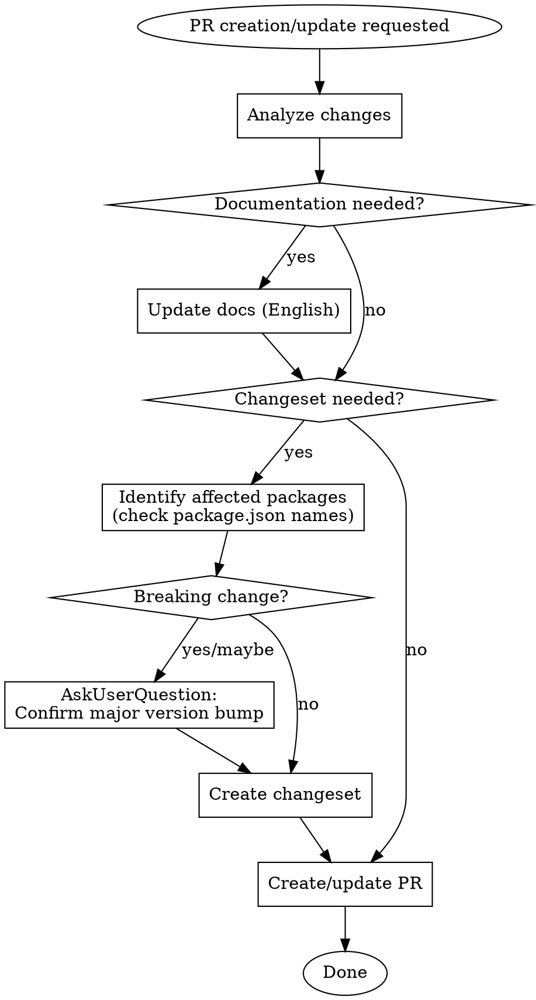

# PR with Docs and Changeset

## Overview

When creating or updating PRs, ensure documentation and changeset are properly prepared with conventional commit conventions and appropriate versioning.

## When to Use

- Creating a new PR
- Updating an existing PR with new changes
- Adding features that need documentation
- Making changes that affect published packages

## Workflow



## Conventional Commit Prefixes

| Prefix | Usage |
|--------|-------|
| `feat` | New feature |
| `fix` | Bug fix |
| `docs` | Documentation only |
| `refactor` | Code refactoring without behavior change |
| `perf` | Performance improvement |
| `test` | Adding/updating tests |
| `chore` | Maintenance tasks |

## PR Title Format

```
<prefix>(<scope>): <description>
```

Example: `feat(cli): add importExtension config option`

## Changeset Creation

### Format

```markdown
---
"<package-name>": <version-type>
---

<prefix>: <one-line description>
```

### Rules

1. **Package name**: Use exact name from `package.json` (e.g., `@gqlkit-ts/cli`, NOT `packages/cli`)
2. **Version type**: `patch`, `minor`, or `major`
3. **Description**: One line, concise, in English
4. **No scope**: Unlike PR title, changeset does NOT include scope in prefix

### Version Type Selection

| Type | When |
|------|------|
| `patch` | Bug fixes, documentation updates |
| `minor` | New features (backward compatible) |
| `major` | Breaking changes |

### Breaking Change Format

When there's a breaking change:

```markdown
---
"@gqlkit-ts/cli": major
---

feat: **BREAKING**: <description>

<explanation of the breaking change>

Migration:
- <step 1>
- <step 2>
```

## Package Identification

**CRITICAL**: Always verify the exact package name from `package.json`:

```bash
cat packages/<dir>/package.json | grep '"name"'
```

This project's packages:
- `@gqlkit-ts/cli` (packages/cli)
- `@gqlkit-ts/runtime` (packages/runtime)

## Documentation Updates

Location: `packages/docs/src/content/`

- Write in **English**
- Update when adding/changing user-facing features
- Follow existing documentation structure

## PR Update Workflow

When updating an existing PR:

1. Review existing changeset in `.changeset/`
2. If changes affect the description or version type, update the changeset
3. If scope of changes expanded to new packages, add them to changeset

## Common Mistakes

| Mistake | Correct |
|---------|---------|
| Using directory name as package | Use `package.json` name |
| Verbose changeset description | Keep to one line |
| Forgetting to update docs for new features | Always check if docs needed |
| Using scope in changeset prefix | No scope: `feat:` not `feat(cli):` |
| Skipping breaking change confirmation | Always ask user for major bumps |
| Writing changeset in Japanese | Write in English |

## Red Flags

Stop if you're thinking:

- "I'll just use the directory name" → Check `package.json`
- "This minor change doesn't need a changeset" → If it affects published code, it needs one
- "The PR description explains everything" → Changeset still needs concise summary
- "I'm pretty sure this isn't breaking" → When in doubt, ask user

## Changeset File Naming

Use descriptive kebab-case names that reflect the change:

```
.changeset/add-import-extension-config.md
.changeset/fix-schema-parsing-error.md
```

**Do NOT** use random generated names like `purple-lions-dance.md`.

## Multiple Packages

When changes affect multiple packages:

```markdown
---
"@gqlkit-ts/cli": minor
"@gqlkit-ts/runtime": patch
---

feat: add new feature with runtime support
```

## Quick Reference

```bash
# Verify package names
cat packages/cli/package.json | grep '"name"'      # @gqlkit-ts/cli
cat packages/runtime/package.json | grep '"name"'  # @gqlkit-ts/runtime
cat packages/docs/package.json | grep '"name"'     # @gqlkit-ts/docs
```

## Project Packages

| Directory | Package Name |
|-----------|--------------|
| packages/cli | `@gqlkit-ts/cli` |
| packages/runtime | `@gqlkit-ts/runtime` |
| packages/docs | `@gqlkit-ts/docs` |
