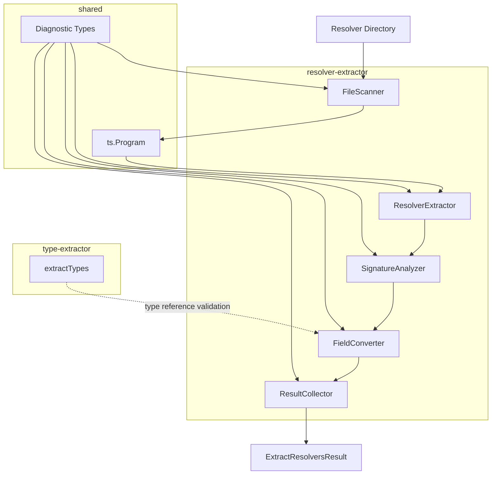
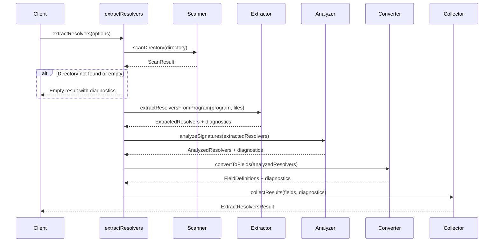
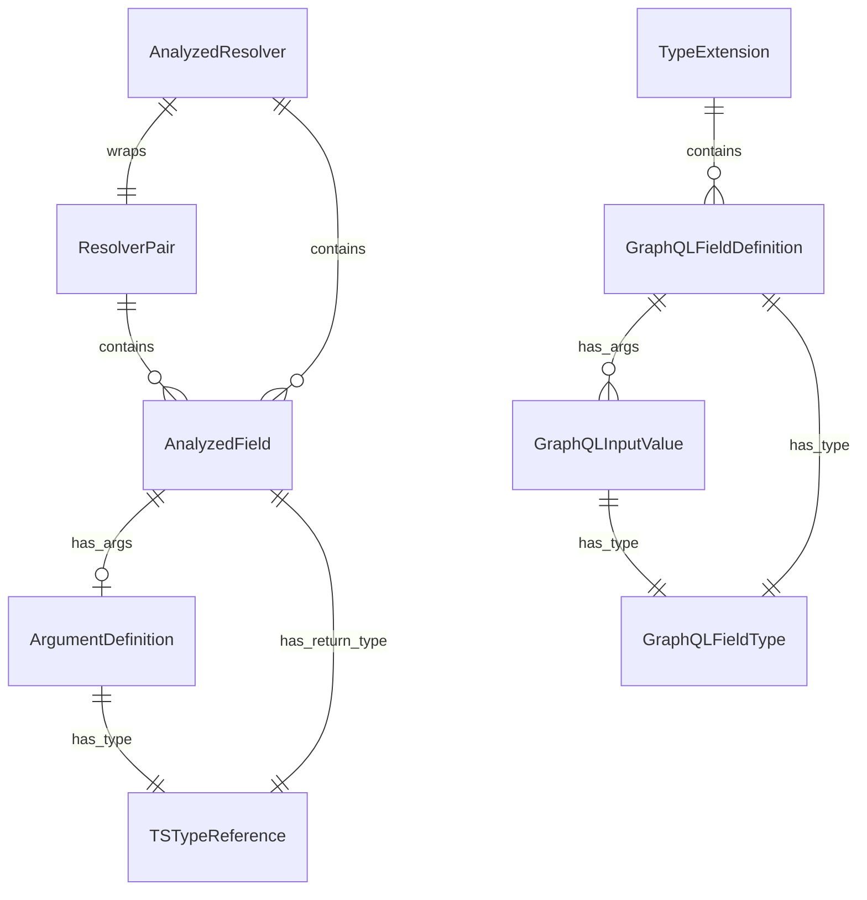

# Design Document

## Overview

**Purpose**: resolver-extractor モジュールは、TypeScript ファイルから resolver の型定義と実装値を抽出し、GraphQL スキーマに適用可能なフィールド定義（Query/Mutation ルートフィールドおよび型拡張フィールド）を生成する。

**Users**: gqlkit ユーザーおよび gqlkit 統合パイプラインが、resolver ディレクトリをスキャンし GraphQL スキーマ生成に必要なフィールド情報を取得するために使用する。

**Impact**: 既存の type-extractor と同様のパイプラインアーキテクチャを採用し、gqlkit の規約駆動コード生成パイプラインに resolver 抽出機能を追加する。

### Goals

- TypeScript の resolver 型・値から GraphQL フィールド定義を自動生成する
- gqlkit 命名規則（`*Resolver` 型 + `*Resolver` 値）に基づく 1:1 マッピングを実現する
- type-extractor と一貫したアーキテクチャ・API 設計を維持する
- 診断情報を通じて規約違反や型不整合を早期に検出する

### Non-Goals

- resolver 実装コードの生成（本モジュールは抽出のみ）
- GraphQL スキーマ AST の直接生成（後続の統合モジュールで実施）
- HTTP サーバー統合やランタイム実行
- context / info パラメータの解析（将来フェーズで対応予定）

## Architecture

### Existing Architecture Analysis

type-extractor は以下のパイプライン構造を持つ:

1. **Scanner**: ディレクトリから `.ts` ファイルを収集
2. **Extractor**: ts.Program を生成し、export された型を抽出
3. **Converter**: TypeScript 型を GraphQL 型情報に変換
4. **Validator**: 変換結果を検証
5. **Collector**: 結果と診断情報を集約

resolver-extractor は同一のパイプラインパターンを採用し、以下の拡張を行う:
- 型だけでなく値（resolver 実装）も抽出
- 型と値のペアリング検証
- 関数シグネチャ解析による引数・戻り値型の推論

### Architecture Pattern & Boundary Map



**Architecture Integration**:
- **Selected pattern**: Pipeline（type-extractor と同一）
- **Domain boundaries**: resolver-extractor は独立モジュールとして `src/resolver-extractor/` に配置
- **Existing patterns preserved**: Diagnostic 型、SourceLocation、パイプライン構造
- **New components rationale**: 関数シグネチャ解析（SignatureAnalyzer）が type-extractor にない新機能として必要
- **Steering compliance**: 静的解析のみ、デコレータ不使用、fail-fast 診断

### Technology Stack

| Layer | Choice / Version | Role in Feature | Notes |
|-------|------------------|-----------------|-------|
| Backend / Services | TypeScript 5.9+ | ソースコード解析、型チェッカー API | ts.TypeChecker で関数シグネチャ解析 |
| Infrastructure / Runtime | Node.js (ES2022+) | ファイルシステム操作、モジュール実行 | ESM のみ |

## System Flows

### Resolver 抽出フロー



## Requirements Traceability

| Requirement | Summary | Components | Interfaces | Flows |
|-------------|---------|------------|------------|-------|
| 1.1-1.5 | Resolver ファイルスキャン | FileScanner | `scanDirectory()` | 抽出フロー Step 1 |
| 2.1-2.5 | Resolver 型の認識 | ResolverExtractor | `extractResolversFromProgram()` | 抽出フロー Step 2 |
| 3.1-3.5 | 型・値のペアリング | ResolverExtractor | `extractResolversFromProgram()` | 抽出フロー Step 2 |
| 4.1-4.9 | フィールドシグネチャ解析 | SignatureAnalyzer | `analyzeSignatures()` | 抽出フロー Step 3 |
| 5.1-5.7 | Query/Mutation フィールド生成 | FieldConverter | `convertToFields()` | 抽出フロー Step 4 |
| 6.1-6.6 | 型フィールド拡張生成 | FieldConverter | `convertToFields()` | 抽出フロー Step 4 |
| 7.1-7.5 | 結果収集と出力 | ResultCollector | `collectResults()` | 抽出フロー Step 5 |
| 8.1-8.6 | GraphQL スカラー型対応 | FieldConverter | `convertToFields()` | 抽出フロー Step 4 |

## Components and Interfaces

| Component | Domain/Layer | Intent | Req Coverage | Key Dependencies | Contracts |
|-----------|--------------|--------|--------------|------------------|-----------|
| FileScanner | Scanner | ディレクトリから resolver ファイルを収集 | 1.1-1.5 | Node.js fs (P0) | Service |
| ResolverExtractor | Extractor | 型・値ペアを抽出しペアリング検証 | 2.1-2.5, 3.1-3.5 | ts.Program (P0), ts.TypeChecker (P0) | Service |
| SignatureAnalyzer | Analyzer | 関数シグネチャから引数・戻り値を解析 | 4.1-4.9 | ts.TypeChecker (P0) | Service |
| FieldConverter | Converter | 解析結果を GraphQL フィールド定義に変換 | 5.1-5.7, 6.1-6.6, 8.1-8.6 | type-extractor 型情報 (P1) | Service |
| ResultCollector | Collector | 結果と診断情報を集約 | 7.1-7.5 | - | Service |

### Scanner Layer

#### FileScanner

| Field | Detail |
|-------|--------|
| Intent | 指定ディレクトリ以下の `.ts` ファイルを再帰的にスキャンし、resolver ファイル一覧を返す |
| Requirements | 1.1, 1.2, 1.3, 1.4, 1.5 |

**Responsibilities & Constraints**
- ディレクトリの存在確認と再帰的ファイル収集
- `.d.ts`, `.test.ts`, `.spec.ts` ファイルの除外
- `node_modules` ディレクトリの除外
- type-extractor の `scanDirectory` を再利用可能

**Dependencies**
- External: Node.js `fs/promises` - ファイルシステム操作 (P0)

**Contracts**: Service [x]

##### Service Interface

```typescript
interface ScanResult {
  readonly files: ReadonlyArray<string>;
  readonly errors: ReadonlyArray<Diagnostic>;
}

function scanDirectory(directory: string): Promise<ScanResult>;
```

- Preconditions: `directory` は絶対パスまたは相対パス
- Postconditions: `files` は `.ts` ファイルのソート済みリスト、存在しないディレクトリは `DIRECTORY_NOT_FOUND` エラー
- Invariants: 同一入力に対して同一出力（決定論的）

**Implementation Notes**
- Integration: type-extractor の `file-scanner.ts` をそのまま再利用、または共通モジュールとして抽出
- Validation: テストファイル除外ロジックを type-extractor に追加（1.4, 1.5 対応）
- Risks: 大規模ディレクトリでのパフォーマンス（許容範囲内）

### Extractor Layer

#### ResolverExtractor

| Field | Detail |
|-------|--------|
| Intent | ts.Program から `*Resolver` 型と対応する値を抽出し、命名規則に基づいてペアリング |
| Requirements | 2.1, 2.2, 2.3, 2.4, 2.5, 3.1, 3.2, 3.3, 3.4, 3.5 |

**Responsibilities & Constraints**
- `*Resolver` サフィックスを持つ export 型の認識
- 対応する camelCase 値の探索とペアリング
- Query/Mutation ルートリゾルバの特別認識
- interface と type alias の両方をサポート
- ペアリング失敗時の診断エラー生成

**Dependencies**
- Inbound: FileScanner からのファイルリスト (P0)
- External: TypeScript Compiler API (`ts.Program`, `ts.TypeChecker`) (P0)

**Contracts**: Service [x]

##### Service Interface

```typescript
type ResolverCategory = "query" | "mutation" | "type";

interface ResolverPair {
  readonly typeName: string;
  readonly valueName: string;
  readonly category: ResolverCategory;
  readonly targetTypeName: string;
  readonly typeSymbol: ts.Symbol;
  readonly valueSymbol: ts.Symbol;
  readonly sourceFile: string;
}

interface ExtractedResolvers {
  readonly resolvers: ReadonlyArray<ResolverPair>;
  readonly diagnostics: ReadonlyArray<Diagnostic>;
}

function createProgramFromFiles(files: ReadonlyArray<string>): ts.Program;

function extractResolversFromProgram(
  program: ts.Program,
  files: ReadonlyArray<string>,
): ExtractedResolvers;
```

- Preconditions: `files` は有効な TypeScript ファイルパス
- Postconditions:
  - `resolvers` は型・値ペアのリスト
  - ペアリング失敗は `MISSING_RESOLVER_VALUE`, `MISSING_RESOLVER_TYPE`, `NAMING_CONVENTION_MISMATCH` 診断
- Invariants: `QueryResolver` → category="query", `MutationResolver` → category="mutation", その他 → category="type"

**Implementation Notes**
- Integration: type-extractor の `createProgramFromFiles` を再利用
- Validation: 命名規則マッチング - `{TypeName}Resolver` 型 ↔ `{typeName}Resolver` 値
- Risks: 複数ファイルにまたがる型・値定義は同一ファイル制約により検出

### Analyzer Layer

#### SignatureAnalyzer

| Field | Detail |
|-------|--------|
| Intent | resolver 型のプロパティから関数シグネチャを解析し、引数型・戻り値型を抽出 |
| Requirements | 4.1, 4.2, 4.3, 4.4, 4.5, 4.6, 4.7, 4.8, 4.9 |

**Responsibilities & Constraints**
- 関数型プロパティの識別
- Query/Mutation: `() => T` または `(args: A) => T` シグネチャ解析
- 型リゾルバ: `(parent: P) => T` または `(parent: P, args: A) => T` シグネチャ解析
- `Promise<T>` のアンラップ
- args 型プロパティの抽出

**Dependencies**
- Inbound: ResolverExtractor からの ResolverPair (P0)
- External: TypeScript Compiler API (`ts.TypeChecker`) (P0)

**Contracts**: Service [x]

##### Service Interface

```typescript
interface TSTypeReference {
  readonly kind: "primitive" | "reference" | "array" | "union" | "literal";
  readonly name?: string;
  readonly elementType?: TSTypeReference;
  readonly members?: ReadonlyArray<TSTypeReference>;
  readonly nullable: boolean;
}

interface ArgumentDefinition {
  readonly name: string;
  readonly tsType: TSTypeReference;
  readonly optional: boolean;
}

interface AnalyzedField {
  readonly name: string;
  readonly parentType?: TSTypeReference;
  readonly args?: ReadonlyArray<ArgumentDefinition>;
  readonly returnType: TSTypeReference;
}

interface AnalyzedResolver {
  readonly pair: ResolverPair;
  readonly fields: ReadonlyArray<AnalyzedField>;
}

interface AnalyzedResolvers {
  readonly resolvers: ReadonlyArray<AnalyzedResolver>;
  readonly diagnostics: ReadonlyArray<Diagnostic>;
}

function analyzeSignatures(
  extractedResolvers: ExtractedResolvers,
  checker: ts.TypeChecker,
): AnalyzedResolvers;
```

- Preconditions: `extractedResolvers` は有効な ResolverPair を含む
- Postconditions:
  - 各フィールドに `returnType` が設定される
  - Query/Mutation フィールドは `parentType` なし、型リゾルバは `parentType` あり
  - 不正シグネチャは `INVALID_RESOLVER_SIGNATURE` 診断
- Invariants: `Promise<T>` は内部型 `T` に解決

**Implementation Notes**
- Integration: type-extractor の `convertTsTypeToReference` ロジックを共有
- Validation: シグネチャパターンマッチング（引数の数と型による判定）
- Risks: 複雑なジェネリクスや条件型は `UNSUPPORTED_SYNTAX` 警告

### Converter Layer

#### FieldConverter

| Field | Detail |
|-------|--------|
| Intent | 解析済み resolver 情報を GraphQL フィールド定義に変換 |
| Requirements | 5.1, 5.2, 5.3, 5.4, 5.5, 5.6, 5.7, 6.1, 6.2, 6.3, 6.4, 6.5, 6.6, 8.1, 8.2, 8.3, 8.4, 8.5, 8.6 |

**Responsibilities & Constraints**
- TypeScript 型を GraphQL 型に変換（string→String, number→Int, boolean→Boolean）
- nullable/non-null, list/non-list の推論
- Query/Mutation フィールド定義の生成
- 型拡張フィールド定義の生成
- 引数リスト（InputValue）の生成
- サポート外の型に対する診断エラー生成

**Dependencies**
- Inbound: SignatureAnalyzer からの AnalyzedResolvers (P0)
- External: type-extractor 型情報 - 型参照の検証 (P1)

**Contracts**: Service [x]

##### Service Interface

```typescript
interface GraphQLFieldType {
  readonly typeName: string;
  readonly nullable: boolean;
  readonly list: boolean;
  readonly listItemNullable?: boolean;
}

interface GraphQLInputValue {
  readonly name: string;
  readonly type: GraphQLFieldType;
}

interface GraphQLFieldDefinition {
  readonly name: string;
  readonly type: GraphQLFieldType;
  readonly args?: ReadonlyArray<GraphQLInputValue>;
  readonly sourceLocation: SourceLocation;
}

interface QueryFieldDefinitions {
  readonly fields: ReadonlyArray<GraphQLFieldDefinition>;
}

interface MutationFieldDefinitions {
  readonly fields: ReadonlyArray<GraphQLFieldDefinition>;
}

interface TypeExtension {
  readonly targetTypeName: string;
  readonly fields: ReadonlyArray<GraphQLFieldDefinition>;
}

interface ConvertedFields {
  readonly queryFields: QueryFieldDefinitions;
  readonly mutationFields: MutationFieldDefinitions;
  readonly typeExtensions: ReadonlyArray<TypeExtension>;
  readonly diagnostics: ReadonlyArray<Diagnostic>;
}

function convertToFields(
  analyzedResolvers: AnalyzedResolvers,
): ConvertedFields;
```

- Preconditions: `analyzedResolvers` は解析済みフィールド情報を含む
- Postconditions:
  - Query/Mutation フィールドは対応する定義に分類
  - 型リゾルバは `typeExtensions` に分類
  - サポート外の型は `UNSUPPORTED_RETURN_TYPE`, `UNSUPPORTED_ARG_TYPE` 診断
- Invariants: TypeScript プリミティブ型は常に対応する GraphQL スカラーに変換

**Implementation Notes**
- Integration: type-extractor の `PRIMITIVE_TYPE_MAP` を共有
- Validation: 戻り値型と args 型の GraphQL 互換性チェック
- Risks: type-extractor 未定義の型参照は `UNKNOWN_TARGET_TYPE` 警告（6.5）

### Collector Layer

#### ResultCollector

| Field | Detail |
|-------|--------|
| Intent | パイプライン全体の結果と診断情報を集約し、構造化された出力を生成 |
| Requirements | 7.1, 7.2, 7.3, 7.4, 7.5 |

**Responsibilities & Constraints**
- Query/Mutation フィールド、型拡張を分離した構造で返却
- ソースファイル位置情報の保持
- 診断情報（errors/warnings）の収集と分類
- エラー存在時も部分的な結果を返却
- type-extractor と同形式の出力構造

**Dependencies**
- Inbound: FieldConverter からの ConvertedFields (P0)

**Contracts**: Service [x]

##### Service Interface

```typescript
interface Diagnostics {
  readonly errors: ReadonlyArray<Diagnostic>;
  readonly warnings: ReadonlyArray<Diagnostic>;
}

interface ExtractResolversResult {
  readonly queryFields: QueryFieldDefinitions;
  readonly mutationFields: MutationFieldDefinitions;
  readonly typeExtensions: ReadonlyArray<TypeExtension>;
  readonly diagnostics: Diagnostics;
}

function collectResults(
  convertedFields: ConvertedFields,
  allDiagnostics: ReadonlyArray<Diagnostic>,
): ExtractResolversResult;
```

- Preconditions: `convertedFields` と `allDiagnostics` が提供される
- Postconditions:
  - 結果はソート済み（名前順）
  - 診断は重複排除済み
  - errors/warnings に分類済み
- Invariants: 入力に対して決定論的な出力

**Implementation Notes**
- Integration: type-extractor の `collectResults` パターンを踏襲
- Risks: なし

## Data Models

### Domain Model



**Aggregates**:
- `ExtractResolversResult`: 抽出結果の集約ルート
- `ResolverPair`: 型・値ペアの集約

**Entities**:
- `ResolverPair`: typeName, valueName で識別
- `GraphQLFieldDefinition`: name, sourceLocation で識別

**Value Objects**:
- `TSTypeReference`, `GraphQLFieldType`, `GraphQLInputValue`, `ArgumentDefinition`
- `SourceLocation`, `Diagnostic`

**Business Rules & Invariants**:
- `{TypeName}Resolver` 型は必ず `{typeName}Resolver` 値とペアになる
- Query/Mutation resolver のフィールドは parent 引数を持たない
- 型 resolver のフィールドは必ず parent 引数を持つ
- parent 引数の型は resolver 名から推論される型と一致する必要がある

### Logical Data Model

**Diagnostic Codes（resolver-extractor 固有）**:

| Code | Severity | Condition |
|------|----------|-----------|
| `DIRECTORY_NOT_FOUND` | error | 指定ディレクトリが存在しない |
| `MISSING_RESOLVER_VALUE` | error | 型に対応する値が見つからない |
| `MISSING_RESOLVER_TYPE` | error | 値に対応する型が見つからない |
| `NAMING_CONVENTION_MISMATCH` | error | 型名と値名の命名規則が不一致 |
| `INVALID_RESOLVER_SIGNATURE` | error | フィールドが不正な関数シグネチャを持つ |
| `UNSUPPORTED_RETURN_TYPE` | error | 戻り値型が GraphQL でサポートされない |
| `UNSUPPORTED_ARG_TYPE` | error | args 型が GraphQL でサポートされない |
| `UNKNOWN_TARGET_TYPE` | warning | 対象型が type-extractor の結果に存在しない |
| `PARENT_TYPE_MISMATCH` | error | parent 引数型と推論型が不一致 |

## Error Handling

### Error Strategy

- **Fail-fast with maximum information**: エラー発生時も処理を継続し、すべての診断情報を収集
- **Actionable diagnostics**: エラーメッセージに修正方法を示唆
- **Graceful degradation**: 部分的な結果とエラーの両方を返却

### Error Categories and Responses

**User Errors (Diagnostic)**:
- 命名規則違反 → 正しい命名パターンを提示
- シグネチャ不正 → 期待されるシグネチャ形式を提示
- 型不一致 → 期待される型を提示

**System Errors (Diagnostic)**:
- ディレクトリ不在 → パス確認を促す
- パース失敗 → ファイル位置と構文エラー詳細を提示

### Monitoring

- 診断情報の収集と分類（errors/warnings）
- ソースファイル位置情報の保持によるデバッグ支援

## Testing Strategy

### Unit Tests

- FileScanner: ディレクトリスキャン、ファイル除外ロジック
- ResolverExtractor: 型・値認識、ペアリング、カテゴリ分類
- SignatureAnalyzer: 各シグネチャパターンの解析、Promise アンラップ
- FieldConverter: 型変換、nullable/list 推論、引数変換
- ResultCollector: 結果集約、診断分類、ソート・重複排除

### Integration Tests

- 完全な resolver ディレクトリからの抽出フロー
- Query/Mutation + 型リゾルバの混合ケース
- エラーケースでの部分結果返却
- type-extractor との結果形式互換性

### E2E Tests

- 実際の resolver ファイル構成からのフィールド定義生成
- 複数ファイルにまたがる resolver 定義

## Performance & Scalability

### Target Metrics

- 100 ファイル規模のディレクトリで 1 秒以内の処理完了
- メモリ使用量は type-extractor と同等レベル

### Optimization

- ts.Program の再利用（type-extractor と共有時）
- 診断情報の遅延評価（必要時のみメッセージ生成）
