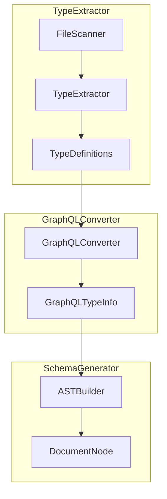
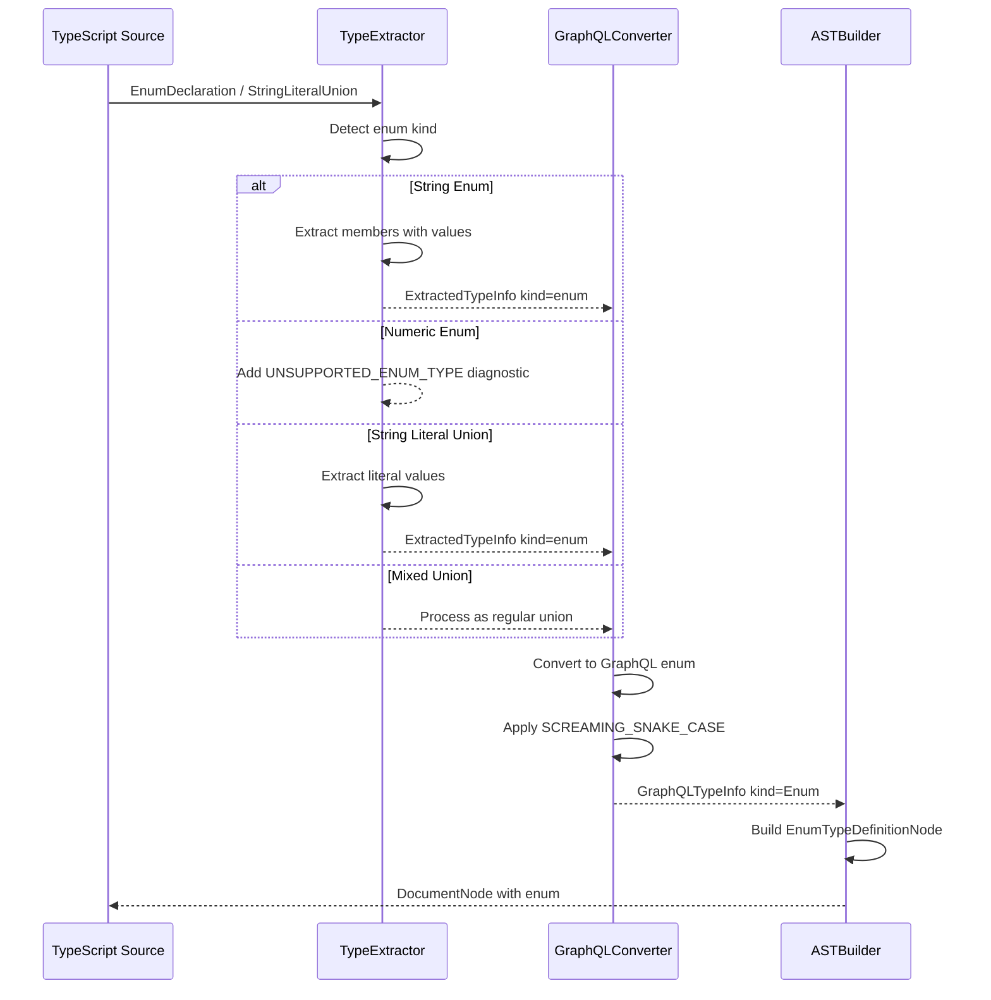
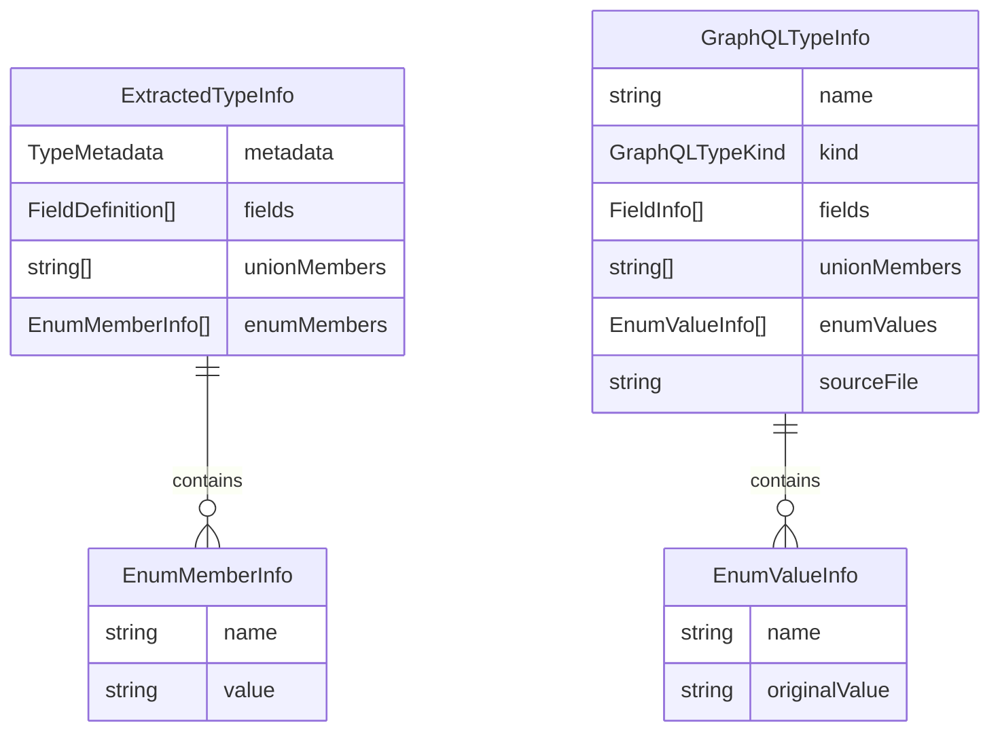

# Design Document

## Overview

**Purpose**: この機能は、type-extractor モジュールを拡張し、TypeScript enum および string literal union を GraphQL enum として抽出・変換する機能を提供する。

**Users**: gqlkit を使用する開発者が、TypeScript の enum や string literal union を自然な形で GraphQL スキーマに反映できるようになる。

**Impact**: 既存の type-extractor/graphql-converter/ast-builder を拡張し、新しい型種別 "enum" をサポートする。既存の Object/Union 型の抽出動作には影響しない。

### Goals

- TypeScript enum を GraphQL enum として抽出・変換する
- string literal union を GraphQL enum として抽出・変換する
- 非対応パターン（numeric enum、const enum 等）に対して明確なエラーメッセージを提供する
- 既存の Object/Union 型抽出との互換性を維持する

### Non-Goals

- enum のカスタムディレクティブサポート
- enum の description/deprecation サポート
- Input type としての enum 使用（将来の拡張として検討）
- GraphQL enum の値に対するカスタムマッピング

## Architecture

### Existing Architecture Analysis

現在の type-extractor は以下の構造を持つ:

1. **type-extractor.ts**: TypeScript AST から型情報を抽出
   - `TypeKind`: "object" | "interface" | "union"
   - interface/type alias のみを処理

2. **graphql-converter.ts**: 抽出された型を GraphQL 型情報に変換
   - `GraphQLTypeKind`: "Object" | "Union"
   - RESERVED_TYPE_NAMES チェックを実施

3. **ast-builder.ts**: GraphQL 型情報から AST ノードを構築
   - ObjectTypeDefinitionNode / UnionTypeDefinitionNode をサポート

### Architecture Pattern & Boundary Map



**Architecture Integration**:
- Selected pattern: 既存のパイプラインパターンを維持し、各段階で enum サポートを追加
- Domain boundaries: type-extractor が enum 検出を担当、graphql-converter が変換を担当
- Existing patterns preserved: 抽出 -> 変換 -> AST 構築の流れを維持
- New components rationale: 新規コンポーネントは不要、既存コンポーネントの拡張のみ
- Steering compliance: deterministic output、fail-fast validation を維持

### Technology Stack

| Layer | Choice / Version | Role in Feature | Notes |
|-------|------------------|-----------------|-------|
| Backend / Services | TypeScript 5.9+ / ts-morph | TypeScript AST 解析と enum 検出 | 既存の ts.EnumDeclaration API を使用 |
| Data / Storage | - | - | 変更なし |

## System Flows

### Enum Extraction Flow



## Requirements Traceability

| Requirement | Summary | Components | Interfaces | Flows |
|-------------|---------|------------|------------|-------|
| 1.1-1.5 | TypeScript enum の検出と抽出 | TypeExtractor | ExtractedTypeInfo, TypeKind | Enum Extraction Flow |
| 2.1-2.4 | String literal union の検出と抽出 | TypeExtractor | ExtractedTypeInfo, TSTypeReference | Enum Extraction Flow |
| 3.1-3.5 | GraphQL enum への変換 | GraphQLConverter | GraphQLTypeInfo, GraphQLTypeKind, EnumValueInfo | Enum Extraction Flow |
| 4.1-4.5 | 非対応パターンのエラーハンドリング | TypeExtractor, GraphQLConverter | Diagnostic, DiagnosticCode | Enum Extraction Flow |
| 5.1-5.4 | 既存機能との整合性 | TypeExtractor, GraphQLConverter | - | - |

## Components and Interfaces

| Component | Domain/Layer | Intent | Req Coverage | Key Dependencies (P0/P1) | Contracts |
|-----------|--------------|--------|--------------|--------------------------|-----------|
| TypeExtractor | type-extractor | TypeScript 型から enum 情報を抽出 | 1.1-1.5, 2.1-2.4, 4.1-4.4, 5.1-5.3 | ts (P0) | Service |
| GraphQLConverter | type-extractor | 抽出された enum を GraphQL 型に変換 | 3.1-3.5, 4.5, 5.4 | TypeExtractor (P0) | Service |
| ASTBuilder | schema-generator | GraphQL enum の AST ノードを構築 | 3.1-3.5 | GraphQLConverter (P0) | Service |

### Type Definitions Layer

#### TypeKind Extension

| Field | Detail |
|-------|--------|
| Intent | TypeScript 型の種別に enum を追加 |
| Requirements | 1.1, 2.1 |

**Contracts**: State [x]

##### State Management

```typescript
// src/type-extractor/types/typescript.ts
export type TypeKind = "object" | "interface" | "union" | "enum";
```

#### EnumMemberInfo

| Field | Detail |
|-------|--------|
| Intent | enum メンバーの情報を保持する型定義 |
| Requirements | 1.2, 1.4, 2.2 |

**Contracts**: State [x]

##### State Management

```typescript
// src/type-extractor/types/typescript.ts
export interface EnumMemberInfo {
  readonly name: string;
  readonly value: string;
}
```

#### ExtractedTypeInfo Extension

| Field | Detail |
|-------|--------|
| Intent | 抽出された型情報に enum メンバーを追加 |
| Requirements | 1.2, 1.4, 1.5, 2.2, 2.4 |

**Contracts**: State [x]

##### State Management

```typescript
// src/type-extractor/types/typescript.ts
export interface ExtractedTypeInfo {
  readonly metadata: TypeMetadata;
  readonly fields: ReadonlyArray<FieldDefinition>;
  readonly unionMembers?: ReadonlyArray<string>;
  readonly enumMembers?: ReadonlyArray<EnumMemberInfo>;
}
```

#### GraphQLTypeKind Extension

| Field | Detail |
|-------|--------|
| Intent | GraphQL 型の種別に Enum を追加 |
| Requirements | 3.1, 3.2 |

**Contracts**: State [x]

##### State Management

```typescript
// src/type-extractor/types/graphql.ts
export type GraphQLTypeKind = "Object" | "Union" | "Enum";
```

#### EnumValueInfo

| Field | Detail |
|-------|--------|
| Intent | GraphQL enum 値の情報を保持する型定義 |
| Requirements | 3.3, 3.4, 3.5 |

**Contracts**: State [x]

##### State Management

```typescript
// src/type-extractor/types/graphql.ts
export interface EnumValueInfo {
  readonly name: string;
  readonly originalValue: string;
}
```

#### GraphQLTypeInfo Extension

| Field | Detail |
|-------|--------|
| Intent | GraphQL 型情報に enum 値を追加 |
| Requirements | 3.5 |

**Contracts**: State [x]

##### State Management

```typescript
// src/type-extractor/types/graphql.ts
export interface GraphQLTypeInfo {
  readonly name: string;
  readonly kind: GraphQLTypeKind;
  readonly fields?: ReadonlyArray<FieldInfo>;
  readonly unionMembers?: ReadonlyArray<string>;
  readonly enumValues?: ReadonlyArray<EnumValueInfo>;
  readonly sourceFile: string;
}
```

#### DiagnosticCode Extension

| Field | Detail |
|-------|--------|
| Intent | enum 関連のエラーコードを追加 |
| Requirements | 4.1, 4.2, 4.4, 4.5 |

**Contracts**: State [x]

##### State Management

```typescript
// src/type-extractor/types/diagnostics.ts
export type DiagnosticCode =
  | "DIRECTORY_NOT_FOUND"
  | "PARSE_ERROR"
  | "UNSUPPORTED_SYNTAX"
  | "RESERVED_TYPE_NAME"
  | "UNRESOLVED_REFERENCE"
  | "MISSING_RESOLVER_VALUE"
  | "MISSING_RESOLVER_TYPE"
  | "NAMING_CONVENTION_MISMATCH"
  | "INVALID_RESOLVER_SIGNATURE"
  | "UNSUPPORTED_RETURN_TYPE"
  | "UNSUPPORTED_ARG_TYPE"
  | "UNKNOWN_TARGET_TYPE"
  | "PARENT_TYPE_MISMATCH"
  | "UNSUPPORTED_ENUM_TYPE"
  | "INVALID_ENUM_MEMBER";
```

### Extraction Layer

#### TypeExtractor

| Field | Detail |
|-------|--------|
| Intent | TypeScript enum および string literal union を検出・抽出する |
| Requirements | 1.1-1.5, 2.1-2.4, 4.1-4.4, 5.1-5.3 |

**Responsibilities & Constraints**
- TypeScript EnumDeclaration ノードを検出し、enum メンバーを抽出する
- string literal union を検出し、enum として抽出する
- numeric enum、const enum、heterogeneous enum を検出しエラーを出力する
- 既存の interface/type alias 抽出ロジックに影響を与えない

**Dependencies**
- Inbound: FileScanner - ソースファイルの提供 (P0)
- Outbound: ResultCollector - 抽出結果の収集 (P1)
- External: typescript - AST 解析 (P0)

**Contracts**: Service [x]

##### Service Interface

```typescript
// src/type-extractor/extractor/type-extractor.ts

interface EnumExtractionContext {
  readonly node: ts.EnumDeclaration;
  readonly sourceFile: ts.SourceFile;
  readonly checker: ts.TypeChecker;
}

interface StringLiteralUnionContext {
  readonly node: ts.TypeAliasDeclaration;
  readonly type: ts.Type;
  readonly sourceFile: ts.SourceFile;
}

// 追加する関数
function isStringEnum(node: ts.EnumDeclaration): boolean;
function isNumericEnum(node: ts.EnumDeclaration): boolean;
function isHeterogeneousEnum(node: ts.EnumDeclaration): boolean;
function isConstEnum(node: ts.EnumDeclaration): boolean;
function isStringLiteralUnion(type: ts.Type): boolean;

function extractEnumMembers(
  context: EnumExtractionContext,
): ReadonlyArray<EnumMemberInfo>;

function extractStringLiteralUnionMembers(
  context: StringLiteralUnionContext,
): ReadonlyArray<EnumMemberInfo>;

// extractTypesFromProgram の拡張
// - ts.EnumDeclaration を処理するロジックを追加
// - string literal union を enum として抽出するロジックを追加
```

- Preconditions: Program と sourceFiles が有効であること
- Postconditions: enum 情報を含む ExtractedTypeInfo を返却
- Invariants: 既存の Object/Union 抽出ロジックは変更しない

**Implementation Notes**
- Integration: 既存の `ts.forEachChild` ループ内に `ts.isEnumDeclaration` チェックを追加
- Validation: const enum は `ts.ModifierFlags.Const` でチェック
- Risks: string literal union の検出精度（null/undefined の除外処理）

### Conversion Layer

#### GraphQLConverter

| Field | Detail |
|-------|--------|
| Intent | 抽出された enum を GraphQL enum に変換し、メンバー名を正規化する |
| Requirements | 3.1-3.5, 4.5, 5.4 |

**Responsibilities & Constraints**
- ExtractedTypeInfo (kind=enum) を GraphQLTypeInfo (kind=Enum) に変換
- enum メンバー名を SCREAMING_SNAKE_CASE に変換
- GraphQL 識別子として無効な文字を検出しエラーを出力
- RESERVED_TYPE_NAMES チェックを enum にも適用

**Dependencies**
- Inbound: TypeExtractor - 抽出された型情報 (P0)
- Outbound: ASTBuilder - GraphQL 型情報の提供 (P1)

**Contracts**: Service [x]

##### Service Interface

```typescript
// src/type-extractor/converter/graphql-converter.ts

// 追加する関数
function toScreamingSnakeCase(value: string): string;
function isValidGraphQLEnumValue(value: string): boolean;

function convertEnumMembers(
  members: ReadonlyArray<EnumMemberInfo>,
  sourceFile: string,
): { values: ReadonlyArray<EnumValueInfo>; diagnostics: ReadonlyArray<Diagnostic> };

// convertToGraphQL の拡張
// - kind === "enum" の場合の変換ロジックを追加
// - RESERVED_TYPE_NAMES チェックを維持
```

- Preconditions: ExtractedTypeInfo が有効であること
- Postconditions: GraphQLTypeInfo を返却、変換エラーは diagnostics に含める
- Invariants: 既存の Object/Union 変換ロジックは変更しない

**Implementation Notes**
- Integration: `convertToGraphQL` 関数内に enum 変換分岐を追加
- Validation: GraphQL 識別子は `/^[_A-Za-z][_0-9A-Za-z]*$/` に従う
- Risks: SCREAMING_SNAKE_CASE 変換時の特殊文字処理

### AST Builder Layer

#### ASTBuilder

| Field | Detail |
|-------|--------|
| Intent | GraphQL enum の AST ノードを構築する |
| Requirements | 3.1, 3.2 |

**Responsibilities & Constraints**
- GraphQLTypeInfo (kind=Enum) から EnumTypeDefinitionNode を構築
- enum 値の順序を維持
- 既存の buildDocumentNode に enum サポートを追加

**Dependencies**
- Inbound: GraphQLConverter - GraphQL 型情報 (P0)
- External: graphql - AST ノード型 (P0)

**Contracts**: Service [x]

##### Service Interface

```typescript
// src/schema-generator/builder/ast-builder.ts
import type {
  EnumTypeDefinitionNode,
  EnumValueDefinitionNode,
} from "graphql";

function buildEnumValueDefinitionNode(
  value: EnumValueInfo,
): EnumValueDefinitionNode;

function buildEnumTypeDefinitionNode(
  baseType: BaseType,
): EnumTypeDefinitionNode;

// buildDocumentNode の拡張
// - kind === "Enum" の場合に buildEnumTypeDefinitionNode を呼び出す
```

- Preconditions: BaseType が有効な enum 情報を含むこと
- Postconditions: 有効な EnumTypeDefinitionNode を返却
- Invariants: 既存の Object/Union AST 構築ロジックは変更しない

**Implementation Notes**
- Integration: `buildDocumentNode` の分岐に Enum ケースを追加
- Validation: enum 値が空でないことを事前にチェック
- Risks: graphql パッケージの Kind.ENUM_TYPE_DEFINITION 使用

## Data Models

### Domain Model

**Aggregates and Boundaries**:
- ExtractedTypeInfo: 抽出された型のルート集約
- GraphQLTypeInfo: 変換後の GraphQL 型のルート集約

**Entities**:
- EnumMemberInfo: enum メンバーを表すエンティティ
- EnumValueInfo: GraphQL enum 値を表すエンティティ

**Value Objects**:
- TypeKind: 型の種別を表す値オブジェクト
- GraphQLTypeKind: GraphQL 型の種別を表す値オブジェクト

**Business Rules & Invariants**:
- enum メンバーは定義順序を維持する
- string enum のみサポート（numeric enum は不可）
- const enum は非サポート
- enum メンバー名は GraphQL 識別子として有効である必要がある

### Logical Data Model

**Structure Definition**:



**Consistency & Integrity**:
- enum メンバーの順序は TypeScript ソースコードの定義順序を反映
- originalValue は変換前の値を保持し、トレーサビリティを確保

## Error Handling

### Error Strategy

enum 関連のエラーは即座に診断として報告し、処理を継続する（fail-fast with graceful degradation）。

### Error Categories and Responses

**User Errors (Diagnostic)**:
- `UNSUPPORTED_ENUM_TYPE`: numeric enum、heterogeneous enum、const enum の検出時
  - Message: "Numeric enum '{name}' is not supported. Use string enum instead."
  - Message: "Heterogeneous enum '{name}' is not supported. Use string enum instead."
  - Message: "Const enum '{name}' is not supported. Use regular enum instead."
- `INVALID_ENUM_MEMBER`: GraphQL 識別子として無効な enum メンバー名の検出時
  - Message: "Enum member '{member}' contains invalid characters for GraphQL identifier."

**Business Logic Errors**:
- string literal と他の型が混在する union は enum として扱わず、通常の union として処理

### Monitoring

既存の診断収集メカニズム（ResultCollector）を使用し、enum 関連エラーを追跡する。

## Testing Strategy

### Unit Tests

1. **isStringEnum**: string enum の正しい検出
2. **isNumericEnum**: numeric enum の正しい検出
3. **isConstEnum**: const enum の正しい検出
4. **isStringLiteralUnion**: string literal union の正しい検出
5. **toScreamingSnakeCase**: 各種入力パターンの変換
6. **isValidGraphQLEnumValue**: GraphQL 識別子バリデーション

### Integration Tests

1. **TypeScript enum -> GraphQL enum**: 完全な変換フロー
2. **String literal union -> GraphQL enum**: 完全な変換フロー
3. **Mixed file extraction**: enum と Object 型が混在するファイルの抽出
4. **Error diagnostic flow**: 非対応 enum パターンの診断出力
5. **AST generation**: enum を含む DocumentNode の生成

### E2E Tests

1. **Complete schema generation**: enum を含む TypeScript ソースから GraphQL スキーマ生成
2. **Error reporting**: 非対応パターンでのエラーメッセージ出力確認
3. **Backward compatibility**: 既存の Object/Union 型のみを含むソースの動作確認
