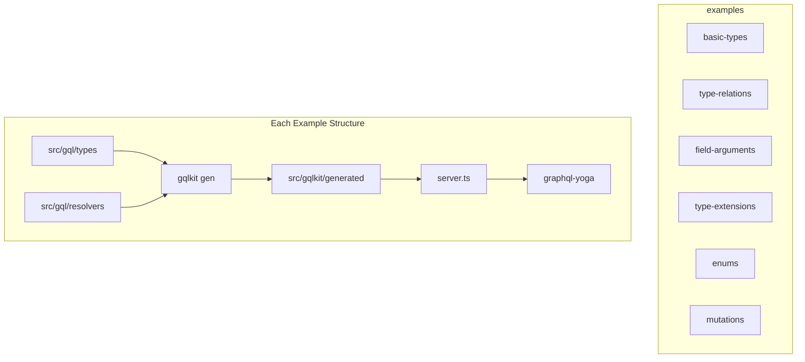
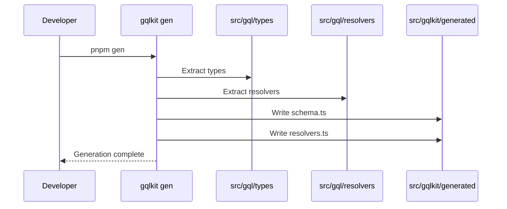
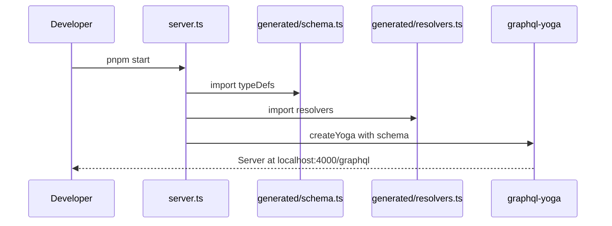

# Technical Design Document

## Overview

**Purpose**: 本機能は、gqlkit の主要ユースケースを網羅する最小限の動作例を `examples/` ディレクトリに提供する。開発者が gqlkit の使用方法を迅速に理解し、実行可能なサンプルを通じて学習できる環境を構築する。

**Users**: gqlkit 初学者および開発者が、型定義からスキーマ生成までの一連のワークフローを理解するために使用する。

**Impact**: リポジトリルートに新規 `examples/` ディレクトリを追加し、各ユースケースを独立したサブプロジェクトとして構成する。

### Goals

- gqlkit の全主要機能（型定義、リゾルバ、Enum、Mutation、型拡張、引数）を独立したサンプルで示す
- 各サンプルが `pnpm install && pnpm gen && pnpm start` で即座に動作する
- コード最小化原則に従い、各サンプルは特定機能のみに集中する

### Non-Goals

- 本番環境向けのベストプラクティス（認証、エラーハンドリング、ロギング等）の実装
- 複雑なデータベース連携やミドルウェア構成
- パフォーマンス最適化やスケーリング考慮

## Architecture

### Architecture Pattern & Boundary Map



**Architecture Integration**:
- Selected pattern: 独立サブプロジェクト構成（各例が完全に自己完結）
- Domain/feature boundaries: 各サンプルは単一の gqlkit 機能に焦点を当て、他サンプルへの依存なし
- Existing patterns preserved: gqlkit の規約（`src/gql/types`, `src/gql/resolvers`, `src/gqlkit/generated`）を厳守
- New components rationale: graphql-yoga を使用した軽量サーバーエントリポイントを各サンプルに追加
- Steering compliance: ESM、TypeScript strict mode、pnpm を使用

### Technology Stack

| Layer | Choice / Version | Role in Feature | Notes |
|-------|------------------|-----------------|-------|
| Runtime | Node.js 20+ | サンプル実行環境 | ES2022+ target |
| Package Manager | pnpm 10.26.1 | 依存関係管理 | ワークスペース不使用（独立性維持） |
| GraphQL Server | graphql-yoga ^5 | サンプルサーバー起動 | 軽量かつ組み込み Playground 提供 |
| Schema Tools | @graphql-tools/schema ^10 | makeExecutableSchema 提供 | typeDefs + resolvers 統合 |
| Core | gqlkit (link) | スキーマ生成 | 親パッケージへのリンク |
| TypeScript | 5.9+ | 型安全性 | strict mode 有効 |

## Requirements Traceability

| Requirement | Summary | Components | Interfaces | Flows |
|-------------|---------|------------|------------|-------|
| 1.1 | examples/ ディレクトリ配置 | ExamplesRoot | - | - |
| 1.2 | 独立サブディレクトリ構成 | 全サンプル | - | - |
| 1.3 | 個別実行可能構成 | package.json | scripts | GenFlow |
| 1.4 | 必要な依存関係 | package.json | - | - |
| 2.1-2.5 | 基本型定義サンプル | BasicTypesExample | User, QueryResolver | GenFlow, ServerFlow |
| 3.1-3.5 | 型リレーションサンプル | TypeRelationsExample | User, Post, QueryResolver | GenFlow, ServerFlow |
| 4.1-4.4 | 引数付きフィールドサンプル | FieldArgumentsExample | QueryResolver with args | GenFlow, ServerFlow |
| 5.1-5.5 | 型拡張サンプル | TypeExtensionsExample | UserResolver | GenFlow, ServerFlow |
| 6.1-6.4 | Enum サンプル | EnumsExample | Status enum, Role union | GenFlow, ServerFlow |
| 7.1-7.4 | Mutation サンプル | MutationsExample | MutationResolver | GenFlow, ServerFlow |
| 8.1-8.4 | サンプル実行可能性 | ServerEntrypoint, README | createYoga | ServerFlow |
| 9.1-9.4 | コード最小化原則 | 全コンポーネント | - | - |

## System Flows

### Generation Flow (GenFlow)



### Server Flow (ServerFlow)



## Components and Interfaces

| Component | Domain/Layer | Intent | Req Coverage | Key Dependencies | Contracts |
|-----------|--------------|--------|--------------|------------------|-----------|
| ExamplesRoot | Infrastructure | examples/ ディレクトリ構成 | 1.1, 1.2 | - | - |
| BasicTypesExample | Example | 基本型定義のデモ | 2.1-2.5 | gqlkit, graphql-yoga | Service |
| TypeRelationsExample | Example | 型参照のデモ | 3.1-3.5 | gqlkit, graphql-yoga | Service |
| FieldArgumentsExample | Example | 引数付きフィールドのデモ | 4.1-4.4 | gqlkit, graphql-yoga | Service |
| TypeExtensionsExample | Example | フィールドリゾルバのデモ | 5.1-5.5 | gqlkit, graphql-yoga | Service |
| EnumsExample | Example | Enum 変換のデモ | 6.1-6.4 | gqlkit, graphql-yoga | Service |
| MutationsExample | Example | Mutation のデモ | 7.1-7.4 | gqlkit, graphql-yoga | Service |
| ServerEntrypoint | Shared | サーバー起動ロジック | 8.1-8.3 | graphql-yoga (P0) | Service |
| README | Documentation | 実行手順記載 | 8.4 | - | - |

### Example Layer

#### BasicTypesExample

| Field | Detail |
|-------|--------|
| Intent | プリミティブ型を持つ最小限の型定義と Query を示す |
| Requirements | 2.1, 2.2, 2.3, 2.4, 2.5 |

**Responsibilities & Constraints**
- TypeScript interface から GraphQL Object 型への変換を示す
- string, number, boolean フィールドの定義を含む
- QueryResolver による Query フィールド定義
- 生成されたスキーマを使用するサーバーエントリポイント

**Dependencies**
- External: gqlkit - スキーマ生成 (P0)
- External: graphql-yoga - サーバー起動 (P0)
- External: @graphql-tools/schema - makeExecutableSchema (P1)

**Contracts**: Service [x]

##### Service Interface

```typescript
// src/gql/types/user.ts
export interface User {
  id: string;
  name: string;
  age: number;
  isActive: boolean;
}

// src/gql/resolvers/user.ts
// ドメインエンティティごとにリゾルバをまとめる構成
// user.ts に User に関する Query/Mutation/Field リゾルバを集約
import type { User } from "../types/user.js";

export type QueryResolver = {
  user: () => User;
  users: () => User[];
};

export const queryResolver: QueryResolver = {
  user: () => ({ id: "1", name: "Alice", age: 30, isActive: true }),
  users: () => [],
};
```

**Implementation Notes**
- Integration: server.ts で typeDefs と resolvers を import し createYoga に渡す
- Validation: `pnpm gen` 実行後に schema.ts と resolvers.ts が生成されることを確認
- File organization: リゾルバは `query.ts` ではなく `user.ts` にドメイン単位で配置

---

#### TypeRelationsExample

| Field | Detail |
|-------|--------|
| Intent | 型間の参照関係、nullable、リスト型を示す |
| Requirements | 3.1, 3.2, 3.3, 3.4, 3.5 |

**Responsibilities & Constraints**
- 他の GraphQL 型を参照するフィールド（User が Post を持つ）
- nullable フィールド（`T | null`）の定義
- リスト型（`T[]`）のフィールド定義
- 2 つ以上の関連型を含む

**Dependencies**
- External: gqlkit - スキーマ生成 (P0)
- External: graphql-yoga - サーバー起動 (P0)

**Contracts**: Service [x]

##### Service Interface

```typescript
// src/gql/types/user.ts
export interface User {
  id: string;
  name: string;
  email: string | null;
  posts: Post[];
}

// src/gql/types/post.ts
export interface Post {
  id: string;
  title: string;
  content: string;
  author: User | null;
}

// src/gql/resolvers/user.ts
// User に関する Query リゾルバ
import type { User } from "../types/user.js";

export type QueryResolver = {
  user: () => User | null;
  users: () => User[];
};

export const queryResolver: QueryResolver = {
  user: () => ({ id: "1", name: "Alice", email: null, posts: [] }),
  users: () => [],
};

// src/gql/resolvers/post.ts
// Post に関する Query リゾルバ
import type { Post } from "../types/post.js";

export type QueryResolver = {
  posts: () => Post[];
};

export const queryResolver: QueryResolver = {
  posts: () => [],
};
```

**Implementation Notes**
- Integration: 循環参照を含む型定義が正しく生成されることを示す
- File organization: user.ts と post.ts それぞれにドメイン単位でリゾルバを配置
- Risks: 循環参照時の型推論複雑性（gqlkit 側で対応済み）

---

#### FieldArgumentsExample

| Field | Detail |
|-------|--------|
| Intent | Query フィールドへの引数渡しを示す |
| Requirements | 4.1, 4.2, 4.3, 4.4 |

**Responsibilities & Constraints**
- Query フィールドに引数を持つリゾルバ定義
- 複数引数を持つフィールド
- nullable 引数と non-nullable 引数の両方

**Dependencies**
- External: gqlkit - スキーマ生成 (P0)
- External: graphql-yoga - サーバー起動 (P0)

**Contracts**: Service [x]

##### Service Interface

```typescript
// src/gql/types/user.ts
export interface User {
  id: string;
  name: string;
}

// src/gql/resolvers/user.ts
// User に関する引数付き Query リゾルバ
import type { User } from "../types/user.js";

export type QueryResolver = {
  user: (args: { id: string }) => User | null;
  users: (args: { limit: number; offset: number | null }) => User[];
  search: (args: { query: string; includeInactive: boolean | null }) => User[];
};

export const queryResolver: QueryResolver = {
  user: (args) => ({ id: args.id, name: "User" }),
  users: (args) => [],
  search: (args) => [],
};
```

**Implementation Notes**
- Integration: args がオブジェクト型として GraphQL InputValueDefinition に変換される
- File organization: user.ts にドメイン単位で配置
- Validation: 生成されたスキーマで引数が正しく定義されていることを確認

---

#### TypeExtensionsExample

| Field | Detail |
|-------|--------|
| Intent | 既存型への計算フィールド追加（フィールドリゾルバ）を示す |
| Requirements | 5.1, 5.2, 5.3, 5.4, 5.5 |

**Responsibilities & Constraints**
- type-extractor で定義された型に対するフィールドリゾルバ
- `{TypeName}Resolver` と `{typeName}Resolver` 命名規則
- parent 引数を受け取るフィールドリゾルバ
- `extend type` としての出力

**Dependencies**
- External: gqlkit - スキーマ生成 (P0)
- External: graphql-yoga - サーバー起動 (P0)

**Contracts**: Service [x]

##### Service Interface

```typescript
// src/gql/types/user.ts
export interface User {
  id: string;
  firstName: string;
  lastName: string;
}

// src/gql/types/post.ts
export interface Post {
  id: string;
  title: string;
  authorId: string;
}

// src/gql/resolvers/user.ts
// User に関する Query/Field リゾルバを集約
import type { User } from "../types/user.js";
import type { Post } from "../types/post.js";

export type QueryResolver = {
  user: () => User;
};

export const queryResolver: QueryResolver = {
  user: () => ({ id: "1", firstName: "Alice", lastName: "Smith" }),
};

// User 型のフィールドリゾルバ
export type UserResolver = {
  fullName: (parent: User) => string;
  posts: (parent: User) => Post[];
};

export const userResolver: UserResolver = {
  fullName: (parent) => `${parent.firstName} ${parent.lastName}`,
  posts: (parent) => [],
};

// src/gql/resolvers/post.ts
// Post に関する Query リゾルバ
import type { Post } from "../types/post.js";

export type QueryResolver = {
  posts: () => Post[];
};

export const queryResolver: QueryResolver = {
  posts: () => [],
};
```

**Implementation Notes**
- Integration: UserResolver が `extend type User` として出力される
- File organization: user.ts に Query と UserResolver を集約、post.ts に Post 関連を配置
- Validation: resolvers.User が正しく生成されることを確認

---

#### EnumsExample

| Field | Detail |
|-------|--------|
| Intent | TypeScript enum と string literal union の GraphQL 変換を示す |
| Requirements | 6.1, 6.2, 6.3, 6.4 |

**Responsibilities & Constraints**
- TypeScript enum から GraphQL Enum への変換
- string literal union から GraphQL Enum への変換
- enum を参照するフィールド定義
- SCREAMING_SNAKE_CASE 変換

**Dependencies**
- External: gqlkit - スキーマ生成 (P0)
- External: graphql-yoga - サーバー起動 (P0)

**Contracts**: Service [x]

##### Service Interface

```typescript
// src/gql/types/status.ts
export enum Status {
  Active = "active",
  Inactive = "inactive",
  Pending = "pending",
}

// src/gql/types/role.ts
export type Role = "admin" | "user" | "guest";

// src/gql/types/user.ts
import type { Status } from "./status.js";
import type { Role } from "./role.js";

export interface User {
  id: string;
  name: string;
  status: Status;
  role: Role;
}

// src/gql/resolvers/user.ts
// User に関する Query リゾルバ
import type { User } from "../types/user.js";
import { Status } from "../types/status.js";

export type QueryResolver = {
  user: () => User;
};

export const queryResolver: QueryResolver = {
  user: () => ({
    id: "1",
    name: "Alice",
    status: Status.Active,
    role: "admin",
  }),
};
```

**Implementation Notes**
- Integration: Status は `ACTIVE`, `INACTIVE`, `PENDING` に変換
- Integration: Role は `ADMIN`, `USER`, `GUEST` に変換
- File organization: user.ts にドメイン単位で配置
- Validation: 生成されたスキーマで enum が正しく定義されていることを確認

---

#### MutationsExample

| Field | Detail |
|-------|--------|
| Intent | Mutation の定義方法を示す |
| Requirements | 7.1, 7.2, 7.3, 7.4 |

**Responsibilities & Constraints**
- MutationResolver による Mutation フィールド定義
- 引数を持つ Mutation フィールド
- 戻り値型を持つ Mutation フィールド

**Dependencies**
- External: gqlkit - スキーマ生成 (P0)
- External: graphql-yoga - サーバー起動 (P0)

**Contracts**: Service [x]

##### Service Interface

```typescript
// src/gql/types/user.ts
export interface User {
  id: string;
  name: string;
  email: string;
}

// src/gql/resolvers/user.ts
// User に関する Query/Mutation リゾルバを集約
import type { User } from "../types/user.js";

export type QueryResolver = {
  users: () => User[];
};

export const queryResolver: QueryResolver = {
  users: () => [],
};

export type MutationResolver = {
  createUser: (args: { name: string; email: string }) => User;
  updateUser: (args: { id: string; name: string | null }) => User | null;
  deleteUser: (args: { id: string }) => boolean;
};

export const mutationResolver: MutationResolver = {
  createUser: (args) => ({ id: "new", name: args.name, email: args.email }),
  updateUser: (args) => ({ id: args.id, name: args.name ?? "Unknown", email: "" }),
  deleteUser: () => true,
};
```

**Implementation Notes**
- Integration: resolvers.Mutation が正しく出力される
- File organization: user.ts に Query と Mutation を集約（ドメイン単位）
- Validation: 生成されたスキーマで Mutation 型が定義されていることを確認

---

### Shared Components

#### ServerEntrypoint

| Field | Detail |
|-------|--------|
| Intent | 各サンプルで共通のサーバー起動パターン |
| Requirements | 8.1, 8.2, 8.3 |

**Responsibilities & Constraints**
- graphql-yoga を使用した軽量サーバー起動
- GraphQL Playground の提供（組み込み）
- 生成された typeDefs と resolvers の統合

**Dependencies**
- External: graphql-yoga ^5 - サーバーフレームワーク (P0)
- External: @graphql-tools/schema ^10 - makeExecutableSchema (P0)

**Contracts**: Service [x]

##### Service Interface

```typescript
// server.ts (各サンプル共通パターン)
import { createServer } from "node:http";
import { createYoga } from "graphql-yoga";
import { makeExecutableSchema } from "@graphql-tools/schema";
import { typeDefs } from "./src/gqlkit/generated/schema.js";
import { resolvers } from "./src/gqlkit/generated/resolvers.js";

const schema = makeExecutableSchema({ typeDefs, resolvers });

const yoga = createYoga({ schema });
const server = createServer(yoga);

server.listen(4000, () => {
  console.log("Server is running on http://localhost:4000/graphql");
});
```

**Implementation Notes**
- Integration: `pnpm start` で実行可能
- Validation: ブラウザで http://localhost:4000/graphql にアクセスし Playground 表示を確認

---

#### Package Configuration

| Field | Detail |
|-------|--------|
| Intent | 各サンプルの package.json 構成 |
| Requirements | 1.3, 1.4, 8.1 |

**Contracts**: State [x]

##### State Management

```json
{
  "name": "@gqlkit-examples/{example-name}",
  "type": "module",
  "private": true,
  "scripts": {
    "gen": "gqlkit gen",
    "start": "node --import tsx server.ts",
    "dev": "pnpm gen && pnpm start"
  },
  "dependencies": {
    "gqlkit": "link:../..",
    "graphql": "^16.12.0",
    "graphql-yoga": "^5.0.0",
    "@graphql-tools/schema": "^10.0.0"
  },
  "devDependencies": {
    "tsx": "^4.21.0",
    "typescript": "^5.9.0"
  }
}
```

**Implementation Notes**
- Integration: `gqlkit` は親パッケージへの link として設定
- Validation: `pnpm install` 後に全依存関係が解決されることを確認

## Data Models

### Domain Model

各サンプルで使用する型定義は、gqlkit の規約に従う純粋な TypeScript 型定義である。

**Entities**:
- User: 基本的なユーザー情報
- Post: ブログ投稿情報
- Status (enum): ユーザーステータス
- Role (union): ユーザーロール

**Business Rules**:
- 型定義は `src/gql/types/` に配置
- リゾルバは `src/gql/resolvers/` にドメインエンティティ単位で配置（例: `user.ts` に User 関連の Query/Mutation/Field リゾルバを集約）
- 命名規則: `QueryResolver`/`MutationResolver`/`{TypeName}Resolver` 型と対応する小文字の値
- gqlkit は複数ファイルから同名の QueryResolver/MutationResolver をマージして統合

### Logical Data Model

本機能はデータ永続化を含まない。全てのデータはインメモリのモックデータとして提供される。

## Error Handling

### Error Strategy

- **コード生成エラー**: gqlkit gen が失敗した場合、診断メッセージを表示して終了
- **サーバー起動エラー**: ポート競合時はエラーメッセージを表示
- **GraphQL 実行エラー**: graphql-yoga のデフォルトエラーハンドリングに委譲

### Error Categories and Responses

**User Errors**:
- 不正なクエリ構文 → GraphQL バリデーションエラー

**System Errors**:
- 型/リゾルバ不整合 → gqlkit gen 時のエラー診断

## Testing Strategy

### Manual Testing

各サンプルの動作確認は手動で実施する:

1. `pnpm install` - 依存関係インストール
2. `pnpm gen` - スキーマ生成確認
3. `pnpm start` - サーバー起動確認
4. GraphQL Playground でクエリ実行

### Validation Checklist

| Example | Query | Expected Result |
|---------|-------|-----------------|
| basic-types | `{ user { id name age isActive } }` | User オブジェクト返却 |
| type-relations | `{ user { posts { title } } }` | ネスト構造返却 |
| field-arguments | `{ user(id: "1") { name } }` | 引数付きクエリ動作 |
| type-extensions | `{ user { fullName } }` | 計算フィールド動作 |
| enums | `{ user { status role } }` | Enum 値返却 |
| mutations | `mutation { createUser(name: "Bob", email: "bob@example.com") { id } }` | Mutation 動作 |
