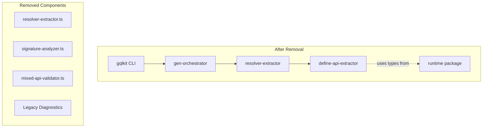

# Design Document

## Overview

**Purpose**: 本機能は、gqlkit のレガシー Resolver API（`*Resolver` 型/値ペア規約）を完全に廃止し、新しい Define API（`defineQuery`、`defineMutation`、`defineField`）へ統一することで、コードベースのシンプル化と保守性向上を実現する。

**Users**: gqlkit 開発者およびユーザーが、明確で一貫性のある API を使用できるようになる。

**Impact**: 既存のレガシー API 実装（抽出ロジック、バリデーション、診断コード）を削除し、すべてのサンプルプロジェクトを Define API へ移行する。gqlkit はリリース前のため後方互換性は不要。

### Goals

- レガシー API 関連コード（extractor、validator、diagnostics）の完全削除
- 全サンプルプロジェクトの Define API への移行
- ドキュメント（CLAUDE.md、steering）の新 API への更新
- 公開 API からレガシー型定義の削除

### Non-Goals

- 新機能の追加
- Define API 自体の変更や拡張
- 後方互換性の維持（リリース前のため不要）

## Architecture

### Existing Architecture Analysis

現在の `resolver-extractor` モジュールは2つの API スタイルを並行サポートしている：

1. **レガシー API**（削除対象）:
   - `resolver-extractor.ts`: `*Resolver` 型/値ペアの抽出
   - `signature-analyzer.ts`: レガシー Resolver のシグネチャ解析
   - `mixed-api-validator.ts`: 両 API 混在検証
   - 診断コード: `MISSING_RESOLVER_VALUE`、`MISSING_RESOLVER_TYPE`、`LEGACY_API_DETECTED`

2. **Define API**（継続）:
   - `define-api-extractor.ts`: `defineQuery`/`defineMutation`/`defineField` 呼び出しの抽出
   - `@gqlkit-ts/runtime`: Define API 関数とヘルパー型の提供

### Architecture Pattern & Boundary Map



**Architecture Integration**:
- Selected pattern: 既存の静的解析パイプラインを簡素化
- Domain boundaries: resolver-extractor モジュールは Define API 抽出のみに責務を限定
- Existing patterns preserved: TypeScript Compiler API による静的解析、Diagnostics パターン
- New components rationale: 追加なし、削除のみ
- Steering compliance: convention-driven 設計原則を維持

### Technology Stack

| Layer | Choice / Version | Role in Feature | Notes |
|-------|------------------|-----------------|-------|
| Backend / Services | TypeScript 5.9+ | 静的型解析とコード変換 | 既存スタック |
| Runtime | @gqlkit-ts/runtime | Define API 関数提供 | 変更なし |

## Requirements Traceability

| Requirement | Summary | Components | Files Affected |
|-------------|---------|------------|----------------|
| 1.1 | レガシー抽出処理の削除 | extract-resolvers, resolver-extractor | extract-resolvers.ts |
| 1.2 | レガシー抽出ロジック削除 | resolver-extractor | resolver-extractor.ts (削除) |
| 1.3 | MISSING_RESOLVER 診断コード削除 | diagnostics | diagnostics.ts |
| 1.4 | レガシー型エクスポート削除 | resolver-extractor index | index.ts |
| 2.1 | mixed-api-validator 削除 | mixed-api-validator | mixed-api-validator.ts (削除) |
| 2.2 | LEGACY_API_DETECTED 削除 | mixed-api-validator | 削除により解消 |
| 2.3 | 混在チェック削除 | extract-resolvers | extract-resolvers.ts |
| 3.1-3.8 | サンプル移行 | examples/* | 各プロジェクトの resolvers/*.ts |
| 4.1-4.4 | ドキュメント更新 | docs | CLAUDE.md, steering/*.md |
| 5.1-5.4 | テスト更新 | tests | *.test.ts files |
| 6.1-6.3 | エクスポート整理 | packages exports | index.ts files |

## Components and Interfaces

| Component | Domain/Layer | Intent | Req Coverage | Files |
|-----------|--------------|--------|--------------|-------|
| extract-resolvers | CLI/Extractor | Define API のみを使用したリゾルバ抽出 | 1.1, 2.3 | extract-resolvers.ts |
| resolver-extractor index | CLI/Extractor | 公開 API の整理 | 1.4, 6.1, 6.3 | index.ts |
| diagnostics | CLI/Types | 診断コード定義の整理 | 1.3, 2.2 | diagnostics.ts |
| example projects | Examples | Define API を使用したサンプル | 3.1-3.8 | examples/**/resolvers/*.ts |
| CLAUDE.md | Documentation | プロジェクトドキュメント | 4.1, 4.2 | CLAUDE.md |
| steering docs | Documentation | プロジェクト規約 | 4.3, 4.4 | .kiro/steering/*.md |

### CLI/Extractor Layer

#### extract-resolvers (Modification)

| Field | Detail |
|-------|--------|
| Intent | Define API 呼び出しからリゾルバ情報を抽出する |
| Requirements | 1.1, 2.3 |

**Responsibilities & Constraints**
- Define API（`defineQuery`、`defineMutation`、`defineField`）呼び出しのみを検出
- レガシー API 抽出ロジックを呼び出さない
- Mixed API バリデーションを実行しない

**Changes Required**
- `extractResolversFromProgram` 呼び出しの削除
- `validateApiStyleConsistency` 呼び出しの削除
- `analyzeSignatures` および `convertToFields` 呼び出しの削除
- レガシー API フォールバックパスの削除

**Contracts**: Service [x]

##### Service Interface (After Modification)

```typescript
interface ExtractResolversResult {
  readonly queryFields: QueryFieldDefinitions;
  readonly mutationFields: MutationFieldDefinitions;
  readonly typeExtensions: ReadonlyArray<TypeExtension>;
  readonly diagnostics: Diagnostics;
}

// extractResolvers は Define API のみを処理
async function extractResolvers(
  options: ExtractResolversOptions
): Promise<ExtractResolversResult>;
```

#### resolver-extractor index (Modification)

| Field | Detail |
|-------|--------|
| Intent | resolver-extractor モジュールの公開 API を定義する |
| Requirements | 1.4, 6.1, 6.3 |

**Changes Required**
- 以下のエクスポートを削除:
  - `ResolverPair`
  - `ExtractedResolvers`
  - `ResolverCategory`
  - `AnalyzedField`、`AnalyzedResolver`、`AnalyzedResolvers`、`ArgumentDefinition`（`signature-analyzer.ts` から）
- `./extractor/resolver-extractor.js` からのインポートを削除
- `./analyzer/signature-analyzer.js` からのインポートを削除

#### diagnostics (Modification)

| Field | Detail |
|-------|--------|
| Intent | 診断コードの型定義を管理する |
| Requirements | 1.3, 2.2 |

**Changes Required**
- `DiagnosticCode` 型から以下を削除:
  - `MISSING_RESOLVER_VALUE`
  - `MISSING_RESOLVER_TYPE`
- 注: `LEGACY_API_DETECTED` は `mixed-api-validator.ts` 内でハードコードされており、型定義には含まれていないため、ファイル削除により解消

### Files to Delete

| File | Reason | Requirements |
|------|--------|--------------|
| `packages/cli/src/resolver-extractor/extractor/resolver-extractor.ts` | レガシー API 抽出ロジック | 1.2 |
| `packages/cli/src/resolver-extractor/extractor/resolver-extractor.test.ts` | 上記のテスト | 5.1 |
| `packages/cli/src/resolver-extractor/extractor/mixed-api-validator.ts` | Mixed API バリデーション | 2.1 |
| `packages/cli/src/resolver-extractor/extractor/mixed-api-validator.test.ts` | 上記のテスト | 5.2 |
| `packages/cli/src/resolver-extractor/analyzer/signature-analyzer.ts` | レガシー シグネチャ解析 | 1.2 |
| `packages/cli/src/resolver-extractor/analyzer/signature-analyzer.test.ts` | 上記のテスト | 5.1 |
| `packages/cli/src/resolver-extractor/converter/field-converter.ts` | レガシー フィールド変換 | 1.2 |
| `packages/cli/src/resolver-extractor/converter/field-converter.test.ts` | 上記のテスト | 5.1 |

### Examples Layer

#### Example Projects Migration

| Field | Detail |
|-------|--------|
| Intent | 全サンプルプロジェクトを Define API パターンに移行する |
| Requirements | 3.1-3.8 |

**Migration Pattern**

各サンプルプロジェクトで以下の変換を適用：

**コーディング規約**:
- アロー関数ではなく `function` を使用する
- 未使用の引数は省略可（すべて書く必要はない）

1. **Query リゾルバ変換**:
```typescript
// Before (Legacy)
export type QueryResolver = {
  user: () => User;
};
export const queryResolver: QueryResolver = {
  user: () => ({ id: "1", name: "Alice" }),
};

// After (Define API)
import { defineQuery, type NoArgs } from "@gqlkit-ts/runtime";
export const user = defineQuery<NoArgs, User>(function () {
  return { id: "1", name: "Alice" };
});
```

2. **Mutation リゾルバ変換**:
```typescript
// Before (Legacy)
export type MutationResolver = {
  createUser: (args: { name: string }) => User;
};
export const mutationResolver: MutationResolver = {
  createUser: (args) => ({ id: "1", name: args.name }),
};

// After (Define API)
import { defineMutation } from "@gqlkit-ts/runtime";
export const createUser = defineMutation<{ name: string }, User>(function (
  _root,
  args
) {
  return { id: "1", name: args.name };
});
```

3. **Field リゾルバ変換**:
```typescript
// Before (Legacy)
export type UserResolver = {
  fullName: (parent: User) => string;
};
export const userResolver: UserResolver = {
  fullName: (parent) => `${parent.firstName} ${parent.lastName}`,
};

// After (Define API)
import { defineField, type NoArgs } from "@gqlkit-ts/runtime";
export const fullName = defineField<User, NoArgs, string>(function (parent) {
  return `${parent.firstName} ${parent.lastName}`;
});
```

**Projects to Migrate**

| Project | Current State | Changes |
|---------|---------------|---------|
| basic-types | QueryResolver | defineQuery への移行 |
| mutations | QueryResolver + MutationResolver | defineQuery + defineMutation への移行 |
| type-relations | QueryResolver (user.ts + post.ts) | defineQuery への移行 |
| type-extensions | QueryResolver + UserResolver | defineQuery + defineField への移行 |
| enums | QueryResolver | defineQuery への移行 |
| field-arguments | QueryResolver with args | defineQuery への移行（引数付き） |

### Documentation Layer

#### CLAUDE.md Update

| Field | Detail |
|-------|--------|
| Intent | プロジェクトドキュメントを Define API に更新する |
| Requirements | 4.1, 4.2 |

**Changes Required**
- セクション3「Resolver naming conventions」を削除
- セクション4「Resolver function signatures」を削除
- Define API の使用方法に関する新しいセクションを追加:
  - `defineQuery<TArgs, TResult>` の使用方法
  - `defineMutation<TArgs, TResult>` の使用方法
  - `defineField<TParent, TArgs, TResult>` の使用方法
  - `NoArgs` 型の説明

#### Steering Documents Update

| Field | Detail |
|-------|--------|
| Intent | steering ドキュメントを Define API に更新する |
| Requirements | 4.3, 4.4 |

**Files to Update**
- `.kiro/steering/structure.md`: Naming Conventions セクションからレガシー規約を削除
- `.kiro/steering/product.md`: 必要に応じて Define API への言及を追加

## Testing Strategy

### Unit Tests

削除対象ファイルのテストを削除：
- `resolver-extractor.test.ts` - 削除
- `mixed-api-validator.test.ts` - 削除
- `signature-analyzer.test.ts` - 削除
- `field-converter.test.ts` - 削除

### Integration Tests

- `extract-resolvers.test.ts`: レガシー API 関連テストケースの削除
- `gen-orchestrator` 統合テスト: Define API のみを使用するよう更新

### E2E Tests

- 各サンプルプロジェクトで `gqlkit gen` が正常動作することを確認
- 移行後のサンプルプロジェクトが正しいスキーマを生成することを確認

## Migration Strategy

### Phase 1: Code Deletion

1. レガシー API ファイルの削除
2. `extract-resolvers.ts` からのレガシー呼び出し削除
3. `index.ts` からのレガシーエクスポート削除
4. `diagnostics.ts` からのレガシー診断コード削除
5. テストファイルの削除/更新

### Phase 2: Example Migration

1. 各サンプルプロジェクトを Define API パターンに変換
2. `.d.ts` ファイルが存在する場合は削除
3. 各プロジェクトで `gqlkit gen` の動作確認

### Phase 3: Documentation Update

1. CLAUDE.md の更新
2. Steering ドキュメントの更新

### Validation Checkpoints

- [ ] すべてのレガシー API ファイルが削除されていること
- [ ] `pnpm check` がエラーなく通過すること
- [ ] すべてのテストがパスすること
- [ ] すべてのサンプルプロジェクトで `gqlkit gen` が成功すること
- [ ] ドキュメントにレガシー API への言及がないこと
