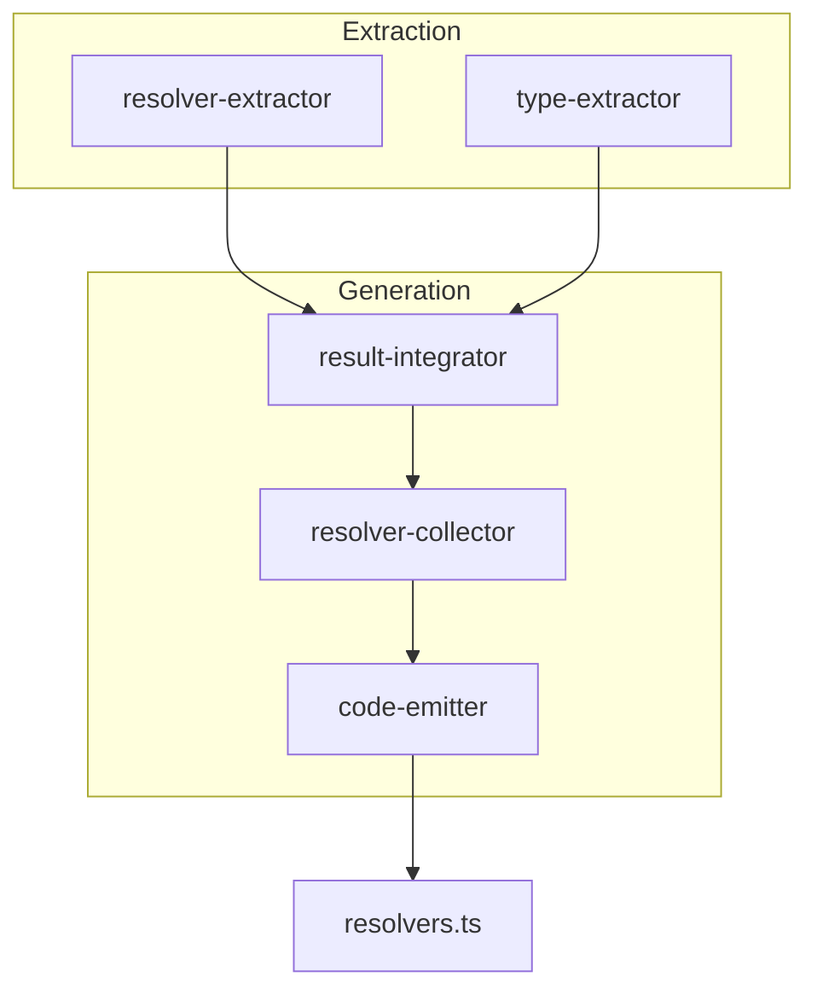
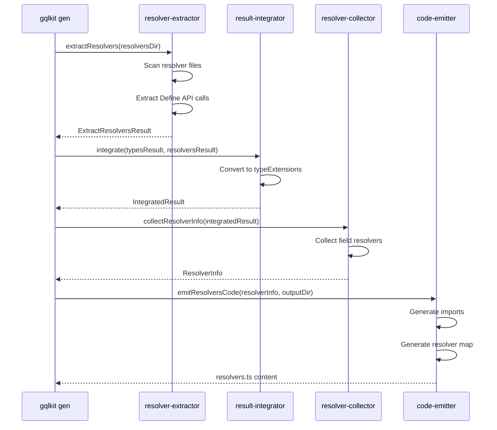

# Technical Design Document

## Overview

**Purpose**: 本機能は `gqlkit gen` コマンドにおける resolver map 生成を修復し、Define API (`defineQuery`, `defineMutation`, `defineField`) で定義されたリゾルバが graphql-tools の `makeExecutableSchema` と互換性のある形式で正しく生成されるようにする。

**Users**: gqlkit を使用する TypeScript 開発者が、型安全な GraphQL サーバーを構築する際に、この機能を利用する。

**Impact**: 現在空のオブジェクトとして生成されている `resolvers.ts` を修正し、すべての Define API リゾルバを含む完全な resolver map を生成する。

### Goals

- Define API で定義されたすべてのリゾルバ（Query、Mutation、Field）を resolver map に含める
- graphql-tools の `makeExecutableSchema` と互換性のある resolver map 形式を生成する
- 正確な import 文を生成し、TypeScript コンパイルエラーを防ぐ
- 決定論的な出力を保証する（同じ入力 → 同じ出力）

### Non-Goals

- 新しいリゾルバ定義 API の追加
- レガシーリゾルバ API のサポート（削除済み）
- HTTP サーバー統合の実装

## Architecture

### Existing Architecture Analysis

gqlkit のコード生成パイプラインは以下のコンポーネントで構成される：

1. **resolver-extractor**: Define API リゾルバを抽出
2. **type-extractor**: TypeScript 型定義を抽出
3. **schema-generator**: 統合・コード生成を実行
   - **result-integrator**: 型とリゾルバ情報を統合
   - **resolver-collector**: resolver map 用の情報を収集
   - **code-emitter**: TypeScript コードを生成

現状、パイプラインは存在するが、生成される `resolvers.ts` が空になっている問題がある。

### Architecture Pattern & Boundary Map



**Architecture Integration**:
- Selected pattern: Pipeline アーキテクチャ（既存パターンを継続）
- Domain boundaries: Extraction → Integration → Generation の明確な分離
- Existing patterns preserved: 各コンポーネントの単一責任原則
- New components rationale: 新規コンポーネントは不要、既存コンポーネントの修正
- Steering compliance: 静的解析ベース、デコレータ不使用の原則を維持

### Technology Stack

| Layer | Choice / Version | Role in Feature | Notes |
|-------|------------------|-----------------|-------|
| Backend / Services | TypeScript 5.9+, ts-morph (via TypeScript Compiler API) | リゾルバ抽出・コード生成 | 既存スタック |
| Infrastructure / Runtime | Node.js (ESM) | CLI 実行環境 | ESM 互換性のため `.js` 拡張子が必要 |

## System Flows

### Resolver Map Generation Flow



**Key Flow Decisions**:
- Define API リゾルバは `resolverExportName` フィールドを持ち、直接エクスポートとして扱われる
- 各リゾルバはソースファイルパスと共に追跡され、正確な import 文生成を可能にする

## Requirements Traceability

| Requirement | Summary | Components | Interfaces | Flows |
|-------------|---------|------------|------------|-------|
| 1.1, 1.2, 1.3, 1.4 | Query リゾルバの resolver map 生成 | DefineApiExtractor, ResultIntegrator, ResolverCollector, CodeEmitter | DefineApiResolverInfo, ExtensionField, FieldResolver | Resolver Map Generation Flow |
| 2.1, 2.2, 2.3, 2.4 | Mutation リゾルバの resolver map 生成 | DefineApiExtractor, ResultIntegrator, ResolverCollector, CodeEmitter | DefineApiResolverInfo, ExtensionField, FieldResolver | Resolver Map Generation Flow |
| 3.1, 3.2, 3.3, 3.4 | フィールドリゾルバの resolver map 生成 | DefineApiExtractor, ResultIntegrator, ResolverCollector, CodeEmitter | DefineApiResolverInfo, ExtensionField, FieldResolver | Resolver Map Generation Flow |
| 4.1, 4.2, 4.3, 4.4 | import 文の正確な生成 | CodeEmitter | ResolverInfo | Resolver Map Generation Flow |
| 5.1, 5.2, 5.3 | makeExecutableSchema 互換性 | CodeEmitter | ResolverInfo | Resolver Map Generation Flow |
| 6.1, 6.2, 6.3, 6.4 | 決定論的な出力 | ResolverCollector, CodeEmitter | ResolverInfo | Resolver Map Generation Flow |
| 7.1, 7.2, 7.3, 7.4, 7.5, 7.6 | サンプルプロジェクトでの動作確認 | All | All | Resolver Map Generation Flow |

## Components and Interfaces

| Component | Domain/Layer | Intent | Req Coverage | Key Dependencies | Contracts |
|-----------|--------------|--------|--------------|------------------|-----------|
| DefineApiExtractor | Extraction | Define API 呼び出しからリゾルバ情報を抽出 | 1, 2, 3 | TypeScript Compiler API (P0) | Service |
| ResultIntegrator | Generation | 型とリゾルバ情報を統合 | 1, 2, 3 | DefineApiExtractor (P0) | Service |
| ResolverCollector | Generation | resolver map 用の情報を収集 | 1, 2, 3, 6 | ResultIntegrator (P0) | Service |
| CodeEmitter | Generation | TypeScript コードを生成 | 4, 5, 6 | ResolverCollector (P0) | Service |

### Extraction Layer

#### DefineApiExtractor

| Field | Detail |
|-------|--------|
| Intent | Define API 呼び出し（defineQuery, defineMutation, defineField）からリゾルバ情報を抽出する |
| Requirements | 1.1, 1.2, 2.1, 2.2, 3.1, 3.2, 3.3 |

**Responsibilities & Constraints**
- `@gqlkit-ts/runtime` からインポートされた Define API 関数呼び出しを識別
- 型引数から Args 型、Return 型、Parent 型（defineField の場合）を抽出
- エクスポートされた変数名をフィールド名として使用

**Dependencies**
- Inbound: extractResolvers (P0)
- External: TypeScript Compiler API (P0)

**Contracts**: Service [x]

##### Service Interface

```typescript
interface DefineApiResolverInfo {
  readonly fieldName: string;
  readonly resolverType: "query" | "mutation" | "field";
  readonly parentTypeName?: string;
  readonly argsType?: TSTypeReference;
  readonly args?: ReadonlyArray<ArgumentDefinition>;
  readonly returnType: TSTypeReference;
  readonly sourceFile: string;
  readonly exportedInputTypes: ReadonlyArray<ExportedInputType>;
}

interface ExtractDefineApiResult {
  readonly resolvers: ReadonlyArray<DefineApiResolverInfo>;
  readonly diagnostics: ReadonlyArray<Diagnostic>;
}

function extractDefineApiResolvers(
  program: ts.Program,
  files: ReadonlyArray<string>,
): ExtractDefineApiResult;
```

- Preconditions: 有効な TypeScript プログラムと解析対象ファイルリスト
- Postconditions: すべての Define API リゾルバが抽出される
- Invariants: エクスポートされていないリゾルバは無視される

### Generation Layer

#### ResultIntegrator

| Field | Detail |
|-------|--------|
| Intent | 型抽出結果とリゾルバ抽出結果を統合し、スキーマ生成用の統一データ構造を作成する |
| Requirements | 1.1, 1.4, 2.1, 2.4, 3.1, 3.4 |

**Responsibilities & Constraints**
- Query/Mutation フィールドを `typeExtensions` として構造化
- フィールドリゾルバを対応する親型にマッピング
- 存在しない型への参照をエラーとして報告

**Dependencies**
- Inbound: generateSchema (P0)
- Outbound: ExtractTypesResult, ExtractResolversResult (P0)

**Contracts**: Service [x]

##### Service Interface

```typescript
interface ExtensionField {
  readonly name: string;
  readonly type: GraphQLFieldType;
  readonly args?: ReadonlyArray<GraphQLInputValue>;
  readonly resolverSourceFile: string;
  readonly resolverExportName?: string;
}

interface TypeExtension {
  readonly targetTypeName: string;
  readonly fields: ReadonlyArray<ExtensionField>;
}

interface IntegratedResult {
  readonly baseTypes: ReadonlyArray<BaseType>;
  readonly typeExtensions: ReadonlyArray<TypeExtension>;
  readonly hasQuery: boolean;
  readonly hasMutation: boolean;
  readonly hasErrors: boolean;
  readonly diagnostics: ReadonlyArray<Diagnostic>;
}

function integrate(
  typesResult: ExtractTypesResult,
  resolversResult: ExtractResolversResult,
): IntegratedResult;
```

- Preconditions: 有効な型とリゾルバ抽出結果
- Postconditions: すべてのリゾルバが適切な `typeExtensions` に含まれる
- Invariants: `resolverExportName` が Define API リゾルバに設定される

#### ResolverCollector

| Field | Detail |
|-------|--------|
| Intent | 統合結果から resolver map 生成に必要な情報を収集・整理する |
| Requirements | 1.1, 2.1, 3.1, 6.2, 6.3 |

**Responsibilities & Constraints**
- `typeExtensions` からフィールドリゾルバ情報を収集
- 直接エクスポート（Define API）と間接エクスポート（レガシー）を区別
- 型名とフィールド名をアルファベット順にソート

**Dependencies**
- Inbound: generateSchema (P0)
- Outbound: IntegratedResult (P0)

**Contracts**: Service [x]

##### Service Interface

```typescript
interface FieldResolver {
  readonly fieldName: string;
  readonly sourceFile: string;
  readonly resolverValueName: string;
  readonly isDirectExport: boolean;
}

interface TypeResolvers {
  readonly typeName: string;
  readonly fields: ReadonlyArray<FieldResolver>;
}

interface ResolverInfo {
  readonly types: ReadonlyArray<TypeResolvers>;
  readonly sourceFiles: ReadonlyArray<string>;
}

function collectResolverInfo(integratedResult: IntegratedResult): ResolverInfo;
```

- Preconditions: 有効な `IntegratedResult`
- Postconditions: すべての `typeExtensions` が処理される
- Invariants: 出力は型名・フィールド名でソートされる

#### CodeEmitter

| Field | Detail |
|-------|--------|
| Intent | ResolverInfo から TypeScript コード（import 文と resolver map）を生成する |
| Requirements | 4.1, 4.2, 4.3, 4.4, 5.1, 5.2, 6.1, 6.4 |

**Responsibilities & Constraints**
- 出力ディレクトリからソースファイルへの相対 import パスを計算
- `.ts` 拡張子を `.js` に変換（ESM 互換性）
- 同一ファイルからの複数インポートを単一 import 文にまとめる
- 直接エクスポートの場合は `fieldName: resolverValueName` 形式で生成

**Dependencies**
- Inbound: generateSchema (P0)
- Outbound: ResolverInfo (P0)

**Contracts**: Service [x]

##### Service Interface

```typescript
function emitResolversCode(
  resolverInfo: ResolverInfo,
  outputDir: string,
): string;
```

- Preconditions: 有効な `ResolverInfo` と出力ディレクトリパス
- Postconditions: 生成されたコードは `makeExecutableSchema` 互換
- Invariants: import 文はアルファベット順にソートされる

**Expected Output Format**:

```typescript
import { me, allUsers, user } from "../gql/resolvers/queries.js";
import { createUser } from "../gql/resolvers/mutations.js";
import { posts_, displayName } from "../gql/resolvers/user-fields.js";

export const resolvers = {
    Mutation: {
      createUser: createUser,
    },
    Query: {
      allUsers: allUsers,
      me: me,
      user: user,
    },
    User: {
      displayName: displayName,
      posts_: posts_,
    },
} as const;
```

**Implementation Notes**
- Integration: Define API リゾルバは `isDirectExport: true` として扱い、`fieldName: resolverValueName` 形式で生成
- Validation: 生成されたコードが TypeScript として有効であることを保証
- Risks: import パス計算のエラーにより TypeScript コンパイルエラーが発生する可能性

## Data Models

### Domain Model

本機能は既存のデータモデルを使用し、新規のドメインモデルは導入しない。

主要なエンティティ：
- **DefineApiResolverInfo**: 抽出されたリゾルバ情報
- **IntegratedResult**: 統合された型とリゾルバ情報
- **ResolverInfo**: コード生成用のリゾルバ情報

### Data Contracts & Integration

**API Data Transfer**

入力データフロー：
```
ResolverFile(.ts) → DefineApiResolverInfo → ExtensionField → FieldResolver → resolvers.ts
```

主要な型変換：
1. `DefineApiResolverInfo.fieldName` → `ExtensionField.name` → `FieldResolver.fieldName`
2. `DefineApiResolverInfo.fieldName` → `ExtensionField.resolverExportName` → `FieldResolver.resolverValueName`
3. `DefineApiResolverInfo.sourceFile` → `ExtensionField.resolverSourceFile` → `FieldResolver.sourceFile`

## Error Handling

### Error Strategy

- **Fail Fast**: 無効なリゾルバ定義は抽出時に即座にエラー報告
- **Actionable Messages**: ファイル位置と修正方法を含むエラーメッセージ

### Error Categories and Responses

**User Errors**:
- 無効な Define API 呼び出し → `INVALID_DEFINE_CALL` 診断エラー
- 存在しない型への参照 → `UNKNOWN_TARGET_TYPE` 診断エラー

**System Errors**:
- ファイル読み取りエラー → スキャン時にエラー診断を追加

### Monitoring

- 診断メッセージは `Diagnostic` 型で統一的に報告
- エラー/警告の重大度レベルを区別

## Testing Strategy

### Unit Tests

- **DefineApiExtractor**: defineQuery/defineMutation/defineField の抽出、型引数の解析、エラーケース
- **ResultIntegrator**: Query/Mutation/Field の統合、resolverExportName の伝播、エラー検出
- **ResolverCollector**: 直接エクスポート判定、ソート順序、ソースファイル収集
- **CodeEmitter**: import パス生成、resolver map フォーマット、重複排除

### Integration Tests

- Extraction → Integration → Collection → Emission の完全なパイプライン
- 複数ファイルからのリゾルバ収集
- Query + Mutation + Field の組み合わせ

### E2E Tests

- `examples/define-api` での完全なコード生成
- `examples/basic-types`, `examples/mutations`, `examples/type-relations`, `examples/type-extensions` での動作確認
- 生成されたスキーマでの GraphQL クエリ実行

### Performance

- 大量のリゾルバファイルでの生成時間測定（目標: 100ファイル < 5秒）

## Optional Sections

### Security Considerations

- 生成されるコードには実行時セキュリティ上の懸念なし
- 入力ファイルは信頼されたソースディレクトリからのみ読み込み

### Performance & Scalability

- TypeScript Compiler API の使用によりメモリ使用量が増加する可能性
- 大規模プロジェクトでは増分コンパイルの検討が必要（将来の課題）
