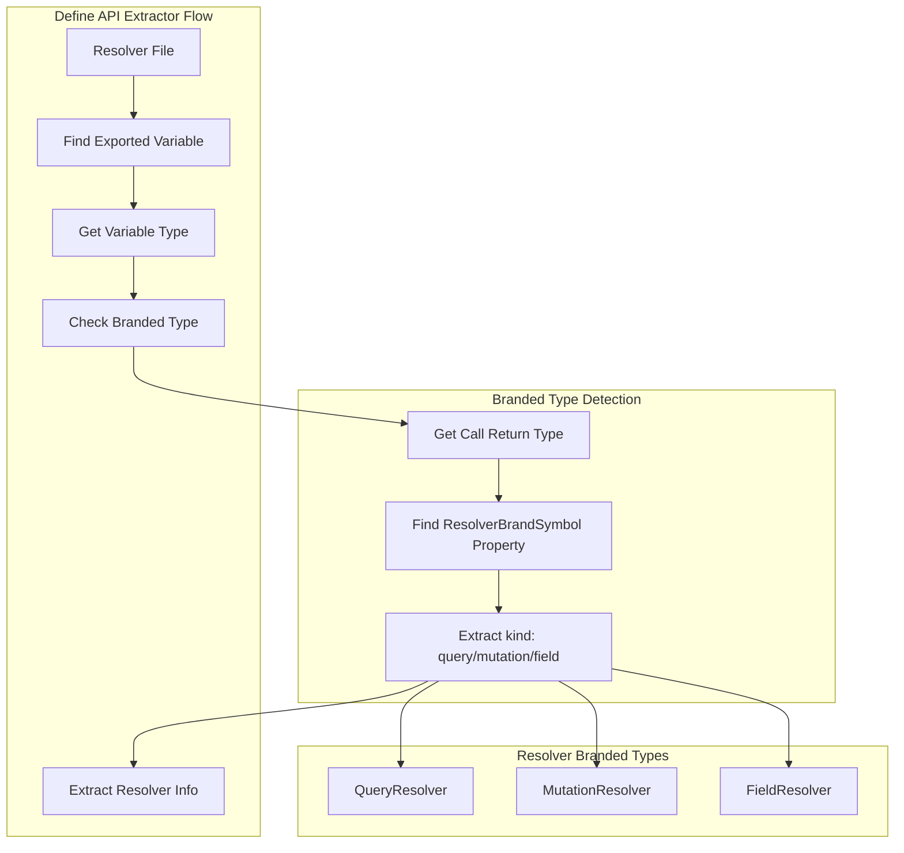
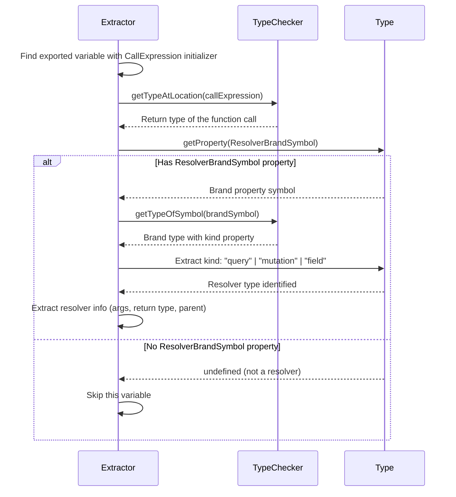
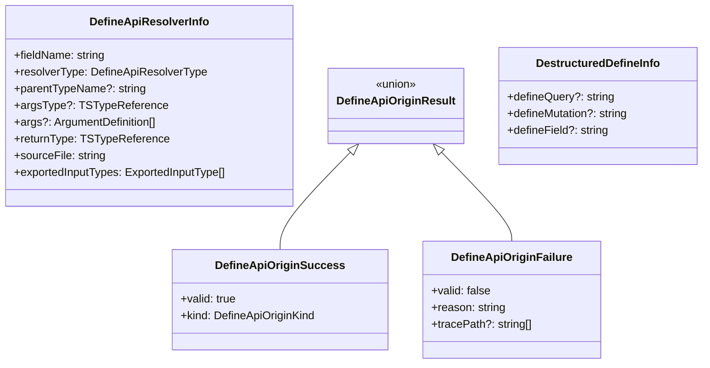

# Design Document

## Overview

**Purpose**: この機能は、re-export パターンを使用して Define API 関数（`defineQuery`, `defineMutation`, `defineField`）をインポートする場合に resolver が検出されないクリティカルなバグを修正する。

**Users**: gqlkit ユーザーは、推奨されるプロジェクト構成（`gqlkit.ts` で共通設定を定義し、resolver ファイルでインポートするパターン）を使用できるようになる。

**Impact**: 既存の `define-api-extractor.ts` を拡張し、TypeScript の型チェッカー API を使用してブランド型（`QueryResolver`/`MutationResolver`/`FieldResolver`）を検査することで resolver を識別する。import チェーンの追跡は不要。

### Goals

- re-export された Define API 関数を使用した resolver を正しく検出する
- 既存の直接インポートパターンとの後方互換性を維持する
- 冗長なコードチェックを削除してコード品質を向上させる
- 検出失敗時に有用な診断情報を提供する

### Non-Goals

- Define API 以外の resolver パターンのサポート
- 実行時のパフォーマンス最適化（静的解析のため影響なし）
- 新しい Define API 関数の追加

## Architecture

### Existing Architecture Analysis

現在の `define-api-extractor.ts` には以下の問題がある：

1. **`findCreateGqlkitApisDestructuring`（L45-94）**: 各ソースファイル内でのみ `createGqlkitApis()` の分割代入を検索する。別ファイルから re-export された関数を使用するケースに対応していない。

2. **`isCreateGqlkitApisCall`（L127-132）**: `RUNTIME_PACKAGE` 定数と同じ値（`"@gqlkit-ts/runtime"`）をハードコードしており、冗長なチェックになっている。

3. **処理フロー**: 現在は「同一ファイル内で `createGqlkitApis` を探す」→「見つかった場合のみ resolver を検出」という流れで、インポートチェーンをたどる機能がない。

### Architecture Pattern & Boundary Map



**Architecture Integration**:
- Selected pattern: ブランド型ベースの検出（import 追跡不要）
- Domain boundary: `define-api-extractor.ts` 内で完結（他モジュールへの影響なし）
- Existing patterns preserved: `extractDefineApiResolvers` のインターフェースは変更なし
- New components rationale: ブランド型検出のためのヘルパー関数を追加
- Steering compliance: 静的解析のみ、デコレータなし、deterministic な出力
- Performance: 型検査のみで完結するため、import 追跡より軽量

### Technology Stack

| Layer | Choice / Version | Role in Feature | Notes |
|-------|------------------|-----------------|-------|
| Language | TypeScript 5.9+ | 実装言語 | strict mode 必須 |
| TypeScript Compiler API | typescript | ブランド型の検査 | `getTypeAtLocation`, `getProperty` API 使用 |

## System Flows

### Branded Type Detection Flow



## Requirements Traceability

| Requirement | Summary | Components | Interfaces | Flows |
|-------------|---------|------------|------------|-------|
| 1.1-1.5 | Re-export された Define API 関数の検出 | `detectResolverFromBrandedType` | `DefineApiResolverType` | Branded Type Detection |
| 2.1 | 直接インポートパターンの継続サポート | `detectResolverFromBrandedType` | 変更なし | Branded Type Detection |
| 3.1-3.2 | 冗長なチェックの削除 | `isCreateGqlkitApisCall` | - | - |
| 4.1-4.3 | 検出失敗時の診断情報 | `extractDefineApiResolvers` | `Diagnostic` | エラー報告フロー |
| 5.1-5.2 | 多段階 Re-export のサポート | `detectResolverFromBrandedType` | - | Branded Type Detection（自動対応） |

## Components and Interfaces

| Component | Domain/Layer | Intent | Req Coverage | Key Dependencies | Contracts |
|-----------|--------------|--------|--------------|------------------|-----------|
| `detectResolverFromBrandedType` | Extractor | ブランド型を検査して resolver タイプを判定 | 1.1-1.5, 2.1, 5.1-5.2 | TypeChecker (P0) | Service |
| `isCreateGqlkitApisCall` | Extractor | createGqlkitApis 呼び出しの検証（修正） | 3.1-3.2 | - | Service |
| `extractDefineApiResolvers` | Extractor | resolver 情報の抽出（既存、ブランド型検出に変更） | 4.1-4.3 | `detectResolverFromBrandedType` (P0) | Service |

### Extractor Layer

#### detectResolverFromBrandedType

| Field | Detail |
|-------|--------|
| Intent | 関数呼び出しの戻り値型を検査し、`ResolverBrandSymbol` プロパティの有無と `kind` を確認して resolver タイプを判定する |
| Requirements | 1.1-1.5, 2.1, 5.1-5.2 |

**Responsibilities & Constraints**
- 関数呼び出しの戻り値型を取得する
- `ResolverBrandSymbol` プロパティ（unique symbol）を検索する
- `kind` プロパティから resolver タイプ（"query" | "mutation" | "field"）を抽出する
- ブランド型が見つからない場合は `undefined` を返す

**Dependencies**
- Inbound: `extractDefineApiResolvers` から呼び出される (P0)
- External: TypeScript TypeChecker API (`getTypeAtLocation`, `getProperty`, `getTypeOfSymbol`) (P0)

**Contracts**: Service [x]

##### Service Interface

```typescript
/**
 * ブランド型を検査して resolver タイプを判定する
 *
 * ResolverBrandSymbol は @gqlkit-ts/runtime で定義された unique symbol で、
 * 偽陽性を防ぐために正確なシンボル一致を確認する
 */
function detectResolverFromBrandedType(
  callExpr: ts.CallExpression,
  checker: ts.TypeChecker,
): DefineApiResolverType | undefined;

// 実装イメージ
function detectResolverFromBrandedType(
  callExpr: ts.CallExpression,
  checker: ts.TypeChecker,
): DefineApiResolverType | undefined {
  // 1. 関数呼び出しの戻り値型を取得
  const returnType = checker.getTypeAtLocation(callExpr);

  // 2. ResolverBrandSymbol プロパティを探す
  // unique symbol なので、シンボル名で検索（__@ResolverBrandSymbol 形式）
  const properties = returnType.getProperties();
  const brandProp = properties.find(p => {
    const name = p.getName();
    // unique symbol は内部的に __@symbolName@id 形式になる
    return name.includes("ResolverBrandSymbol");
  });

  if (!brandProp) return undefined;

  // 3. ブランド型から kind を抽出
  const brandType = checker.getTypeOfSymbol(brandProp);
  const kindProp = brandType.getProperty("kind");
  if (!kindProp) return undefined;

  const kindType = checker.getTypeOfSymbol(kindProp);
  // リテラル型から値を取得
  if (kindType.isStringLiteral()) {
    const kind = kindType.value;
    if (kind === "query" || kind === "mutation" || kind === "field") {
      return kind;
    }
  }

  return undefined;
}
```

- Preconditions: `callExpr` は `export const xxx = ...` の initializer である
- Postconditions: ブランド型を持つ場合は resolver タイプを返す、そうでなければ `undefined`
- Invariants: 同一の callExpr に対して常に同じ結果を返す（deterministic）

**Implementation Notes**
- Integration: 既存の `isDestructuredDefineCall` と `findCreateGqlkitApisDestructuring` を置き換え
- Validation: unique symbol による厳密な一致確認で偽陽性を防止
- Performance: import チェーン追跡より軽量（単一の型検査のみ）
- Risks: TypeScript の unique symbol の内部表現に依存（低リスク、テストで検証可能）

#### isCreateGqlkitApisCall（修正）

| Field | Detail |
|-------|--------|
| Intent | createGqlkitApis 呼び出しの検証。冗長なチェックを削除する |
| Requirements | 3.1-3.2 |

**Responsibilities & Constraints**
- `RUNTIME_PACKAGE` 定数を一度だけ使用する
- 重複した `"@gqlkit-ts/runtime"` 文字列を削除する

**Contracts**: Service [x]

##### Service Interface

```typescript
// 変更前（L127-132）
if (
  fileName.includes(RUNTIME_PACKAGE) ||
  fileName.includes("@gqlkit-ts/runtime")  // 削除対象
) {
  return true;
}

// 変更後
if (fileName.includes(RUNTIME_PACKAGE)) {
  return true;
}
```

**Implementation Notes**
- Validation: 既存のテストケースが全て通過することを確認
- Risks: なし（論理的に同等）

#### extractDefineApiResolvers（診断機能強化）

| Field | Detail |
|-------|--------|
| Intent | resolver 情報の抽出。検出失敗時の診断情報を強化する |
| Requirements | 4.1-4.3 |

**Responsibilities & Constraints**
- import チェーンのトレース失敗時に詳細な診断情報を提供する
- 検出成功/スキップの統計を報告する

**Dependencies**
- Outbound: `isValidDefineApiFunction`, `traceDefineApiOrigin` を使用 (P0)

**Contracts**: Service [x]

##### Service Interface

```typescript
// 既存の Diagnostic 型を拡張使用
interface Diagnostic {
  readonly code: string;
  readonly message: string;
  readonly severity: "error" | "warning" | "info";
  readonly location: {
    readonly file: string;
    readonly line: number;
    readonly column: number;
  };
}

// 新しい診断コード
type DiagnosticCode =
  | "INVALID_DEFINE_CALL"        // 既存
  | "IMPORT_TRACE_FAILED"        // import チェーンのトレース失敗
  | "NO_CREATE_GQLKIT_APIS"      // createGqlkitApis が見つからない
  | "CIRCULAR_IMPORT_DETECTED";  // 循環参照検出
```

**Implementation Notes**
- Integration: 既存の診断フローに新しいコードを追加
- Validation: 各失敗パターンに対して適切な診断メッセージを生成

## Data Models

### Domain Model



**Business Rules & Invariants**:
- Define API 関数は必ず `@gqlkit-ts/runtime` の `createGqlkitApis` から派生する
- 同一ファイル内の分割代入と re-export の両パターンをサポート
- 循環参照は検出し、無限ループを回避する

## Error Handling

### Error Strategy

TypeScript の型システムと discriminated union を使用して、エラー状態を型安全に表現する。

### Error Categories and Responses

**User Errors**:
- import パスが見つからない → 明確なエラーメッセージと import パスを表示
- createGqlkitApis が見つからない → 中間ファイルのパスと期待される定義場所を表示

**System Errors**:
- 循環参照検出 → トレースパスを含むエラーメッセージを表示、処理を継続

**Business Logic Errors**:
- 無効な Define API 呼び出し → 既存の `INVALID_DEFINE_CALL` 診断を使用

### Monitoring

- 検出成功した resolver 数をログ出力
- スキップされたファイルがある場合はその理由を報告

## Testing Strategy

### Unit Tests

- `detectResolverFromBrandedType` が `QueryResolver` ブランド型を正しく検出する
- `detectResolverFromBrandedType` が `MutationResolver` ブランド型を正しく検出する
- `detectResolverFromBrandedType` が `FieldResolver` ブランド型を正しく検出する
- `detectResolverFromBrandedType` がブランド型を持たない関数に対して `undefined` を返す
- `detectResolverFromBrandedType` が re-export された関数でも正しく動作する
- `isCreateGqlkitApisCall` の冗長チェック削除後も既存テストが通過する

### Integration Tests

- examples/define-api の resolver が正しく検出される
- examples/basic-types の resolver が正しく検出される
- 複数ファイルにまたがる re-export パターンが動作する
- 名前変更 re-export（`export const myQuery = defineQuery`）が動作する

### E2E Tests

- `gqlkit gen` コマンドが re-export パターンを使用したプロジェクトで正常に動作する
- 生成された resolver map が期待通りの内容を含む

## Supporting References

### TypeScript Compiler API

ブランド型の検査には以下の API を使用する：

- `checker.getTypeAtLocation(node)`: ノードの型を取得
- `type.getProperties()`: 型のプロパティ一覧を取得
- `type.getProperty(name)`: 特定のプロパティを取得
- `checker.getTypeOfSymbol(symbol)`: シンボルの型を取得
- `type.isStringLiteral()`: リテラル型かどうかを判定

参考資料:
- [TypeScript Compiler API Wiki](https://github.com/microsoft/TypeScript/wiki/Using-the-Compiler-API)
- [TypeScript Branded Types](https://egghead.io/blog/using-branded-types-in-typescript)
