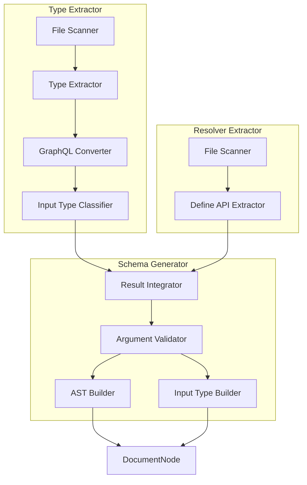
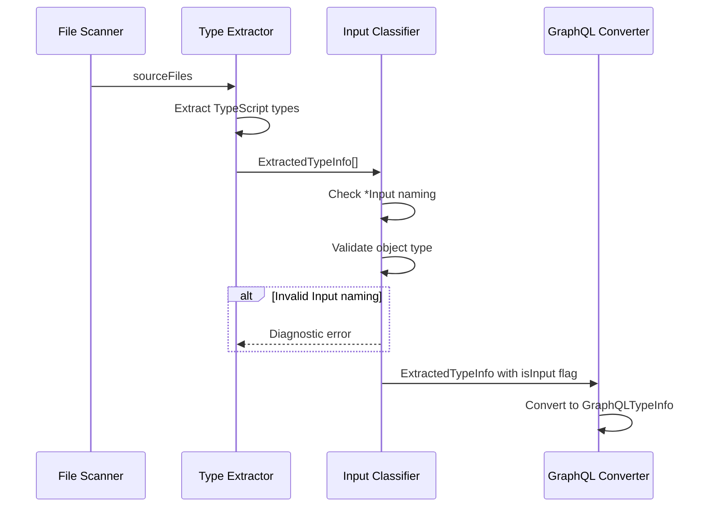
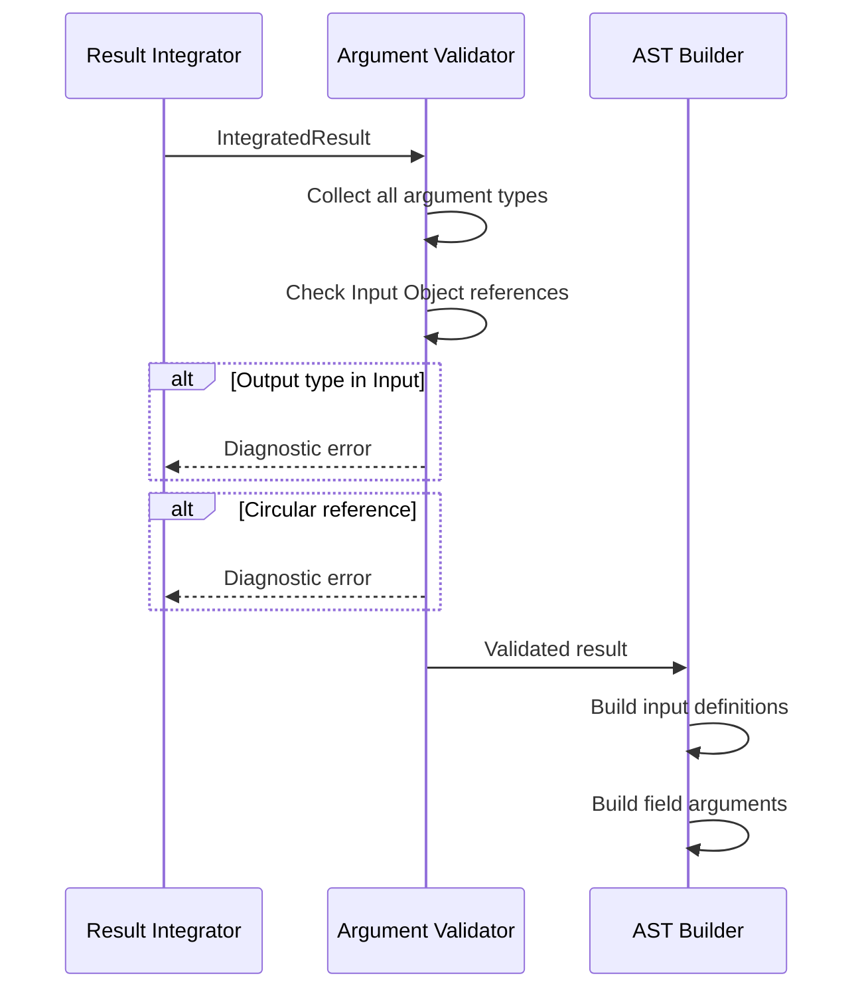
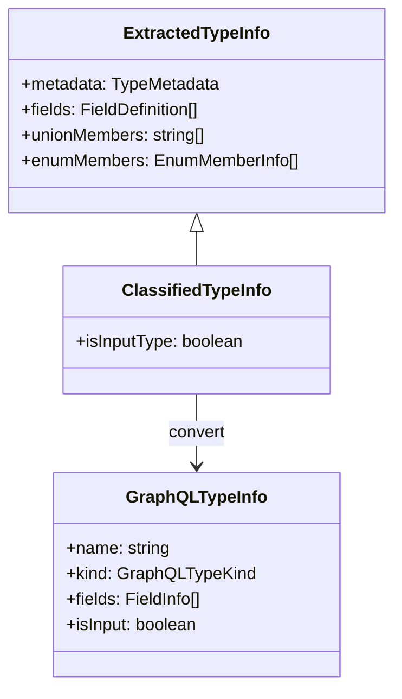

# Technical Design Document

## Overview

**Purpose**: 本機能は、gqlkit における GraphQL フィールド引数および Input Object 型の完全なサポートを提供する。リゾルバ定義の型パラメータ（`TArgs`）から引数情報を抽出し、GraphQL スキーマに反映させることで、型安全な引数定義を実現する。

**Users**: gqlkit を使用する開発者が、リゾルバに引数を定義し、自動的に GraphQL スキーマへ反映させるワークフローで利用する。

**Impact**: 既存の Type Extractor および Schema Generator を拡張し、Input Object 型の認識とスキーマ生成を追加する。

### Goals

- Input Object 型の自動認識（`*Input` 命名規則）
- リゾルバ引数型からの GraphQL 引数定義自動生成
- Input Object 型の GraphQL `input` 定義生成
- 不正な引数定義に対する明確なエラーメッセージ提供

### Non-Goals

- カスタム Input Object 命名規則のサポート（`*Input` 以外）
- ディレクティブやデフォルト値のサポート
- 引数のバリデーションロジック生成

## Architecture

### Existing Architecture Analysis

現在の実装は以下のパイプライン構成を持つ：

1. **Type Extractor**: `src/gql/types` から TypeScript 型を抽出し、`GraphQLTypeInfo` へ変換
2. **Resolver Extractor**: `src/gql/resolvers` から Define API リゾルバを抽出し、`DefineApiResolverInfo` を生成。既に `args` フィールドで引数情報を抽出済み
3. **Result Integrator**: 型とリゾルバを統合し、`IntegratedResult` を生成
4. **AST Builder**: `IntegratedResult` から GraphQL DocumentNode を生成

現在の制約：
- Type Extractor は全ての型を Output 型として扱い、Input Object を区別しない
- Schema Generator は `input` 型定義を生成しない
- 引数型のバリデーション（Input Object 制約）が不足

### Architecture Pattern & Boundary Map



**Architecture Integration**:
- Selected pattern: パイプライン拡張（既存アーキテクチャに準拠）
- Domain boundaries: Type Extractor に Input 分類機能を追加、Schema Generator に Input 型生成と検証を追加
- Existing patterns preserved: 既存の Extractor/Converter/Builder パターンを維持
- New components rationale: Input Type Classifier と Argument Validator は既存コンポーネントを拡張
- Steering compliance: Convention-driven design、Fail-fast validation 原則を維持

### Technology Stack

| Layer | Choice / Version | Role in Feature | Notes |
|-------|------------------|-----------------|-------|
| Backend / Services | TypeScript 5.9+ | 型解析・AST 操作 | ts.TypeChecker による型情報抽出 |
| Data / Storage | N/A | N/A | ファイルシステム読み取りのみ |

## System Flows

### Input Object Recognition Flow



### Argument Validation Flow



## Requirements Traceability

| Requirement | Summary | Components | Interfaces | Flows |
|-------------|---------|------------|------------|-------|
| 1.1, 1.2, 1.3, 1.4 | Input Object 型の認識 | InputTypeClassifier, TypeExtractor | `classifyInputType()` | Input Object Recognition |
| 2.1, 2.2, 2.3, 2.4, 2.5 | リゾルバ引数型の抽出 | DefineAPIExtractor | `ArgumentDefinition` | - |
| 3.1, 3.2, 3.3, 3.4, 3.5 | フィールド引数のスキーマ生成 | ASTBuilder | `buildInputValueDefinitionNode()` | - |
| 4.1, 4.2, 4.3, 4.4, 4.5 | Input Object 型定義の生成 | InputTypeBuilder, ASTBuilder | `buildInputObjectTypeDefinitionNode()` | - |
| 5.1, 5.2, 5.3, 5.4, 5.5, 5.6 | スカラー型・Enum 型の引数サポート | GraphQLConverter, ASTBuilder | `convertTsTypeToGraphQL()` | - |
| 6.1, 6.2, 6.3, 6.4, 6.5 | エラーハンドリングと検証 | ArgumentValidator | `validateArguments()` | Argument Validation |

## Components and Interfaces

| Component | Domain/Layer | Intent | Req Coverage | Key Dependencies (P0/P1) | Contracts |
|-----------|--------------|--------|--------------|--------------------------|-----------|
| InputTypeClassifier | Type Extractor | Input Object 型の識別 | 1.1, 1.2, 1.3, 1.4 | TypeExtractor (P0) | Service |
| ArgumentValidator | Schema Generator | 引数型の検証 | 6.1, 6.2, 6.3, 6.4, 6.5 | ResultIntegrator (P0) | Service |
| InputTypeBuilder | Schema Generator | Input 型 AST 生成 | 4.1, 4.2, 4.3, 4.4, 4.5 | ASTBuilder (P0) | Service |

### Type Extractor Layer

#### InputTypeClassifier

| Field | Detail |
|-------|--------|
| Intent | `*Input` 命名規則に基づく Input Object 型の識別と分類 |
| Requirements | 1.1, 1.2, 1.3, 1.4 |

**Responsibilities & Constraints**
- 型名が `Input` で終わるオブジェクト型を Input Object として識別
- Input Object 型にはメタデータフラグを付与
- 非オブジェクト型（union、interface 等）で `Input` 命名の場合はエラー

**Dependencies**
- Inbound: TypeExtractor - 抽出済み型情報 (P0)
- Outbound: GraphQLConverter - 分類済み型情報 (P0)

**Contracts**: Service [x]

##### Service Interface

```typescript
interface InputTypeClassificationResult {
  readonly types: ReadonlyArray<ClassifiedTypeInfo>;
  readonly diagnostics: ReadonlyArray<Diagnostic>;
}

interface ClassifiedTypeInfo extends ExtractedTypeInfo {
  readonly isInputType: boolean;
}

function classifyInputTypes(
  types: ReadonlyArray<ExtractedTypeInfo>
): InputTypeClassificationResult;
```

- Preconditions: 型情報が Type Extractor により抽出済み
- Postconditions: 全ての型が Input/Output に分類される
- Invariants: `*Input` 命名の型は `isInputType: true`

**Implementation Notes**
- Integration: 既存の `graphql-converter.ts` に統合可能
- Validation: 命名規則チェックはソースファイル位置情報を含む
- Risks: 既存の型定義が意図せず Input として扱われる可能性

### Schema Generator Layer

#### ArgumentValidator

| Field | Detail |
|-------|--------|
| Intent | 引数型の整合性検証と循環参照検出 |
| Requirements | 6.1, 6.2, 6.3, 6.4, 6.5 |

**Responsibilities & Constraints**
- 引数型が既知の型（スカラー、Enum、Input Object）を参照することを検証
- Input Object 内のフィールドが Output 型を参照していないことを検証
- 循環参照の検出
- 複数エラーの収集とまとめて報告

**Dependencies**
- Inbound: ResultIntegrator - 統合結果 (P0)
- Outbound: ASTBuilder - 検証済み結果 (P0)

**Contracts**: Service [x]

##### Service Interface

```typescript
interface ArgumentValidationResult {
  readonly isValid: boolean;
  readonly diagnostics: ReadonlyArray<Diagnostic>;
}

interface ValidationContext {
  readonly knownTypes: ReadonlySet<string>;
  readonly inputTypes: ReadonlySet<string>;
  readonly outputTypes: ReadonlySet<string>;
  readonly enumTypes: ReadonlySet<string>;
}

function validateArguments(
  integratedResult: IntegratedResult,
  context: ValidationContext
): ArgumentValidationResult;
```

- Preconditions: IntegratedResult が生成済み
- Postconditions: 全ての引数型が検証される
- Invariants: エラーは常にソースファイル位置情報を含む

**Implementation Notes**
- Integration: `result-integrator.ts` の `integrate()` 関数内で呼び出し
- Validation: 深さ優先探索で循環参照を検出
- Risks: 大規模な型グラフでのパフォーマンス

#### InputTypeBuilder

| Field | Detail |
|-------|--------|
| Intent | GraphQL Input Object 型定義の AST 生成 |
| Requirements | 4.1, 4.2, 4.3, 4.4, 4.5 |

**Responsibilities & Constraints**
- Input Object 型から GraphQL `input` 型定義ノードを生成
- フィールドの nullability を正しく反映
- ネストした Input Object 型参照をサポート

**Dependencies**
- Inbound: ResultIntegrator - Input Object 型情報 (P0)
- Outbound: DocumentNode - 生成された AST (P0)

**Contracts**: Service [x]

##### Service Interface

```typescript
function buildInputObjectTypeDefinitionNode(
  inputType: InputTypeInfo
): InputObjectTypeDefinitionNode;

interface InputTypeInfo {
  readonly name: string;
  readonly fields: ReadonlyArray<InputFieldInfo>;
  readonly sourceFile: string;
}

interface InputFieldInfo {
  readonly name: string;
  readonly type: GraphQLFieldType;
}
```

- Preconditions: Input Object 型情報が検証済み
- Postconditions: 有効な GraphQL InputObjectTypeDefinitionNode が生成される
- Invariants: フィールド名はアルファベット順でソート

**Implementation Notes**
- Integration: 既存の `ast-builder.ts` に新規関数として追加
- Validation: graphql-js の Kind.INPUT_OBJECT_TYPE_DEFINITION を使用
- Risks: なし（既存パターンに準拠）

## Data Models

### Domain Model

#### 型分類



#### Input/Output 型の区別

| 型カテゴリ | GraphQL 表現 | 引数使用可否 | 戻り値使用可否 |
|-----------|-------------|-------------|--------------|
| Scalar (string, number, boolean) | String, Int, Float, Boolean | Yes | Yes |
| ID | ID | Yes | Yes |
| Enum | enum | Yes | Yes |
| Input Object (*Input) | input | Yes | No |
| Object | type | No | Yes |
| Union | union | No | Yes |

### Logical Data Model

#### GraphQLTypeKind の拡張

現在の `GraphQLTypeKind`:
```typescript
type GraphQLTypeKind = "Object" | "Union" | "Enum";
```

拡張後:
```typescript
type GraphQLTypeKind = "Object" | "Union" | "Enum" | "InputObject";
```

#### GraphQLTypeInfo の拡張

```typescript
interface GraphQLTypeInfo {
  readonly name: string;
  readonly kind: GraphQLTypeKind;
  readonly fields?: ReadonlyArray<FieldInfo>;
  readonly unionMembers?: ReadonlyArray<string>;
  readonly enumValues?: ReadonlyArray<EnumValueInfo>;
  readonly sourceFile: string;
}
```

`kind: "InputObject"` の場合、`fields` は Input フィールドを表す。

#### IntegratedResult の拡張

```typescript
interface IntegratedResult {
  readonly baseTypes: ReadonlyArray<BaseType>;
  readonly inputTypes: ReadonlyArray<InputType>;  // 新規追加
  readonly typeExtensions: ReadonlyArray<TypeExtension>;
  readonly hasQuery: boolean;
  readonly hasMutation: boolean;
  readonly hasErrors: boolean;
  readonly diagnostics: ReadonlyArray<Diagnostic>;
}

interface InputType {
  readonly name: string;
  readonly fields: ReadonlyArray<InputFieldInfo>;
  readonly sourceFile: string;
}

interface InputFieldInfo {
  readonly name: string;
  readonly type: GraphQLFieldType;
}
```

## Error Handling

### Error Strategy

Fail-fast 原則に基づき、検出したエラーを全て収集し、まとめて報告する。

### Error Categories and Responses

**User Errors (Diagnostic)**:

| Error Code | 状況 | メッセージ例 |
|------------|------|-------------|
| `INVALID_INPUT_TYPE` | `*Input` 命名だが非オブジェクト型 | `Type 'FooInput' ends with 'Input' but is not an object type. Input types must be object types.` |
| `UNKNOWN_ARGUMENT_TYPE` | 引数型が未知の型を参照 | `Argument type 'UnknownType' is not defined. Define it in src/gql/types or use a scalar type.` |
| `OUTPUT_TYPE_IN_INPUT` | Input Object が Output 型を参照 | `Input type 'CreateUserInput' references output type 'User'. Input types can only reference scalars, enums, and other input types.` |
| `CIRCULAR_INPUT_REFERENCE` | 循環参照検出 | `Circular reference detected: CreateUserInput -> AddressInput -> CreateUserInput` |

**エラー報告形式**:
```
error[INVALID_INPUT_TYPE]: Type 'StatusInput' ends with 'Input' but is a union type
  --> src/gql/types/status.ts:5:1
```

### Monitoring

- 全てのエラーは `Diagnostic` 型で統一
- エラー収集は `collectDiagnostics()` で重複排除済み

## Testing Strategy

### Unit Tests

1. **InputTypeClassifier**
   - `*Input` 命名のオブジェクト型が正しく識別される
   - `*Input` 命名の非オブジェクト型でエラーが発生する
   - 通常のオブジェクト型は Input として識別されない

2. **ArgumentValidator**
   - 有効な引数型（スカラー、Enum、Input Object）が検証を通過
   - Output 型参照でエラーが発生
   - 循環参照検出が正しく動作
   - 複数エラーがまとめて報告される

3. **InputTypeBuilder**
   - Input Object 型定義が正しく生成される
   - フィールドの nullability が正しく反映される
   - ネストした Input Object 参照が正しく生成される

### Integration Tests

1. **End-to-end スキーマ生成**
   - Input Object 型を含むスキーマが正しく生成される
   - 引数付きリゾルバのスキーマが正しく生成される
   - Input Object と Enum の組み合わせが正しく動作する

2. **エラーケース**
   - 不正な Input Object 定義でビルドが失敗する
   - エラーメッセージにファイルパスと行番号が含まれる

### E2E Tests

1. **examples ディレクトリでの検証**
   - 既存の example プロジェクトに Input Object を追加
   - `gqlkit gen` コマンドで正しいスキーマが生成される
