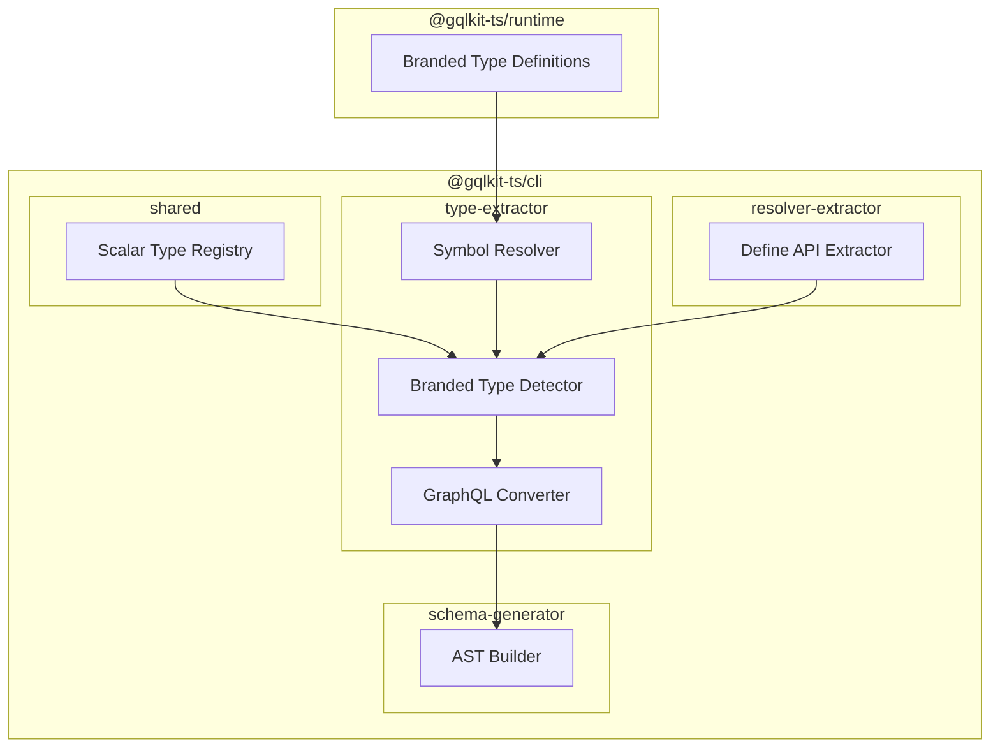
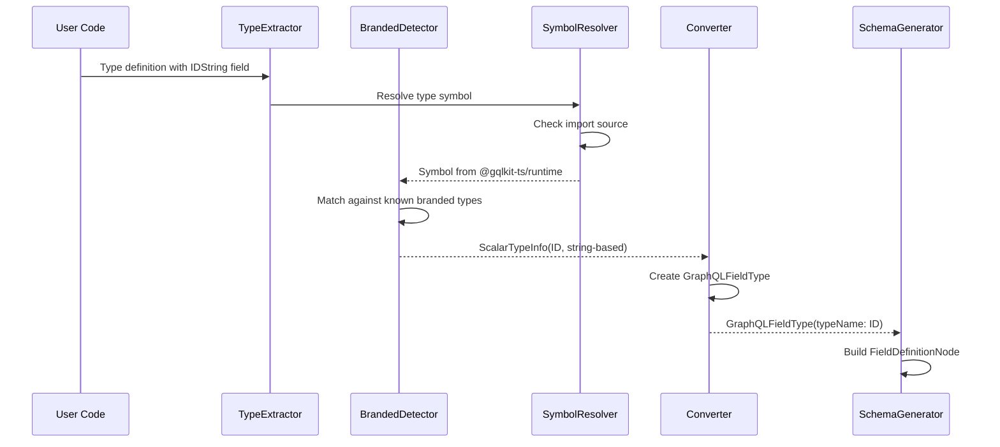
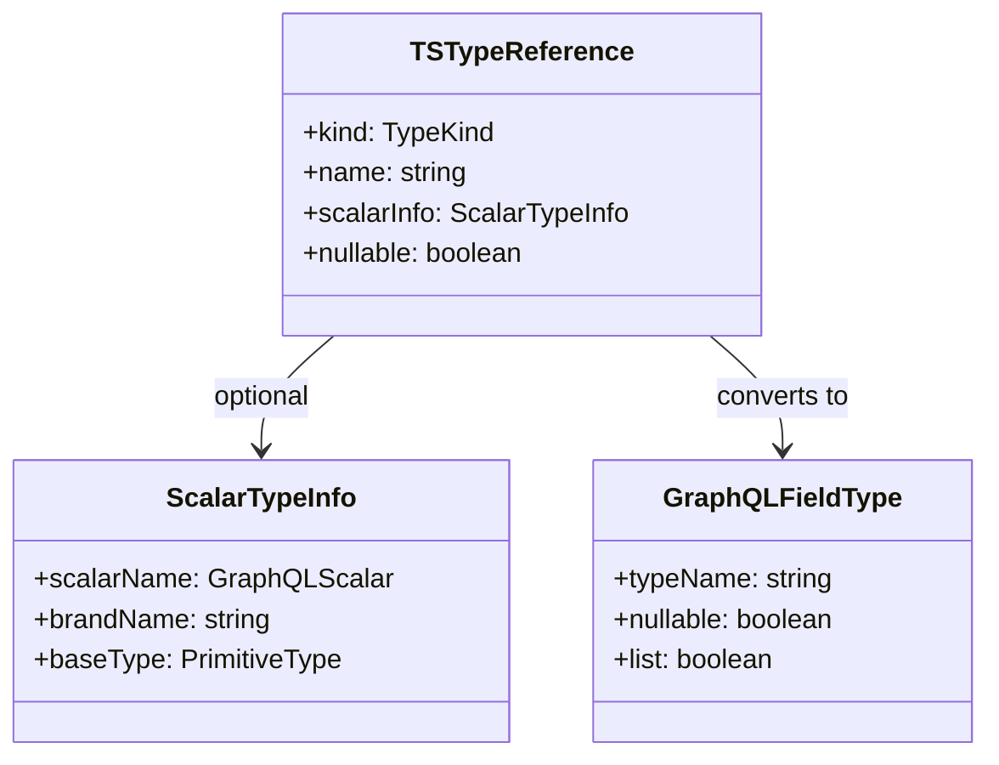

# Technical Design: Branded Scalar Types

## Overview

**Purpose**: 本機能は、GraphQL の ID 型および Int/Float の明示的な区別を TypeScript の branded type パターンを用いてサポートする。`@gqlkit-ts/runtime` パッケージから標準の branded type をエクスポートし、型解析時にこれらを検出して適切な GraphQL scalar type にマッピングする。

**Users**: gqlkit を使用する TypeScript 開発者が、GraphQL スキーマにおける ID 型や数値型を型安全に定義できるようになる。

**Impact**: 既存の `type-extractor` および `schema-generator` パイプラインを拡張し、branded type の認識と GraphQL scalar へのマッピングを追加する。

### Goals

- `IDString`, `IDNumber`, `Int`, `Float` の 4 つの標準 branded type を `@gqlkit-ts/runtime` で提供する
- type-extractor で branded type を `@gqlkit-ts/runtime` からのインポートとして識別する
- branded type を対応する GraphQL scalar type にマッピングする（ID, Int, Float）
- リゾルバ引数および Input Object 型での branded type サポート
- 将来のカスタム scalar 拡張に備えた設計

### Non-Goals

- カスタム scalar 型のユーザ定義サポート（将来の拡張として設計のみ）
- DateTime, URL, Email などの追加 scalar type の提供
- バリデーションロジックを含む branded type の実行時チェック
- GraphQL Subscription 型での branded type サポート（現時点で Subscription は未サポート）

## Architecture

### Existing Architecture Analysis

現在のパイプラインは以下の構造で動作している：

1. **type-extractor**: TypeScript ソースから型情報を抽出
   - `TSTypeReference` で TypeScript 型を表現（`kind: "primitive" | "reference" | "array" | "union" | "literal"`）
   - `PRIMITIVE_TYPE_MAP` で `string` → `String`, `number` → `Float`, `boolean` → `Boolean` にマッピング（本機能で `number → Float` に変更）

2. **resolver-extractor**: リゾルバ定義から型情報を抽出
   - 引数型を `TSTypeReference` として抽出
   - `convertTypeToTSTypeReference` で TypeScript 型を変換

3. **schema-generator**: GraphQL AST を構築
   - `GraphQLFieldType` で GraphQL フィールド型を表現
   - `buildFieldTypeNode` で AST ノードを構築

### Architecture Pattern & Boundary Map



**Architecture Integration**:
- **Selected pattern**: 既存のパイプラインパターンを維持し、branded type 検出レイヤーを追加
- **Domain boundaries**: runtime パッケージは型定義のみ、CLI パッケージは解析とマッピングロジック
- **Existing patterns preserved**: TSTypeReference による型表現、PRIMITIVE_TYPE_MAP によるマッピング
- **New components rationale**: ScalarRegistry は将来の拡張性を確保しつつ、現時点では静的マッピングとして実装
- **Steering compliance**: 型安全性、静的解析のみ、デコレータ不使用の原則を維持

### Technology Stack

| Layer | Choice / Version | Role in Feature | Notes |
|-------|------------------|-----------------|-------|
| Runtime | TypeScript 5.9+ | Branded type 定義 | `unique symbol` パターン使用 |
| CLI | TypeScript Compiler API | シンボル解決・型解析 | 既存の ts モジュール利用 |

## System Flows

### Branded Type Detection Flow



## Requirements Traceability

| Requirement | Summary | Components | Interfaces | Flows |
|-------------|---------|------------|------------|-------|
| 1.1-1.5 | 標準 branded type の提供 | BrandedTypes | ScalarTypeDefinition | - |
| 2.1-2.6 | Branded type の型解析 | SymbolResolver, BrandedDetector, Converter | TSTypeReference, ScalarTypeInfo | Branded Type Detection |
| 3.1-3.5 | GraphQL Schema へのマッピング | Converter, ASTBuilder | GraphQLFieldType | Branded Type Detection |
| 4.1-4.3 | リゾルバ引数での branded type サポート | DefineApiExtractor, BrandedDetector | ArgumentDefinition | Branded Type Detection |
| 5.1-5.4 | 拡張可能なアーキテクチャ | ScalarRegistry (CLI/Shared), BrandedDetector | ScalarMappingConfig | - |
| 6.1-6.3 | エラーハンドリング | BrandedDetector, Diagnostics | Diagnostic | - |

## Components and Interfaces

| Component | Domain/Layer | Intent | Req Coverage | Key Dependencies | Contracts |
|-----------|--------------|--------|--------------|------------------|-----------|
| BrandedTypes | Runtime | Branded scalar type 定義を提供 | 1.1-1.5 | - | State |
| ScalarRegistry | CLI/Shared | Scalar マッピング情報を管理 | 5.1-5.2 | - | Service |
| SymbolResolver | CLI/TypeExtractor | TypeScript シンボルの解決とインポート元特定 | 2.1 | ts (P0) | Service |
| BrandedDetector | CLI/TypeExtractor | Branded type の検出とマッピング | 2.2-2.6, 5.3, 6.1-6.2 | SymbolResolver (P0), ScalarRegistry (P0) | Service |
| Converter (拡張) | CLI/TypeExtractor | GraphQL 型への変換 | 3.1-3.5 | BrandedDetector (P0) | Service |

### Runtime Layer

#### BrandedTypes

| Field | Detail |
|-------|--------|
| Intent | GraphQL scalar に対応する branded type 定義を提供 |
| Requirements | 1.1, 1.2, 1.3, 1.4, 1.5 |

**Responsibilities & Constraints**
- IDString, IDNumber, Int, Float の 4 つの branded type をエクスポート
- TypeScript の `unique symbol` パターンを使用して型の区別を実現
- ランタイムコストなし（コンパイル時のみ）

**Dependencies**
- External: TypeScript 型システム — branded type パターン (P0)

**Contracts**: State [x]

##### State Management

```typescript
declare const ScalarBrandSymbol: unique symbol;

type ScalarBrand<K extends string> = {
  readonly [ScalarBrandSymbol]: K;
};

export type IDString = string & ScalarBrand<"IDString">;
export type IDNumber = number & ScalarBrand<"IDNumber">;
export type Int = number & ScalarBrand<"Int">;
export type Float = number & ScalarBrand<"Float">;
```

**Implementation Notes**
- Integration: 既存の `ResolverBrandSymbol` と同様のパターンを採用
- Validation: 型レベルのみ、ランタイムバリデーションなし
- Risks: `unique symbol` の異なるファイルでの宣言は互換性がないため、単一ソースで定義する必要あり

---

### CLI/Shared Layer

#### ScalarRegistry

| Field | Detail |
|-------|--------|
| Intent | Branded type から GraphQL scalar へのマッピング情報を管理 |
| Requirements | 5.1, 5.2 |

**Responsibilities & Constraints**
- 標準 branded type のマッピング情報を定義
- 将来のカスタム scalar 拡張のための設計基盤
- CLI パッケージ内部でのみ使用（ユーザーには公開しない）

**Dependencies**
- Inbound: BrandedDetector — マッピング情報の参照 (P0)

**Contracts**: Service [x]

##### Service Interface

```typescript
interface ScalarMappingInfo {
  readonly brandName: string;
  readonly graphqlScalar: "ID" | "Int" | "Float" | "String" | "Boolean";
  readonly baseType: "string" | "number";
}

const STANDARD_SCALAR_MAPPINGS: ReadonlyMap<string, ScalarMappingInfo> = new Map([
  ["IDString", { brandName: "IDString", graphqlScalar: "ID", baseType: "string" }],
  ["IDNumber", { brandName: "IDNumber", graphqlScalar: "ID", baseType: "number" }],
  ["Int", { brandName: "Int", graphqlScalar: "Int", baseType: "number" }],
  ["Float", { brandName: "Float", graphqlScalar: "Float", baseType: "number" }],
]);

function getScalarMapping(brandName: string): ScalarMappingInfo | undefined;
function isKnownBrandedScalar(brandName: string): boolean;
```

- Preconditions: なし
- Postconditions: 既知の branded type に対して正しいマッピング情報を返す
- Invariants: マッピング情報は不変

**Implementation Notes**
- Integration: CLI パッケージ内の shared モジュールとして実装
- Location: `packages/cli/src/shared/scalar-registry.ts`
- Risks: なし（CLI 内部で完結）

---

### CLI/TypeExtractor Layer

#### SymbolResolver

| Field | Detail |
|-------|--------|
| Intent | TypeScript シンボルのインポート元を特定 |
| Requirements | 2.1 |

**Responsibilities & Constraints**
- 型シンボルのインポート元モジュールを特定
- `@gqlkit-ts/runtime` からのインポートを識別

**Dependencies**
- External: TypeScript Compiler API — シンボル解決 (P0)

**Contracts**: Service [x]

##### Service Interface

```typescript
interface SymbolOrigin {
  readonly moduleName: string;
  readonly symbolName: string;
  readonly isFromRuntime: boolean;
}

function resolveSymbolOrigin(
  symbol: ts.Symbol,
  checker: ts.TypeChecker,
): SymbolOrigin | undefined;

function isSymbolFromGqlkitRuntime(
  symbol: ts.Symbol,
  checker: ts.TypeChecker,
): boolean;
```

- Preconditions: シンボルが有効であること
- Postconditions: インポート元情報を正確に返す
- Invariants: なし

**Implementation Notes**
- Integration: `ts.Symbol.declarations` からインポート宣言を辿る
- Validation: シンボルが存在しない場合は `undefined` を返す
- Risks: パスエイリアスや複雑なモジュール構成での解決失敗

---

#### BrandedDetector

| Field | Detail |
|-------|--------|
| Intent | Branded type を検出し GraphQL scalar マッピング情報を提供 |
| Requirements | 2.2, 2.3, 2.4, 2.5, 2.6, 5.3, 6.1, 6.2 |

**Responsibilities & Constraints**
- TypeScript 型から branded scalar type を検出
- 検出した branded type を GraphQL scalar にマッピング
- 未知の branded type に対する警告生成

**Dependencies**
- Inbound: Converter — 型変換時の呼び出し (P0)
- Outbound: SymbolResolver — シンボル解決 (P0)
- Outbound: ScalarRegistry — マッピング情報参照 (P1)

**Contracts**: Service [x]

##### Service Interface

```typescript
interface ScalarTypeInfo {
  readonly scalarName: "ID" | "Int" | "Float" | "String" | "Boolean";
  readonly brandName: string;
  readonly baseType: "string" | "number";
}

interface DetectionResult {
  readonly scalarInfo: ScalarTypeInfo | undefined;
  readonly diagnostics: ReadonlyArray<Diagnostic>;
}

function detectBrandedScalar(
  type: ts.Type,
  checker: ts.TypeChecker,
): DetectionResult;

function isBrandedScalarType(
  type: ts.Type,
  checker: ts.TypeChecker,
): boolean;
```

- Preconditions: 型が有効であること
- Postconditions:
  - branded type の場合、正しい ScalarTypeInfo を返す
  - 未知の branded type の場合、警告診断を含み ScalarTypeInfo は undefined
- Invariants: 同一入力に対して同一結果

**Implementation Notes**
- Integration: `convertTsTypeToReference` 内で呼び出し
- Validation: インポート元チェック、シンボル名チェック
- Risks: TypeScript 型の構造変更による検出失敗

---

#### Converter (拡張)

| Field | Detail |
|-------|--------|
| Intent | TypeScript 型を GraphQL 型に変換（branded type サポート追加） |
| Requirements | 3.1, 3.2, 3.3, 3.4, 3.5 |

**Responsibilities & Constraints**
- 既存の primitive type マッピングに branded type マッピングを統合
- nullable / list 属性の正確な保持

**Dependencies**
- Inbound: type-extractor pipeline — 型変換 (P0)
- Outbound: BrandedDetector — branded type 検出 (P0)

**Contracts**: Service [x]

##### Service Interface

既存の `convertTsTypeToGraphQL` 関数を拡張：

```typescript
function convertTsTypeToGraphQL(
  tsType: TSTypeReference,
  optional: boolean,
  checker: ts.TypeChecker,
): GraphQLFieldType;
```

変更点：
- `kind: "reference"` かつ `@gqlkit-ts/runtime` からの branded type の場合、`BrandedDetector` を使用
- 検出された scalar type を `typeName` に設定

**Implementation Notes**
- Integration: 既存ロジックを維持しつつ、branded type チェックを追加
- Validation: branded type 検出失敗時は警告を出力し、String としてフォールバック
- Risks: パフォーマンスへの影響（シンボル解決コスト）

---

### CLI/ResolverExtractor Layer

#### DefineApiExtractor (拡張)

| Field | Detail |
|-------|--------|
| Intent | リゾルバ引数型での branded type サポート |
| Requirements | 4.1, 4.2, 4.3 |

**Responsibilities & Constraints**
- 引数型内の branded type を認識
- Input Object フィールドの branded type を処理

**Dependencies**
- Outbound: BrandedDetector — branded type 検出 (P0)

**Contracts**: Service [x]

##### Service Interface

既存の `convertTypeToTSTypeReference` 関数を拡張し、branded type 情報を保持：

```typescript
interface TSTypeReference {
  readonly kind: "primitive" | "reference" | "array" | "union" | "literal" | "scalar";
  readonly name?: string;
  readonly scalarInfo?: ScalarTypeInfo;
  // ... 既存フィールド
}
```

**Implementation Notes**
- Integration: `extractArgsFromType` 内で branded type チェックを追加
- Validation: 引数型のバリデーション時に branded type の整合性を確認

## Data Models

### Domain Model



**Business Rules & Invariants**:
- `IDString` は `string` ベース、GraphQL `ID` にマップ
- `IDNumber` は `number` ベース、GraphQL `ID` にマップ
- `Int` は `number` ベース、GraphQL `Int` にマップ
- `Float` は `number` ベース、GraphQL `Float` にマップ
- 通常の `number` は `Float` にマップ（整数が必要な場合は `Int` branded type を明示的に使用）（要件 2.6）

### Logical Data Model

**TSTypeReference 拡張**:

| Field | Type | Description |
|-------|------|-------------|
| kind | `"primitive" \| "reference" \| "array" \| "union" \| "literal" \| "scalar"` | 型の種別（`scalar` を追加） |
| scalarInfo | `ScalarTypeInfo \| undefined` | Branded scalar の場合のマッピング情報 |

**Consistency & Integrity**:
- `kind: "scalar"` の場合、`scalarInfo` は必須
- `scalarInfo.baseType` と実際のプリミティブ型は一致すること

## Error Handling

### Error Strategy

Fail-fast アプローチを採用し、型解析時に問題を早期検出する。

### Error Categories and Responses

**User Errors (警告)**:
- 未知の branded type 使用 → 警告を出力し String としてフォールバック
- インポート元の不正 → 警告を出力し通常の参照型として処理

**User Errors (エラー)**:
- 矛盾する型使用（例: IDString と number の交差型）→ エラーを出力し処理停止

### Diagnostic Codes

| Code | Severity | Message Template |
|------|----------|------------------|
| `UNKNOWN_BRANDED_SCALAR` | warning | `Unknown branded scalar type '{typeName}' from @gqlkit-ts/runtime. Treating as String.` |
| `INVALID_SCALAR_IMPORT` | warning | `Type '{typeName}' appears to be a branded scalar but is not imported from @gqlkit-ts/runtime.` |
| `CONFLICTING_SCALAR_TYPE` | error | `Type '{typeName}' has conflicting scalar definitions at {location}.` |

### Monitoring

- 診断情報は既存の `Diagnostic` インターフェースを使用
- CLI 出力時にファイル名・行番号を含める（要件 6.3）

## Testing Strategy

### Unit Tests

1. **BrandedTypes**: 型定義が正しくエクスポートされ、互いに区別可能であること
2. **SymbolResolver**: `@gqlkit-ts/runtime` からのインポートを正しく識別すること
3. **BrandedDetector**: 各 branded type を正しく検出し ScalarTypeInfo を返すこと
4. **Converter**: Branded type を含むフィールドが正しい GraphQL 型に変換されること
5. **DefineApiExtractor**: 引数型内の branded type が正しく処理されること

### Integration Tests

1. 型定義 → GraphQL スキーマ生成の完全なパイプラインテスト
2. リゾルバ引数での branded type 使用時のスキーマ生成テスト
3. Input Object 型での branded type 使用時のスキーマ生成テスト
4. 複合型（配列、nullable）での branded type テスト
5. エラー・警告診断の出力テスト

### E2E Tests

1. 実際のユーザコードパターンでの schema 生成テスト
2. `number` → `Float` マッピングの動作確認テスト
3. エラーメッセージのファイル名・行番号含有テスト
