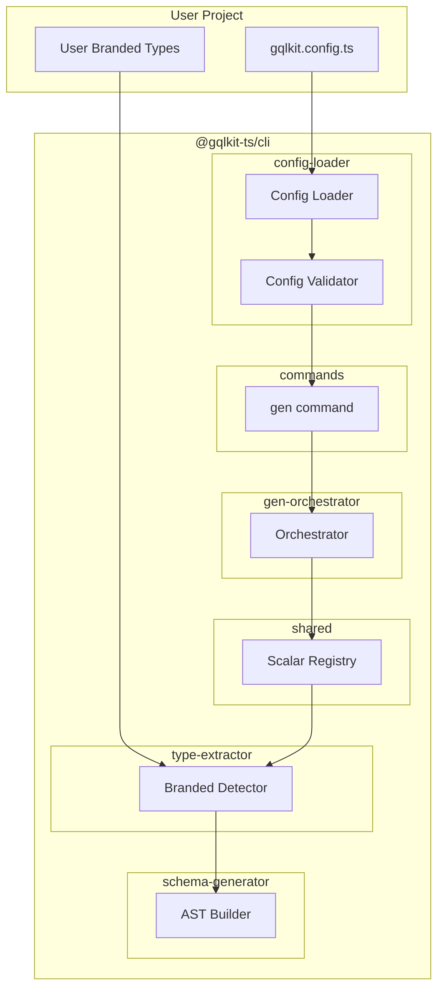
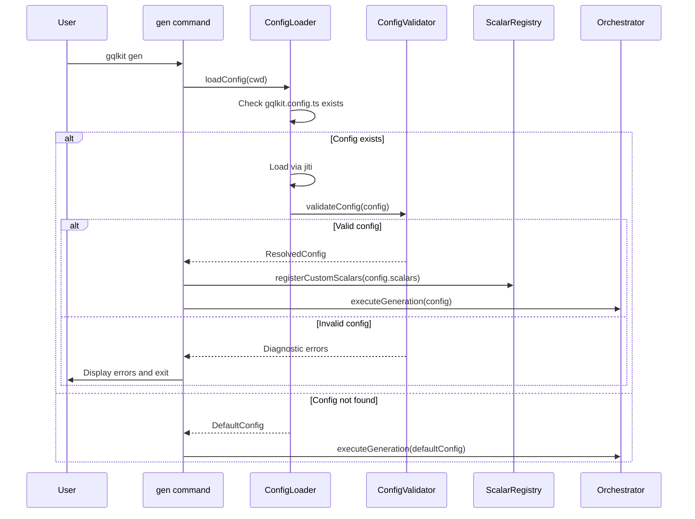
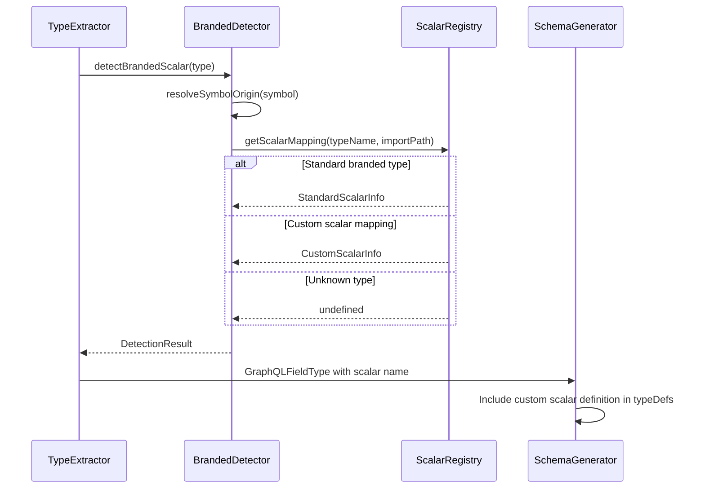
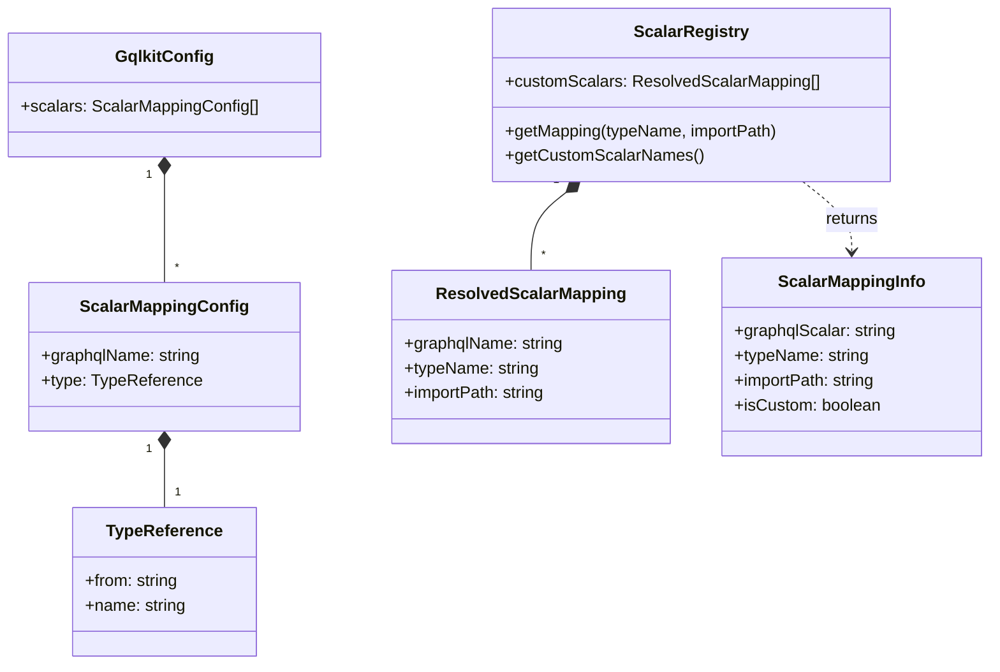

# Technical Design: Custom Scalar Config

## Overview

**Purpose**: 本機能は、ユーザーが `gqlkit.config.ts` 設定ファイルを通じて独自の branded type と GraphQL custom scalar のマッピングを定義できるようにする。これにより、gqlkit の「型からスキーマを自動生成する」コンセプトを維持しつつ、DateTime, UUID, URL などのカスタムスカラーの柔軟なサポートを実現する。

**Users**: gqlkit を使用する TypeScript 開発者が、独自の branded type を GraphQL custom scalar にマッピングして型安全な GraphQL API を構築できるようになる。

**Impact**: 既存の CLI パイプラインに設定ファイル読み込み機構を追加し、`ScalarRegistry` を拡張してカスタムマッピングをサポートする。

### Goals

- プロジェクトルートの `gqlkit.config.ts` を自動認識して読み込む
- `scalars` プロパティでカスタムスカラーマッピングを宣言的に定義可能にする
- 設定されたカスタムスカラーを GraphQL スキーマ生成に正しく反映する
- 型安全な設定 API（`defineConfig` 関数）を提供する
- 設定エラーの早期検出と明確なエラーメッセージを提供する

### Non-Goals

- `gqlkit.config.ts` 以外のファイル形式（JSON, YAML 等）のサポート
- カスタムスカラーのランタイムシリアライズ/パース処理の自動生成
- GraphQL Subscription 型でのカスタムスカラーサポート（現時点で Subscription は未サポート）
- カスタムスカラーの graphql-scalars 等との自動統合

## Architecture

### Existing Architecture Analysis

現在のパイプラインは以下の構造で動作している：

1. **gen command**: `packages/cli/src/commands/gen.ts` でハードコードされた設定を使用
2. **orchestrator**: `GenerationConfig` を受け取り、型抽出・リゾルバ抽出・スキーマ生成を実行
3. **ScalarRegistry**: `packages/cli/src/shared/scalar-registry.ts` で標準 branded scalar のマッピングを管理（`STANDARD_SCALAR_MAPPINGS` として静的定義）
4. **BrandedDetector**: `@gqlkit-ts/runtime` からのインポートを検出し、ScalarRegistry を参照してマッピング

**統合ポイント**:
- gen command の実行前に設定ファイルを読み込む必要がある
- ScalarRegistry をカスタムマッピングで拡張可能にする必要がある
- スキーマ生成時にカスタムスカラー定義を typeDefs に含める必要がある

### Architecture Pattern & Boundary Map



**Architecture Integration**:
- **Selected pattern**: 既存のパイプラインパターンを維持し、設定読み込みレイヤーを gen command の前段に追加
- **Domain boundaries**: 設定読み込み（config-loader）は独立モジュール、ScalarRegistry は既存の shared レイヤーを拡張
- **Existing patterns preserved**: パイプラインアーキテクチャ、Diagnostic インターフェース、fail-fast バリデーション
- **New components rationale**: config-loader は設定ファイル固有の責務を分離、runtime への型エクスポートは既存パターンを踏襲
- **Steering compliance**: 型安全性、静的解析のみ、デコレータ不使用の原則を維持

### Technology Stack

| Layer | Choice / Version | Role in Feature | Notes |
|-------|------------------|-----------------|-------|
| CLI / Config Loading | jiti ^2.4 | TypeScript 設定ファイルの動的読み込み | ESM/CJS 互換、キャッシュ機能あり |
| CLI / Validation | TypeScript | 設定オブジェクトの型チェック | ランタイムバリデーションと組み合わせ |
| Runtime | TypeScript 5.9+ | 設定型定義のエクスポート | `defineConfig` ヘルパー関数 |

## System Flows

### Config Loading Flow



### Custom Scalar Detection Flow



## Requirements Traceability

| Requirement | Summary | Components | Interfaces | Flows |
|-------------|---------|------------|------------|-------|
| 1.1 | 設定ファイル自動認識 | ConfigLoader | loadConfig | Config Loading |
| 1.2 | 設定ファイル不在時のデフォルト動作 | ConfigLoader | loadConfig | Config Loading |
| 1.3 | 構文エラー時のエラー表示 | ConfigLoader, ConfigValidator | Diagnostic | Config Loading |
| 1.4 | TypeScript ファイル形式のみサポート | ConfigLoader | loadConfig | Config Loading |
| 2.1 | scalars プロパティの構造提供 | GqlkitConfig | ScalarMappingConfig | - |
| 2.2 | マッピング定義の構造 | GqlkitConfig | ScalarMappingConfig | - |
| 2.3 | マッピングのスキーマ生成反映 | ScalarRegistry, ASTBuilder | - | Custom Scalar Detection |
| 2.4 | 複数マッピングの同時定義 | GqlkitConfig | ScalarMappingConfig | - |
| 3.1 | scalar 定義の typeDefs 出力 | ASTBuilder | - | Custom Scalar Detection |
| 3.2 | フィールド型のカスタムスカラー出力 | BrandedDetector, ASTBuilder | - | Custom Scalar Detection |
| 3.3 | 組み込み branded type との共存 | ScalarRegistry | getScalarMapping | Custom Scalar Detection |
| 3.4 | 重複マッピングのエラー報告 | ConfigValidator | Diagnostic | Config Loading |
| 4.1 | 必須プロパティ欠落エラー | ConfigValidator | Diagnostic | Config Loading |
| 4.2 | 不正な型のエラー | ConfigValidator | Diagnostic | Config Loading |
| 4.3 | 型が見つからないエラー | BrandedDetector | Diagnostic | Custom Scalar Detection |
| 4.4 | 組み込みスカラー上書きエラー | ConfigValidator | Diagnostic | Config Loading |
| 5.1 | GqlkitConfig 型のエクスポート | @gqlkit-ts/cli exports | GqlkitConfig | - |
| 5.2 | scalars プロパティの型定義 | @gqlkit-ts/cli exports | ScalarMappingConfig | - |
| 5.3 | defineConfig 関数の提供 | @gqlkit-ts/cli exports | defineConfig | - |
| 5.4 | 型チェックと補完の提供 | TypeScript | - | - |

## Components and Interfaces

| Component | Domain/Layer | Intent | Req Coverage | Key Dependencies (P0/P1) | Contracts |
|-----------|--------------|--------|--------------|--------------------------|-----------|
| ConfigLoader | CLI/config-loader | 設定ファイルの読み込みと解決 | 1.1, 1.2, 1.3, 1.4 | jiti (P0) | Service |
| ConfigValidator | CLI/config-loader | 設定オブジェクトのバリデーション | 4.1, 4.2, 4.4, 3.4 | - | Service |
| ScalarRegistry (拡張) | CLI/shared | カスタムスカラーマッピングの管理 | 2.3, 3.3 | - | Service |
| BrandedDetector (拡張) | CLI/type-extractor | カスタムスカラーの検出 | 4.3 | ScalarRegistry (P0) | Service |
| ASTBuilder (拡張) | CLI/schema-generator | カスタムスカラー定義の生成 | 3.1, 3.2 | - | Service |
| GqlkitConfig | CLI/exports | 設定型定義のエクスポート | 5.1, 5.2 | - | State |
| defineConfig | CLI/exports | 型安全な設定ヘルパー | 5.3, 5.4 | - | Service |

### CLI/config-loader Layer

#### ConfigLoader

| Field | Detail |
|-------|--------|
| Intent | プロジェクトルートの gqlkit.config.ts を読み込み、設定オブジェクトを返す |
| Requirements | 1.1, 1.2, 1.3, 1.4 |

**Responsibilities & Constraints**
- `gqlkit.config.ts` の存在確認とファイル読み込み
- jiti を使用した TypeScript ファイルの動的インポート
- ファイル不在時はデフォルト設定を返す
- 構文エラー時は Diagnostic エラーを返す

**Dependencies**
- External: jiti ^2.4 — TypeScript 設定ファイルの動的読み込み (P0)
- External: Node.js fs — ファイル存在確認 (P0)

**Contracts**: Service [x]

##### Service Interface

```typescript
interface LoadConfigOptions {
  readonly cwd: string;
}

interface LoadConfigResult {
  readonly config: ResolvedConfig;
  readonly configPath: string | undefined;
  readonly diagnostics: ReadonlyArray<Diagnostic>;
}

interface ResolvedConfig {
  readonly scalars: ReadonlyArray<ResolvedScalarMapping>;
}

interface ResolvedScalarMapping {
  readonly graphqlName: string;
  readonly typeName: string;
  readonly importPath: string;
}

function loadConfig(options: LoadConfigOptions): Promise<LoadConfigResult>;
```

- Preconditions: `cwd` が有効なディレクトリパスであること
- Postconditions:
  - 設定ファイル存在時: 設定オブジェクトと設定ファイルパスを返す
  - 設定ファイル不在時: デフォルト設定を返し、`configPath` は `undefined`
  - エラー時: `diagnostics` にエラー情報を含む
- Invariants: 同一設定ファイルに対して同一結果

**Implementation Notes**
- Integration: `packages/cli/src/config-loader/loader.ts` として実装
- Validation: jiti のエラーを Diagnostic 形式に変換
- Risks: jiti のバージョン互換性、ESM/CJS の相互運用性

---

#### ConfigValidator

| Field | Detail |
|-------|--------|
| Intent | 設定オブジェクトの構造と値をバリデーション |
| Requirements | 4.1, 4.2, 4.4, 3.4 |

**Responsibilities & Constraints**
- 設定オブジェクトの必須プロパティ検証
- 各プロパティの型検証
- 組み込みスカラー名の上書き禁止チェック
- 重複マッピングの検出

**Dependencies**
- Inbound: ConfigLoader — バリデーション対象の設定 (P0)

**Contracts**: Service [x]

##### Service Interface

```typescript
interface ValidateConfigOptions {
  readonly config: unknown;
  readonly configPath: string;
}

interface ValidateConfigResult {
  readonly valid: boolean;
  readonly resolvedConfig: ResolvedConfig | undefined;
  readonly diagnostics: ReadonlyArray<Diagnostic>;
}

function validateConfig(options: ValidateConfigOptions): ValidateConfigResult;
```

**Validation Rules**:

```typescript
const BUILTIN_SCALAR_NAMES = ["ID", "String", "Int", "Float", "Boolean"] as const;

// 1. scalars が配列であること
// 2. 各 scalar mapping が必須プロパティを持つこと
// 3. graphqlName が BUILTIN_SCALAR_NAMES に含まれないこと
// 4. 同一 graphqlName の重複がないこと
// 5. 同一 (typeName, importPath) の重複がないこと
```

- Preconditions: `config` が読み込まれた設定オブジェクト
- Postconditions:
  - 有効時: `valid: true` と `resolvedConfig` を返す
  - 無効時: `valid: false` と詳細な `diagnostics` を返す
- Invariants: バリデーションルールは不変

**Implementation Notes**
- Integration: `packages/cli/src/config-loader/validator.ts` として実装
- Validation: 各ルールに対応したエラーコードとメッセージを定義
- Risks: なし

---

### CLI/shared Layer

#### ScalarRegistry (拡張)

| Field | Detail |
|-------|--------|
| Intent | 標準およびカスタムスカラーマッピングの統合管理 |
| Requirements | 2.3, 3.3 |

**Responsibilities & Constraints**
- 標準 branded type マッピングの管理（既存機能）
- カスタムスカラーマッピングの登録と参照
- インポートパスと型名のペアでマッピングを特定

**Dependencies**
- Inbound: BrandedDetector — マッピング情報の参照 (P0)
- Inbound: ConfigLoader — カスタムマッピングの登録 (P0)

**Contracts**: Service [x]

##### Service Interface

```typescript
/**
 * スカラーマッピング情報。
 * 標準 branded type とカスタムスカラーの両方を表現する。
 *
 * Note: baseType は意図的に含めない。GraphQL サーバーでは
 * カスタムスカラーの serialize/parse をユーザーが実装するため、
 * gqlkit としてはベース型を知る必要がない。
 */
interface ScalarMappingInfo {
  /** GraphQL スキーマでのスカラー名 */
  readonly graphqlScalar: string;
  /** TypeScript の型名 */
  readonly typeName: string;
  /** 解決済みの絶対インポートパス */
  readonly importPath: string;
  /** カスタムスカラーかどうか */
  readonly isCustom: boolean;
}

interface ScalarRegistryConfig {
  /** 設定ファイルのディレクトリパス（相対パス解決に使用） */
  readonly configDir: string;
  /** カスタムスカラーマッピング */
  readonly customScalars: ReadonlyArray<ResolvedScalarMapping>;
}

/**
 * ScalarRegistry ファクトリ関数。
 * 標準 branded type マッピングとカスタムマッピングを統合した
 * レジストリを生成する。
 */
function createScalarRegistry(config?: ScalarRegistryConfig): ScalarRegistry;

interface ScalarRegistry {
  /**
   * 絶対インポートパスと型名でマッピングを検索。
   * 標準 branded type とカスタムスカラーの両方を対象とする。
   *
   * @param typeName - TypeScript の型名
   * @param absoluteImportPath - 絶対パスに解決済みのインポートパス
   */
  getMapping(typeName: string, absoluteImportPath: string): ScalarMappingInfo | undefined;

  /** 登録済みカスタムスカラー名の一覧を取得 */
  getCustomScalarNames(): ReadonlyArray<string>;
}
```

- Preconditions: なし
- Postconditions:
  - 標準 branded type に対して正しいマッピングを返す
  - 登録済みカスタムスカラーに対して正しいマッピングを返す
- Invariants: 標準マッピングは不変、カスタムマッピングは初期化時に確定

**Implementation Notes**
- Integration: 既存の `scalar-registry.ts` を拡張し、`createScalarRegistry` ファクトリを追加
- Validation: 登録時の重複チェックは ConfigValidator で実施済み
- Risks: なし

---

### CLI/type-extractor Layer

#### BrandedDetector (拡張)

| Field | Detail |
|-------|--------|
| Intent | 標準およびカスタム branded type の検出 |
| Requirements | 4.3 |

**Responsibilities & Constraints**
- 既存: `@gqlkit-ts/runtime` からの標準 branded type 検出
- 新規: 設定で指定されたインポートパスからのカスタム branded type 検出
- 未知の型に対する警告生成

**Dependencies**
- Inbound: Converter — 型変換時の呼び出し (P0)
- Outbound: ScalarRegistry — マッピング情報参照 (P0)
- Outbound: SymbolResolver — シンボル解決 (P0)

**Contracts**: Service [x]

##### Service Interface

```typescript
// 既存インターフェースに ScalarRegistry を受け取るよう拡張
interface DetectBrandedScalarOptions {
  readonly type: ts.Type;
  readonly checker: ts.TypeChecker;
  readonly registry: ScalarRegistry;
}

function detectBrandedScalar(options: DetectBrandedScalarOptions): DetectionResult;
```

**Implementation Notes**
- Integration: 既存の `detectBrandedScalar` を拡張し、`ScalarRegistry` を参照するよう変更
- Validation: カスタムスカラーの型が見つからない場合は警告を出力
- Risks: パフォーマンスへの影響（インポートパスの解決コスト）

---

### CLI/schema-generator Layer

#### ASTBuilder (拡張)

| Field | Detail |
|-------|--------|
| Intent | カスタムスカラー定義を含む GraphQL AST の構築 |
| Requirements | 3.1, 3.2 |

**Responsibilities & Constraints**
- カスタムスカラー定義ノードの生成
- typeDefs にカスタムスカラー定義を含める
- フィールド型としてカスタムスカラー名を使用

**Dependencies**
- Inbound: Converter — フィールド型情報 (P0)
- Outbound: ScalarRegistry — カスタムスカラー名一覧 (P0)

**Contracts**: Service [x]

##### Service Interface

```typescript
interface BuildSchemaOptions {
  readonly types: ExtractedTypes;
  readonly resolvers: ExtractedResolvers;
  readonly registry: ScalarRegistry;
}

interface SchemaResult {
  readonly typeDefs: DocumentNode;
  readonly customScalarDefinitions: ReadonlyArray<ScalarTypeDefinitionNode>;
  // ... 既存フィールド
}
```

**Custom Scalar Definition Generation**:

```typescript
// 生成される GraphQL スキーマ例
scalar DateTime
scalar UUID

type User {
  id: ID!
  createdAt: DateTime!
  uuid: UUID!
}
```

**Implementation Notes**
- Integration: `buildSchema` 関数にカスタムスカラー定義生成を追加
- Validation: なし（設定バリデーション済み）
- Risks: なし

---

### CLI/exports Layer

#### GqlkitConfig

| Field | Detail |
|-------|--------|
| Intent | 設定ファイルの型定義を提供 |
| Requirements | 5.1, 5.2 |

**Responsibilities & Constraints**
- 型定義のみ、ランタイムコードなし
- ユーザーの IDE で型補完を提供

**Contracts**: State [x]

##### State Management

```typescript
/**
 * gqlkit 設定ファイルの型定義。
 * `gqlkit.config.ts` で使用する。
 */
export interface GqlkitConfig {
  /**
   * カスタムスカラーマッピングの定義。
   * branded type と GraphQL scalar の対応を設定する。
   */
  readonly scalars?: ReadonlyArray<ScalarMappingConfig>;
}

/**
 * 個々のカスタムスカラーマッピング設定。
 */
export interface ScalarMappingConfig {
  /**
   * GraphQL スキーマで使用するスカラー名。
   * 例: "DateTime", "UUID", "URL"
   */
  readonly graphqlName: string;

  /**
   * マッピング対象の TypeScript 型情報。
   */
  readonly type: {
    /**
     * 型のインポートパス。
     * 例: "./src/types/scalars", "@my-lib/scalars"
     */
    readonly from: string;

    /**
     * インポートする型名。
     * 例: "DateTime", "UUID"
     */
    readonly name: string;
  };
}
```

**Implementation Notes**
- Integration: `packages/cli/src/config/types.ts` として実装、index.ts からエクスポート
- Risks: なし

---

#### defineConfig

| Field | Detail |
|-------|--------|
| Intent | 型安全な設定オブジェクト作成ヘルパー |
| Requirements | 5.3, 5.4 |

**Contracts**: Service [x]

##### Service Interface

```typescript
/**
 * 型安全な設定オブジェクトを作成するヘルパー関数。
 * IDE での型補完とコンパイル時の型チェックを提供する。
 *
 * @example
 * ```typescript
 * // gqlkit.config.ts
 * import { defineConfig } from "@gqlkit-ts/cli";
 *
 * export default defineConfig({
 *   scalars: [
 *     {
 *       graphqlName: "DateTime",
 *       type: { from: "./src/types/scalars", name: "DateTime" },
 *     },
 *     {
 *       graphqlName: "UUID",
 *       type: { from: "./src/types/scalars", name: "UUID" },
 *     },
 *   ],
 * });
 * ```
 */
export function defineConfig(config: GqlkitConfig): GqlkitConfig;
```

- Preconditions: なし
- Postconditions: 入力をそのまま返す（型チェックのみ）
- Invariants: 入力と出力は同一

**Implementation Notes**
- Integration: `packages/cli/src/config/define-config.ts` として実装
- Validation: ランタイムバリデーションなし（ConfigValidator で実施）
- Risks: なし

---

### gen command (拡張)

| Field | Detail |
|-------|--------|
| Intent | 設定読み込みを統合した gen コマンド |
| Requirements | 1.1, 1.2, 1.3 |

**Implementation Notes**

既存の `runGenCommand` 関数を以下のように拡張：

```typescript
import { dirname } from "node:path";

export async function runGenCommand(
  options: RunGenCommandOptions,
): Promise<RunGenCommandResult> {
  // 1. 設定ファイルの読み込み
  const configResult = await loadConfig({ cwd: options.cwd });

  if (configResult.diagnostics.some(d => d.severity === "error")) {
    diagnosticReporter.reportDiagnostics(configResult.diagnostics);
    return { exitCode: 1 };
  }

  // 2. ScalarRegistry の初期化
  //    configPath から configDir を導出し、相対パス解決に使用
  const configDir = configResult.configPath
    ? dirname(configResult.configPath)
    : options.cwd;

  const registry = createScalarRegistry({
    configDir,
    customScalars: configResult.config.scalars,
  });

  // 3. GenerationConfig に registry を含める
  const config: GenerationConfig = {
    cwd: options.cwd,
    typesDir: join(options.cwd, "src/gql/types"),
    resolversDir: join(options.cwd, "src/gql/resolvers"),
    outputDir: join(options.cwd, "src/gqlkit/generated"),
    scalarRegistry: registry,
  };

  // ... 既存のパイプライン実行
}
```

## Data Models

### Domain Model



**Business Rules & Invariants**:
- `graphqlName` は GraphQL の命名規則に従う（PascalCase 推奨）
- `graphqlName` は組み込みスカラー名（ID, String, Int, Float, Boolean）と重複不可
- 同一の `(typeName, importPath)` ペアは 1 つのマッピングのみ許可
- 標準 branded type（IDString, IDNumber, Int, Float）は常に利用可能

### Logical Data Model

**ResolvedScalarMapping**:

| Field | Type | Description |
|-------|------|-------------|
| graphqlName | string | GraphQL スキーマでのスカラー名 |
| typeName | string | TypeScript の型名 |
| importPath | string | 解決済みのインポートパス（相対パスは絶対パスに変換） |

**インポートパスの解決**:

設定ファイル（`gqlkit.config.ts`）のディレクトリを基準として相対パスを解決し、絶対パスに変換する。

```
プロジェクト構造:
/project/
├── gqlkit.config.ts          # configDir = /project
└── src/
    └── scalars/
        └── index.ts          # DateTime 型をエクスポート

設定:
scalars: [
  { graphqlName: "DateTime", type: { from: "./src/scalars", name: "DateTime" } }
]

解決フロー:
1. configDir: /project
2. 設定の from: ./src/scalars
3. 絶対パス: /project/src/scalars (path.resolve(configDir, from))
4. TypeScript が解決したインポートパスと照合
```

- 相対パス（`./`, `../`）: `path.resolve(configDir, from)` で絶対パスに変換
- パッケージパス（`@scope/pkg`, `pkg`）: そのまま使用（node_modules 解決は TypeScript に委ねる）

## Error Handling

### Error Strategy

Fail-fast アプローチを採用し、設定読み込み・バリデーション段階で問題を早期検出する。

### Error Categories and Responses

**Config Errors (致命的)**:
- 構文エラー → jiti エラーをラップしてファイル位置を表示
- 必須プロパティ欠落 → 欠けているプロパティを明示
- 型の不一致 → 期待される型と実際の値を表示

**Validation Errors (致命的)**:
- 組み込みスカラー上書き → 組み込み名とユーザー指定名を表示
- 重複マッピング → 重複している定義の位置を表示

**Type Resolution Warnings (警告)**:
- カスタムスカラーの型が見つからない → 設定されたパスと型名を表示、String としてフォールバック

### Diagnostic Codes

| Code | Severity | Message Template |
|------|----------|------------------|
| `CONFIG_SYNTAX_ERROR` | error | `Failed to load config file: {error}` |
| `CONFIG_MISSING_PROPERTY` | error | `Config property '{property}' is required` |
| `CONFIG_INVALID_TYPE` | error | `Config property '{property}' expected {expected}, got {actual}` |
| `CONFIG_BUILTIN_OVERRIDE` | error | `Cannot override built-in scalar '{name}'. Built-in scalars: ID, String, Int, Float, Boolean` |
| `CONFIG_DUPLICATE_MAPPING` | error | `Duplicate scalar mapping: '{graphqlName}' is defined multiple times` |
| `CONFIG_DUPLICATE_TYPE` | error | `Type '{typeName}' from '{importPath}' is mapped to multiple scalars: {names}` |
| `CUSTOM_SCALAR_TYPE_NOT_FOUND` | warning | `Custom scalar type '{typeName}' from '{importPath}' not found. Treating as String.` |

### Monitoring

- 診断情報は既存の `Diagnostic` インターフェースを使用
- CLI 出力時にファイル名・行番号を含める（可能な場合）

## Testing Strategy

### Unit Tests

1. **ConfigLoader**: 設定ファイルの読み込みとエラーハンドリング
2. **ConfigValidator**: 各バリデーションルールの検証
3. **ScalarRegistry**: カスタムマッピングの登録と参照
4. **BrandedDetector**: カスタムスカラーの検出
5. **ASTBuilder**: カスタムスカラー定義の生成

### Integration Tests

1. 設定ファイル → スキーマ生成の完全なパイプラインテスト
2. カスタムスカラーを含む型定義のスキーマ生成テスト
3. 標準 branded type とカスタムスカラーの共存テスト
4. エラー・警告診断の出力テスト

### E2E Tests

1. 実際の `gqlkit.config.ts` を使用したスキーマ生成テスト
2. 設定エラー時のエラーメッセージ出力テスト
3. カスタムスカラーを含む実用的なスキーマ生成テスト
