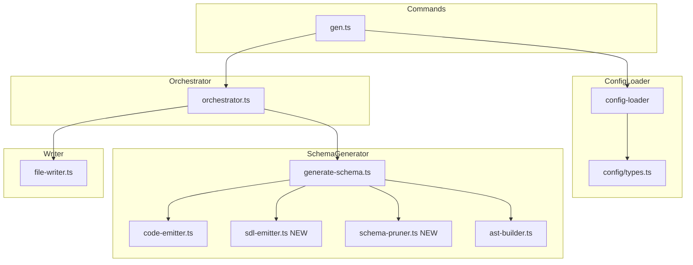
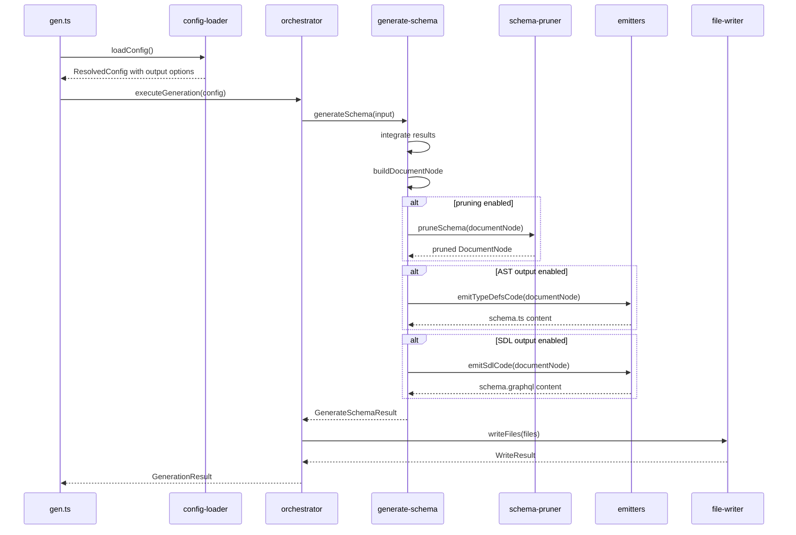

# Design Document

## Overview

**Purpose**: この機能は `gqlkit gen` コマンドに SDL 形式でのスキーマ出力、出力先パスの設定、出力抑制、および未使用型の自動削除 (pruning) 機能を追加する。

**Users**: gqlkit を利用する開発者が、スキーマレビュー、ドキュメント生成、外部ツール連携のために柔軟な出力形式を選択できるようになる。

**Impact**: 既存の AST 出力機能は維持しつつ、新たな出力形式と制御オプションを追加する。設定ファイル `gqlkit.config.ts` を拡張し、gen-orchestrator パイプラインに新しい処理ステージを追加する。

### Goals

- SDL (schema.graphql) 形式でのスキーマ出力をサポートする
- AST と SDL の出力パスを個別に設定可能にする
- 出力形式ごとに出力を抑制可能にする
- 未使用型を自動削除する pruning 機能を提供する

### Non-Goals

- GraphQL スキーマのカスタム形式での出力（JSON 等）
- 複数の出力先ディレクトリへの同時出力
- resolvers.ts の出力パス設定（スキーマ出力のみ対象）
- pruning オプションの詳細なカスタマイズ（skipPruning コールバック等）

## Architecture

### Existing Architecture Analysis

現在の gen コマンドパイプライン:

1. `gen.ts`: コマンド定義、設定読み込み、orchestrator 呼び出し
2. `orchestrator.ts`: パイプライン調整 (extractTypes → extractResolvers → generateSchema → writeFiles)
3. `generateSchema`: IntegratedResult から DocumentNode と resolver コードを生成
4. `code-emitter.ts`: DocumentNode を TypeScript コード文字列に変換
5. `file-writer.ts`: ファイル出力

**現在の出力**:
- `schema.ts`: DocumentNode を含む TypeScript ファイル
- `resolvers.ts`: resolver マップを含む TypeScript ファイル

### Architecture Pattern & Boundary Map



**Architecture Integration**:

- **Selected pattern**: 既存パイプラインの拡張。新機能は既存の generate-schema モジュール内に配置
- **Domain boundaries**: schema-generator モジュール内に SDL emitter と pruner を追加
- **Existing patterns preserved**: Pipeline architecture、fail-fast validation、explicit file outputs
- **New components rationale**:
  - `sdl-emitter.ts`: SDL 形式出力の責務を分離
  - `schema-pruner.ts`: pruning 処理の責務を分離
- **Steering compliance**: 静的解析ベース、graphql-tools 互換出力

### Technology Stack

| Layer | Choice / Version | Role in Feature | Notes |
|-------|------------------|-----------------|-------|
| Backend / Services | TypeScript 5.9+ | 型安全な実装 | 既存 |
| Backend / Services | graphql ^16.12.0 | `print()` による SDL 出力 | 既存依存 |
| Backend / Services | @graphql-tools/utils ^10.x | `pruneSchema()` による未使用型削除 | 新規依存 |

## System Flows

### Schema Generation with Output Options



## Requirements Traceability

| Requirement | Summary | Components | Interfaces | Flows |
|-------------|---------|------------|------------|-------|
| 1.1 | SDL ファイル出力 | SdlEmitter | emitSdlContent | Schema Generation |
| 1.2 | SDL に全定義を含める | SdlEmitter | emitSdlContent | Schema Generation |
| 1.3 | TSDoc を SDL description に反映 | 既存 (ast-builder) | - | Schema Generation |
| 2.1 | AST 出力の継続サポート | CodeEmitter | emitTypeDefsCode | Schema Generation |
| 2.2 | AST と SDL の同時生成 | GenerateSchema, Orchestrator | generateSchema | Schema Generation |
| 3.1 | AST 出力パス設定 | ConfigTypes, ConfigValidator | GqlkitConfig.output | Schema Generation |
| 3.2 | SDL 出力パス設定 | ConfigTypes, ConfigValidator | GqlkitConfig.output | Schema Generation |
| 3.3 | デフォルト出力パス | ConfigLoader, Orchestrator | ResolvedConfig | Schema Generation |
| 3.4 | null による出力抑制 | ConfigLoader, Orchestrator | ResolvedConfig | Schema Generation |
| 4.1 | AST 出力抑制 | Orchestrator | executeGeneration | Schema Generation |
| 4.2 | SDL 出力抑制 | Orchestrator | executeGeneration | Schema Generation |
| 4.3 | 両形式同時出力 | Orchestrator | executeGeneration | Schema Generation |
| 5.1 | pruneSchema 適用 | SchemaPruner | pruneDocumentNode | Schema Generation |
| 5.2 | 未使用型の判定 | SchemaPruner | pruneDocumentNode | Schema Generation |
| 5.3 | pruning 後のスキーマを両形式に適用 | GenerateSchema | generateSchema | Schema Generation |

## Components and Interfaces

| Component | Domain/Layer | Intent | Req Coverage | Key Dependencies (P0/P1) | Contracts |
|-----------|--------------|--------|--------------|--------------------------|-----------|
| ConfigTypes | Config | 出力オプションの型定義 | 3.1, 3.2, 3.3, 3.4 | - | State |
| ConfigValidator | Config | 出力オプションの検証 | 3.1, 3.2, 3.3, 3.4 | ConfigTypes (P0) | Service |
| SdlEmitter | SchemaGenerator | SDL 形式でのスキーマ出力 | 1.1, 1.2, 1.3 | graphql (P0) | Service |
| SchemaPruner | SchemaGenerator | 未使用型の削除 | 5.1, 5.2, 5.3 | @graphql-tools/utils (P0), graphql (P0) | Service |
| GenerateSchema | SchemaGenerator | スキーマ生成の統合 | 2.2, 5.3 | SdlEmitter (P1), SchemaPruner (P1) | Service |
| Orchestrator | GenOrchestrator | 出力の条件分岐制御 | 2.1, 2.2, 4.1, 4.2, 4.3 | GenerateSchema (P0), FileWriter (P0) | Service |

### Config Layer

#### ConfigTypes (config/types.ts 拡張)

| Field | Detail |
|-------|--------|
| Intent | 出力オプションの型定義を提供する |
| Requirements | 3.1, 3.2, 3.3, 3.4 |

**Responsibilities & Constraints**
- 出力設定の型安全な定義
- null による出力抑制のセマンティクス定義
- デフォルト値は型レベルでは表現しない（ランタイムで解決）

**Contracts**: State [x]

##### State Management

```typescript
/**
 * スキーマ出力オプション
 */
interface SchemaOutputConfig {
  /**
   * AST (DocumentNode) 形式の出力パス
   * - 相対パスの場合、設定ファイルからの相対
   * - null の場合、AST 出力を抑制
   * - undefined の場合、デフォルトパス使用
   * @default "src/gqlkit/generated/schema.ts"
   */
  readonly ast?: string | null;

  /**
   * SDL 形式の出力パス
   * - 相対パスの場合、設定ファイルからの相対
   * - null の場合、SDL 出力を抑制
   * - undefined の場合、デフォルトパス使用
   * @default "src/gqlkit/generated/schema.graphql"
   */
  readonly sdl?: string | null;
}

interface GqlkitConfig {
  readonly scalars?: ReadonlyArray<ScalarMappingConfig>;

  /**
   * スキーマ出力設定
   */
  readonly output?: SchemaOutputConfig;
}
```

#### ConfigValidator (config-loader/validator.ts 拡張)

| Field | Detail |
|-------|--------|
| Intent | 出力オプションの検証を行う |
| Requirements | 3.1, 3.2, 3.3, 3.4 |

**Responsibilities & Constraints**
- output.ast と output.sdl の型検証（string | null | undefined）
- 無効な値に対するエラー診断

**Dependencies**
- Inbound: ConfigLoader — 設定オブジェクトの検証 (P0)

**Contracts**: Service [x]

##### Service Interface

```typescript
interface ResolvedOutputConfig {
  /** AST 出力パス。null は出力抑制 */
  readonly ast: string | null;
  /** SDL 出力パス。null は出力抑制 */
  readonly sdl: string | null;
}

interface ResolvedConfig {
  readonly scalars: ReadonlyArray<ResolvedScalarMapping>;
  readonly output: ResolvedOutputConfig;
}

// validateConfig は ResolvedConfig を返却するよう拡張
```

- Preconditions: config が loadConfig で取得されたオブジェクトであること
- Postconditions: output.ast と output.sdl は string または null に解決される
- Invariants: 両方が null の場合でもエラーにはしない（警告を出す可能性はある）

**Implementation Notes**
- Integration: 既存の validateConfig 関数に output 検証ロジックを追加
- Validation: output.ast / output.sdl が string, null, undefined 以外の場合はエラー
- Risks: 相対パスの解決タイミング（config-loader vs orchestrator）を明確に

### SchemaGenerator Layer

#### SdlEmitter (schema-generator/emitter/sdl-emitter.ts)

| Field | Detail |
|-------|--------|
| Intent | DocumentNode を SDL 形式の文字列に変換する |
| Requirements | 1.1, 1.2, 1.3 |

**Responsibilities & Constraints**
- graphql パッケージの `print()` 関数を使用して SDL 生成
- DocumentNode に含まれる全定義（型、フィールド、引数、ディレクティブ、description）を出力
- description は TSDoc から抽出済み（ast-builder が担当）

**Dependencies**
- External: graphql — print 関数 (P0)

**Contracts**: Service [x]

##### Service Interface

```typescript
/**
 * DocumentNode を SDL 形式の文字列に変換する
 */
function emitSdlContent(documentNode: DocumentNode): string;
```

- Preconditions: documentNode が有効な GraphQL DocumentNode であること
- Postconditions: 有効な GraphQL SDL 文字列を返却
- Invariants: 入力 DocumentNode を変更しない

**Implementation Notes**
- Integration: graphql パッケージの `print()` は DocumentNode を直接受け取れる
- Validation: 不要（graphql パッケージが処理）
- Risks: なし（既存依存の活用）

#### SchemaPruner (schema-generator/pruner/schema-pruner.ts)

| Field | Detail |
|-------|--------|
| Intent | DocumentNode から未使用の型を削除する |
| Requirements | 5.1, 5.2, 5.3 |

**Responsibilities & Constraints**
- DocumentNode → GraphQLSchema → pruneSchema → DocumentNode の変換パイプライン
- Query, Mutation, Subscription から参照されていない型を削除
- カスタムスカラーは pruning 対象外として保持

**Dependencies**
- External: graphql — buildSchema, print, parse (P0)
- External: @graphql-tools/utils — pruneSchema (P0)

**Contracts**: Service [x]

##### Service Interface

```typescript
interface PruneDocumentNodeInput {
  readonly documentNode: DocumentNode;
  readonly customScalarNames?: ReadonlyArray<string>;
}

interface PruneDocumentNodeResult {
  readonly documentNode: DocumentNode;
  readonly removedTypes: ReadonlyArray<string>;
}

/**
 * DocumentNode から未使用の型を削除する
 */
function pruneDocumentNode(
  input: PruneDocumentNodeInput
): PruneDocumentNodeResult;
```

- Preconditions: documentNode が有効な GraphQL DocumentNode であること
- Postconditions: 未使用型が削除された DocumentNode を返却
- Invariants: Query, Mutation, Subscription 型は削除されない

**Implementation Notes**
- Integration: DocumentNode → SDL → GraphQLSchema → pruneSchema → SDL → DocumentNode の変換が必要
- Validation: removedTypes で削除された型を報告（診断用）
- Risks: 変換オーバーヘッド。ただし gen 実行は開発時のみなので許容範囲

#### GenerateSchema (schema-generator/generate-schema.ts 拡張)

| Field | Detail |
|-------|--------|
| Intent | スキーマ生成処理を統合し、pruning と複数形式出力を制御する |
| Requirements | 2.2, 5.3 |

**Responsibilities & Constraints**
- pruning が有効な場合、DocumentNode に pruneDocumentNode を適用
- AST コードと SDL コンテンツの両方を生成

**Dependencies**
- Inbound: Orchestrator — スキーマ生成の呼び出し (P0)
- Outbound: SdlEmitter — SDL 生成 (P1)
- Outbound: SchemaPruner — pruning 処理 (P1)
- Outbound: CodeEmitter — AST コード生成 (P0)

**Contracts**: Service [x]

##### Service Interface

```typescript
interface GenerateSchemaInput {
  readonly typesResult: ExtractTypesResult;
  readonly resolversResult: ExtractResolversResult;
  readonly outputDir: string;
  readonly customScalarNames?: ReadonlyArray<string>;
  readonly enablePruning?: boolean;
}

interface GenerateSchemaResult {
  readonly typeDefsCode: string;
  readonly sdlContent: string;
  readonly resolversCode: string;
  readonly diagnostics: ReadonlyArray<Diagnostic>;
  readonly hasErrors: boolean;
  readonly prunedTypes?: ReadonlyArray<string>;
}
```

- Preconditions: typesResult と resolversResult が抽出済みであること
- Postconditions: typeDefsCode と sdlContent の両方が生成される
- Invariants: pruning は両形式に同一に適用される

### GenOrchestrator Layer

#### Orchestrator (gen-orchestrator/orchestrator.ts 拡張)

| Field | Detail |
|-------|--------|
| Intent | 出力設定に基づいて条件分岐でファイル出力を制御する |
| Requirements | 2.1, 2.2, 4.1, 4.2, 4.3 |

**Responsibilities & Constraints**
- ResolvedOutputConfig に基づいて出力ファイルリストを構築
- ast が null でなければ schema.ts を出力
- sdl が null でなければ schema.graphql を出力
- resolvers.ts は常に出力（本機能のスコープ外）

**Dependencies**
- Inbound: GenCommand — 生成処理の呼び出し (P0)
- Outbound: GenerateSchema — スキーマ生成 (P0)
- Outbound: FileWriter — ファイル出力 (P0)

**Contracts**: Service [x]

##### Service Interface

```typescript
interface GenerationConfig {
  readonly cwd: string;
  readonly typesDir: string;
  readonly resolversDir: string;
  readonly outputDir: string;
  readonly configDir?: string;
  readonly customScalars?: ReadonlyArray<ResolvedScalarMapping>;
  readonly output: ResolvedOutputConfig;
}

// executeGeneration は GenerationConfig.output を参照して出力を制御
```

- Preconditions: config.output が ResolvedOutputConfig であること
- Postconditions: 設定に応じたファイルが出力される
- Invariants: 出力が全て抑制されても resolvers.ts は出力される

**Implementation Notes**
- Integration: ファイル出力リストを動的に構築
- Validation: 両方 null の場合に警告を出力（スキーマなしで resolvers のみ）
- Risks: パス解決のロジックが複雑化する可能性

## Data Models

### Domain Model

本機能は主に設定値とパイプライン処理に関わり、新規ドメインモデルは導入しない。

**設定値フロー**:
- `gqlkit.config.ts` → `ResolvedConfig.output` → `GenerationConfig.output` → ファイル出力判定

**処理フロー**:
- `DocumentNode` → (pruning) → `DocumentNode` → `typeDefsCode` + `sdlContent`

### Data Contracts & Integration

**設定ファイル形式** (`gqlkit.config.ts`):

```typescript
import { defineConfig } from "@gqlkit-ts/cli";

export default defineConfig({
  scalars: [...],
  output: {
    ast: "src/gqlkit/generated/schema.ts",  // または null で抑制
    sdl: "src/gqlkit/generated/schema.graphql",  // または null で抑制
  },
});
```

**デフォルト値**:
- `output.ast`: `"src/gqlkit/generated/schema.ts"` (cwd からの相対パス)
- `output.sdl`: `"src/gqlkit/generated/schema.graphql"` (cwd からの相対パス)

## Error Handling

### Error Strategy

Fail-fast アプローチを継続。設定エラーは早期に検出し、実行を中断する。

### Error Categories and Responses

**User Errors (設定エラー)**:
- `CONFIG_INVALID_OUTPUT_TYPE`: output.ast または output.sdl が不正な型
  - メッセージ: `output.ast must be a string, null, or undefined`
- `CONFIG_INVALID_OUTPUT_PATH`: 出力パスが無効（空文字列等）
  - メッセージ: `output.ast path cannot be empty`

**System Errors**:
- ファイル書き込みエラー: 既存の FileWriter エラーハンドリングを継続

**警告**:
- 両出力が抑制された場合: `Both AST and SDL outputs are suppressed. Only resolvers.ts will be generated.`

## Testing Strategy

### Unit Tests

- `config-loader/validator.ts`:
  - output オプションの検証（string, null, undefined の各ケース）
  - 無効な型に対するエラー診断
  - デフォルト値の解決

- `schema-generator/emitter/sdl-emitter.ts`:
  - DocumentNode から SDL への変換
  - description の保持確認
  - ディレクティブの出力確認

- `schema-generator/pruner/schema-pruner.ts`:
  - 未使用型の削除
  - Query/Mutation から参照される型の保持
  - カスタムスカラーの保持

### Integration Tests

- `gen-orchestrator/orchestrator.ts`:
  - AST のみ出力（SDL 抑制）
  - SDL のみ出力（AST 抑制）
  - 両形式出力
  - pruning 有効時の出力

### E2E Tests

- `schema-generator/e2e/`:
  - 完全なスキーマでの SDL 出力検証
  - pruning 前後のスキーマ比較
  - 出力パス設定の反映確認
