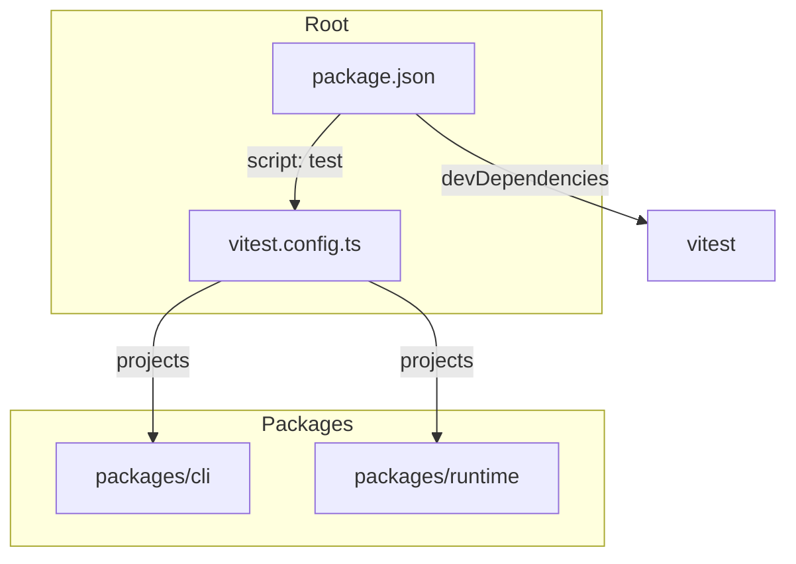

# Design Document

## Overview

**Purpose**: この機能は、gqlkit monorepo のテストフレームワークを Node.js built-in test runner から vitest に移行し、開発者に高速で一貫したテスト実行環境を提供する。

**Users**: gqlkit の開発者およびコントリビューターが、日常的なテスト実行とデバッグに活用する。

**Impact**: 現在の `node --import tsx --test` ベースのテスト実行を vitest に置き換え、42 個の既存テストファイルを vitest API に移行する。

### Goals

- vitest をルートレベルにインストールし、全パッケージで統一されたテスト環境を提供する
- vitest の projects 機能を使用して、各パッケージのテストを独立して管理・実行可能にする
- globals を無効化し、明示的なインポートスタイルを維持することで型安全性を確保する
- 既存のテストカバレッジと動作を完全に維持する

### Non-Goals

- カバレッジレポート機能の追加（将来的な拡張として検討）
- テストの並列実行最適化（デフォルト設定で十分）
- UI モードやブラウザテストの設定
- examples ディレクトリのテスト追加

## Architecture

### Existing Architecture Analysis

**現在のテスト構成**:
- **Test Runner**: Node.js built-in test runner (`node --test`)
- **Loader**: tsx (`node --import tsx`)
- **Assertion**: `node:assert` および `node:assert/strict`
- **Test API**: `node:test` (describe, it, beforeEach, afterEach)
- **Pattern**: `src/**/*.test.ts` (colocated tests)

**各パッケージの現状**:
| Package | Test Files | Command |
|---------|------------|---------|
| @gqlkit-ts/cli | 39 | `node --import tsx --test 'src/**/*.test.ts'` |
| @gqlkit-ts/runtime | 3 | `node --import tsx --test 'src/**/*.test.ts'` |

### Architecture Pattern & Boundary Map

**Architecture Integration**:
- **Selected pattern**: Vitest projects with shared root configuration
- **Domain boundaries**: 各パッケージは独立した project として扱い、テスト実行の分離を維持
- **Existing patterns preserved**: colocated test files, E2E tests in e2e/ subdirectory
- **New components rationale**: vitest.config.ts をルートに配置し、projects で各パッケージを参照
- **Steering compliance**: 既存の monorepo 構成と pnpm workspace を尊重



### Technology Stack

| Layer | Choice / Version | Role in Feature | Notes |
|-------|------------------|-----------------|-------|
| Test Runner | vitest ^3.2.x | テスト実行エンジン | Vitest 3.2 で projects 推奨 |
| TypeScript Loader | vitest built-in | TSファイル変換 | tsx が不要になる |
| Assertion | vitest (expect) | テストアサーション | node:assert から移行 |

## Requirements Traceability

| Requirement | Summary | Components | Interfaces |
|-------------|---------|------------|------------|
| 1.1 | vitest devDependency install | RootPackageConfig | - |
| 1.2 | vitest.config.ts at root | VitestRootConfig | - |
| 1.3 | pnpm test executes vitest | RootPackageConfig | - |
| 2.1 | workspace definitions for packages | VitestRootConfig | projects option |
| 2.2 | independent test execution per package | VitestRootConfig | --project flag |
| 2.3 | run all tests with single command | RootPackageConfig | pnpm test |
| 3.1 | globals option disabled | VitestRootConfig | globals: false |
| 3.2 | explicit imports required | TestFileMigration | vitest imports |
| 4.1 | node:test to vitest API conversion | TestFileMigration | describe, it, etc. |
| 4.2 | node:assert to expect conversion | TestFileMigration | expect API |
| 4.3 | maintain test coverage | TestFileMigration | - |
| 4.4 | tests pass after migration | TestFileMigration | - |
| 5.1 | TypeScript support without loaders | VitestRootConfig | built-in |
| 5.2 | respect tsconfig.json | VitestRootConfig | - |
| 6.1 | colocated test file pattern | VitestRootConfig | include option |
| 6.2 | E2E test pattern | VitestRootConfig | include option |

## Components and Interfaces

| Component | Domain/Layer | Intent | Req Coverage | Key Dependencies |
|-----------|--------------|--------|--------------|------------------|
| VitestRootConfig | Configuration | ルートレベルの vitest 設定 | 1.2, 2.1, 2.2, 3.1, 5.1, 5.2, 6.1, 6.2 | vitest (P0) |
| RootPackageConfig | Configuration | ルート package.json の更新 | 1.1, 1.3, 2.3 | - |
| PackageScriptUpdate | Configuration | 各パッケージの test script 削除 | 2.1 | - |
| TestFileMigration | Migration | テストファイルの API 移行 | 3.2, 4.1, 4.2, 4.3, 4.4 | vitest (P0) |

### Configuration Layer

#### VitestRootConfig

| Field | Detail |
|-------|--------|
| Intent | vitest の全体設定を定義し、projects で各パッケージを参照する |
| Requirements | 1.2, 2.1, 2.2, 3.1, 5.1, 5.2, 6.1, 6.2 |

**Responsibilities & Constraints**
- ルートレベルで vitest 設定を一元管理
- 各パッケージを project として定義
- globals を明示的に無効化（デフォルト動作）
- TypeScript ファイルを追加ローダーなしで実行

**Dependencies**
- External: vitest ^3.2.x - test runner (P0)

**Contracts**: Service [ ] / API [ ] / Event [ ] / Batch [ ] / State [ ]

##### Configuration Interface

```typescript
// vitest.config.ts
import { defineConfig } from "vitest/config";

export default defineConfig({
  test: {
    // globals は明示的に false（デフォルト）
    globals: false,

    // 各パッケージを project として定義
    projects: [
      {
        test: {
          name: "cli",
          root: "./packages/cli",
          include: ["src/**/*.test.ts"],
        },
      },
      {
        test: {
          name: "runtime",
          root: "./packages/runtime",
          include: ["src/**/*.test.ts"],
        },
      },
    ],
  },
});
```

**Implementation Notes**
- vitest 3.2 では `workspace` ではなく `projects` を使用する（workspace は deprecated）
- `globals: false` は vitest のデフォルト動作だが、要件の明確化のため明示的に設定
- TypeScript サポートは vitest の built-in 機能として提供される

#### RootPackageConfig

| Field | Detail |
|-------|--------|
| Intent | ルート package.json に vitest を追加し、test script を更新する |
| Requirements | 1.1, 1.3, 2.3 |

**Responsibilities & Constraints**
- vitest を devDependencies に追加
- test script を vitest コマンドに更新
- tsx 依存は各パッケージで保持（ビルド等で使用）

**Contracts**: Service [ ] / API [ ] / Event [ ] / Batch [ ] / State [ ]

##### Configuration Changes

```json
{
  "scripts": {
    "test": "vitest run"
  },
  "devDependencies": {
    "vitest": "^3.2.0"
  }
}
```

**Implementation Notes**
- `vitest run` は非 watch モードでテストを実行
- `vitest` (watch モード) は開発時に別途使用可能
- 各パッケージの test script は削除（ルートから一括実行）

#### PackageScriptUpdate

| Field | Detail |
|-------|--------|
| Intent | 各パッケージの test script を削除し、ルートからの一括実行に移行する |
| Requirements | 2.1 |

**Responsibilities & Constraints**
- packages/cli/package.json から test script を削除
- packages/runtime/package.json から test script を削除
- tsx は build 等で引き続き使用するため devDependencies に保持

**Implementation Notes**
- 個別パッケージのテスト実行は `vitest run --project cli` で可能

### Migration Layer

#### TestFileMigration

| Field | Detail |
|-------|--------|
| Intent | 既存テストファイルを node:test/node:assert から vitest API に移行する |
| Requirements | 3.2, 4.1, 4.2, 4.3, 4.4 |

**Responsibilities & Constraints**
- 42 個のテストファイルを移行
- テストロジックは変更せず、API のみ置換
- 全テストが移行後も pass することを確認

**Contracts**: Service [ ] / API [ ] / Event [ ] / Batch [ ] / State [ ]

##### Migration Patterns

**Import 置換**:

| Before | After |
|--------|-------|
| `import { describe, it, beforeEach, afterEach } from "node:test";` | `import { describe, it, beforeEach, afterEach } from "vitest";` |
| `import assert from "node:assert";` | `import { expect } from "vitest";` |
| `import assert from "node:assert/strict";` | `import { expect } from "vitest";` |

**Assertion 置換**:

| Before (node:assert) | After (vitest expect) |
|---------------------|----------------------|
| `assert.strictEqual(a, b)` | `expect(a).toBe(b)` |
| `assert.deepStrictEqual(a, b)` | `expect(a).toEqual(b)` |
| `assert.ok(value)` | `expect(value).toBeTruthy()` |
| `assert.equal(a, b)` | `expect(a).toBe(b)` |
| `assert.notEqual(a, b)` | `expect(a).not.toBe(b)` |
| `assert.notStrictEqual(a, b)` | `expect(a).not.toBe(b)` |
| `assert.throws(() => fn())` | `expect(() => fn()).toThrow()` |
| `assert.rejects(async () => fn())` | `await expect(async () => fn()).rejects.toThrow()` |
| `assert.match(str, regex)` | `expect(str).toMatch(regex)` |
| `assert(condition)` | `expect(condition).toBeTruthy()` |

**Implementation Notes**
- node:test の describe/it/beforeEach/afterEach は vitest と同じシグネチャ
- assert.strictEqual と assert.equal は両方とも expect().toBe() に統一
- async テストの構文は維持される

## Testing Strategy

### Migration Validation

- **Unit Tests**: 全 42 テストファイルが vitest で実行可能であることを確認
- **Regression**: 移行前後でテスト結果が一致することを確認
- **Coverage**: テストカバレッジが維持されていることを確認（手動）

### Validation Steps

1. vitest をインストールし設定ファイルを作成
2. 1 ファイルずつテストを移行し、都度 pass を確認
3. 全ファイル移行後、`pnpm test` で全テスト pass を確認
4. 個別パッケージ実行 (`--project` フラグ) の動作確認

## Error Handling

### Error Categories and Responses

**Configuration Errors**:
- 無効な projects 設定 -> vitest がエラーメッセージを出力
- TypeScript 設定との不整合 -> vitest の型チェックエラー

**Migration Errors**:
- assert パターンの見落とし -> テスト実行時にランタイムエラー
- import 漏れ -> "describe is not defined" 等のエラー

**Recovery Strategy**:
- エラーが発生した場合は該当テストファイルを個別に修正
- `vitest run --project cli` で特定パッケージのみ実行しデバッグ
