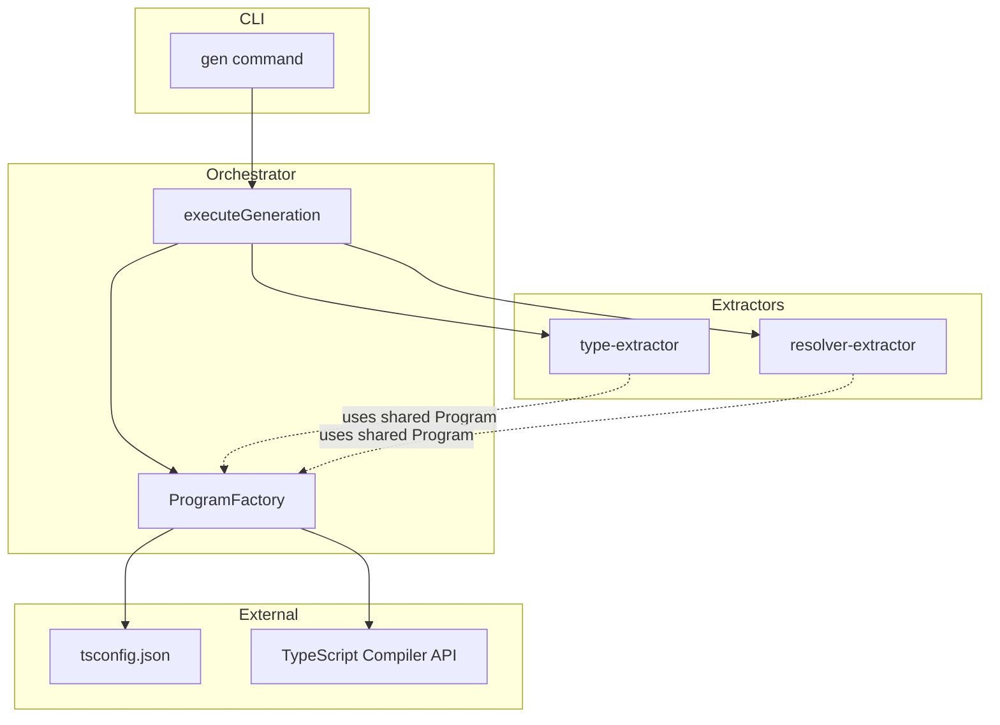
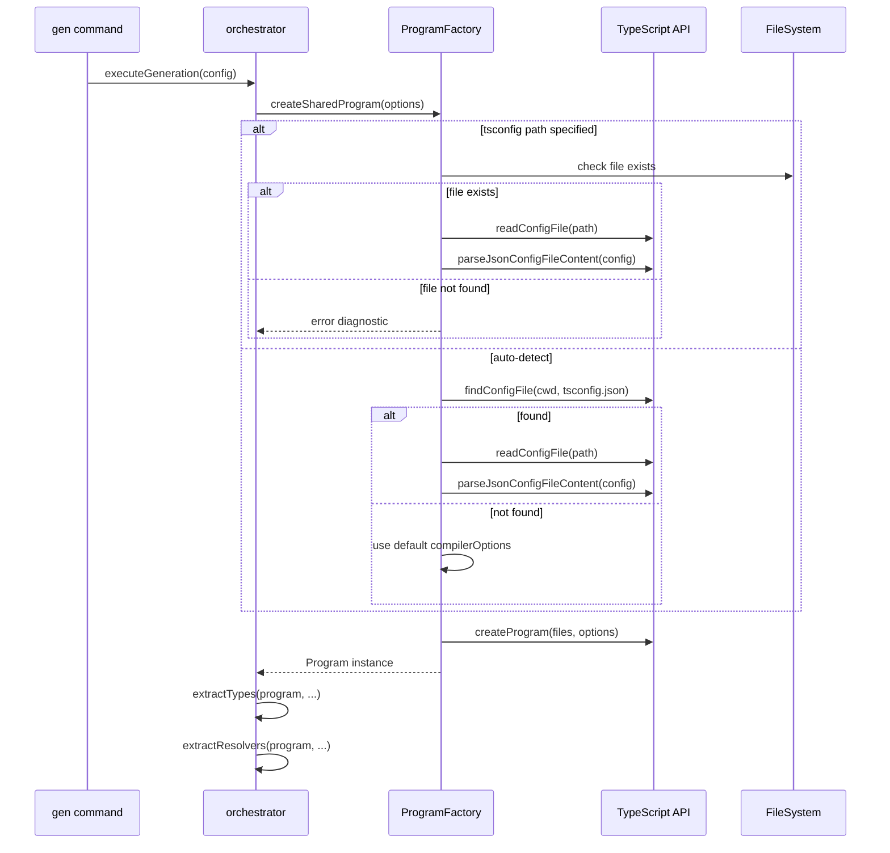

# Design Document

## Overview

**Purpose**: 本機能は、gqlkit CLI の `gen` コマンドにおける TypeScript Program インスタンスの共有と、プロジェクトの tsconfig.json を利用した compilerOptions の設定を実現する。

**Users**: gqlkit を使用する開発者が、パフォーマンス向上とプロジェクト固有の TypeScript 設定（パスエイリアス、strictness 設定など）の反映を得られる。

**Impact**: 現在 type-extractor と resolver-extractor でそれぞれ独立して `createProgram` を呼び出しているアーキテクチャを変更し、orchestrator レベルで単一の Program インスタンスを生成・共有する形に移行する。

### Goals

- TypeScript Program の生成を orchestrator レベルで一度に統合し、extractor 間で共有する
- プロジェクトの tsconfig.json から compilerOptions を読み込み、型解析に適用する
- カスタム tsconfig パスを設定ファイルの `tsconfigPath` フィールドで指定可能にする
- 既存の動作との後方互換性を維持する

### Non-Goals

- Watch モードでの Program 再利用（インクリメンタルビルド）
- tsconfig.json の自動生成・検証
- TypeScript バージョンの互換性チェック

## Architecture

### Existing Architecture Analysis

現在のアーキテクチャでは以下の問題がある：

1. **重複した Program 生成**: `extractTypes()` と `extractResolvers()` がそれぞれ `createProgramFromFiles()` を呼び出し、2 つの独立した Program インスタンスを生成している
2. **ハードコードされた CompilerOptions**: `DEFAULT_COMPILER_OPTIONS` が `type-extractor.ts` に固定値として定義されており、プロジェクトの tsconfig.json を参照していない
3. **パフォーマンス**: 同一ファイルセットに対して Program を 2 回生成するオーバーヘッドが発生している

### Architecture Pattern & Boundary Map



**Architecture Integration**:

- Selected pattern: Factory パターン + Dependency Injection（Program インスタンスを orchestrator で生成し、各 extractor に注入）
- Domain/feature boundaries: ProgramFactory は shared モジュールとして配置し、orchestrator が生成責任を持つ
- Existing patterns preserved: Pipeline architecture（extract -> validate -> generate -> write）を維持
- New components rationale: `ProgramFactory` は tsconfig.json 読み込みと Program 生成のロジックをカプセル化
- Steering compliance: Fail fast with actionable errors の原則を維持（tsconfig 読み込みエラー時に明確なメッセージを出力）

### Technology Stack

| Layer | Choice / Version | Role in Feature | Notes |
|-------|------------------|-----------------|-------|
| Backend / Services | TypeScript 5.9+ | tsconfig.json の読み込みと Program 生成 | `ts.readConfigFile`, `ts.parseJsonConfigFileContent` を使用 |
| Infrastructure / Runtime | Node.js | ファイルシステムアクセス | `fs.existsSync`, `fs.readFileSync` |

## System Flows

### tsconfig.json 読み込みフロー



## Requirements Traceability

| Requirement | Summary | Components | Interfaces | Flows |
|-------------|---------|------------|------------|-------|
| 1.1, 1.2 | 共有 Program インスタンスの生成と使用 | ProgramFactory, Orchestrator | `createSharedProgram`, `ProgramContext` | tsconfig 読み込みフロー |
| 1.3, 1.4 | Extractor が共有 Program を使用 | TypeExtractor, ResolverExtractor | `extractTypes`, `extractResolvers` | - |
| 2.1, 2.2 | tsconfig.json の自動検索と読み込み | ProgramFactory | `TsconfigLoader` | tsconfig 読み込みフロー |
| 2.3 | extends フィールドの解決 | ProgramFactory | `TsconfigLoader` | - |
| 2.4 | tsconfig.json 不在時のデフォルト動作 | ProgramFactory | `TsconfigLoader` | - |
| 3.1 | カスタム tsconfig パス指定 | GqlkitConfig | config types | - |
| 3.2 | 不正パス時のエラー | ProgramFactory | `TsconfigLoader` | - |
| 3.3 | 相対/絶対パスサポート | ProgramFactory | `TsconfigLoader` | - |
| 4.1, 4.2, 4.3 | 後方互換性 | All | - | - |

## Components and Interfaces

| Component | Domain/Layer | Intent | Req Coverage | Key Dependencies (P0/P1) | Contracts |
|-----------|--------------|--------|--------------|--------------------------|-----------|
| ProgramFactory | Shared | TypeScript Program の生成と tsconfig 読み込みを担当 | 1.1, 1.2, 2.1-2.4, 3.2, 3.3 | TypeScript API (P0) | Service |
| TsconfigLoader | Shared | tsconfig.json の検索・読み込み・解析 | 2.1-2.4, 3.2, 3.3 | TypeScript API (P0), Node.js fs (P1) | Service |
| Orchestrator (modified) | Orchestrator | Program 生成の責務を追加 | 1.1, 1.2 | ProgramFactory (P0) | Service |
| TypeExtractor (modified) | Type Extraction | Program を外部から受け取る形に変更 | 1.3 | - | Service |
| ResolverExtractor (modified) | Resolver Extraction | Program を外部から受け取る形に変更 | 1.4 | - | Service |
| GqlkitConfig (modified) | Config | tsconfigPath オプション追加 | 3.1 | - | - |

### Shared Layer

#### ProgramFactory

| Field | Detail |
|-------|--------|
| Intent | TypeScript Program インスタンスの生成と tsconfig.json 読み込みのファサード |
| Requirements | 1.1, 1.2, 2.1-2.4, 3.2, 3.3, 4.1, 4.3 |

**Responsibilities & Constraints**

- tsconfig.json の検索・読み込み・解析を TsconfigLoader に委譲
- 取得した compilerOptions と対象ファイル群から Program インスタンスを生成
- tsconfig.json が存在しない場合はデフォルト compilerOptions を適用

**Dependencies**

- Outbound: TsconfigLoader — tsconfig 読み込み (P0)
- External: TypeScript Compiler API — `ts.createProgram` (P0)

**Contracts**: Service [x]

##### Service Interface

```typescript
interface CreateSharedProgramOptions {
  readonly cwd: string;
  readonly tsconfigPath: string | null;
  readonly typeFiles: ReadonlyArray<string>;
  readonly resolverFiles: ReadonlyArray<string>;
}

interface CreateSharedProgramResult {
  readonly program: ts.Program;
  readonly diagnostics: ReadonlyArray<Diagnostic>;
}

interface ProgramFactory {
  createSharedProgram(options: CreateSharedProgramOptions): CreateSharedProgramResult;
}
```

- Preconditions: `typeFiles` と `resolverFiles` は有効なファイルパスの配列
- Postconditions: `program` は有効な TypeScript Program インスタンス、または `diagnostics` にエラーが含まれる
- Invariants: tsconfig.json が存在しない場合のみデフォルト compilerOptions を適用

**Implementation Notes**

- Integration: TypeScript API の `ts.createProgram` を使用
- Validation: tsconfigPath が指定された場合はファイル存在チェック
- Risks: TypeScript 内部 API への依存

---

#### TsconfigLoader

| Field | Detail |
|-------|--------|
| Intent | tsconfig.json の検索・読み込み・解析を担当 |
| Requirements | 2.1-2.4, 3.2, 3.3 |

**Responsibilities & Constraints**

- `ts.findConfigFile` による tsconfig.json の自動検索
- `ts.readConfigFile` と `ts.parseJsonConfigFileContent` による設定読み込み
- `extends` フィールドの自動解決
- 相対パス・絶対パスの正規化

**Dependencies**

- External: TypeScript Compiler API — `ts.findConfigFile`, `ts.readConfigFile`, `ts.parseJsonConfigFileContent` (P0)
- External: Node.js fs — `fs.existsSync`, `fs.readFileSync` (P1)

**Contracts**: Service [x]

##### Service Interface

```typescript
interface LoadTsconfigOptions {
  readonly cwd: string;
  readonly tsconfigPath: string | null;
}

interface LoadTsconfigResult {
  readonly compilerOptions: ts.CompilerOptions | null;
  readonly configFilePath: string | null;
  readonly diagnostics: ReadonlyArray<Diagnostic>;
}

interface TsconfigLoader {
  loadTsconfig(options: LoadTsconfigOptions): LoadTsconfigResult;
}
```

- Preconditions: `cwd` は有効なディレクトリパス
- Postconditions: `compilerOptions` は有効な ts.CompilerOptions、または `diagnostics` にエラーが含まれる
- Invariants: `extends` フィールドは常に解決される

**Implementation Notes**

- Integration: TypeScript の `ts.readConfigFile` + `ts.parseJsonConfigFileContent` で extends を自動解決
- Validation: ファイル存在チェック、JSON パースエラーのハンドリング
- Risks: TypeScript バージョン間での API 差異

---

### Orchestrator Layer

#### executeGeneration (modified)

| Field | Detail |
|-------|--------|
| Intent | Program 生成を orchestrator レベルで行い、extractors に注入する |
| Requirements | 1.1, 1.2 |

**Responsibilities & Constraints**

- ファイルスキャンを先に実行し、対象ファイル一覧を取得
- ProgramFactory を使用して共有 Program を生成
- 生成した Program を extractors に渡す

**Dependencies**

- Inbound: GenCommand — 実行トリガー (P0)
- Outbound: ProgramFactory — Program 生成 (P0)
- Outbound: TypeExtractor, ResolverExtractor — 型・リゾルバ抽出 (P0)

**Contracts**: Service [x]

##### Service Interface

```typescript
interface GenerationConfig {
  readonly cwd: string;
  readonly typesDir: string;
  readonly resolversDir: string;
  readonly outputDir: string;
  readonly configDir: string | null;
  readonly customScalars: ReadonlyArray<ResolvedScalarMapping> | null;
  readonly output: ResolvedOutputConfig | null;
  readonly tsconfigPath: string | null;  // NEW
}
```

**Implementation Notes**

- Integration: ファイルスキャン → Program 生成 → 抽出の順序で実行
- Risks: Program 生成失敗時は早期リターン

---

### Type Extraction Layer

#### extractTypes (modified)

| Field | Detail |
|-------|--------|
| Intent | 外部から Program を受け取る形に API を変更 |
| Requirements | 1.3 |

**Contracts**: Service [x]

##### Service Interface

```typescript
interface ExtractTypesOptions {
  readonly directory: string;
  readonly customScalarNames: ReadonlyArray<string> | null;
  readonly program: ts.Program | null;  // NEW: null の場合は従来通り内部で生成
}
```

**Implementation Notes**

- Integration: `program` が渡された場合は内部での `createProgramFromFiles` 呼び出しをスキップ
- Validation: 後方互換性のため `program: null` を許容

---

### Resolver Extraction Layer

#### extractResolvers (modified)

| Field | Detail |
|-------|--------|
| Intent | 外部から Program を受け取る形に API を変更 |
| Requirements | 1.4 |

**Contracts**: Service [x]

##### Service Interface

```typescript
interface ExtractResolversOptions {
  readonly directory: string;
  readonly program: ts.Program | null;  // NEW: null の場合は従来通り内部で生成
}
```

**Implementation Notes**

- Integration: `program` が渡された場合は内部での `createProgramFromFiles` 呼び出しをスキップ
- Validation: 後方互換性のため `program: null` を許容

---

### Config Layer

#### GqlkitConfig (modified)

| Field | Detail |
|-------|--------|
| Intent | tsconfigPath オプションを設定ファイルに追加 |
| Requirements | 3.1 |

**Contracts**: Service [x]

##### Service Interface

```typescript
interface GqlkitConfig {
  readonly scalars?: ReadonlyArray<ScalarMappingConfig>;
  readonly output?: SchemaOutputConfig;
  readonly tsconfigPath?: string;  // NEW: tsconfig.json へのパス
}

interface ResolvedConfig {
  readonly scalars: ReadonlyArray<ResolvedScalarMapping>;
  readonly output: ResolvedOutputConfig;
  readonly tsconfigPath: string | null;  // NEW
}
```

## Data Models

### Domain Model

本機能では新規のドメインモデルは導入しない。既存の `Diagnostic` 型を使用してエラーを報告する。

### Logical Data Model

**CompilerOptions の決定戦略**:

```
tsconfig.json が存在する場合:
  Final CompilerOptions = tsconfig.json options（そのまま使用）

tsconfig.json が存在しない場合:
  Final CompilerOptions = デフォルトオプション（従来の DEFAULT_COMPILER_OPTIONS 相当）
```

**注**: `@gqlkit-ts/runtime` はユーザープロジェクトの `node_modules` にインストールされる想定のため、gqlkit 側で `paths` マッピングを追加する必要はない。TypeScript の通常の module resolution で解決される。

## Error Handling

### Error Strategy

Fail-fast 戦略を採用し、tsconfig 関連のエラーは早期に検出して明確なメッセージを出力する。

### Error Categories and Responses

**User Errors (Configuration)**:

| Error Code | Condition | Message | Recovery |
|------------|-----------|---------|----------|
| `TSCONFIG_NOT_FOUND` | 指定された tsconfig が存在しない | `tsconfig.json not found at: {path}` | パスを確認して再実行 |
| `TSCONFIG_PARSE_ERROR` | tsconfig の JSON パースに失敗 | `Failed to parse tsconfig.json: {error}` | tsconfig.json の構文を修正 |
| `TSCONFIG_INVALID` | compilerOptions が無効 | `Invalid compiler options: {error}` | TypeScript ドキュメントを参照して修正 |

**System Errors**:

| Error Code | Condition | Message | Recovery |
|------------|-----------|---------|----------|
| `TSCONFIG_READ_ERROR` | ファイル読み込みに失敗 | `Failed to read tsconfig.json: {error}` | ファイル権限を確認 |

## Testing Strategy

### Unit Tests

- TsconfigLoader
  - tsconfig.json の読み込みと解析
  - extends フィールドの解決
  - 存在しないファイルのエラーハンドリング
  - 相対パス・絶対パスの正規化
- ProgramFactory
  - tsconfig.json からの compilerOptions 適用
  - tsconfig.json 不在時のデフォルト compilerOptions 適用
  - Program インスタンスの生成

### Integration Tests

- Orchestrator + ProgramFactory
  - 共有 Program を使用した型抽出
  - 共有 Program を使用したリゾルバ抽出
- Config Loading
  - 設定ファイルの tsconfigPath オプション読み込み
  - デフォルト動作（tsconfig なし）

### E2E Tests

- tsconfig.json が存在するプロジェクトでの gen コマンド実行
- 設定ファイルで tsconfigPath 指定時の動作
- tsconfig.json が存在しないプロジェクトでの gen コマンド実行（後方互換性）
- paths エイリアスを使用したプロジェクトでの型解析
