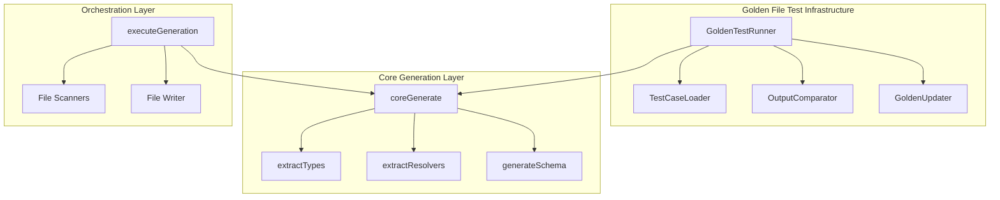
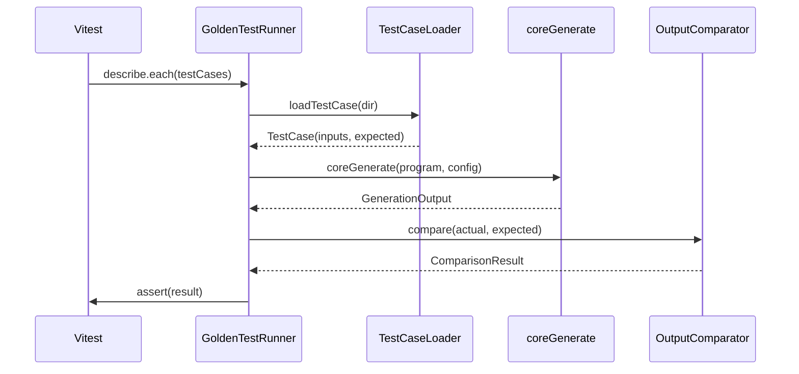
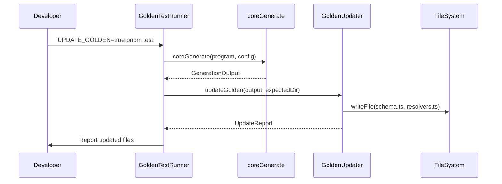

# Design Document

## Overview

**Purpose**: gqlkit のコード生成パイプラインに対する Golden File テスト基盤を構築する。これにより、入力(TypeScript 型定義、リゾルバ定義、設定)に対して期待通りの出力(スキーマ AST、SDL、リゾルバコード)が生成されることを網羅的に検証できる。

**Users**: gqlkit の開発者が、仕様変更やリファクタリング時にコード生成の正確性を検証するために使用する。

**Impact**: 既存の `orchestrator.ts` からコア生成ロジックを純粋関数として抽出し、ファイルシステムに依存しないテスト可能な形に再構築する。実装詳細に依存した脆いユニットテストから、仕様ベースの堅牢なテストスイートへの移行を実現する。

### Goals

- コア生成ロジックをファイル I/O から分離し、純粋関数としてテスト可能にする
- パラメタライズド Golden File テストによる網羅的な仕様検証
- テストケースの追加・更新が容易なディレクトリベースの構造
- 既存のすべての仕様を Golden File テストでカバー

### Non-Goals

- CLI コマンドのテスト(既存の E2E テストでカバー)
- パフォーマンステスト
- 外部依存(graphql-js 等)の互換性テスト

## Architecture

### Existing Architecture Analysis

現在の `orchestrator.ts` は以下の処理を一連のパイプラインとして実行している:

1. `scanDirectory` / `scanResolverDirectory` - ファイルシステムからファイル一覧を取得
2. `createSharedProgram` - TypeScript Program を作成
3. `extractTypes` / `extractResolvers` - 型とリゾルバを抽出
4. `generateSchema` - スキーマ AST とリゾルバコードを生成
5. `writeFiles` - ファイルシステムへ出力

**課題**: ファイルスキャン(1)とファイル書き込み(5)が生成ロジック(2-4)と結合しており、テスト時にファイルシステムのセットアップが必要。

### Architecture Pattern & Boundary Map



**Architecture Integration**:

- **Selected pattern**: Layered Architecture - コア生成ロジックをオーケストレーション層から分離
- **Domain boundaries**: テストインフラ層とコア生成層を明確に分離し、並行開発を可能に
- **Existing patterns preserved**: 既存の `extractTypes`, `extractResolvers`, `generateSchema` のインターフェースは維持
- **New components rationale**: `coreGenerate` 関数の導入により、ファイル I/O を除いた純粋な生成パイプラインを提供
- **Steering compliance**: パイプラインアーキテクチャ、モジュール境界、コロケーションテストの原則を維持

### Technology Stack

| Layer | Choice / Version | Role in Feature | Notes |
|-------|------------------|-----------------|-------|
| Backend / Services | TypeScript 5.9+ | 型定義、テストコード | 既存スタック |
| Testing | Vitest | テストランナー、パラメタライズドテスト | `describe.each` / `it.each` を活用 |
| Infrastructure / Runtime | Node.js (ES2022+) | ファイル読み込み、Program 作成 | `ts.createProgram` を使用 |

## System Flows

### Golden File Test Execution Flow



### Golden File Update Flow



## Requirements Traceability

| Requirement | Summary | Components | Interfaces | Flows |
|-------------|---------|------------|------------|-------|
| 1.1-1.5 | コア生成ロジックの抽出 | coreGenerate | CoreGenerateInput, CoreGenerateOutput | - |
| 2.1-2.5 | Golden File テストインフラ | GoldenTestRunner, OutputComparator | TestCase, ComparisonResult | Test Execution |
| 3.1-3.5 | テストケース構造 | TestCaseLoader | TestCaseDirectory | - |
| 4.1-4.3 | Golden File 更新機能 | GoldenUpdater | UpdateOptions, UpdateReport | Update Flow |
| 5.1-5.12 | 既存仕様カバレッジ | testdata fixtures | - | - |

## Components and Interfaces

| Component | Domain/Layer | Intent | Req Coverage | Key Dependencies (P0/P1) | Contracts |
|-----------|--------------|--------|--------------|--------------------------|-----------|
| coreGenerate | Core Generation | 純粋な生成パイプライン | 1.1-1.5 | extractTypes (P0), extractResolvers (P0), generateSchema (P0) | Service |
| GoldenTestRunner | Test Infrastructure | テスト実行とアサーション | 2.1-2.5 | coreGenerate (P0), Vitest (P0) | Service |
| TestCaseLoader | Test Infrastructure | テストケースの読み込み | 3.1-3.5 | fs/promises (P1) | Service |
| OutputComparator | Test Infrastructure | 出力比較とdiff表示 | 2.3-2.4 | - | Service |
| GoldenUpdater | Test Infrastructure | 期待出力の更新 | 4.1-4.3 | fs/promises (P1) | Service |

### Core Generation Layer

#### coreGenerate

| Field | Detail |
|-------|--------|
| Intent | ファイル I/O を除いたコア生成パイプラインを実行 |
| Requirements | 1.1, 1.2, 1.3, 1.4, 1.5 |

**Responsibilities & Constraints**

- 入力として `ts.Program`、設定、ファイルパス情報を受け取る
- 型抽出、リゾルバ抽出、スキーマ生成を順次実行
- 出力としてスキーマ AST コード、SDL、リゾルバコード、診断情報を返す
- ファイルシステムへのアクセスは行わない(純粋関数)

**Dependencies**

- Inbound: executeGeneration, GoldenTestRunner (P0)
- Outbound: extractTypes, extractResolvers, generateSchema (P0)

**Contracts**: Service [x] / API [ ] / Event [ ] / Batch [ ] / State [ ]

##### Service Interface

```typescript
interface CoreGenerateInput {
  readonly program: ts.Program;
  readonly typeFiles: ReadonlyArray<string>;
  readonly resolverFiles: ReadonlyArray<string>;
  readonly typesDir: string;
  readonly resolversDir: string;
  readonly outputDir: string;
  readonly customScalars: ReadonlyArray<ResolvedScalarMapping> | null;
  readonly output: ResolvedOutputConfig | null;
  readonly sourceRoot: string;
}

interface CoreGenerateOutput {
  readonly success: boolean;
  readonly typeDefsCode: string;
  readonly sdlContent: string;
  readonly resolversCode: string;
  readonly diagnostics: ReadonlyArray<Diagnostic>;
}

function coreGenerate(input: CoreGenerateInput): CoreGenerateOutput;
```

- Preconditions: program は有効な TypeScript Program であること
- Postconditions: 成功時は typeDefsCode, sdlContent, resolversCode が非空文字列
- Invariants: 同一入力に対して常に同一出力を返す(決定論的)

**Implementation Notes**

- Integration: 既存の `executeGeneration` から抽出、内部で `coreGenerate` を呼び出すようリファクタリング
- Validation: Program 作成時のエラーは呼び出し元で処理済みと仮定
- Risks: なし(既存ロジックの再構成のみ)

### Test Infrastructure Layer

#### GoldenTestRunner

| Field | Detail |
|-------|--------|
| Intent | Golden File テストの実行フレームワーク |
| Requirements | 2.1, 2.2, 2.3, 2.4, 2.5 |

**Responsibilities & Constraints**

- テストケースディレクトリを自動検出
- Vitest の `describe.each` を使用したパラメタライズドテスト
- 更新モード時は期待出力を上書き

**Dependencies**

- Outbound: TestCaseLoader (P0), coreGenerate (P0), OutputComparator (P1), GoldenUpdater (P1)
- External: Vitest (P0)

**Contracts**: Service [x] / API [ ] / Event [ ] / Batch [ ] / State [ ]

##### Service Interface

```typescript
interface GoldenTestOptions {
  readonly testdataDir: string;
  readonly updateMode: boolean;
}

function runGoldenTests(options: GoldenTestOptions): void;
```

**Implementation Notes**

- Integration: `packages/cli/src/gen-orchestrator/golden.test.ts` として配置
- Validation: テストケースディレクトリの存在確認
- Risks: ファイルパスの OS 依存性に注意

#### TestCaseLoader

| Field | Detail |
|-------|--------|
| Intent | テストケースディレクトリからの入力/期待出力読み込み |
| Requirements | 3.1, 3.2, 3.3, 3.4, 3.5 |

**Responsibilities & Constraints**

- 規約に基づくディレクトリ構造からファイルを読み込み
- 設定ファイル(config.json)が存在する場合は読み込み
- エラー期待ケース(expected/diagnostics.json)のサポート

**Dependencies**

- Outbound: fs/promises (P1), ts.createProgram (P0)

**Contracts**: Service [x] / API [ ] / Event [ ] / Batch [ ] / State [ ]

##### Service Interface

```typescript
interface TestCase {
  readonly name: string;
  readonly program: ts.Program;
  readonly input: TestCaseInput;
  readonly expected: TestCaseExpected;
}

interface TestCaseInput {
  readonly typeFiles: ReadonlyArray<string>;
  readonly resolverFiles: ReadonlyArray<string>;
  readonly typesDir: string;
  readonly resolversDir: string;
  readonly config: Partial<GqlkitConfig> | null;
}

interface TestCaseExpected {
  readonly schemaTs: string | null;
  readonly schemaSdl: string | null;
  readonly resolversTs: string | null;
  readonly diagnostics: ReadonlyArray<ExpectedDiagnostic> | null;
}

interface ExpectedDiagnostic {
  readonly code: string;
  readonly severity: "error" | "warning";
  readonly messagePattern?: string;
}

function loadTestCase(dir: string): Promise<TestCase>;
function discoverTestCases(baseDir: string): Promise<ReadonlyArray<string>>;
```

**Implementation Notes**

- Integration: `packages/cli/src/gen-orchestrator/testdata/` 配下にテストケースを配置
- Validation: 必須ファイル(types/, resolvers/)の存在確認
- Risks: 大量のテストケース時のパフォーマンス

#### OutputComparator

| Field | Detail |
|-------|--------|
| Intent | 生成出力と期待出力の比較、差分表示 |
| Requirements | 2.3, 2.4 |

**Responsibilities & Constraints**

- 文字列ベースの厳密比較
- 不一致時は unified diff 形式で差分を表示
- 診断メッセージの比較(コード、重要度、パターンマッチ)

**Dependencies**

- Outbound: なし

**Contracts**: Service [x] / API [ ] / Event [ ] / Batch [ ] / State [ ]

##### Service Interface

```typescript
interface ComparisonResult {
  readonly match: boolean;
  readonly differences: ReadonlyArray<FileDifference>;
}

interface FileDifference {
  readonly file: string;
  readonly expected: string;
  readonly actual: string;
  readonly diff: string;
}

function compareOutputs(
  actual: CoreGenerateOutput,
  expected: TestCaseExpected,
): ComparisonResult;
```

#### GoldenUpdater

| Field | Detail |
|-------|--------|
| Intent | 期待出力ファイルの更新 |
| Requirements | 4.1, 4.2, 4.3 |

**Responsibilities & Constraints**

- 環境変数 `UPDATE_GOLDEN=true` で更新モードを有効化
- 更新されたファイルをコンソールにレポート

**Dependencies**

- Outbound: fs/promises (P1)

**Contracts**: Service [x] / API [ ] / Event [ ] / Batch [ ] / State [ ]

##### Service Interface

```typescript
interface UpdateReport {
  readonly updatedFiles: ReadonlyArray<string>;
}

function updateGoldenFiles(
  testCaseDir: string,
  output: CoreGenerateOutput,
): Promise<UpdateReport>;
```

## Data Models

### Domain Model

#### TestCase Directory Structure

```
packages/cli/src/gen-orchestrator/testdata/
  {test-case-name}/
    types/
      *.ts              # 型定義ファイル
    resolvers/
      *.ts              # リゾルバ定義ファイル
    config.json         # (optional) テストケース固有の設定
    expected/
      schema.ts         # 期待されるスキーマ AST コード
      schema.graphql    # 期待される SDL
      resolvers.ts      # 期待されるリゾルバコード
      diagnostics.json  # (optional) 期待される診断メッセージ
```

**Business Rules & Invariants**:

- `types/` と `resolvers/` は必須
- `expected/` 内のファイルは少なくとも1つ必要(schema.ts または diagnostics.json)
- エラーを期待するケースでは `expected/diagnostics.json` を使用

### Logical Data Model

#### TestCase Configuration

```typescript
// config.json の構造
interface TestCaseConfig {
  readonly scalars?: ReadonlyArray<ScalarMapping>;
  readonly output?: OutputConfig;
  readonly expectError?: boolean;
}

// diagnostics.json の構造
interface ExpectedDiagnostics {
  readonly errors?: ReadonlyArray<ExpectedDiagnostic>;
  readonly warnings?: ReadonlyArray<ExpectedDiagnostic>;
}
```

## Error Handling

### Error Strategy

Golden File テストは開発時ツールであり、エラー時は明確な差分表示とテスト失敗を報告する。

### Error Categories and Responses

**Test Case Errors**:
- 不正なディレクトリ構造: テストスキップ + 警告メッセージ
- 期待ファイル不足: テスト失敗 + 必要ファイルの指示

**Comparison Errors**:
- 出力不一致: unified diff を表示 + テスト失敗
- 診断メッセージ不一致: 期待/実際の診断を並列表示

**Update Mode Errors**:
- ファイル書き込み失敗: エラーメッセージ + テスト失敗

## Testing Strategy

### Unit Tests

- `coreGenerate`: 最小限の入力での正常系テスト
- `TestCaseLoader`: ディレクトリ構造パターンのテスト
- `OutputComparator`: 差分検出ロジックのテスト

### Integration Tests (Golden File Tests)

5.1-5.12 の各仕様に対応するテストケース:

| ID | Test Case | Description |
|----|-----------|-------------|
| 5.1 | basic-object-type | 基本的なオブジェクト型の生成 |
| 5.2 | union-type | Union 型の生成 |
| 5.3 | input-object-type | Input Object 型の生成 |
| 5.4 | branded-scalars | ブランド型スカラー(IDString, IDNumber, Int, Float) |
| 5.5 | query-resolver | Query リゾルバの生成 |
| 5.6 | mutation-resolver | Mutation リゾルバの生成 |
| 5.7 | field-resolver | Field リゾルバの生成 |
| 5.8 | tsdoc-description | TSDoc からの description 生成 |
| 5.9 | deprecated-directive | @deprecated ディレクティブの生成 |
| 5.10 | custom-scalar-config | カスタムスカラー設定の適用 |
| 5.11 | type-error-diagnostics | 型エラーの診断 |
| 5.12 | resolver-error-diagnostics | リゾルバエラーの診断 |

### Performance Considerations

- テストケースは並列実行可能(Vitest のデフォルト動作)
- 各テストケースで独立した `ts.Program` を作成(メモリ使用量に注意)
