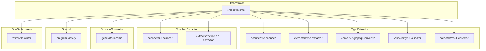
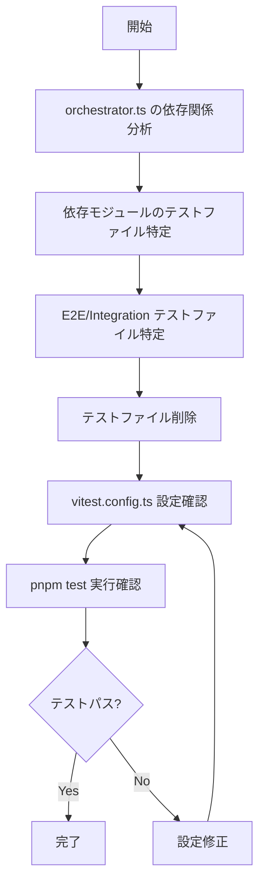
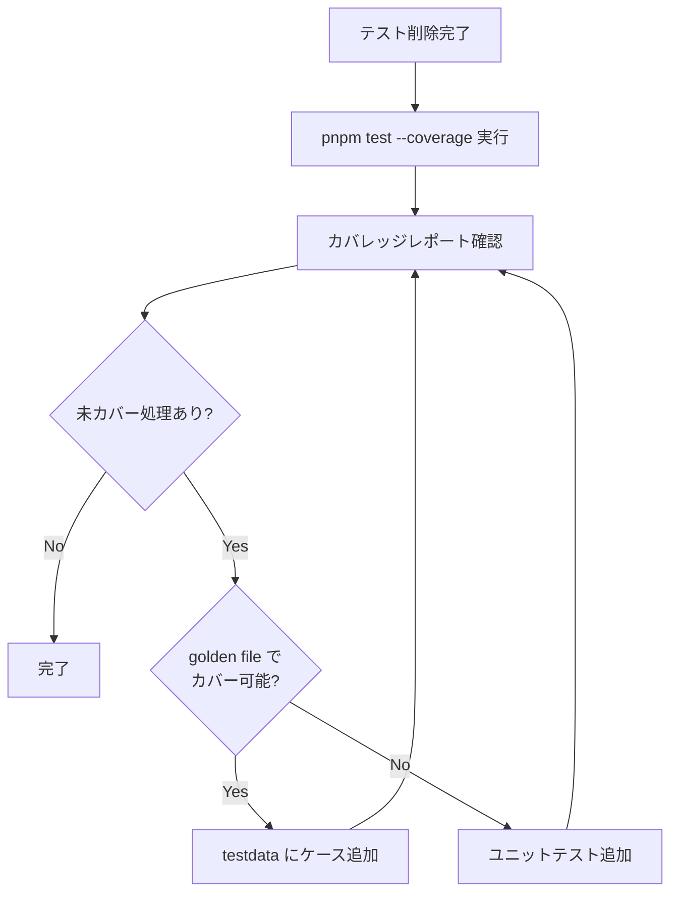

# Technical Design Document

## Overview

**Purpose**: gqlkit のテストアーキテクチャを再設計し、golden file テストを中心とした効率的なテスト戦略を実現する。コード生成ツールとして最も重要な「入力に対する出力の検証」に焦点を当て、冗長なユニットテストと E2E/Integration テストを削除することで、テストスイートを最適化する。

**Users**: gqlkit の開発者がテストの追加・実行・保守を行う際に、より効率的かつ明確なテスト戦略に基づいて作業できる。

**Impact**: 現在の 42 個のテストファイルから、golden file テストでカバーされている冗長なテストを削除し、カバレッジに基づいて必要最小限のテストのみを保持する構成に変更する。

### Goals

- orchestrator.ts から依存されるモジュールのユニットテストを削除する
- E2E テストおよび Integration テストを完全に削除する
- Vitest カバレッジ設定を追加し、テストカバレッジを計測可能にする
- カバレッジ結果に基づいて、golden file テストでカバーできないエッジケースのみテストを追加する
- `golden.test.ts` をテスト戦略の中心として維持する

### Non-Goals

- 新しいテストフレームワークへの移行
- golden file テスト自体の大幅なリファクタリング
- パフォーマンステストの追加
- CI/CD パイプラインの変更（カバレッジ閾値の設定等）

## Architecture

### Existing Architecture Analysis

現在のテストアーキテクチャは以下の構成:

```
packages/cli/src/
├── gen-orchestrator/
│   ├── golden.test.ts         # 保持: 主要なテスト戦略
│   ├── orchestrator.test.ts   # 削除対象
│   ├── e2e.test.ts            # 削除対象
│   ├── integration.test.ts    # 削除対象
│   ├── reporter/*.test.ts     # 削除対象
│   └── writer/*.test.ts       # 削除対象
├── type-extractor/
│   ├── integration.test.ts    # 削除対象
│   └── **/*.test.ts           # 削除対象（依存モジュール）
├── resolver-extractor/
│   └── **/*.test.ts           # 削除対象（依存モジュール）
├── schema-generator/
│   ├── e2e/*.e2e.test.ts      # 削除対象
│   └── **/*.test.ts           # 削除対象（依存モジュール）
├── shared/
│   └── program-factory.test.ts # 削除対象（依存モジュール）
├── config/                     # 非依存: テスト保持
├── config-loader/              # 非依存: テスト保持
└── commands/                   # 非依存: テスト保持
```

**orchestrator.ts の依存関係**:



### Architecture Pattern & Boundary Map

**Selected Pattern**: Golden File Testing を中心とした Integration-First テスト戦略

**Rationale**: コード生成ツールでは「入力→出力」の変換が正しいことが最重要。個々の関数の振る舞いよりも、パイプライン全体の出力を検証する方が効果的かつ保守性が高い。

**Architecture Integration**:
- 既存パターン維持: Vitest + colocated tests の構成は維持
- 新規追加: カバレッジ設定を `vitest.config.ts` に追加
- Steering 準拠: `tech.md` で定義されたテスト戦略（Vitest, colocated tests）に従う

### Technology Stack

| Layer | Choice / Version | Role in Feature | Notes |
|-------|------------------|-----------------|-------|
| テストランナー | Vitest (existing) | テスト実行・カバレッジ計測 | 既存設定を拡張 |
| カバレッジ | @vitest/coverage-v8 | V8 ベースのカバレッジ計測 | 新規追加 |

## System Flows

### テスト削除フロー



### カバレッジ計測・テスト追加フロー



## Requirements Traceability

| Requirement | Summary | Components | Interfaces | Flows |
|-------------|---------|------------|------------|-------|
| 1.1, 1.2, 1.3, 1.4 | ユニットテスト削除 | TestFileDeleter | deleteTestFiles | テスト削除フロー |
| 2.1, 2.2, 2.3, 2.4 | E2E/Integration 削除 | TestFileDeleter, VitestConfig | deleteTestFiles, updateConfig | テスト削除フロー |
| 3.1, 3.2, 3.3, 3.4 | カバレッジ計測 | VitestConfig | coverageConfig | カバレッジ計測フロー |
| 4.1, 4.2, 4.3, 4.4 | 不足テスト追加 | TestAddition | addTestCase | カバレッジ計測フロー |
| 5.1, 5.2, 5.3, 5.4 | Golden File 保全 | GoldenTest | executeGoldenTest | - |
| 6.1, 6.2, 6.3, 6.4 | インフラ整合性 | VitestConfig | runTests | テスト削除フロー |

## Components and Interfaces

| Component | Domain/Layer | Intent | Req Coverage | Key Dependencies | Contracts |
|-----------|--------------|--------|--------------|------------------|-----------|
| TestFileDeleter | CLI/Test | テストファイルの削除管理 | 1.1-1.4, 2.1-2.4 | Node.js fs | - |
| VitestConfig | CLI/Config | Vitest 設定管理 | 2.4, 3.1-3.4, 6.3, 6.4 | vitest | State |
| GoldenTest | CLI/Test | Golden file テスト実行 | 5.1-5.4 | vitest, executeGeneration | - |
| TestAddition | CLI/Test | 不足テストの追加 | 4.1-4.4 | vitest | - |

### CLI / Test Infrastructure

#### TestFileDeleter

| Field | Detail |
|-------|--------|
| Intent | orchestrator.ts 依存モジュールおよび E2E/Integration テストファイルの特定と削除 |
| Requirements | 1.1, 1.2, 1.3, 1.4, 2.1, 2.2, 2.3 |

**Responsibilities & Constraints**
- orchestrator.ts の import 文を再帰的に解析し、依存モジュールを特定
- 依存モジュールに対応するテストファイル（`*.test.ts`）を削除
- `golden.test.ts` は削除対象から除外
- E2E ディレクトリ配下のファイルを削除

**削除対象ファイル一覧**

orchestrator.ts 直接・間接依存のテストファイル:
```
packages/cli/src/gen-orchestrator/orchestrator.test.ts
packages/cli/src/gen-orchestrator/e2e.test.ts
packages/cli/src/gen-orchestrator/integration.test.ts
packages/cli/src/gen-orchestrator/reporter/diagnostic-reporter.test.ts
packages/cli/src/gen-orchestrator/reporter/progress-reporter.test.ts
packages/cli/src/gen-orchestrator/writer/file-writer.test.ts
packages/cli/src/type-extractor/scanner/file-scanner.test.ts
packages/cli/src/type-extractor/extractor/type-extractor.test.ts
packages/cli/src/type-extractor/converter/graphql-converter.test.ts
packages/cli/src/type-extractor/validator/type-validator.test.ts
packages/cli/src/type-extractor/collector/result-collector.test.ts
packages/cli/src/type-extractor/extract-types.test.ts
packages/cli/src/type-extractor/integration.test.ts
packages/cli/src/type-extractor/types/typescript.test.ts
packages/cli/src/type-extractor/types/graphql.test.ts
packages/cli/src/type-extractor/types/diagnostics.test.ts
packages/cli/src/resolver-extractor/scanner/file-scanner.test.ts
packages/cli/src/resolver-extractor/extractor/define-api-extractor.test.ts
packages/cli/src/resolver-extractor/extractor/parent-type-resolver.test.ts
packages/cli/src/resolver-extractor/extract-resolvers.test.ts
packages/cli/src/schema-generator/generate-schema.test.ts
packages/cli/src/schema-generator/builder/ast-builder.test.ts
packages/cli/src/schema-generator/emitter/code-emitter.test.ts
packages/cli/src/schema-generator/emitter/sdl-emitter.test.ts
packages/cli/src/schema-generator/integrator/result-integrator.test.ts
packages/cli/src/schema-generator/pruner/schema-pruner.test.ts
packages/cli/src/schema-generator/resolver-collector/resolver-collector.test.ts
packages/cli/src/schema-generator/validator/argument-validator.test.ts
packages/cli/src/schema-generator/e2e/description.e2e.test.ts
packages/cli/src/schema-generator/e2e/input-types.e2e.test.ts
packages/cli/src/schema-generator/e2e/output-options.e2e.test.ts
packages/cli/src/shared/program-factory.test.ts
packages/cli/src/shared/branded-detector.test.ts
packages/cli/src/shared/tsdoc-parser.test.ts
packages/cli/src/shared/symbol-resolver.test.ts
packages/cli/src/shared/scalar-registry.test.ts
packages/cli/src/shared/tsconfig-loader.test.ts
```

保持対象:
```
packages/cli/src/gen-orchestrator/golden.test.ts  # 保持: 主要テスト戦略
packages/cli/src/config/types.test.ts             # 保持: 非依存
packages/cli/src/config/define-config.test.ts     # 保持: 非依存
packages/cli/src/config-loader/loader.test.ts     # 保持: 非依存
packages/cli/src/config-loader/validator.test.ts  # 保持: 非依存
packages/cli/src/commands/gen.test.ts             # 保持: 非依存
```

**Implementation Notes**
- Integration: ファイル削除後に `pnpm check` および `pnpm test` でビルドエラーがないことを確認
- Validation: `golden.test.ts` が正常に動作することを確認

#### VitestConfig

| Field | Detail |
|-------|--------|
| Intent | Vitest カバレッジ設定の追加と E2E 関連設定のクリーンアップ |
| Requirements | 2.4, 3.1, 3.2, 3.3, 3.4, 6.3, 6.4 |

**Responsibilities & Constraints**
- `@vitest/coverage-v8` を使用したカバレッジ計測の設定
- `packages/cli/src/gen-orchestrator/` 配下のカバレッジ計測
- 行カバレッジ、関数カバレッジ、分岐カバレッジのレポート出力

**Contracts**: State [x]

##### State Management

**現在の vitest.config.ts**:
```typescript
export default defineConfig({
  // ... existing config
  test: {
    projects: [
      {
        test: {
          name: "cli",
          root: "./packages/cli",
          include: ["src/**/*.test.ts"],
          // ...
        },
      },
      // ...
    ],
  },
});
```

**カバレッジ設定追加後**:
```typescript
export default defineConfig({
  // ... existing config
  test: {
    coverage: {
      provider: "v8",
      reporter: ["text", "html", "lcov"],
      include: ["packages/cli/src/gen-orchestrator/**/*.ts"],
      exclude: [
        "**/*.test.ts",
        "**/testdata/**",
        "**/index.ts",
      ],
    },
    projects: [
      // ... existing projects
    ],
  },
});
```

**Implementation Notes**
- Integration: `pnpm test --coverage` でカバレッジレポートが生成されることを確認
- Validation: レポートに行・関数・分岐カバレッジが含まれていることを確認

#### GoldenTest

| Field | Detail |
|-------|--------|
| Intent | golden file テストの正常動作保証 |
| Requirements | 5.1, 5.2, 5.3, 5.4 |

**Responsibilities & Constraints**
- 既存の `golden.test.ts` がリファクタリング後も正常動作すること
- `testdata/` ディレクトリへの新規テストケース追加が可能なこと
- 9 個の既存テストケースがすべてパスすること

**Implementation Notes**
- Validation: テスト削除後に `pnpm test` で golden file テストがパスすることを確認

#### TestAddition

| Field | Detail |
|-------|--------|
| Intent | カバレッジ結果に基づく不足テストの追加 |
| Requirements | 4.1, 4.2, 4.3, 4.4 |

**Responsibilities & Constraints**
- カバレッジ計測結果を分析し、未カバーの処理を特定
- golden file テストでカバー可能な場合は `testdata/` にテストケースを追加
- カバー不可能な場合（エラーハンドリング、エッジケース）のみユニットテストを追加

**テスト追加の判断基準**:
1. 未カバーの処理が「正常系の出力パターン」なら → `testdata/` にケース追加
2. 未カバーの処理が「エラーハンドリング」なら → ユニットテスト追加を検討
3. 未カバーの処理が「内部ヘルパー関数」なら → カバレッジ対象から除外を検討

**Implementation Notes**
- Validation: 追加テストが既存命名規則（`*.test.ts`）に従うこと
- Risks: 過剰なテスト追加を避けるため、golden file テストでのカバーを優先

## Testing Strategy

### Golden File Tests

golden file テストは以下を検証:
- 正常系: 入力ファイルに対する生成出力が期待値と一致
- エラー系: 不正入力に対する diagnostics 出力が期待値と一致

既存テストケース（9 件）:
- `basic-object-type`: 基本的なオブジェクト型
- `union-type`: Union 型
- `input-object-type`: Input オブジェクト型
- `field-resolver`: フィールドリゾルバ
- `tsdoc-description`: TSDoc 記述
- `deprecated-directive`: @deprecated ディレクティブ
- `custom-scalar-config`: カスタムスカラー設定
- `branded-scalar`: ブランド型スカラー
- `type-error-diagnostics`: 型エラー診断

### Coverage-Based Test Addition

カバレッジ計測後、以下の観点で不足テストを評価:
1. 未カバーのエラーパス（例: ファイル読み込み失敗）
2. 未カバーのエッジケース（例: 空入力、境界値）
3. 未カバーの条件分岐

## Error Handling

### Error Strategy

テスト削除によって失われるエラーハンドリングのテストについて:
- **ファイルシステムエラー**: golden file テストの `type-error-diagnostics` ケースでカバー
- **型変換エラー**: 既存の diagnostics 出力テストでカバー
- **設定エラー**: `config/` および `config-loader/` のテストで継続カバー

### Monitoring

カバレッジレポートで以下を監視:
- 行カバレッジ率
- 関数カバレッジ率
- 分岐カバレッジ率

## Migration Strategy

### Phase 1: テストファイル削除

1. 削除対象ファイル一覧に基づいてテストファイルを削除
2. `schema-generator/e2e/` ディレクトリを削除
3. `pnpm check` でビルドエラーがないことを確認
4. `pnpm test` で残存テストがパスすることを確認

### Phase 2: カバレッジ設定追加

1. `@vitest/coverage-v8` を devDependencies に追加
2. `vitest.config.ts` にカバレッジ設定を追加
3. `pnpm test --coverage` でレポート生成を確認

### Phase 3: カバレッジ分析・テスト追加

1. カバレッジレポートを分析
2. 未カバー処理を特定
3. golden file テストケースまたはユニットテストを追加
4. 目標カバレッジ達成まで繰り返し

### Rollback

テスト削除は Git で追跡されるため、問題発生時は `git revert` で復元可能。
