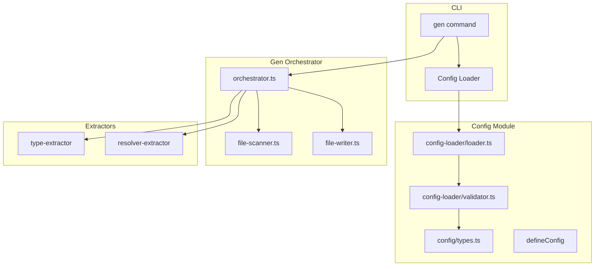
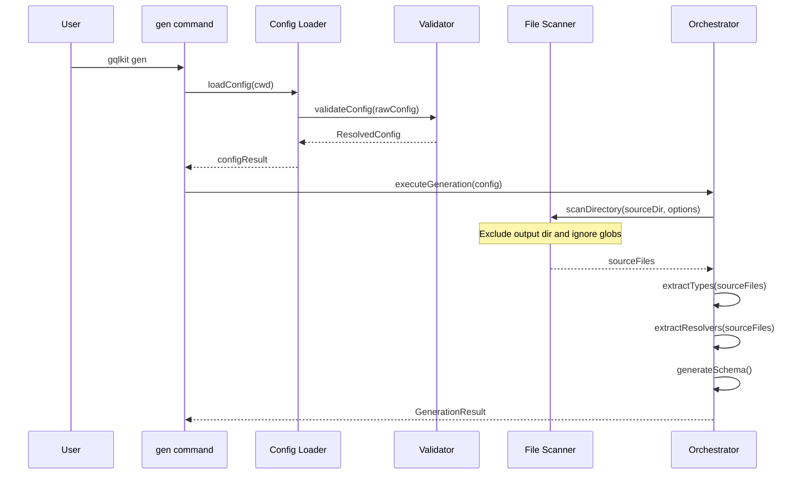
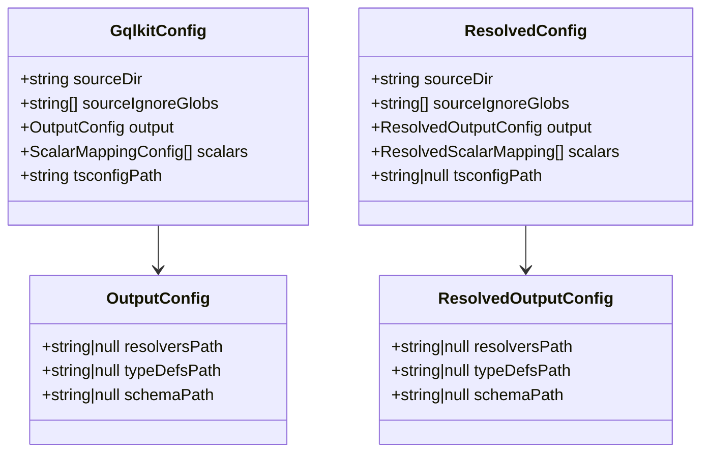

# Technical Design Document

## Overview

**Purpose**: この機能は、gqlkit の解析対象ディレクトリと生成ファイルの出力先を設定ファイルから柔軟に変更可能にする。現在の固定パス構成（`src/gql/types/`, `src/gql/resolvers/`, `src/gqlkit/generated/`）から、統一されたソースディレクトリ構成（`src/gqlkit`）への完全移行を実現する。

**Users**: gqlkit ユーザーは、プロジェクト固有のディレクトリ構成に合わせて解析対象と出力先をカスタマイズできる。

**Impact**: 既存の分離された types/resolvers ディレクトリ構成を廃止し、単一ソースディレクトリからの型・リゾルバ統合スキャンに移行する。

### Goals
- 解析対象ディレクトリを `gqlkit.config.ts` で設定可能にする
- 解析対象ディレクトリ以下の全 TypeScript ファイルを統合スキャンする
- 生成ファイルを解析対象から自動除外する
- glob パターンによる除外設定をサポートする
- 出力ファイルパス（resolvers, typeDefs, schema）を個別に設定可能にする
- 旧パス構成のサポートを完全に削除する

### Non-Goals
- 後方互換性の維持（未リリース段階のため不要）
- 複数ソースディレクトリのサポート
- 設定ファイルの自動マイグレーション
- watch モードでの動的設定リロード

## Architecture

### Existing Architecture Analysis

現在の実装における課題:

1. **ハードコードされたパス**: `gen.ts` で `src/gql/types`, `src/gql/resolvers`, `src/gqlkit/generated` が固定
2. **分離されたスキャン**: 型とリゾルバを別々のディレクトリから個別にスキャン
3. **出力設定の制限**: `output.ast` と `output.sdl` のみ、`resolvers.ts` のパスは固定

### Architecture Pattern & Boundary Map



**Architecture Integration**:
- **Selected pattern**: 既存のパイプラインアーキテクチャを維持しつつ、設定解決を拡張
- **Domain boundaries**: 設定モジュール（Config Module）が新しいパス設定を解決し、オーケストレータに渡す
- **Existing patterns preserved**: 設定バリデーション、診断エラー報告、ファイルスキャンのパターンを踏襲
- **New components rationale**: 既存コンポーネントの拡張のみで対応。新規コンポーネントは不要
- **Steering compliance**: convention-driven 設計を維持、デフォルト値は新規約に準拠

### Technology Stack

| Layer | Choice / Version | Role in Feature | Notes |
|-------|------------------|-----------------|-------|
| Backend / Services | TypeScript 5.9+ | 型定義、設定スキーマ | 既存スタック |
| Infrastructure / Runtime | Node.js 22+ | ファイルスキャン、glob パターン処理 | Node.js 標準 API（`fs.glob`, `path.matchesGlob`）を使用 |

## System Flows

### Configuration Resolution Flow



## Requirements Traceability

| Requirement | Summary | Components | Interfaces | Flows |
|-------------|---------|------------|------------|-------|
| 1.1, 1.2, 1.3 | 解析対象ディレクトリの設定 | ConfigLoader, Validator, Orchestrator | ResolvedConfig, GenerationConfig | Configuration Resolution |
| 2.1, 2.2, 2.3 | 解析対象ファイルのスコープ | FileScanner, Orchestrator | ScanOptions, ScanResult | File Scanning |
| 3.1, 3.2 | 生成ファイルの除外 | FileScanner | ScanOptions | File Scanning |
| 4.1, 4.2, 4.3, 4.4 | 除外パターンの設定 | ConfigLoader, Validator, FileScanner | GqlkitConfig, ScanOptions | Configuration Resolution, File Scanning |
| 5.1-5.6 | 出力ファイルパスの設定 | ConfigLoader, Validator, FileWriter | OutputConfig, ResolvedOutputConfig | File Writing |
| 6.1, 6.2, 6.3 | 設定スキーマの型安全性 | config/types.ts | GqlkitConfig, OutputConfig | N/A |
| 7.1-7.4 | 完全移行 | gen.ts, Orchestrator, examples | GenerationConfig | All flows |

## Components and Interfaces

| Component | Domain/Layer | Intent | Req Coverage | Key Dependencies | Contracts |
|-----------|--------------|--------|--------------|------------------|-----------|
| config/types.ts | Config | 設定型定義の拡張 | 6.1, 6.2, 6.3 | None | Service |
| config-loader/loader.ts | Config | パス設定の解決とデフォルト適用 | 1.1, 1.2, 4.1, 5.1-5.3 | validator.ts (P0) | Service |
| config-loader/validator.ts | Config | 新規設定フィールドのバリデーション | 1.3, 4.2, 4.3, 5.4-5.6 | types.ts (P0) | Service |
| file-scanner.ts | Shared | glob パターン除外と出力ディレクトリ除外 | 2.1, 2.2, 3.1, 3.2, 4.4 | None (Node.js 標準 API) | Service |
| orchestrator.ts | Orchestrator | 統合スキャンと設定適用 | 2.3, 7.1, 7.2 | file-scanner (P0), extractors (P0) | Service |
| gen.ts | Commands | ハードコードパスの削除と設定利用 | 7.1, 7.2 | config-loader (P0), orchestrator (P0) | Service |

### Config Module

#### config/types.ts

| Field | Detail |
|-------|--------|
| Intent | 設定スキーマに `sourceDir`, `sourceIgnoreGlobs`, `output` 拡張を追加 |
| Requirements | 6.1, 6.2, 6.3 |

**Responsibilities & Constraints**
- `GqlkitConfig` インターフェースに新規フィールドを追加
- 全ての新規オプションはオプショナルとして定義
- `output` を `resolversPath`, `typeDefsPath`, `schemaPath` を含むオブジェクトに再構成

**Dependencies**
- Inbound: defineConfig (P0)
- Outbound: None
- External: None

**Contracts**: Service [x] / API [ ] / Event [ ] / Batch [ ] / State [ ]

##### Service Interface

```typescript
/**
 * Output configuration for generated files.
 * All paths are relative to project root.
 */
interface OutputConfig {
  /**
   * Output path for resolver map file.
   * @default "src/gqlkit/__generated__/resolvers.ts"
   */
  readonly resolversPath?: string | null;

  /**
   * Output path for GraphQL schema AST (DocumentNode).
   * @default "src/gqlkit/__generated__/typeDefs.ts"
   */
  readonly typeDefsPath?: string | null;

  /**
   * Output path for GraphQL schema SDL.
   * @default "src/gqlkit/__generated__/schema.graphql"
   */
  readonly schemaPath?: string | null;
}

interface GqlkitConfig {
  /**
   * Source directory to scan for types and resolvers.
   * @default "src/gqlkit"
   */
  readonly sourceDir?: string;

  /**
   * Glob patterns to exclude from source scanning.
   * Patterns are matched against file paths relative to sourceDir.
   * @default []
   */
  readonly sourceIgnoreGlobs?: ReadonlyArray<string>;

  /**
   * Output configuration for generated files.
   */
  readonly output?: OutputConfig;

  // Existing fields preserved
  readonly scalars?: ReadonlyArray<ScalarMappingConfig>;
  readonly tsconfigPath?: string;
}
```

- Preconditions: None
- Postconditions: Type-safe configuration schema available for defineConfig
- Invariants: All new fields are optional

#### config-loader/loader.ts

| Field | Detail |
|-------|--------|
| Intent | 新規設定フィールドの解決とデフォルト値適用 |
| Requirements | 1.1, 1.2, 4.1, 5.1, 5.2, 5.3 |

**Responsibilities & Constraints**
- `sourceDir` のデフォルト値を `src/gqlkit` に設定
- `sourceIgnoreGlobs` のデフォルト値を空配列に設定
- `output` の各パスにデフォルト値を適用
- 旧 `output.ast` / `output.sdl` から新形式への移行（型定義のみ、ランタイムサポート不要）

**Dependencies**
- Inbound: gen.ts (P0)
- Outbound: validator.ts (P0)
- External: jiti (P0) - config file loading

**Contracts**: Service [x] / API [ ] / Event [ ] / Batch [ ] / State [ ]

##### Service Interface

```typescript
interface ResolvedOutputConfig {
  /** Resolver map output path. Null suppresses output */
  readonly resolversPath: string | null;
  /** Schema AST output path. Null suppresses output */
  readonly typeDefsPath: string | null;
  /** Schema SDL output path. Null suppresses output */
  readonly schemaPath: string | null;
}

interface ResolvedConfig {
  readonly sourceDir: string;
  readonly sourceIgnoreGlobs: ReadonlyArray<string>;
  readonly output: ResolvedOutputConfig;
  readonly scalars: ReadonlyArray<ResolvedScalarMapping>;
  readonly tsconfigPath: string | null;
}

// Default values
const DEFAULT_SOURCE_DIR = "src/gqlkit";
const DEFAULT_RESOLVERS_PATH = "src/gqlkit/__generated__/resolvers.ts";
const DEFAULT_TYPEDEFS_PATH = "src/gqlkit/__generated__/typeDefs.ts";
const DEFAULT_SCHEMA_PATH = "src/gqlkit/__generated__/schema.graphql";
```

- Preconditions: Config file exists or defaults are used
- Postconditions: All paths are resolved with defaults applied
- Invariants: sourceDir is always a non-empty string

#### config-loader/validator.ts

| Field | Detail |
|-------|--------|
| Intent | 新規設定フィールドのバリデーション |
| Requirements | 1.3, 4.2, 4.3, 5.4, 5.5, 5.6 |

**Responsibilities & Constraints**
- `sourceDir` が空文字列でないことを検証
- `sourceIgnoreGlobs` が文字列配列であることを検証
- `output` の各パスが有効な文字列または null であることを検証
- バリデーションエラーに対して診断メッセージを生成

**Dependencies**
- Inbound: loader.ts (P0)
- Outbound: None
- External: None

**Contracts**: Service [x] / API [ ] / Event [ ] / Batch [ ] / State [ ]

##### Service Interface

```typescript
function validateSourceDir(
  value: unknown,
  configPath: string,
): { resolved: string | undefined; diagnostics: Diagnostic[] };

function validateSourceIgnoreGlobs(
  value: unknown,
  configPath: string,
): { resolved: ReadonlyArray<string> | undefined; diagnostics: Diagnostic[] };

function validateOutputConfig(
  output: unknown,
  configPath: string,
): { resolved: ResolvedOutputConfig | undefined; diagnostics: Diagnostic[] };
```

- Preconditions: Raw config value passed from loader
- Postconditions: Validated and resolved config or diagnostics
- Invariants: Diagnostics are non-empty only on validation failure

**Implementation Notes**
- Integration: 既存の validateConfig 関数を拡張
- Validation: 新規バリデーション関数を追加し、既存パターンを踏襲
- Risks: 設定フォーマット変更による既存テストの修正が必要

### Shared Module

#### file-scanner.ts

| Field | Detail |
|-------|--------|
| Intent | glob パターンによる除外と出力ディレクトリ自動除外 |
| Requirements | 2.1, 2.2, 3.1, 3.2, 4.4 |

**Responsibilities & Constraints**
- `.ts`, `.cts`, `.mts` ファイルをスキャン対象とする
- 指定された出力ディレクトリ内のファイルを自動除外
- glob パターンにマッチするファイルを除外
- サブディレクトリを再帰的に走査

**Dependencies**
- Inbound: orchestrator.ts (P0)
- Outbound: None
- External: None (Node.js 標準 API を使用)

**Contracts**: Service [x] / API [ ] / Event [ ] / Batch [ ] / State [ ]

##### Service Interface

```typescript
interface ScanOptions {
  /**
   * Glob patterns to exclude files.
   * Patterns are matched against file paths relative to the scan directory.
   */
  readonly excludeGlobs?: ReadonlyArray<string>;

  /**
   * File paths to exclude (for generated files).
   * Each path is individually excluded from scanning.
   */
  readonly excludePaths?: ReadonlyArray<string>;

  /**
   * Simple suffix patterns to exclude (existing behavior).
   * @deprecated Use excludeGlobs instead
   */
  readonly excludePatterns?: ReadonlyArray<string>;
}

function isTypeScriptSourceFile(fileName: string): boolean;

async function scanDirectory(
  directory: string,
  options?: ScanOptions,
): Promise<ScanResult>;
```

- Preconditions: directory exists and is accessible
- Postconditions: Returns sorted list of TypeScript source files
- Invariants: `.d.ts` files are always excluded

**Implementation Notes**
- Integration: Node.js 22+ 標準 API（`fs.glob`, `path.matchesGlob`）を使用。外部依存なし
- Validation: 無効な glob パターンはエラーログを出力しスキップ
- Risks: glob パターンのパフォーマンス影響（多数のファイルで顕著になる可能性）

### Orchestrator Module

#### orchestrator.ts

| Field | Detail |
|-------|--------|
| Intent | 統合ソーススキャンと新設定構造の適用 |
| Requirements | 2.3, 7.1, 7.2 |

**Responsibilities & Constraints**
- 単一ソースディレクトリから型とリゾルバを同時抽出
- 出力ディレクトリのファイルを解析から除外
- 新しい出力パス設定を適用

**Dependencies**
- Inbound: gen.ts (P0)
- Outbound: file-scanner (P0), type-extractor (P0), resolver-extractor (P0), file-writer (P0)
- External: None

**Contracts**: Service [x] / API [ ] / Event [ ] / Batch [ ] / State [ ]

##### Service Interface

```typescript
interface GenerationConfig {
  readonly cwd: string;
  readonly sourceDir: string;
  readonly sourceIgnoreGlobs: ReadonlyArray<string>;
  readonly output: ResolvedOutputConfig;
  readonly configDir: string | null;
  readonly customScalars: ReadonlyArray<ResolvedScalarMapping> | null;
  readonly tsconfigPath: string | null;
}

async function executeGeneration(
  config: GenerationConfig,
): Promise<GenerationResult>;
```

- Preconditions: sourceDir exists and contains TypeScript files
- Postconditions: Generated files or diagnostics returned
- Invariants: Output file paths are never analyzed as source

**Implementation Notes**
- Integration: `typesDir` と `resolversDir` を `sourceDir` に統合
- Validation: 各出力ファイルパス（resolversPath, typeDefsPath, schemaPath）を個別に解析対象から除外
- Risks: 統合スキャンによるスキャン時間の微増（通常は無視できるレベル）

### Commands Module

#### gen.ts

| Field | Detail |
|-------|--------|
| Intent | ハードコードされたパスを削除し設定値を使用 |
| Requirements | 7.1, 7.2 |

**Responsibilities & Constraints**
- 設定から解決されたパスを使用
- ハードコードされた旧パスを完全に削除

**Dependencies**
- Inbound: CLI entry point (P0)
- Outbound: config-loader (P0), orchestrator (P0)
- External: None

**Contracts**: Service [x] / API [ ] / Event [ ] / Batch [ ] / State [ ]

##### Service Interface

```typescript
async function runGenCommand(
  options: RunGenCommandOptions,
): Promise<RunGenCommandResult>;
```

- Preconditions: cwd is valid directory
- Postconditions: Generation completes or fails with diagnostics
- Invariants: No hardcoded paths in implementation

**Implementation Notes**
- Integration: configResult から新形式のパスを取得
- Validation: sourceDir 存在チェックは FileScanner が担当
- Risks: なし

## Data Models

### Domain Model

**Configuration Aggregate**:
- `GqlkitConfig` - 設定ファイルの入力形式
- `ResolvedConfig` - デフォルト適用後の解決済み設定
- `OutputConfig` / `ResolvedOutputConfig` - 出力パス設定

**Invariants**:
- sourceDir は常に非空文字列
- 出力パスは null（抑制）または有効なファイルパス
- sourceIgnoreGlobs は文字列配列（空可）

### Logical Data Model



## Error Handling

### Error Categories and Responses

**User Errors (Configuration)**:
| Code | Condition | Message |
|------|-----------|---------|
| CONFIG_INVALID_SOURCE_DIR | sourceDir が空文字列 | sourceDir cannot be empty |
| CONFIG_INVALID_IGNORE_GLOBS | sourceIgnoreGlobs が配列でない | sourceIgnoreGlobs must be an array of strings |
| CONFIG_INVALID_OUTPUT_PATH | output パスが無効 | output.{field} must be a string, null, or undefined |
| DIRECTORY_NOT_FOUND | sourceDir が存在しない | Directory not found: {path} |

**System Errors**:
- ファイルシステムエラー: 既存の診断システムで報告

### Monitoring
- 既存の診断レポーターを使用
- 新しいエラーコードを追加

## Testing Strategy

### Unit Tests
- `config/types.test.ts`: 新規型定義のテスト
- `config-loader/loader.test.ts`: デフォルト値適用のテスト
- `config-loader/validator.test.ts`: 新規バリデーションのテスト
- `shared/file-scanner.test.ts`: glob 除外と出力ディレクトリ除外のテスト

### Integration Tests
- `gen.test.ts`: 新パス設定を使用した生成フローのテスト

### Golden File Tests
- `gen-orchestrator/testdata/`: 統合スキャンのゴールデンファイルテストケース追加
- 新ディレクトリ構成（`src/gqlkit`）を使用したテストケース

## Migration Strategy

### Phase 1: Implementation
1. 設定型定義の拡張
2. バリデーターの拡張
3. ローダーの拡張
4. ファイルスキャナーの拡張
5. オーケストレーターの修正
6. gen コマンドの修正

### Phase 2: Example Migration
1. `examples/full-featured/` を新パス構成に移行
2. `examples/minimal/` を新パス構成に移行

### Phase 3: Test Updates
1. 既存テストを新パス構成に更新
2. ゴールデンファイルテストを更新

### Rollback Triggers
- N/A（未リリース段階のため後方互換性は不要）

### Validation Checkpoints
- 全テストの通過
- example プロジェクトの正常動作
