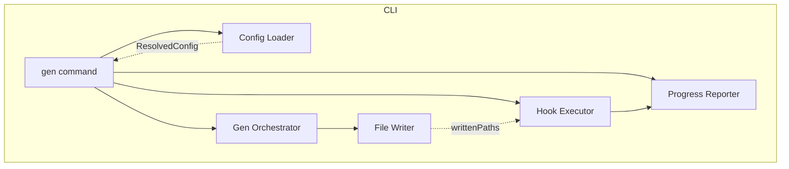
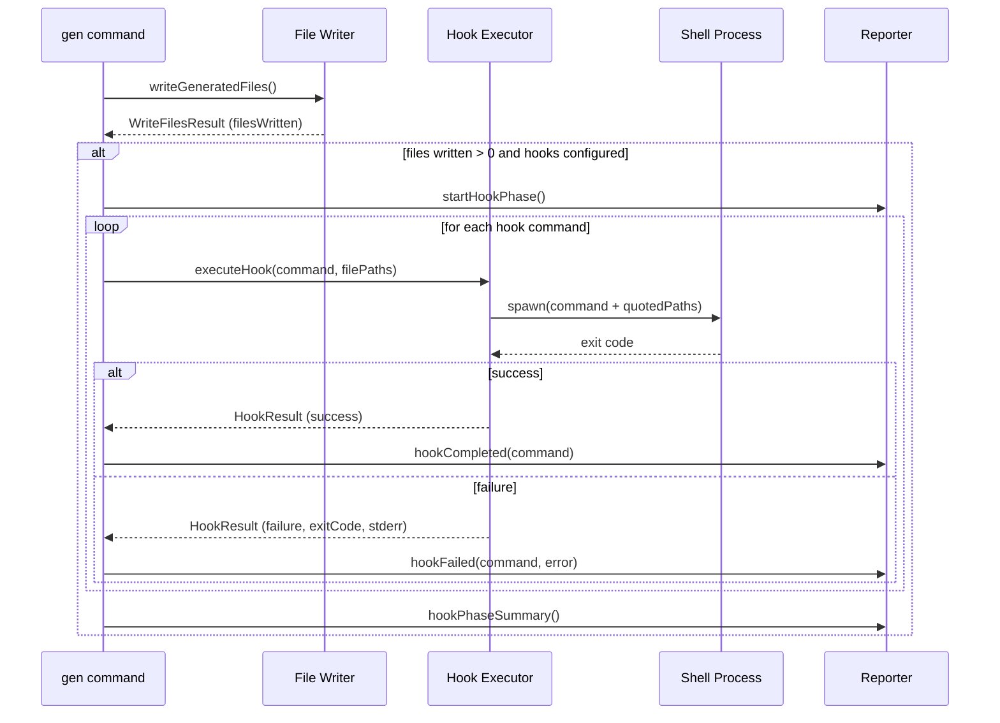

# Design Document

## Overview

**Purpose**: この機能は、gqlkit CLI にファイル生成後のフック実行機能を提供し、開発者が Prettier や ESLint などの外部ツールを自動実行できるようにする。

**Users**: TypeScript/GraphQL プロジェクトの開発者が、コード生成パイプラインにフォーマット・リント処理を統合するために使用する。

**Impact**: 既存の設定システム (`GqlkitConfig`) を拡張し、`gen` コマンドのファイル書き込み後に新しいフック実行フェーズを追加する。

### Goals

- `hooks.afterAllFileWrite` 設定オプションを通じたフック設定の提供
- ファイル書き込み完了後のコマンド順次実行
- 明確なエラー報告とプログレス表示

### Non-Goals

- `beforeAllFileWrite`, `afterOneFileWrite` など他のライフサイクルフックの実装
- 関数形式のフック (コマンド文字列のみサポート)
- Watch モードでの増分フック実行

## Architecture

### Existing Architecture Analysis

現在の gqlkit CLI パイプラインは以下の構造を持つ:

1. **Config Loading** (`config-loader/`): `gqlkit.config.ts` を読み込み、検証し、`ResolvedConfig` を返す
2. **Generation** (`gen-orchestrator/`): 型抽出、リゾルバ抽出、スキーマ生成を実行
3. **File Writing** (`gen-orchestrator/writer/`): 生成されたファイルをディスクに書き込む
4. **Reporting** (`gen-orchestrator/reporter/`): プログレスと診断を報告

フック実行は、ファイル書き込み完了後、成功報告の前に新しいフェーズとして挿入される。

### Architecture Pattern & Boundary Map



**Architecture Integration**:

- **Selected pattern**: パイプライン拡張 - 既存のファイル書き込みフェーズ後に新しいフック実行フェーズを追加
- **Domain boundaries**: HookExecutor は独立したモジュールとして `gen-orchestrator/hook-executor/` に配置
- **Existing patterns preserved**: 設定検証パターン、診断報告パターン、プログレス報告パターン
- **New components rationale**: HookExecutor は外部コマンド実行という新しい責務を担うため分離
- **Steering compliance**: パイプラインアーキテクチャ、明示的なエラーハンドリング、型安全性を維持

### Technology Stack

| Layer | Choice / Version | Role in Feature | Notes |
|-------|------------------|-----------------|-------|
| Runtime | Node.js child_process | シェルコマンド実行 | 標準ライブラリ使用 |
| Utility | shell-quote (または類似) | コマンド引数のエスケープ | セキュリティのため必要 |

## System Flows

### Hook Execution Flow



## Requirements Traceability

| Requirement | Summary | Components | Interfaces | Flows |
|-------------|---------|------------|------------|-------|
| 1.1-1.5 | Hook configuration in gqlkit.config.ts | HooksConfig, ConfigValidator | GqlkitConfig.hooks | - |
| 2.1-2.5 | Hook execution after file write | HookExecutor, gen command | executeHook() | Hook Execution Flow |
| 3.1-3.5 | Error handling and reporting | HookExecutor, DiagnosticReporter | HookResult | Hook Execution Flow |
| 4.1-4.4 | Execution conditions | gen command | - | Hook Execution Flow |
| 5.1-5.4 | Progress reporting | ProgressReporter | hookPhase methods | Hook Execution Flow |

## Components and Interfaces

| Component | Domain/Layer | Intent | Req Coverage | Key Dependencies | Contracts |
|-----------|--------------|--------|--------------|------------------|-----------|
| HooksConfig | Config | フック設定の型定義 | 1.1-1.5 | - | State |
| ConfigValidator (extension) | Config Loader | フック設定の検証 | 1.1-1.5 | HooksConfig (P0) | Service |
| HookExecutor | Gen Orchestrator | 外部コマンドの実行 | 2.1-2.5, 3.1-3.5, 4.1-4.4 | child_process (P0) | Service |
| ProgressReporter (extension) | Reporter | フック実行状態の表示 | 5.1-5.4 | - | Service |

### Config Layer

#### HooksConfig

| Field | Detail |
|-------|--------|
| Intent | フック設定の型定義を提供 |
| Requirements | 1.1, 1.2, 1.3, 1.4, 1.5 |

**Responsibilities & Constraints**

- `afterAllFileWrite` プロパティの型定義
- 単一文字列または文字列配列の両方をサポート
- 未定義の場合はフック実行をスキップ

**Contracts**: State [x]

##### State Management

```typescript
interface HooksConfig {
  /**
   * Commands to execute after all files are written.
   * Each command receives all written file paths as arguments.
   * Commands are executed sequentially in order.
   */
  readonly afterAllFileWrite?: string | ReadonlyArray<string>;
}

interface GqlkitConfig {
  // ... existing fields
  readonly hooks?: HooksConfig;
}

interface ResolvedHooksConfig {
  /** Normalized to array (empty if not configured) */
  readonly afterAllFileWrite: ReadonlyArray<string>;
}

interface ResolvedConfig {
  // ... existing fields
  readonly hooks: ResolvedHooksConfig;
}
```

#### ConfigValidator (extension)

| Field | Detail |
|-------|--------|
| Intent | フック設定の検証と正規化 |
| Requirements | 1.1, 1.2, 1.3, 1.4, 1.5 |

**Responsibilities & Constraints**

- `hooks` オブジェクトの型検証
- `afterAllFileWrite` の string | string[] 型検証
- 空文字列コマンドの拒否
- 配列への正規化 (単一文字列 -> 1要素配列)

**Dependencies**

- Inbound: loader.ts - 設定ロード時に呼び出し (P0)

**Contracts**: Service [x]

##### Service Interface

```typescript
function validateHooksConfig(
  hooks: unknown,
  configPath: string,
): { resolved: ResolvedHooksConfig | undefined; diagnostics: Diagnostic[] };
```

- Preconditions: `hooks` は undefined またはオブジェクト
- Postconditions: 有効な場合は `ResolvedHooksConfig` を返却、無効な場合は診断を返却
- Invariants: 空のコマンド文字列は許可しない

**Implementation Notes**

- Integration: 既存の `validateConfig` 関数に `validateHooksConfig` 呼び出しを追加
- Validation:
  - `hooks` が undefined の場合、デフォルト値 `{ afterAllFileWrite: [] }` を返却
  - `hooks` がオブジェクトでない場合、エラー診断を返却
  - `afterAllFileWrite` が string の場合、1要素配列に正規化
  - 空文字列コマンドは `CONFIG_INVALID_HOOK_COMMAND` エラー

### Gen Orchestrator Layer

#### HookExecutor

| Field | Detail |
|-------|--------|
| Intent | シェルコマンドを実行し、ファイルパスを引数として渡す |
| Requirements | 2.1, 2.2, 2.3, 2.4, 2.5, 3.1, 3.2, 3.3, 3.4, 3.5 |

**Responsibilities & Constraints**

- コマンドの順次実行
- ファイルパスの安全なクォート処理
- プロジェクトルートでの実行
- 失敗時も継続実行 (要件 3.2)
- 全体の成功/失敗ステータスの集約

**Dependencies**

- External: Node.js child_process - コマンド実行 (P0)
- External: shell-quote または同等 - 引数エスケープ (P0)

**Contracts**: Service [x]

##### Service Interface

```typescript
interface HookExecutorOptions {
  /** Hook commands to execute */
  readonly commands: ReadonlyArray<string>;
  /** File paths to pass as arguments */
  readonly filePaths: ReadonlyArray<string>;
  /** Working directory for command execution */
  readonly cwd: string;
  /** Callback for each hook completion */
  readonly onHookComplete?: (result: SingleHookResult) => void;
}

interface SingleHookResult {
  readonly command: string;
  readonly success: boolean;
  readonly exitCode: number | null;
  readonly stdout: string;
  readonly stderr: string;
}

interface HookExecutorResult {
  /** True if all hooks succeeded */
  readonly success: boolean;
  /** Results for each hook in execution order */
  readonly results: ReadonlyArray<SingleHookResult>;
}

function executeHooks(options: HookExecutorOptions): Promise<HookExecutorResult>;
```

- Preconditions:
  - `commands` は空でない配列
  - `filePaths` は空でない配列
  - `cwd` は有効なディレクトリパス
- Postconditions:
  - すべてのコマンドが実行される (失敗しても継続)
  - `success` はすべてのコマンドが成功した場合のみ true
- Invariants: コマンド実行順序は入力順序を保持

**Implementation Notes**

- Integration:
  - `node_modules/.bin` を PATH に追加 (ローカルバイナリ実行のため)
  - シェル経由で実行 (`exec` または `spawn` with shell: true)
- Validation:
  - ファイルパスは shell-quote でエスケープ
  - コマンド文字列はそのまま使用 (ユーザー責任)
- Risks:
  - コマンドが見つからない場合のエラーメッセージ明確化
  - 長時間実行コマンドのタイムアウトは将来検討

#### gen command (extension)

| Field | Detail |
|-------|--------|
| Intent | フック実行をパイプラインに統合 |
| Requirements | 2.1, 4.1, 4.2, 4.3, 4.4 |

**Responsibilities & Constraints**

- ファイル書き込み成功後にフック実行を呼び出し
- 実行条件の判定 (ファイルが書き込まれたか、フックが設定されているか)
- フック失敗時の終了コード設定

**Implementation Notes**

- Integration: `runGenCommand` 内で `writeGeneratedFiles` 成功後に `executeHooks` を呼び出し
- Validation:
  - `writeResult.filesWritten.length === 0` の場合はフックをスキップ
  - `config.hooks.afterAllFileWrite.length === 0` の場合はフックをスキップ
  - dry-run モードは現在未サポートのため、要件 4.3 は将来対応

### Reporter Layer

#### ProgressReporter (extension)

| Field | Detail |
|-------|--------|
| Intent | フック実行の進捗状態を表示 |
| Requirements | 5.1, 5.2, 5.3, 5.4 |

**Responsibilities & Constraints**

- フック実行開始メッセージ
- 各フックの成功/失敗表示
- エラー出力の表示
- サマリー表示

**Contracts**: Service [x]

##### Service Interface

```typescript
interface ProgressReporter {
  // ... existing methods

  /** Display hook execution start message */
  startHookPhase(): void;

  /** Display successful hook completion */
  hookCompleted(command: string): void;

  /** Display hook failure with error details */
  hookFailed(command: string, exitCode: number | null, stderr: string): void;

  /** Display hook phase summary */
  hookPhaseSummary(totalCount: number, failedCount: number): void;
}
```

## Data Models

### Configuration Data

```typescript
// User-facing config (gqlkit.config.ts)
interface HooksConfig {
  readonly afterAllFileWrite?: string | ReadonlyArray<string>;
}

// Internal resolved config
interface ResolvedHooksConfig {
  readonly afterAllFileWrite: ReadonlyArray<string>;
}
```

### Hook Execution Data

```typescript
interface SingleHookResult {
  readonly command: string;
  readonly success: boolean;
  readonly exitCode: number | null;
  readonly stdout: string;
  readonly stderr: string;
}

interface HookExecutorResult {
  readonly success: boolean;
  readonly results: ReadonlyArray<SingleHookResult>;
}
```

## Error Handling

### Error Categories and Responses

**Configuration Errors** (validation time):

| Code | Condition | Message |
|------|-----------|---------|
| `CONFIG_INVALID_TYPE` | `hooks` is not an object | "hooks must be an object" |
| `CONFIG_INVALID_HOOK_TYPE` | `afterAllFileWrite` is not string or array | "hooks.afterAllFileWrite must be a string or array of strings" |
| `CONFIG_INVALID_HOOK_COMMAND` | Empty command string | "hooks.afterAllFileWrite contains empty command" |

**Runtime Errors** (execution time):

| Condition | Behavior | User Message |
|-----------|----------|--------------|
| Command not found | Report error, continue to next hook | "Hook command failed: {command} (command not found)" |
| Non-zero exit code | Report error, continue to next hook | "Hook command failed: {command} (exit code: {code})" |
| Execution error | Report error, continue to next hook | "Hook command failed: {command}: {error message}" |

### Error Flow

1. 各フックの失敗は即座に報告される
2. 失敗しても次のフックは実行される (要件 3.2)
3. 全フック完了後、1つ以上失敗があれば CLI は非ゼロ終了コードで終了 (要件 3.3)
4. ファイルは保持される (ロールバックなし、要件 3.5)

## Testing Strategy

### Unit Tests

- `validateHooksConfig`: 各設定パターンの検証
  - undefined -> デフォルト値
  - 単一文字列 -> 1要素配列
  - 文字列配列 -> そのまま
  - 空文字列コマンド -> エラー
  - 不正な型 -> エラー

- `executeHooks`: フック実行ロジック
  - 成功コマンドの実行
  - 失敗コマンドの処理と継続
  - ファイルパスのクォート処理
  - 空のファイルリストでの動作

### Integration Tests

- 設定ロードからフック実行までのパイプライン
  - フック設定あり/なしでの gen コマンド実行
  - 複数フックの順次実行
  - フック失敗時の終了コード

### Golden File Tests

- 既存の golden file テストに影響しないことを確認
- フック実行を含む新しいテストケースの追加 (オプション)

## Security Considerations

- **Shell Injection Prevention**: ファイルパスは shell-quote でエスケープ
- **Command Trust**: コマンド文字列はユーザー提供のため、ユーザー責任
- **PATH Modification**: `node_modules/.bin` を PATH に追加するのは graphql-codegen と同様の標準的なパターン
