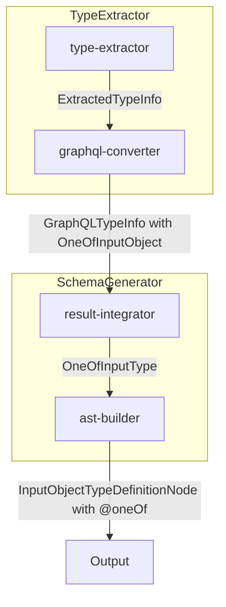
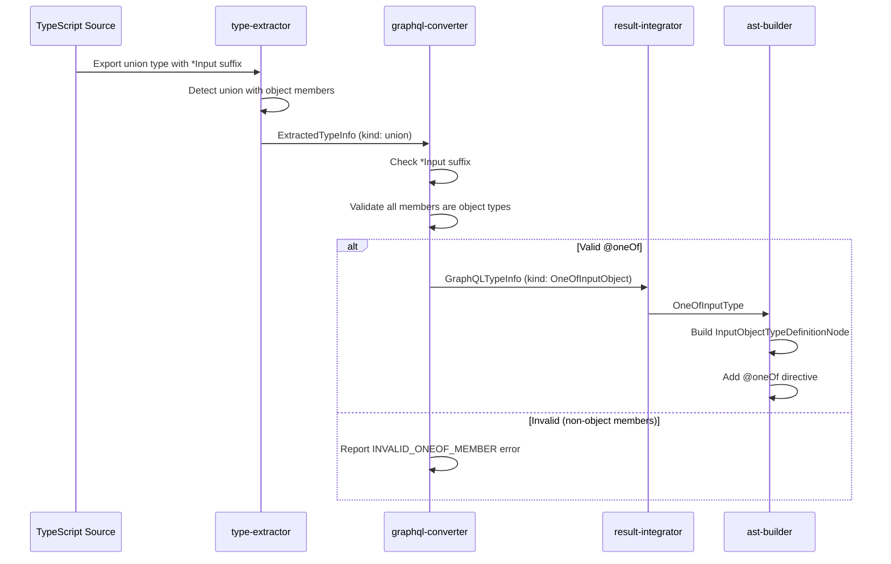
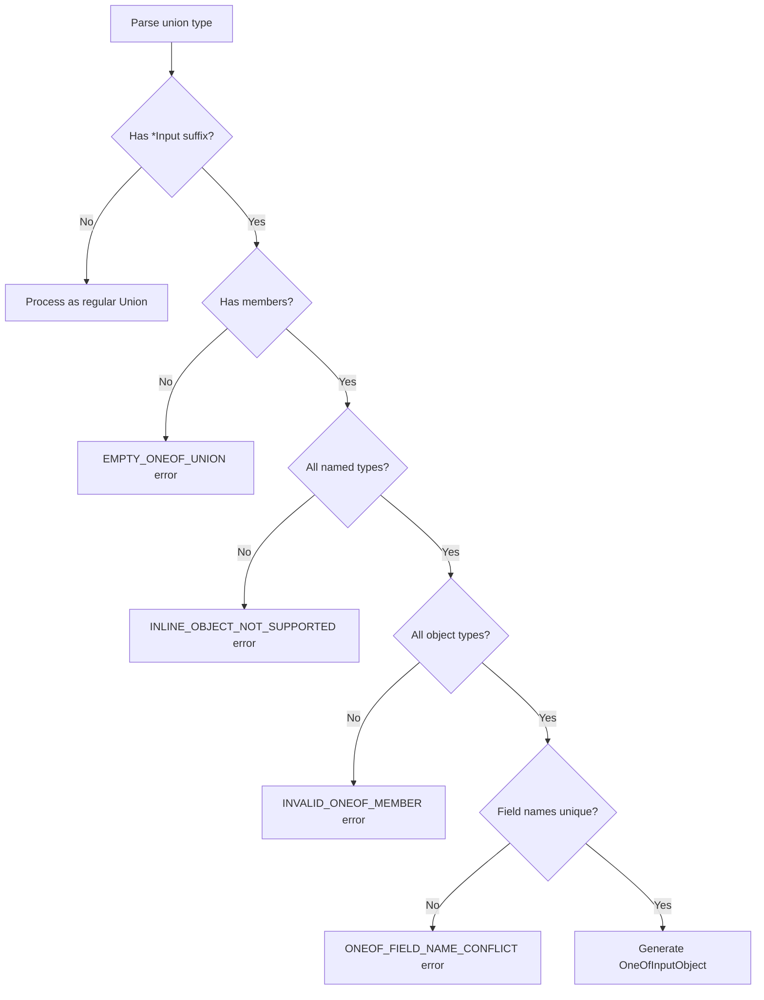

# Technical Design Document

## Overview

**Purpose**: 本機能は、gqlkit の型抽出・スキーマ生成パイプラインを拡張し、TypeScript の union 型を GraphQL `@oneOf` Input Object として変換する機能を提供する。

**Users**: gqlkit を使用する開発者が、TypeScript の union 型を使用して「複数の入力パターンのうち1つだけを指定する」という GraphQL セマンティクスを表現できるようになる。

**Impact**: 既存の type-extractor と schema-generator パイプラインを拡張し、`*Input` suffix を持つ union 型を `@oneOf` directive 付き Input Object として生成する。現在この組み合わせはエラーとして処理されているため、既存動作を置き換える形となる。

### Goals

- TypeScript の `*Input` suffix union 型を GraphQL `@oneOf` Input Object として認識・生成する
- union メンバー型を適切にフィールド定義に展開する
- 無効な定義に対して明確なエラー報告を行う
- TSDoc コメントを `@oneOf` Input Object に継承する

### Non-Goals

- `@oneOf` directive のランタイムバリデーション実装（graphql-js が担当）
- Output type での union 型変換（既存の Union type 生成は維持）
- Subscription 対応（現時点では gqlkit のスコープ外）
- Inline object literal 型のサポート（明示的な named type 定義を要求）

## Architecture

### Existing Architecture Analysis

現在のパイプラインでは以下の制約がある：

- `type-extractor/converter/graphql-converter.ts` が `*Input` suffix を持つ union 型をエラーとして拒否している
- union 型は `kind: "union"` として抽出され、`unionMembers` にメンバー名が格納される
- `schema-generator/builder/ast-builder.ts` は `InputObjectTypeDefinitionNode` を生成するが、directive サポートがない

### Architecture Pattern & Boundary Map



**Architecture Integration**:

- **Selected pattern**: Pipeline extension（既存のパイプラインステージを拡張）
- **Domain/feature boundaries**: type-extractor は認識ロジック、schema-generator は AST 生成ロジックを担当
- **Existing patterns preserved**: GraphQL kind による型分類、Diagnostic による統一的なエラー報告
- **New components rationale**: 新規コンポーネントは不要、既存コンポーネントの拡張で対応
- **Steering compliance**: Convention-driven design、Fail-fast validation、TSDoc extraction の原則を維持

### Technology Stack

| Layer | Choice / Version | Role in Feature | Notes |
|-------|------------------|-----------------|-------|
| Backend / Services | TypeScript 5.9+ | 型抽出・スキーマ生成 | strict mode 維持 |
| Data / Storage | graphql-js | AST 生成・directive 定義 | `Kind.DIRECTIVE` を使用 |

## System Flows

### @oneOf Input Object 生成フロー



**Key Decisions**:

- union 型の判定は type-extractor で行い、`*Input` suffix の判定と変換は graphql-converter で行う
- メンバー型がすべて object 型であることの検証は graphql-converter で実施
- フィールド名は union メンバー型名を camelCase に変換して生成

## Requirements Traceability

| Requirement | Summary | Components | Interfaces | Flows |
|-------------|---------|------------|------------|-------|
| 1.1 | *Input suffix union 型の識別 | graphql-converter | ConversionResult | Detection flow |
| 1.2 | 全メンバーが object 型の検証 | graphql-converter | Diagnostic | Validation flow |
| 1.3 | non-object メンバーの拒否 | graphql-converter | Diagnostic | Validation flow |
| 2.1 | union メンバーをフィールドとして展開 | graphql-converter, ast-builder | GraphQLTypeInfo | Generation flow |
| 2.2 | @oneOf directive の付与 | ast-builder | InputObjectTypeDefinitionNode | AST building |
| 2.3 | フィールド名の camelCase 変換 | graphql-converter | FieldInfo | Field mapping |
| 2.4 | フィールドの nullable 生成 | ast-builder | TypeNode | AST building |
| 3.1 | オブジェクト型メンバーの展開 | graphql-converter | GraphQLFieldType | Type conversion |
| 3.2 | *Input suffix メンバーの参照生成 | graphql-converter | GraphQLFieldType | Type reference |
| 3.3 | inline object literal 型の処理 | graphql-converter | Diagnostic | Validation flow (error: not supported) |
| 4.1 | 空の union エラー | graphql-converter | Diagnostic | Validation flow |
| 4.2 | フィールド名衝突エラー | graphql-converter | Diagnostic | Validation flow |
| 4.3 | 型参照解決エラー | type-extractor | Diagnostic | Validation flow |
| 4.4 | 診断情報の出力 | gen-orchestrator | DiagnosticReporter | Error reporting |
| 5.1 | union 型の TSDoc 継承 | graphql-converter, ast-builder | description | Documentation |
| 5.2 | メンバー型の TSDoc 継承 | graphql-converter | FieldInfo.description | Documentation |
| 5.3 | @deprecated directive 継承 | ast-builder | ConstDirectiveNode | Directive handling |

## Components and Interfaces

| Component | Domain/Layer | Intent | Req Coverage | Key Dependencies (P0/P1) | Contracts |
|-----------|--------------|--------|--------------|--------------------------|-----------|
| graphql-converter | type-extractor | union 型を @oneOf InputObject に変換 | 1.1-1.3, 2.1, 2.3, 3.1-3.3, 4.1-4.2, 5.1-5.2 | type-extractor (P0) | Service |
| ast-builder | schema-generator | @oneOf directive 付き AST 生成 | 2.2, 2.4, 5.1, 5.3 | graphql-js (P0) | Service |
| diagnostics | type-extractor | @oneOf 関連エラーコード定義 | 4.1-4.3 | - | State |

### Type Extractor Layer

#### graphql-converter

| Field | Detail |
|-------|--------|
| Intent | TypeScript 型情報を GraphQL 型情報に変換し、@oneOf Input Object を識別する |
| Requirements | 1.1, 1.2, 1.3, 2.1, 2.3, 3.1, 3.2, 3.3, 4.1, 4.2, 5.1, 5.2 |

**Responsibilities & Constraints**

- `*Input` suffix を持つ union 型を `OneOfInputObject` として識別
- union メンバーがすべて object 型であることを検証
- メンバー型名を camelCase フィールド名に変換
- 各メンバー型を nullable フィールドの型として設定
- TSDoc コメントを description として継承

**Dependencies**

- Inbound: type-extractor — ExtractedTypeInfo を受け取る (P0)
- Outbound: types/graphql — GraphQLTypeInfo を出力 (P0)
- Outbound: types/diagnostics — Diagnostic を出力 (P0)

**Contracts**: Service [x] / API [ ] / Event [ ] / Batch [ ] / State [ ]

##### Service Interface

```typescript
interface OneOfFieldInfo {
  readonly name: string;
  readonly type: GraphQLFieldType;
  readonly memberTypeName: string;
  readonly description: string | null;
  readonly deprecated: DeprecationInfo | null;
}

interface OneOfInputObjectInfo {
  readonly name: string;
  readonly fields: ReadonlyArray<OneOfFieldInfo>;
  readonly sourceFile: string;
  readonly description: string | null;
  readonly deprecated: DeprecationInfo | null;
}
```

- Preconditions: ExtractedTypeInfo の metadata.kind が "union" かつ name が `*Input` suffix
- Postconditions: GraphQLTypeInfo の kind が "OneOfInputObject" として設定される
- Invariants: 全フィールドは nullable として生成される

**Implementation Notes**

- Integration: 既存の `convertToGraphQL` 関数内で union 型の分岐を拡張
- Validation: メンバー型の検証を union 変換前に実施
- Inline object literal: サポート外としてエラーを報告（`INLINE_OBJECT_NOT_SUPPORTED`）。明示的な named type 定義を要求する

#### diagnostics

| Field | Detail |
|-------|--------|
| Intent | @oneOf 関連の診断エラーコードを定義 |
| Requirements | 4.1, 4.2, 4.3 |

**Contracts**: Service [ ] / API [ ] / Event [ ] / Batch [ ] / State [x]

##### State Management

新規 DiagnosticCode の追加：

```typescript
type DiagnosticCode =
  // ... existing codes
  | "EMPTY_ONEOF_UNION"           // 4.1: 空の union
  | "ONEOF_FIELD_NAME_CONFLICT"   // 4.2: フィールド名衝突
  | "INVALID_ONEOF_MEMBER"        // 1.3: non-object メンバー
  | "INLINE_OBJECT_NOT_SUPPORTED"; // 3.3: inline object literal はサポート外
```

### Schema Generator Layer

#### ast-builder

| Field | Detail |
|-------|--------|
| Intent | @oneOf directive 付きの InputObjectTypeDefinitionNode を生成 |
| Requirements | 2.2, 2.4, 5.1, 5.3 |

**Responsibilities & Constraints**

- `OneOfInputObject` 型に対して `@oneOf` directive を付与
- 全フィールドを nullable（NonNull でラップしない）として生成
- description と @deprecated directive を適切に設定

**Dependencies**

- Inbound: result-integrator — OneOfInputType を受け取る (P0)
- External: graphql-js — Kind, ConstDirectiveNode を使用 (P0)

**Contracts**: Service [x] / API [ ] / Event [ ] / Batch [ ] / State [ ]

##### Service Interface

```typescript
function buildOneOfDirective(): ConstDirectiveNode {
  return {
    kind: Kind.DIRECTIVE,
    name: { kind: Kind.NAME, value: "oneOf" },
  };
}

function buildOneOfInputObjectTypeDefinitionNode(
  inputType: OneOfInputType,
  sourceRoot?: string,
): InputObjectTypeDefinitionNode {
  // ... implementation
}
```

- Preconditions: inputType.isOneOf が true
- Postconditions: 生成された InputObjectTypeDefinitionNode に `@oneOf` directive が含まれる
- Invariants: 全フィールドの type は nullable（NamedTypeNode）

**Implementation Notes**

- Integration: `buildDocumentNode` 関数内で oneOf Input Type の分岐を追加
- Validation: フィールドが NonNullType でないことを保証
- Risks: graphql-js の @oneOf サポートバージョンを確認する必要がある

## Data Models

### Domain Model

#### OneOfInputType

```typescript
interface OneOfInputType {
  readonly name: string;
  readonly isOneOf: true;
  readonly fields: ReadonlyArray<BaseField>;
  readonly sourceFile: string;
  readonly description: string | null;
  readonly deprecated: DeprecationInfo | null;
}
```

**Business Rules & Invariants**:

- `isOneOf` フラグは常に `true`
- `fields` は少なくとも1つ以上のメンバーを持つ
- 全フィールドの `type.nullable` は `true`
- フィールド名は一意である

### Logical Data Model

#### GraphQLTypeKind の拡張

```typescript
type GraphQLTypeKind = "Object" | "Union" | "Enum" | "InputObject" | "OneOfInputObject";
```

#### IntegratedResult の拡張

```typescript
interface IntegratedResult {
  // ... existing fields
  readonly inputTypes: ReadonlyArray<InputType>;
  readonly oneOfInputTypes: ReadonlyArray<OneOfInputType>;
  // ...
}
```

代替案として、既存の `InputType` に `isOneOf: boolean` フラグを追加する方法も検討可能。

### Data Contracts & Integration

#### Field Name Transformation

union メンバー型名からフィールド名への変換ルール：

| Member Type Name | Field Name |
|------------------|------------|
| `Foo` | `foo` |
| `FooBar` | `fooBar` |
| `FooBarInput` | `fooBarInput` |

変換関数：

```typescript
function toFieldName(typeName: string): string {
  return typeName.charAt(0).toLowerCase() + typeName.slice(1);
}
```

## Error Handling

### Error Strategy

@oneOf 関連のエラーは既存の Diagnostic インフラを使用し、早期検出・明確なメッセージを提供する。

### Error Categories and Responses

**User Errors (Validation)**:

| Error Code | Condition | Message Template |
|------------|-----------|------------------|
| `EMPTY_ONEOF_UNION` | union メンバーが空 | `OneOf input object '{name}' must have at least one member type` |
| `ONEOF_FIELD_NAME_CONFLICT` | フィールド名が重複 | `OneOf input object '{name}' has duplicate field name '{fieldName}' from types '{type1}' and '{type2}'` |
| `INVALID_ONEOF_MEMBER` | non-object メンバー | `OneOf input object '{name}' contains non-object member type '{memberType}'. All members must be object types.` |
| `INLINE_OBJECT_NOT_SUPPORTED` | inline object literal | `OneOf input object '{name}' contains inline object literal type. Please define a named type instead.` |

**Process Flow**:



### Monitoring

既存の gen-orchestrator の DiagnosticReporter を使用してエラーを報告。ファイルパス・行番号を含む診断情報を出力する。

## Testing Strategy

### Unit Tests

- `graphql-converter.test.ts`:
  - 有効な @oneOf union 型の変換
  - non-object メンバーを含む union のエラー検出
  - 空の union のエラー検出
  - フィールド名衝突のエラー検出
  - TSDoc コメントの継承

- `ast-builder.test.ts`:
  - @oneOf directive の生成
  - nullable フィールドの生成
  - description の設定

### Integration Tests (Golden File)

- `packages/cli/src/gen-orchestrator/testdata/` に新規テストケース追加:
  - `oneof-basic/`: 基本的な @oneOf Input Object 生成
  - `oneof-nested/`: ネストした Input Object を含む @oneOf
  - `oneof-with-docs/`: TSDoc 付き @oneOf
  - `oneof-errors/`: 各種エラーケース

### E2E/UI Tests

- 該当なし（CLI ツールのため）

### Performance/Load

- 該当なし（ビルド時ツールのため、パフォーマンス要件は既存と同等）

## Supporting References

### GraphQL @oneOf Specification

GraphQL spec では `@oneOf` directive は以下のセマンティクスを持つ：

- Input Object の全フィールドは nullable でなければならない
- クライアントは正確に1つのフィールドのみを指定する必要がある
- 指定されたフィールドの値は null であってはならない

参照: [GraphQL OneOf Input Objects](https://www.graphql-js.org/docs/oneof-input-objects/)

### graphql-js Implementation

```javascript
const ProductSpecifier = new GraphQLInputObjectType({
  name: 'ProductSpecifier',
  isOneOf: true,
  fields: {
    id: { type: GraphQLID },
    name: { type: GraphQLString },
  },
});
```

SDL 出力:

```graphql
input ProductSpecifier @oneOf {
  id: ID
  name: String
}
```
