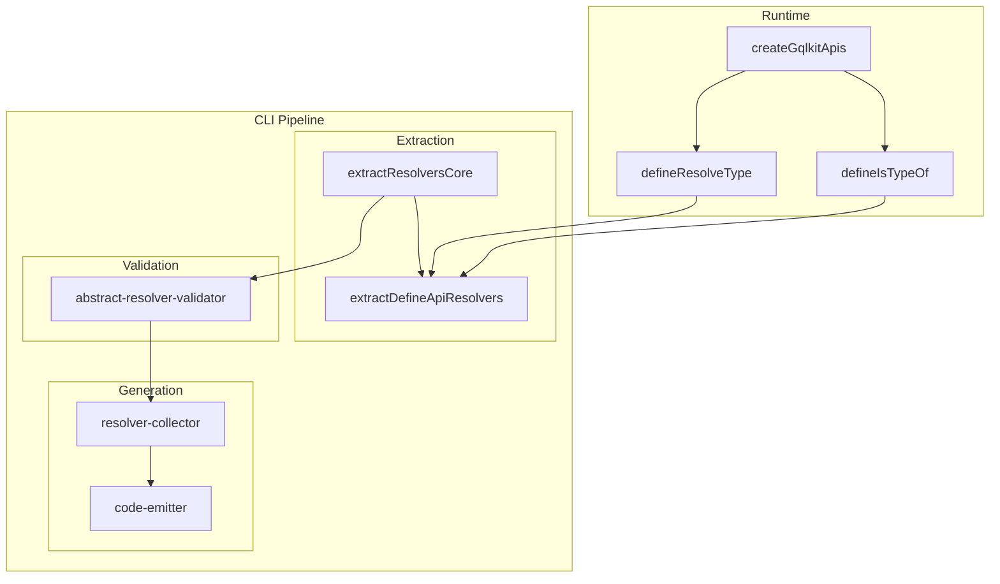
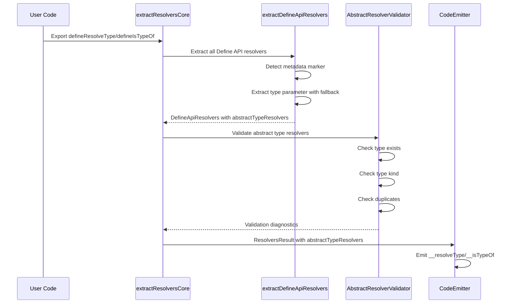
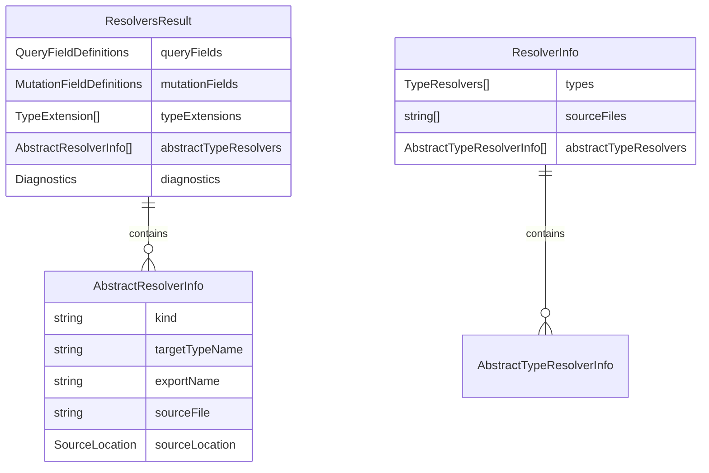

# Technical Design Document

## Overview

**Purpose**: 本機能は GraphQL の union 型および interface 型（抽象型）に対する型解決関数（`resolveType`、`isTypeOf`）を gqlkit の Define API パターンで定義できるようにする。

**Users**: GraphQL 開発者は `defineResolveType<TAbstract>` と `defineIsTypeOf<TObject>` を使用して、実行時の型解決ロジックを型安全に定義する。

**Impact**: 既存の `@gqlkit-ts/runtime` と CLI パイプライン（resolver-extractor、schema-generator）を拡張し、抽象型リゾルバの定義・抽出・resolver map 統合を実現する。

### Goals

- 既存の Define API パターン（`defineQuery`, `defineMutation`, `defineField`）と一貫性のある API を提供
- 型安全な抽象型リゾルバ定義（型パラメータから対象型を推論）
- graphql-tools の `makeExecutableSchema` と互換性のある resolver map 出力
- 実行時エラーを防ぐための包括的なバリデーション

### Non-Goals

- 抽象型リゾルバの自動生成（ユーザーが明示的に定義する必要がある）
- `__typename` フィールドの自動付与
- 実行時の型判定ロジックの提供（ユーザー実装に委ねる）

## Architecture

### Architecture Pattern & Boundary Map

既存の gqlkit パイプラインアーキテクチャを踏襲し、以下の拡張を行う。抽象型リゾルバの抽出は独立したステップではなく、既存の `extractResolversCore` 内に統合する。



**Architecture Integration**:
- **Selected pattern**: 既存のパイプラインアーキテクチャを拡張（`extractResolversCore` 内統合）
- **Domain boundaries**: runtime（API 定義）/ cli extraction（解析）/ cli validation（検証）/ cli generation（出力）
- **Existing patterns preserved**: メタデータ埋め込み、型パラメータ解析、resolver map 構造
- **Steering compliance**: Define API パターン、TypeScript strict mode、graphql-tools 互換
- **Validator placement**: `resolver-extractor/validator/` ディレクトリ（`only-validator.ts` と同階層）

### Technology Stack

| Layer | Choice / Version | Role in Feature | Notes |
|-------|------------------|-----------------|-------|
| Runtime | @gqlkit-ts/runtime | Define API 関数の提供 | 既存パッケージ拡張 |
| CLI | @gqlkit-ts/cli | 抽出・検証・生成パイプライン | 既存パッケージ拡張 |
| TypeScript | 5.9+ | 型解析・メタデータ抽出 | ts.TypeChecker 使用 |
| GraphQL | graphql-js | 型定義参照 | GraphQLResolveInfo 型 |

## System Flows

### Abstract Type Resolver Extraction Flow



## Requirements Traceability

| Requirement | Summary | Components | Interfaces | Flows |
|-------------|---------|------------|------------|-------|
| 1.1-1.4 | defineResolveType API | Runtime | ResolveTypeResolver | - |
| 2.1-2.4 | defineIsTypeOf API | Runtime | IsTypeOfResolver | - |
| 3.1-3.4 | GqlkitApis 統合 | Runtime | GqlkitApis | - |
| 4.1-4.5 | CLI による抽出 | extractDefineApiResolvers (Extended) | ExtractResolversResult | Extraction Flow |
| 5.1-5.4 | Resolver Map 統合 | ResolverCollector, CodeEmitter | ResolverInfo | Extraction Flow |
| 6.1-6.4 | 型参照の検証 | AbstractResolverValidator | Diagnostic | Extraction Flow |
| 7.1-7.3 | 重複定義の検出 | AbstractResolverValidator | Diagnostic | Extraction Flow |
| 8.1-8.4 | エラーメッセージ品質 | AbstractResolverValidator | Diagnostic | - |
| 9.1-9.4 | 未定義時の警告 | AbstractResolverValidator | Diagnostic | - |
| 10.1-10.3 | 命名規則 | - | - | - |

## Components and Interfaces

| Component | Domain/Layer | Intent | Req Coverage | Key Dependencies | Contracts |
|-----------|--------------|--------|--------------|------------------|-----------|
| Runtime Types | runtime | 抽象型リゾルバの型定義 | 1, 2, 3 | graphql-js (P0) | Service |
| extractDefineApiResolvers (Extended) | cli/extraction | 抽象型リゾルバの抽出（既存関数を拡張） | 4 | TypeScript (P0), constants (P1) | Service |
| AbstractResolverValidator | cli/validation | 型参照・重複の検証 | 6, 7, 8, 9 | ExtractTypesResult (P0) | Service |
| ResolverCollector (Extended) | cli/generation | 抽象型リゾルバ情報の収集 | 5 | ResolversResult (P0) | Service |
| CodeEmitter (Extended) | cli/generation | __resolveType/__isTypeOf の出力 | 5, 8 | ResolverInfo (P0) | Service |

### Runtime

#### Runtime Types

| Field | Detail |
|-------|--------|
| Intent | 抽象型リゾルバの型定義とメタデータ埋め込み |
| Requirements | 1.1-1.4, 2.1-2.4, 3.1-3.4 |

**Responsibilities & Constraints**
- `ResolveTypeResolverFn` と `IsTypeOfResolverFn` の関数型定義
- メタデータ埋め込み型（`ResolveTypeResolver`, `IsTypeOfResolver`）の提供
- `GqlkitApis` インターフェースへの `defineResolveType`, `defineIsTypeOf` 追加

**Dependencies**
- Inbound: ユーザーコード - API 使用 (P0)
- External: graphql-js - GraphQLResolveInfo 型 (P0)

**Contracts**: Service [x]

##### Service Interface

```typescript
/**
 * 抽象型リゾルバの種類
 */
type AbstractResolverKind = "resolveType" | "isTypeOf";

/**
 * 抽象型リゾルバのメタデータ構造
 */
interface AbstractResolverMetadataShape {
  readonly kind: AbstractResolverKind;
  readonly targetType: unknown;
}

/**
 * resolveType リゾルバ関数の型
 * @typeParam TAbstract - 対象の union/interface 型
 * @typeParam TContext - コンテキスト型
 */
type ResolveTypeResolverFn<TAbstract, TContext = unknown> = (
  value: TAbstract,
  context: TContext,
  info: GraphQLResolveInfo,
) => string | Promise<string>;

/**
 * isTypeOf リゾルバ関数の型
 * @typeParam TObject - 対象の object 型
 * @typeParam TContext - コンテキスト型
 */
type IsTypeOfResolverFn<TObject, TContext = unknown> = (
  value: unknown,
  context: TContext,
  info: GraphQLResolveInfo,
) => boolean | Promise<boolean>;

/**
 * メタデータ埋め込み済み resolveType リゾルバ
 */
type ResolveTypeResolver<TAbstract, TContext = unknown> =
  ResolveTypeResolverFn<TAbstract, TContext> & {
    " $gqlkitAbstractResolver"?: {
      kind: "resolveType";
      targetType: TAbstract;
    };
  };

/**
 * メタデータ埋め込み済み isTypeOf リゾルバ
 */
type IsTypeOfResolver<TObject, TContext = unknown> =
  IsTypeOfResolverFn<TObject, TContext> & {
    " $gqlkitAbstractResolver"?: {
      kind: "isTypeOf";
      targetType: TObject;
    };
  };

/**
 * GqlkitApis インターフェース（拡張）
 */
interface GqlkitApis<TContext> {
  // 既存の defineQuery, defineMutation, defineField...

  /**
   * union/interface 型に対する resolveType リゾルバを定義
   * @typeParam TAbstract - 対象の抽象型
   */
  defineResolveType: <TAbstract>(
    resolver: ResolveTypeResolverFn<TAbstract, TContext>,
  ) => ResolveTypeResolver<TAbstract, TContext>;

  /**
   * object 型に対する isTypeOf リゾルバを定義
   * @typeParam TObject - 対象の object 型
   */
  defineIsTypeOf: <TObject>(
    resolver: IsTypeOfResolverFn<TObject, TContext>,
  ) => IsTypeOfResolver<TObject, TContext>;
}
```

**Implementation Notes**
- メタデータプロパティ名: ` $gqlkitAbstractResolver`（スペースプレフィックス、既存パターン踏襲）
- 実行時には単にリゾルバ関数をそのまま返す（型情報のみ付与）
- `TAbstract` / `TObject` は型パラメータとして受け取り、CLI で抽出時に解析

### CLI / Extraction

#### extractDefineApiResolvers (Extended)

| Field | Detail |
|-------|--------|
| Intent | 既存のリゾルバ抽出関数を拡張し、抽象型リゾルバも抽出 |
| Requirements | 4.1-4.5 |

**Responsibilities & Constraints**
- 既存の `defineQuery`, `defineMutation`, `defineField` 抽出に加え、`defineResolveType`, `defineIsTypeOf` も抽出
- `$gqlkitAbstractResolver` メタデータマーカーの検出
- 型パラメータから対象型名の抽出
- ソースロケーション情報の記録
- エクスポート名の収集

**Dependencies**
- Inbound: extractResolversCore - パイプライン呼び出し (P0)
- Outbound: constants - メタデータプロパティ名、isInternalTypeSymbol (P1)
- External: TypeScript - ts.TypeChecker, ts.Program (P0)

**Contracts**: Service [x]

##### Service Interface

```typescript
/**
 * 抽出された抽象型リゾルバ情報
 */
interface AbstractResolverInfo {
  /** リゾルバの種類 */
  readonly kind: "resolveType" | "isTypeOf";
  /** 対象の型名 */
  readonly targetTypeName: string;
  /** エクスポート名 */
  readonly exportName: string;
  /** ソースファイルパス */
  readonly sourceFile: string;
  /** ソース位置（行番号等） */
  readonly sourceLocation: SourceLocation;
}

/**
 * 既存の DefineApiExtractionResult を拡張
 */
interface DefineApiExtractionResult {
  readonly resolvers: ReadonlyArray<DefineApiResolver>;
  /** 抽象型リゾルバ（新規追加） */
  readonly abstractTypeResolvers: ReadonlyArray<AbstractResolverInfo>;
  readonly diagnostics: ReadonlyArray<Diagnostic>;
}
```

- Preconditions: program は有効な TypeScript Program、files は schema ディレクトリ内のファイルパス
- Postconditions: すべてのエクスポートされた抽象型リゾルバが abstractTypeResolvers に含まれる
- Invariants: 各 resolver の targetTypeName は空文字列でない

**Implementation Notes**
- 検出ロジック: 既存の `detectResolverFromMetadataType` パターンを参考に実装
- 型パラメータ抽出: `checker.getTypeAtLocation` で返り値型を取得し、メタデータプロパティから `targetType` の型を解析
- **型名解決（エッジケース対応）**:
  1. `type.aliasSymbol?.getName()` または `type.symbol?.getName()` で型名取得を試行
  2. 取得した symbolName に対して `isInternalTypeSymbol(symbolName)` でチェック
  3. 内部型（`__type` など）の場合は `checker.typeToString(type)` にフォールバック
  4. これにより、複雑な型操作で元の型名が失われた場合でも正しい型名を取得可能

### CLI / Validation

#### AbstractResolverValidator

| Field | Detail |
|-------|--------|
| Intent | 抽象型リゾルバの型参照・重複・未定義の検証 |
| Requirements | 6.1-6.4, 7.1-7.3, 8.1-8.4, 9.1-9.4 |
| Location | `packages/cli/src/resolver-extractor/validator/abstract-resolver-validator.ts` |

**Responsibilities & Constraints**
- 参照される型のスキーマ存在確認
- 型の種類（union/interface/object）の妥当性検証
- 同一型に対する重複定義の検出
- 抽象型に対するリゾルバ未定義の警告生成

**Dependencies**
- Inbound: extractResolversCore - 検証呼び出し (P0)
- Outbound: ExtractTypesResult - 型情報参照 (P0)
- Outbound: AbstractResolverInfo - 検証対象 (P0)

**Contracts**: Service [x]

##### Service Interface

```typescript
/**
 * 検証オプション
 */
interface ValidateAbstractResolversOptions {
  /** 抽出された抽象型リゾルバ */
  readonly abstractResolvers: ReadonlyArray<AbstractResolverInfo>;
  /** 抽出された型情報 */
  readonly types: ReadonlyArray<ExtractedTypeInfo>;
  /** 統合済みの基本型情報 */
  readonly baseTypes: ReadonlyArray<BaseType>;
}

/**
 * 検証結果
 */
interface ValidateAbstractResolversResult {
  /** 診断情報（エラー・警告） */
  readonly diagnostics: ReadonlyArray<Diagnostic>;
}

/**
 * 抽象型リゾルバを検証する
 */
function validateAbstractResolvers(
  options: ValidateAbstractResolversOptions,
): ValidateAbstractResolversResult;
```

**Diagnostic Codes**:
- `UNKNOWN_ABSTRACT_TYPE`: 参照された型がスキーマに存在しない
- `INVALID_ABSTRACT_TYPE_KIND`: resolveType で参照された型が union/interface でない
- `INVALID_OBJECT_TYPE_KIND`: isTypeOf で参照された型が object でない
- `DUPLICATE_RESOLVE_TYPE`: 同一 union/interface に対する複数の resolveType 定義
- `DUPLICATE_IS_TYPE_OF`: 同一 object に対する複数の isTypeOf 定義
- `MISSING_ABSTRACT_TYPE_RESOLVER`: union/interface に resolveType も isTypeOf も未定義（警告）

**Implementation Notes**
- ファイル配置: `resolver-extractor/validator/` ディレクトリに配置（`only-validator.ts` と同じパターンに従う）
- 型存在検証: baseTypes から名前検索
- 重複検出: Map でグループ化し、length > 1 をエラー報告
- 未定義警告: union/interface 型をスキャンし、resolveType がなく、かつ構成/実装型すべてに isTypeOf がない場合に警告

### CLI / Generation

#### ResolversResult (Extended)

| Field | Detail |
|-------|--------|
| Intent | リゾルバ抽出結果に抽象型リゾルバを追加 |
| Requirements | 4.5 |

**Contracts**: Service [x]

##### Service Interface

```typescript
/**
 * ResolversResult（拡張）
 * extractResolversCore の戻り値型
 */
interface ResolversResult {
  readonly queryFields: QueryFieldDefinitions;
  readonly mutationFields: MutationFieldDefinitions;
  readonly typeExtensions: ReadonlyArray<TypeExtension>;
  /** 抽象型リゾルバ（新規追加） */
  readonly abstractTypeResolvers: ReadonlyArray<AbstractResolverInfo>;
  readonly diagnostics: Diagnostics;
}
```

#### ResolverCollector (Extended)

| Field | Detail |
|-------|--------|
| Intent | 抽象型リゾルバ情報の収集と構造化 |
| Requirements | 5.1-5.4 |

**Contracts**: Service [x]

##### Service Interface

```typescript
/**
 * 抽象型リゾルバ情報
 */
interface AbstractTypeResolverInfo {
  /** 対象の型名 */
  readonly typeName: string;
  /** リゾルバの種類（__resolveType または __isTypeOf） */
  readonly resolverKey: "__resolveType" | "__isTypeOf";
  /** ソースファイル */
  readonly sourceFile: string;
  /** エクスポート名 */
  readonly exportName: string;
}

/**
 * ResolverInfo（拡張）
 */
interface ResolverInfo {
  readonly types: ReadonlyArray<TypeResolvers>;
  readonly sourceFiles: ReadonlyArray<string>;
  /** 抽象型リゾルバ（新規追加） */
  readonly abstractTypeResolvers: ReadonlyArray<AbstractTypeResolverInfo>;
}
```

#### CodeEmitter (Extended)

| Field | Detail |
|-------|--------|
| Intent | __resolveType と __isTypeOf を含む resolver map コードの生成 |
| Requirements | 5.1-5.4 |

**Contracts**: Service [x]

##### Service Interface

生成される resolver map の形式:

```typescript
export function createResolvers() {
  return {
    Query: {
      // 既存のクエリリゾルバ
    },
    // Union 型の例
    SearchResult: {
      __resolveType: searchResultResolveType,
    },
    // Interface 型の例
    Node: {
      __resolveType: nodeResolveType,
    },
    // Object 型の例（isTypeOf 使用時）
    User: {
      // 既存のフィールドリゾルバ
      posts: userPosts,
      __isTypeOf: userIsTypeOf,
    },
  };
}
```

**Implementation Notes**
- 抽象型リゾルバのインポート生成
- 既存の型リゾルバオブジェクトへの `__resolveType` / `__isTypeOf` プロパティ追加
- Object 型に既存フィールドリゾルバがある場合はマージ

## Data Models

### Domain Model

**Entities**:
- `AbstractResolverInfo`: 抽出された抽象型リゾルバ情報
- `AbstractTypeResolverInfo`: 生成用に構造化された抽象型リゾルバ情報

**Value Objects**:
- `AbstractResolverKind`: "resolveType" | "isTypeOf"
- `SourceLocation`: { file, line, column }

**Invariants**:
- 各 union/interface 型に対して最大1つの resolveType
- 各 object 型に対して最大1つの isTypeOf
- targetTypeName は有効な GraphQL 型名

### Logical Data Model



## Error Handling

### Error Categories and Responses

**Validation Errors** (code generation blocked):
- `UNKNOWN_ABSTRACT_TYPE`: 型 '{typeName}' はスキーマに存在しません (file:line)
- `INVALID_ABSTRACT_TYPE_KIND`: 型 '{typeName}' は union または interface ではありません。resolveType は抽象型に対してのみ使用できます (file:line)
- `INVALID_OBJECT_TYPE_KIND`: 型 '{typeName}' は object 型ではありません。isTypeOf は object 型に対してのみ使用できます (file:line)
- `DUPLICATE_RESOLVE_TYPE`: 型 '{typeName}' に対して複数の resolveType が定義されています: {locations}
- `DUPLICATE_IS_TYPE_OF`: 型 '{typeName}' に対して複数の isTypeOf が定義されています: {locations}

**Validation Warnings** (code generation continues):
- `MISSING_ABSTRACT_TYPE_RESOLVER`: Union 型 '{typeName}' には resolveType が定義されておらず、構成する型にも isTypeOf が定義されていません。実行時エラーを防ぐため、resolveType を定義するか、各構成型に isTypeOf を定義してください。

### Error Message Format

既存の gqlkit 診断パターンに従う:
```
{TypeName}.{fieldName}: {message}
  at {filePath}:{line}:{column}
```

重複エラーの場合:
```
Type 'SearchResult' に対して複数の resolveType が定義されています:
  - searchResultResolveType at src/gqlkit/schema/search.ts:15:1
  - anotherResolveType at src/gqlkit/schema/other.ts:8:1
```

## Testing Strategy

### Golden File Tests

テストケースを `packages/cli/src/gen-orchestrator/testdata/` に追加:

| Test Case | Description | Coverage |
|-----------|-------------|----------|
| `abstract-resolver-basic` | 基本的な resolveType と isTypeOf 定義 | 1, 2, 3, 4, 5 |
| `abstract-resolver-union` | union 型に対する resolveType | 1, 5.1 |
| `abstract-resolver-interface` | interface 型に対する resolveType | 1, 5.2 |
| `abstract-resolver-is-type-of` | object 型に対する isTypeOf | 2, 5.3 |
| `abstract-resolver-mixed` | resolveType と isTypeOf の混在 | 1, 2, 5 |
| `abstract-resolver-error-unknown-type` | 存在しない型参照エラー | 6.1, 6.3, 8.1 |
| `abstract-resolver-error-invalid-kind` | 型種類の不一致エラー | 6.2, 6.4, 8.2 |
| `abstract-resolver-error-duplicate` | 重複定義エラー | 7.1, 7.2, 7.3, 8.3 |
| `abstract-resolver-warning-missing` | 未定義警告 | 9.1, 9.2, 9.3, 9.4 |

### Unit Tests

- `packages/runtime/src/index.test.ts`: createGqlkitApis の型テスト（defineResolveType、defineIsTypeOf の追加）
- `packages/cli/src/resolver-extractor/extractor/define-api-extractor.test.ts`: 抽象型リゾルバ抽出ロジックのテスト（既存テストへ追加）
- `packages/cli/src/resolver-extractor/validator/abstract-resolver-validator.test.ts`: 検証ロジックのテスト（only-validator.test.ts と同様のパターン）

## Supporting References

### graphql-tools Resolver Map Format

graphql-tools の `makeExecutableSchema` では以下の形式で抽象型リゾルバを定義する:

```javascript
const resolvers = {
  Animal: {
    __resolveType: (obj) => obj.constructor.name
  },
  Dog: {
    __isTypeOf: (obj) => obj instanceof Dog
  }
}
```

参考: [GraphQL Tools Resolvers Documentation](https://the-guild.dev/graphql/tools/docs/resolvers)

### Metadata Property Naming Convention

既存のメタデータプロパティ命名規則（スペースプレフィックス）を踏襲:
- ` $gqlkitResolver`: 既存のフィールドリゾルバ用
- ` $gqlkitScalar`: カスタムスカラー用
- ` $gqlkitAbstractResolver`: 抽象型リゾルバ用（新規追加）
