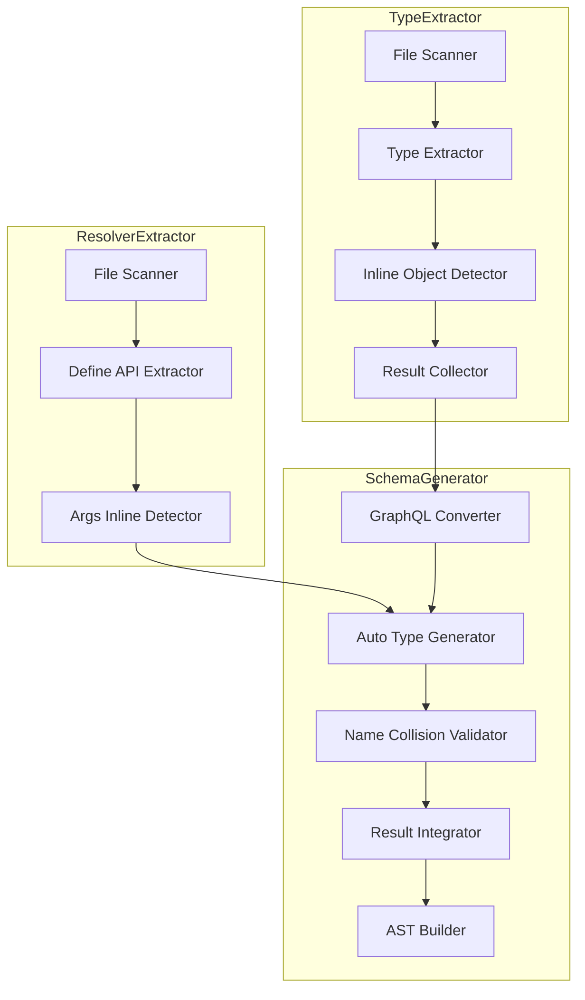
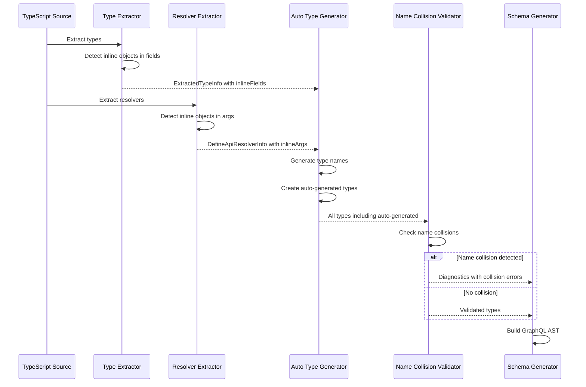
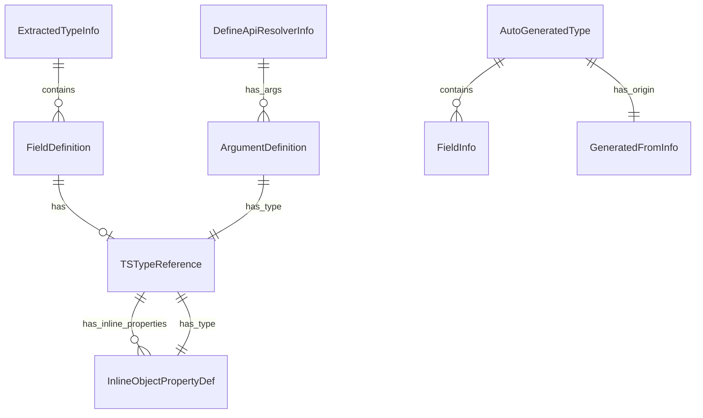

# Design Document: auto-object

## Overview

**Purpose**: 本機能は、TypeScript の inline anonymous object type（インライン無名オブジェクト型）から GraphQL の Object type および Input Object type を自動生成する機能を提供する。

**Users**: gqlkit を使用する開発者が、明示的な型定義なしに nested structure を GraphQL スキーマで表現できるようになる。

**Impact**: 既存の type-extractor、resolver-extractor、schema-generator パイプラインを拡張し、インラインオブジェクト型の検出、命名規則に基づく型名生成、名前衝突検出を追加する。

### Goals

- Object type フィールドのインラインオブジェクト型から自動的に GraphQL Object type を生成する
- Input type フィールドのインラインオブジェクト型から自動的に GraphQL Input Object type を生成する
- Resolver 引数のインラインオブジェクト型から自動的に GraphQL Input Object type を生成する
- 自動生成された型名の衝突を検出し、明確なエラーメッセージを報告する
- 既存機能（TSDoc、GqlFieldDef、nullability 推論）との互換性を維持する

### Non-Goals

- インラインオブジェクト型の命名規則のカスタマイズ（設定ファイルによる上書き）
- 既存の明示的な型定義の自動インライン化
- Union type 内のインラインオブジェクト型の自動生成（oneOf input を除く）

## Architecture

### Existing Architecture Analysis

現在のパイプラインアーキテクチャ:

1. **type-extractor**: TypeScript 型定義から `ExtractedTypeInfo` を抽出
2. **resolver-extractor**: Resolver 定義から `DefineApiResolverInfo` を抽出
3. **graphql-converter**: `ExtractedTypeInfo` を `GraphQLTypeInfo` に変換
4. **result-integrator**: 型とリゾルバーを統合し、検証を実行
5. **schema-generator**: GraphQL AST とリゾルバーマップを生成

**拡張対象**:
- `TSTypeReference` に inline object type を表現する新しい kind を追加
- type-extractor でインラインオブジェクト型の検出と型情報収集
- graphql-converter で自動生成型への変換
- resolver-extractor で引数のインラインオブジェクト型検出
- result-integrator で名前衝突検出

### Architecture Pattern & Boundary Map



**Architecture Integration**:

- **Selected pattern**: Pipeline extension - 既存のパイプラインアーキテクチャを維持しつつ、各ステージにインラインオブジェクト検出機能を追加
- **Domain boundaries**: type-extractor と resolver-extractor でインラインオブジェクト情報を収集し、schema-generator で型生成と検証を実行
- **Existing patterns preserved**: 既存の `TSTypeReference` 構造、`ExtractedTypeInfo` 構造、Diagnostic パターンを継承
- **New components rationale**: Auto Type Generator は自動型名生成ロジックを集約、Name Collision Validator は名前衝突検出を担当
- **Steering compliance**: 既存の convention-driven 設計、fail-fast validation パターンを維持

### Technology Stack

| Layer | Choice / Version | Role in Feature | Notes |
|-------|------------------|-----------------|-------|
| Backend / Services | TypeScript Compiler API | インラインオブジェクト型の解析 | 既存利用を拡張 |

## System Flows

### Inline Object Type Detection and Generation Flow



**Key Decisions**:
- インラインオブジェクト検出は抽出フェーズで実行し、変換フェーズで型生成
- 名前衝突検出は全ての型が収集された後に一括実行

## Requirements Traceability

| Requirement | Summary | Components | Interfaces | Flows |
|-------------|---------|------------|------------|-------|
| 1.1 | Object type フィールドのインラインオブジェクトから Object type 生成 | InlineObjectDetector, AutoTypeGenerator | TSTypeReference, InlineFieldInfo | Detection Flow |
| 1.2 | ネストしたインラインオブジェクトの再帰的処理 | InlineObjectDetector, AutoTypeGenerator | - | Detection Flow |
| 1.3 | 生成型名の衝突検出 | NameCollisionValidator | Diagnostic | Validation Flow |
| 2.1 | Input type フィールドのインラインオブジェクトから Input Object type 生成 | InlineObjectDetector, AutoTypeGenerator | TSTypeReference, InlineFieldInfo | Detection Flow |
| 2.2 | Input type でのネスト再帰処理 | InlineObjectDetector, AutoTypeGenerator | - | Detection Flow |
| 2.3 | Input type での衝突検出 | NameCollisionValidator | Diagnostic | Validation Flow |
| 3.1 | Query/Mutation 引数のインラインオブジェクトから Input Object type 生成 | ArgsInlineDetector, AutoTypeGenerator | InlineArgInfo | Detection Flow |
| 3.2 | Field resolver 引数のインラインオブジェクト処理 | ArgsInlineDetector, AutoTypeGenerator | InlineArgInfo | Detection Flow |
| 3.3 | 引数のネスト再帰処理 | ArgsInlineDetector, AutoTypeGenerator | - | Detection Flow |
| 3.4 | 引数での衝突検出 | NameCollisionValidator | Diagnostic | Validation Flow |
| 4.1 | ユーザー定義型との衝突エラー報告 | NameCollisionValidator | Diagnostic | Validation Flow |
| 4.2 | 自動生成型同士の衝突エラー報告 | NameCollisionValidator | Diagnostic | Validation Flow |
| 4.3 | 衝突時のスキーマ生成中断 | SchemaGenerator | - | Error Handling Flow |
| 5.1 | TSDoc description 抽出のサポート | InlineObjectDetector | FieldDefinition | - |
| 5.2 | GqlFieldDef defaultValue サポート | InlineObjectDetector | FieldDefinition | - |
| 5.3 | nullability/list type 推論の維持 | AutoTypeGenerator | TSTypeReference | - |
| 5.4 | graphql-tools 互換出力 | SchemaGenerator | - | - |

## Components and Interfaces

| Component | Domain/Layer | Intent | Req Coverage | Key Dependencies (P0/P1) | Contracts |
|-----------|--------------|--------|--------------|--------------------------|-----------|
| InlineObjectDetector | type-extractor | フィールドのインラインオブジェクト型を検出 | 1.1, 1.2, 2.1, 2.2, 5.1, 5.2, 5.3 | TypeChecker (P0) | Service |
| ArgsInlineDetector | resolver-extractor | 引数のインラインオブジェクト型を検出 | 3.1, 3.2, 3.3, 5.1, 5.2 | TypeChecker (P0) | Service |
| AutoTypeGenerator | schema-generator | 検出されたインラインオブジェクトから GraphQL 型を生成 | 1.1, 2.1, 3.1, 3.2, 5.3, 5.4 | InlineObjectDetector (P0), ArgsInlineDetector (P0) | Service |
| NameCollisionValidator | schema-generator | 自動生成型名の衝突を検出 | 1.3, 2.3, 3.4, 4.1, 4.2, 4.3 | AutoTypeGenerator (P0) | Service |

### Type Extractor Layer

#### InlineObjectDetector

| Field | Detail |
|-------|--------|
| Intent | TypeScript フィールド定義内のインラインオブジェクト型を検出し、型情報を収集する |
| Requirements | 1.1, 1.2, 2.1, 2.2, 5.1, 5.2, 5.3 |

**Responsibilities & Constraints**

- TypeScript の型リテラル（`{ ... }`）をフィールドの型として検出
- ネストしたインラインオブジェクト型を再帰的に検出
- 検出されたインラインオブジェクトの各プロパティから TSDoc、defaultValue、directives を抽出
- 既存の `extractFieldsFromType` 関数を拡張

**Dependencies**

- Inbound: type-extractor の extractTypesFromProgram — P0
- External: TypeScript Compiler API (ts.TypeChecker) — P0

**Contracts**: Service [x]

##### Service Interface

```typescript
interface InlineFieldInfo {
  readonly fieldName: string;
  readonly properties: ReadonlyArray<InlinePropertyInfo>;
  readonly sourceLocation: SourceLocation;
}

interface InlinePropertyInfo {
  readonly name: string;
  readonly tsType: TSTypeReference;
  readonly optional: boolean;
  readonly description: string | null;
  readonly deprecated: DeprecationInfo | null;
  readonly directives: ReadonlyArray<DirectiveInfo> | null;
  readonly defaultValue: DirectiveArgumentValue | null;
  readonly inlineObject: InlineFieldInfo | null;
}

interface InlineObjectDetectionResult {
  readonly inlineFields: ReadonlyArray<InlineFieldInfo>;
}

function detectInlineObjectsInType(
  type: ts.Type,
  checker: ts.TypeChecker,
  sourceFile: ts.SourceFile,
): InlineObjectDetectionResult;
```

- Preconditions: type が有効な TypeScript 型であること
- Postconditions: 全てのインラインオブジェクト型が再帰的に検出されること
- Invariants: 検出結果は元の型構造を保持すること

**Implementation Notes**

- Integration: 既存の `extractFieldsFromType` 関数内で `TSTypeReference` の `kind` が `inlineObject` の場合を処理
- Validation: TSDoc、GqlFieldDef の検出は既存のヘルパー関数を再利用
- Risks: 深くネストした型での性能影響（実装時にベンチマーク確認が必要）

### Resolver Extractor Layer

#### ArgsInlineDetector

| Field | Detail |
|-------|--------|
| Intent | Resolver 定義の引数型内のインラインオブジェクト型を検出する |
| Requirements | 3.1, 3.2, 3.3, 5.1, 5.2 |

**Responsibilities & Constraints**

- `defineQuery`, `defineMutation`, `defineField` の型引数からインラインオブジェクト型を検出
- 引数ごとにインラインオブジェクト情報を収集
- 既存の `extractArgsFromType` 関数を拡張

**Dependencies**

- Inbound: resolver-extractor の extractDefineApiResolvers — P0
- External: TypeScript Compiler API (ts.TypeChecker) — P0

**Contracts**: Service [x]

##### Service Interface

```typescript
interface InlineArgInfo {
  readonly argName: string;
  readonly resolverType: DefineApiResolverType;
  readonly fieldName: string;
  readonly parentTypeName: string | null;
  readonly properties: ReadonlyArray<InlinePropertyInfo>;
  readonly sourceLocation: SourceLocation;
}

interface ArgsInlineDetectionResult {
  readonly inlineArgs: ReadonlyArray<InlineArgInfo>;
}

function detectInlineObjectsInArgs(
  argsType: ts.Type,
  checker: ts.TypeChecker,
  resolverContext: ResolverContext,
): ArgsInlineDetectionResult;
```

- Preconditions: argsType が有効な引数型であること
- Postconditions: 全ての引数のインラインオブジェクト型が検出されること
- Invariants: resolverContext の情報が型名生成に利用可能であること

**Implementation Notes**

- Integration: `extractTypeArgumentsFromCall` 内で引数型のインラインオブジェクト検出を追加
- Validation: 既存の TSDoc、defaultValue 検出ロジックを再利用

### Schema Generator Layer

#### AutoTypeGenerator

| Field | Detail |
|-------|--------|
| Intent | 検出されたインラインオブジェクト情報から GraphQL 型定義を生成する |
| Requirements | 1.1, 2.1, 3.1, 3.2, 5.3, 5.4 |

**Responsibilities & Constraints**

- 命名規則に従って自動生成型名を決定:
  - Object type フィールド: `{ParentTypeName}{PascalCaseFieldName}`
  - Input type フィールド: `{ParentTypeNameWithoutInputSuffix}{PascalCaseFieldName}Input`
  - Query/Mutation 引数: `{PascalCaseFieldName}{PascalCaseArgName}Input`
  - Field resolver 引数: `{ParentTypeName}{PascalCaseFieldName}{PascalCaseArgName}Input`
- ネストしたインラインオブジェクトの再帰的な型生成
- 生成された型を `GraphQLTypeInfo` として出力

**Dependencies**

- Inbound: InlineObjectDetector — P0
- Inbound: ArgsInlineDetector — P0
- Outbound: result-integrator — P0

**Contracts**: Service [x]

##### Service Interface

```typescript
interface AutoGeneratedType {
  readonly name: string;
  readonly kind: "Object" | "InputObject";
  readonly fields: ReadonlyArray<FieldInfo>;
  readonly sourceLocation: SourceLocation;
  readonly generatedFrom: GeneratedFromInfo;
  readonly description: string | null;
}

interface GeneratedFromInfo {
  readonly parentTypeName: string;
  readonly fieldPath: ReadonlyArray<string>;
  readonly context: "typeField" | "inputField" | "resolverArg";
}

interface AutoTypeGeneratorInput {
  readonly extractedTypes: ReadonlyArray<ExtractedTypeInfo>;
  readonly resolverInfos: ReadonlyArray<DefineApiResolverInfo>;
}

interface AutoTypeGeneratorResult {
  readonly autoGeneratedTypes: ReadonlyArray<AutoGeneratedType>;
  readonly updatedExtractedTypes: ReadonlyArray<ExtractedTypeInfo>;
  readonly updatedResolverInfos: ReadonlyArray<DefineApiResolverInfo>;
}

function generateAutoTypes(input: AutoTypeGeneratorInput): AutoTypeGeneratorResult;
```

- Preconditions: input に有効な抽出結果が含まれること
- Postconditions: 全てのインラインオブジェクトに対応する型が生成されること
- Invariants: 生成された型名が命名規則に従うこと

**Implementation Notes**

- Integration: `integrate` 関数の前段で実行し、生成された型を `ExtractTypesResult` に追加
- Validation: 命名規則の適用は `toPascalCase` ユーティリティを使用

#### NameCollisionValidator

| Field | Detail |
|-------|--------|
| Intent | 自動生成された型名と既存型名の衝突を検出し、診断情報を生成する |
| Requirements | 1.3, 2.3, 3.4, 4.1, 4.2, 4.3 |

**Responsibilities & Constraints**

- 自動生成型名とユーザー定義型名の衝突を検出
- 複数の自動生成型名間の衝突を検出
- 衝突が検出された場合、全ての衝突箇所を含むエラーメッセージを生成
- 衝突エラー発生時は生成処理を中断

**Dependencies**

- Inbound: AutoTypeGenerator — P0
- Outbound: result-integrator diagnostics — P0

**Contracts**: Service [x]

##### Service Interface

```typescript
type DiagnosticCode =
  | "AUTO_TYPE_NAME_COLLISION_USER"
  | "AUTO_TYPE_NAME_COLLISION_AUTO";

interface NameCollisionValidatorInput {
  readonly userDefinedTypes: ReadonlyArray<{ name: string; sourceLocation: SourceLocation }>;
  readonly autoGeneratedTypes: ReadonlyArray<AutoGeneratedType>;
}

interface NameCollisionValidatorResult {
  readonly hasCollisions: boolean;
  readonly diagnostics: ReadonlyArray<Diagnostic>;
}

function validateNameCollisions(input: NameCollisionValidatorInput): NameCollisionValidatorResult;
```

- Preconditions: input に全ての型情報が含まれること
- Postconditions: 全ての衝突が検出され、診断情報が生成されること
- Invariants: 衝突がない場合は空の diagnostics を返すこと

**Implementation Notes**

- Integration: `integrate` 関数内で AutoTypeGenerator の後に実行
- Validation: 衝突検出後、hasCollisions が true の場合は後続処理をスキップ
- Risks: 大量の型がある場合の O(n^2) 検出コスト（Map を使用して O(n) に最適化）

## Data Models

### Domain Model

**TSTypeReference の拡張**:

```typescript
export type TSTypeReferenceKind =
  | "primitive"
  | "reference"
  | "array"
  | "union"
  | "literal"
  | "scalar"
  | "inlineObject";

export interface TSTypeReference {
  readonly kind: TSTypeReferenceKind;
  readonly name: string | null;
  readonly elementType: TSTypeReference | null;
  readonly members: ReadonlyArray<TSTypeReference> | null;
  readonly nullable: boolean;
  readonly scalarInfo: ScalarTypeInfo | null;
  readonly inlineObjectProperties: ReadonlyArray<InlineObjectPropertyDef> | null;
}

export interface InlineObjectPropertyDef {
  readonly name: string;
  readonly tsType: TSTypeReference;
  readonly optional: boolean;
  readonly description: string | null;
  readonly deprecated: DeprecationInfo | null;
  readonly directives: ReadonlyArray<DirectiveInfo> | null;
  readonly defaultValue: DirectiveArgumentValue | null;
}
```

**FieldDefinition の拡張**:

```typescript
export interface FieldDefinition {
  readonly name: string;
  readonly tsType: TSTypeReference;
  readonly optional: boolean;
  readonly description: string | null;
  readonly deprecated: DeprecationInfo | null;
  readonly directives: ReadonlyArray<DirectiveInfo> | null;
  readonly defaultValue: DirectiveArgumentValue | null;
}
```

**Business Rules & Invariants**:

- インラインオブジェクト型のプロパティは再帰的に解析される
- 自動生成型名は一意でなければならない
- Input type から生成される型は必ず `Input` suffix を持つ
- Object type から生成される型は `Input` suffix を持たない

### Logical Data Model

**Entity Relationships**:



**Attributes and Types**:

- `AutoGeneratedType.name`: 命名規則に従って生成された一意の型名
- `GeneratedFromInfo.fieldPath`: ネストしたインラインオブジェクトのパス（例: `["profile", "address"]`）
- `GeneratedFromInfo.context`: 生成元のコンテキスト（typeField, inputField, resolverArg）

### Data Contracts & Integration

**Internal Data Flow**:

1. type-extractor → `ExtractedTypeInfo` with `TSTypeReference.kind = "inlineObject"`
2. resolver-extractor → `DefineApiResolverInfo` with inline args
3. AutoTypeGenerator → `AutoGeneratedType[]`
4. NameCollisionValidator → `Diagnostic[]`
5. result-integrator → `IntegratedResult` with auto-generated types merged

## Error Handling

### Error Strategy

名前衝突検出は fail-fast パターンに従い、最初の衝突検出時点で全ての衝突を収集してからエラーを報告する。

### Error Categories and Responses

**User Errors (Compilation Errors)**:

| Error Code | Condition | Message Template | Severity |
|------------|-----------|------------------|----------|
| AUTO_TYPE_NAME_COLLISION_USER | 自動生成型名がユーザー定義型名と衝突 | `Auto-generated type '{name}' conflicts with user-defined type at {location}. Consider renaming the field or using an explicit type.` | error |
| AUTO_TYPE_NAME_COLLISION_AUTO | 複数の自動生成型名が衝突 | `Auto-generated type name '{name}' is generated from multiple sources: {locations}. Use explicit types to resolve the conflict.` | error |

**Diagnostic Location**:

- 衝突エラーには全ての関連するソース位置（ファイル名、行番号、列番号）を含める
- 推奨される解決方法をメッセージに含める

### Monitoring

既存の Diagnostic システムを使用し、エラーは `gqlkit gen` コマンドの標準エラー出力に表示される。

## Testing Strategy

### Golden File Tests

本機能は既存の golden file testing パターンに従う。以下のテストケースを `packages/cli/src/gen-orchestrator/testdata/` に追加:

1. **auto-object-basic**: Object type フィールドの基本的なインラインオブジェクト
2. **auto-object-nested**: ネストしたインラインオブジェクト
3. **auto-object-input**: Input type フィールドのインラインオブジェクト
4. **auto-object-resolver-args**: Query/Mutation 引数のインラインオブジェクト
5. **auto-object-field-resolver-args**: Field resolver 引数のインラインオブジェクト
6. **auto-object-collision-user**: ユーザー定義型との衝突エラー
7. **auto-object-collision-auto**: 自動生成型同士の衝突エラー
8. **auto-object-with-tsdoc**: TSDoc description 付きインラインオブジェクト
9. **auto-object-with-default-value**: GqlFieldDef defaultValue 付きインラインオブジェクト

### Unit Tests

- `toPascalCase` ユーティリティの境界値テスト
- 命名規則ロジックの単体テスト

### Integration Tests

- 複合シナリオ（nested + default value + directives）のテスト
- 大量の型がある場合の性能テスト

## Optional Sections

### Performance & Scalability

**Target Metrics**:

- インラインオブジェクト検出は型ごとに O(n)（n = フィールド数）
- 名前衝突検出は O(m)（m = 全型数、Map を使用）

**Optimization**:

- 深くネストしたインラインオブジェクト（depth > 5）の検出時に警告を出力
- 衝突検出は Map を使用して線形時間で実行

## Supporting References

### Naming Convention Examples

| Context | Parent Type | Field/Arg Name | Generated Type Name |
|---------|-------------|----------------|---------------------|
| Object field | `User` | `profile` | `UserProfile` |
| Object field (nested) | `UserProfile` | `address` | `UserProfileAddress` |
| Input field | `UserInput` | `profile` | `UserProfileInput` |
| Input field (nested) | `UserProfileInput` | `address` | `UserProfileAddressInput` |
| Query arg | - | `createUser` / `input` | `CreateUserInputInput` |
| Mutation arg | - | `updateUser` / `data` | `UpdateUserDataInput` |
| Field resolver arg | `User` | `posts` / `filter` | `UserPostsFilterInput` |

### DiagnosticCode Additions

```typescript
export type DiagnosticCode =
  // ... existing codes
  | "AUTO_TYPE_NAME_COLLISION_USER"
  | "AUTO_TYPE_NAME_COLLISION_AUTO";
```
