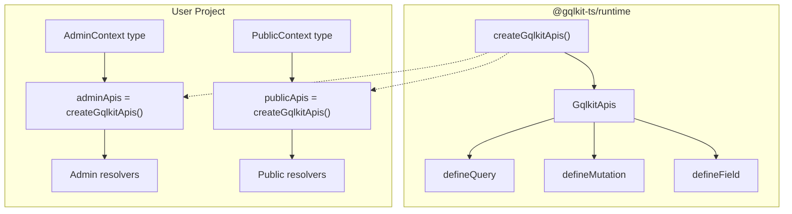

# Technical Design Document

## Overview

**Purpose**: 本機能は `@gqlkit-ts/runtime` パッケージに `createGqlkitApis<TContext>()` ファクトリ関数を追加し、1つの TypeScript プロジェクト内で複数の GraphQL スキーマを異なる Context 型で運用可能にする。

**Users**: 管理者 API と公開 API など、異なるコンテキストを必要とする複数の GraphQL スキーマを単一プロジェクトで管理したい gqlkit ユーザーが利用する。

**Impact**: 現在のグローバル namespace ベースの Context 型設計を補完し、プロジェクトごとに独立した define 関数セットを生成できるようにする。既存の `defineQuery`, `defineMutation`, `defineField` 関数は後方互換性のため維持される。

### Goals

- `createGqlkitApis<TContext>()` で Context 型を指定した define 関数セットを生成可能にする
- 生成された各 define 関数で context 引数が指定した型として型推論される
- 同一プロジェクト内で複数の独立した API セットを作成可能にする
- 既存の型定義（`NoArgs` など）とリゾルバ型を引き続き利用可能にする
- **Branded Type によりリゾルバを型レベルでマーキングし、CLI で検出可能にする**

### Non-Goals

- 既存のグローバル namespace ベースの API を廃止しない（後方互換性維持）
- ランタイムでの Context 型検証（TypeScript の静的型チェックのみ）

## Architecture

### Existing Architecture Analysis

現在の `@gqlkit-ts/runtime` パッケージは以下の設計を採用している:

- **グローバル namespace**: `Gqlkit.Context` インターフェースでプロジェクト全体の Context 型を定義
- **GqlkitContext 型**: namespace が拡張されていれば拡張された型、そうでなければ `unknown` を使用
- **Define 関数**: `defineQuery`, `defineMutation`, `defineField` が `GqlkitContext` を固定で使用
- **Identity 関数パターン**: すべての define 関数は渡されたリゾルバ関数をそのまま返す

この設計の制約として、1つの TypeScript プロジェクトで1つの Context 型しか定義できない。

### Architecture Pattern & Boundary Map



**Architecture Integration**:
- **Selected pattern**: Factory パターン - ジェネリクス型パラメータで設定された define 関数セットを生成
- **Domain boundaries**: ファクトリ関数が Context 型の境界を作り、各 API セットは独立して動作
- **Existing patterns preserved**: Identity 関数パターン、リゾルバ関数シグネチャ
- **New components rationale**: `createGqlkitApis` はファクトリとして機能し、型付きの define 関数を返す
- **Steering compliance**: 静的解析のみ、デコレータなし、graphql-tools 互換の原則を維持

### Technology Stack

| Layer | Choice / Version | Role in Feature | Notes |
|-------|------------------|-----------------|-------|
| Backend / Services | TypeScript 5.9+ | ジェネリクスと条件型による型安全性 | 既存スタック |
| Infrastructure / Runtime | Node.js ESM | ランタイム環境 | 既存スタック |

## Requirements Traceability

| Requirement | Summary | Components | Interfaces | Flows |
|-------------|---------|------------|------------|-------|
| 1.1 | createGqlkitApis がオブジェクトを返す | createGqlkitApis | GqlkitApis | - |
| 1.2 | TContext でコンテキスト型指定 | createGqlkitApis | GqlkitApis | - |
| 1.3 | 未指定時は unknown がデフォルト | createGqlkitApis | GqlkitApis | - |
| 2.1, 2.2, 2.3 | defineQuery の型安全性 | defineQuery | QueryResolver (branded) | - |
| 3.1, 3.2, 3.3 | defineMutation の型安全性 | defineMutation | MutationResolver (branded) | - |
| 4.1, 4.2, 4.3 | defineField の型安全性 | defineField | FieldResolver (branded) | - |
| 5.1, 5.2, 5.3 | 複数スキーマのサポート | createGqlkitApis | GqlkitApis | - |
| 6.1, 6.2, 6.3 | 既存型定義のエクスポート維持 | 型定義 | NoArgs, ResolverFn types | - |
| 7.1, 7.2 | Branded Type によるマーカー付与 | ResolverBrand, Branded Types | QueryResolver, etc. | - |
| 7.3, 7.5 | CLI によるリゾルバ検出 | BrandedTypeExtractor | - | Resolver Detection Flow |
| 7.4 | ランタイム非影響 | ResolverBrand | - | - |

## Components and Interfaces

| Component | Domain/Layer | Intent | Req Coverage | Key Dependencies | Contracts |
|-----------|--------------|--------|--------------|------------------|-----------|
| createGqlkitApis | Runtime/Factory | Context 型付き define 関数セットを生成 | 1.1, 1.2, 1.3, 5.1, 5.2, 5.3 | GraphQLResolveInfo (P1) | Service |
| GqlkitApis | Runtime/Types | 生成される define 関数セットの型定義 | 1.1, 2.1-2.3, 3.1-3.3, 4.1-4.3 | Branded Resolver types (P1) | State |
| ResolverBrand | Runtime/Types | リゾルバ識別用の型レベルシンボル | 7.1, 7.4 | - | State |
| QueryResolver | Runtime/Types | Branded Query リゾルバ型 | 2.1, 2.2, 7.1, 7.2 | ResolverBrand (P1) | State |
| MutationResolver | Runtime/Types | Branded Mutation リゾルバ型 | 3.1, 3.2, 7.1, 7.2 | ResolverBrand (P1) | State |
| FieldResolver | Runtime/Types | Branded Field リゾルバ型 | 4.1, 4.2, 7.1, 7.2 | ResolverBrand (P1) | State |
| QueryResolverFn | Runtime/Types | Query リゾルバ関数の型（ジェネリクス化） | 2.1, 2.2, 6.2 | - | State |
| MutationResolverFn | Runtime/Types | Mutation リゾルバ関数の型（ジェネリクス化） | 3.1, 3.2, 6.2 | - | State |
| FieldResolverFn | Runtime/Types | Field リゾルバ関数の型（ジェネリクス化） | 4.1, 4.2, 6.2 | - | State |
| BrandedTypeExtractor | CLI/Extractor | Branded Type を検出してリゾルバを識別 | 7.3, 7.5 | TypeScript Compiler API (P1) | Service |

### Runtime / Factory

#### createGqlkitApis

| Field | Detail |
|-------|--------|
| Intent | ジェネリクス型パラメータで指定された Context 型に紐づいた define 関数セットを生成するファクトリ関数 |
| Requirements | 1.1, 1.2, 1.3, 5.1, 5.2, 5.3 |

**Responsibilities & Constraints**
- Context 型をジェネリクスで受け取り、その型に紐づいた define 関数を返す
- デフォルトの Context 型は `unknown`
- 各呼び出しで独立した関数セットを返す（共有状態なし）
- Identity 関数パターンを維持（渡されたリゾルバをそのまま返す）

**Dependencies**
- Inbound: なし
- Outbound: GraphQLResolveInfo（graphql パッケージ） - リゾルバ引数型 (P1)
- External: なし

**Contracts**: Service [x] / API [ ] / Event [ ] / Batch [ ] / State [ ]

##### Service Interface

```typescript
/**
 * Context 型を指定した define 関数セットを生成するファクトリ関数
 * @typeParam TContext - リゾルバで使用する Context 型（デフォルト: unknown）
 * @returns defineQuery, defineMutation, defineField を含むオブジェクト
 */
function createGqlkitApis<TContext = unknown>(): GqlkitApis<TContext>;
```

- Preconditions: なし（純粋なファクトリ関数）
- Postconditions: GqlkitApis オブジェクトが返される
- Invariants: 返される関数は常に Identity 関数として動作する

**Implementation Notes**
- Integration: 既存の define 関数と同じパターンで実装
- Validation: コンパイル時の型チェックのみ（ランタイム検証なし）
- Risks: なし

### Runtime / Types

#### GqlkitApis

| Field | Detail |
|-------|--------|
| Intent | createGqlkitApis が返すオブジェクトの型定義 |
| Requirements | 1.1, 2.1-2.3, 3.1-3.3, 4.1-4.3 |

**Contracts**: Service [ ] / API [ ] / Event [ ] / Batch [ ] / State [x]

##### State Management

```typescript
/**
 * createGqlkitApis が返す define 関数セットの型
 * @typeParam TContext - リゾルバで使用する Context 型
 */
interface GqlkitApis<TContext> {
  /**
   * Query リゾルバを定義する
   * @typeParam TArgs - 引数型
   * @typeParam TResult - 戻り値型
   * @returns Branded Type でマーキングされたリゾルバ
   */
  defineQuery: <TArgs, TResult>(
    resolver: QueryResolverFn<TArgs, TResult, TContext>
  ) => QueryResolver<TArgs, TResult, TContext>;

  /**
   * Mutation リゾルバを定義する
   * @typeParam TArgs - 引数型
   * @typeParam TResult - 戻り値型
   * @returns Branded Type でマーキングされたリゾルバ
   */
  defineMutation: <TArgs, TResult>(
    resolver: MutationResolverFn<TArgs, TResult, TContext>
  ) => MutationResolver<TArgs, TResult, TContext>;

  /**
   * Field リゾルバを定義する
   * @typeParam TParent - 親型
   * @typeParam TArgs - 引数型
   * @typeParam TResult - 戻り値型
   * @returns Branded Type でマーキングされたリゾルバ
   */
  defineField: <TParent, TArgs, TResult>(
    resolver: FieldResolverFn<TParent, TArgs, TResult, TContext>
  ) => FieldResolver<TParent, TArgs, TResult, TContext>;
}
```

#### Resolver Function Types (ジェネリクス化)

| Field | Detail |
|-------|--------|
| Intent | Context 型を型パラメータとして受け取るリゾルバ関数型 |
| Requirements | 2.1, 2.2, 3.1, 3.2, 4.1, 4.2, 6.2, 6.3 |

**Contracts**: Service [ ] / API [ ] / Event [ ] / Batch [ ] / State [x]

##### State Management

```typescript
/**
 * Query リゾルバ関数型（ジェネリクス化）
 * @typeParam TArgs - 引数型
 * @typeParam TResult - 戻り値型
 * @typeParam TContext - Context 型（デフォルト: GqlkitContext）
 */
type QueryResolverFn<TArgs, TResult, TContext = GqlkitContext> = (
  root: undefined,
  args: TArgs,
  context: TContext,
  info: GraphQLResolveInfo,
) => TResult | Promise<TResult>;

/**
 * Mutation リゾルバ関数型（ジェネリクス化）
 * @typeParam TArgs - 引数型
 * @typeParam TResult - 戻り値型
 * @typeParam TContext - Context 型（デフォルト: GqlkitContext）
 */
type MutationResolverFn<TArgs, TResult, TContext = GqlkitContext> = (
  root: undefined,
  args: TArgs,
  context: TContext,
  info: GraphQLResolveInfo,
) => TResult | Promise<TResult>;

/**
 * Field リゾルバ関数型（ジェネリクス化）
 * @typeParam TParent - 親型
 * @typeParam TArgs - 引数型
 * @typeParam TResult - 戻り値型
 * @typeParam TContext - Context 型（デフォルト: GqlkitContext）
 */
type FieldResolverFn<TParent, TArgs, TResult, TContext = GqlkitContext> = (
  parent: TParent,
  args: TArgs,
  context: TContext,
  info: GraphQLResolveInfo,
) => TResult | Promise<TResult>;
```

**Implementation Notes**
- Integration: 既存の型定義を拡張（3番目の型パラメータを追加）
- Validation: 後方互換性のためデフォルト型パラメータを設定
- Risks: 既存コードの型互換性を維持する必要がある

### Runtime / Types (Branded)

#### ResolverBrand

| Field | Detail |
|-------|--------|
| Intent | リゾルバを型レベルで識別するための unique symbol |
| Requirements | 7.1, 7.4 |

**Contracts**: Service [ ] / API [ ] / Event [ ] / Batch [ ] / State [x]

##### State Management

```typescript
/**
 * リゾルバ識別用の型レベルシンボル
 * ランタイムには存在せず、型チェックと CLI 検出のみに使用
 */
declare const ResolverBrand: unique symbol;

/**
 * リゾルバの種類を表す型
 */
type ResolverKind = "query" | "mutation" | "field";
```

**Implementation Notes**
- `declare const` により型レベルのみで存在し、ランタイムには影響しない
- `unique symbol` により他のシンボルと衝突しない

#### Branded Resolver Types

| Field | Detail |
|-------|--------|
| Intent | リゾルバ関数にメタ情報を型レベルで付与 |
| Requirements | 7.1, 7.2 |

**Contracts**: Service [ ] / API [ ] / Event [ ] / Batch [ ] / State [x]

##### State Management

```typescript
/**
 * Branded Query リゾルバ型
 * ResolverBrand プロパティにより CLI で検出可能
 */
type QueryResolver<TArgs, TResult, TContext = GqlkitContext> =
  QueryResolverFn<TArgs, TResult, TContext> & {
    [ResolverBrand]: {
      kind: "query";
      args: TArgs;
      result: TResult;
    };
  };

/**
 * Branded Mutation リゾルバ型
 */
type MutationResolver<TArgs, TResult, TContext = GqlkitContext> =
  MutationResolverFn<TArgs, TResult, TContext> & {
    [ResolverBrand]: {
      kind: "mutation";
      args: TArgs;
      result: TResult;
    };
  };

/**
 * Branded Field リゾルバ型
 */
type FieldResolver<TParent, TArgs, TResult, TContext = GqlkitContext> =
  FieldResolverFn<TParent, TArgs, TResult, TContext> & {
    [ResolverBrand]: {
      kind: "field";
      parent: TParent;
      args: TArgs;
      result: TResult;
    };
  };
```

**Implementation Notes**
- Intersection type (`&`) により関数型にメタ情報を追加
- ランタイムでは単なる関数として動作（ブランドプロパティは存在しない）
- CLI は TypeScript コンパイラ API で型情報からブランドを検出

### CLI / Extractor

#### BrandedTypeExtractor

| Field | Detail |
|-------|--------|
| Intent | Branded Type を検出してリゾルバを識別する |
| Requirements | 7.3, 7.5 |

**Responsibilities & Constraints**
- TypeScript コンパイラ API を使用して型情報を解析
- `ResolverBrand` シンボルを持つ型をリゾルバとして識別
- ブランドの `kind` プロパティからリゾルバの種類を判定
- 既存の Define API Extractor と併用（フォールバック）

**Dependencies**
- Inbound: Resolver Extractor
- Outbound: TypeScript Compiler API (P1)
- External: なし

**Contracts**: Service [x] / API [ ] / Event [ ] / Batch [ ] / State [ ]

##### Service Interface

```typescript
interface BrandedTypeExtractor {
  /**
   * 指定されたノードの型が Branded Resolver 型かどうかを判定
   * @param node - TypeScript AST ノード
   * @param checker - TypeScript 型チェッカー
   * @returns リゾルバ情報または null
   */
  extractResolver(
    node: ts.Node,
    checker: ts.TypeChecker
  ): ResolverInfo | null;
}

interface ResolverInfo {
  kind: ResolverKind;
  argsType: ts.Type;
  resultType: ts.Type;
  parentType?: ts.Type; // field の場合のみ
}
```

##### Detection Algorithm

```typescript
function extractResolver(node: ts.Node, checker: ts.TypeChecker): ResolverInfo | null {
  const type = checker.getTypeAtLocation(node);

  // ResolverBrand プロパティを検索
  const brandSymbol = type.getProperty(/* ResolverBrand symbol name */);
  if (!brandSymbol) {
    return null; // Branded Type ではない
  }

  // ブランドの型情報を取得
  const brandType = checker.getTypeOfSymbol(brandSymbol);
  const kindProp = brandType.getProperty("kind");
  if (!kindProp) {
    return null;
  }

  // kind の値を取得（リテラル型）
  const kindType = checker.getTypeOfSymbol(kindProp);
  if (!kindType.isStringLiteral()) {
    return null;
  }

  const kind = kindType.value as ResolverKind;

  // 引数型・戻り値型を取得
  const argsType = brandType.getProperty("args");
  const resultType = brandType.getProperty("result");
  const parentType = brandType.getProperty("parent"); // field のみ

  return {
    kind,
    argsType: argsType ? checker.getTypeOfSymbol(argsType) : checker.getAnyType(),
    resultType: resultType ? checker.getTypeOfSymbol(resultType) : checker.getAnyType(),
    parentType: parentType ? checker.getTypeOfSymbol(parentType) : undefined,
  };
}
```

**Implementation Notes**
- Integration: 既存の `DefineApiExtractor` と統合。まず Branded Type を検出し、見つからない場合はインポート元による従来の検出にフォールバック
- Validation: TypeScript の型チェッカーが提供する型情報を使用
- Risks: TypeScript バージョン間の API 互換性

## Error Handling

### Error Strategy

本機能は純粋な型レベルの機能であり、ランタイムエラーは発生しない。

### Error Categories and Responses

**User Errors (compile-time)**:
- 型パラメータ不一致 -> TypeScript コンパイラエラー
- Context 型の不整合 -> リゾルバ関数の型チェックエラー

## Testing Strategy

### Unit Tests

1. **createGqlkitApis ファクトリ関数**
   - 呼び出し時に GqlkitApis オブジェクトを返すことを検証
   - 返されるオブジェクトに defineQuery, defineMutation, defineField が含まれることを検証

2. **defineQuery (生成版)**
   - 渡されたリゾルバ関数をそのまま返すことを検証（identity 関数）
   - 同期・非同期リゾルバの両方をサポートすることを検証

3. **defineMutation (生成版)**
   - 渡されたリゾルバ関数をそのまま返すことを検証（identity 関数）
   - 同期・非同期リゾルバの両方をサポートすることを検証

4. **defineField (生成版)**
   - 渡されたリゾルバ関数をそのまま返すことを検証（identity 関数）
   - 同期・非同期リゾルバの両方をサポートすることを検証

### Type Tests (compile-time verification)

1. **Context 型推論**
   - createGqlkitApis<TContext>() で生成された define 関数が正しく TContext を推論することを検証
   - context 引数が指定した型として型付けされることを検証

2. **デフォルト型パラメータ**
   - Context 未指定時に unknown として扱われることを検証
   - 既存の ResolverFn 型が後方互換性を維持することを検証

3. **複数スキーマ分離**
   - 異なる Context 型の API セットが独立して型チェックされることを検証
   - 異なる Context 型間でリゾルバを誤って使用した場合にコンパイルエラーになることを検証

4. **既存 API との互換性**
   - 既存の defineQuery, defineMutation, defineField が引き続き動作することを検証
   - 既存の QueryResolverFn, MutationResolverFn, FieldResolverFn 型が後方互換性を維持することを検証

5. **Branded Type の検証**
   - define 関数の戻り値型が ResolverBrand プロパティを持つことを検証
   - Branded Type が関数として呼び出し可能であることを検証

### CLI Tests

1. **BrandedTypeExtractor の動作検証**
   - Branded Query リゾルバを正しく検出することを検証
   - Branded Mutation リゾルバを正しく検出することを検証
   - Branded Field リゾルバを正しく検出することを検証
   - 非リゾルバ型を誤検出しないことを検証

2. **既存エクストラクタとの統合**
   - Branded Type と従来のインポート検出が両立することを検証
   - Branded Type が優先されることを検証

3. **エンドツーエンド検証**
   - `createGqlkitApis` で定義されたリゾルバが `gqlkit gen` で検出されることを検証
   - 生成されたリゾルバマップに正しく含まれることを検証
