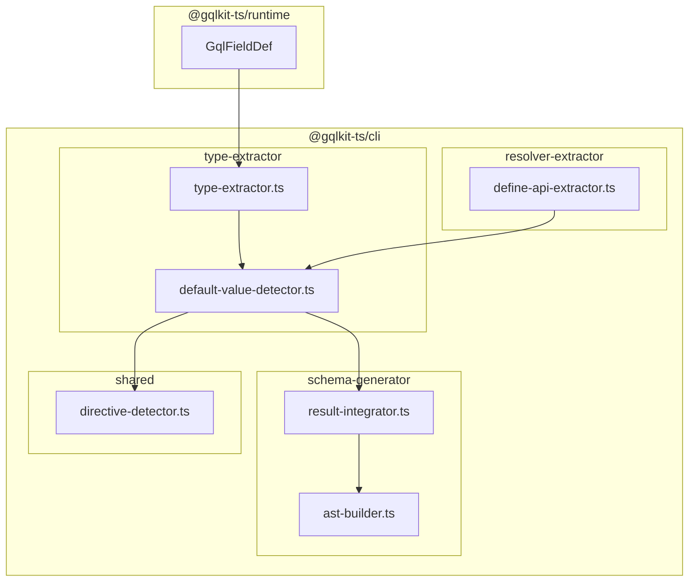
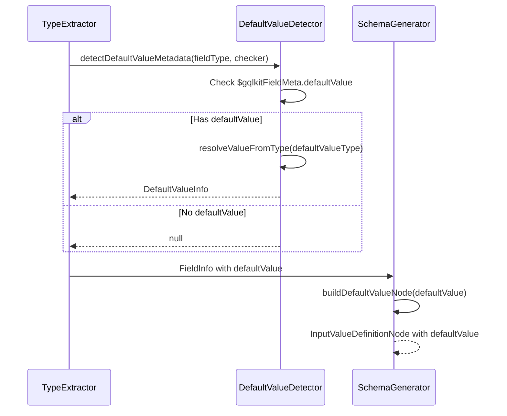
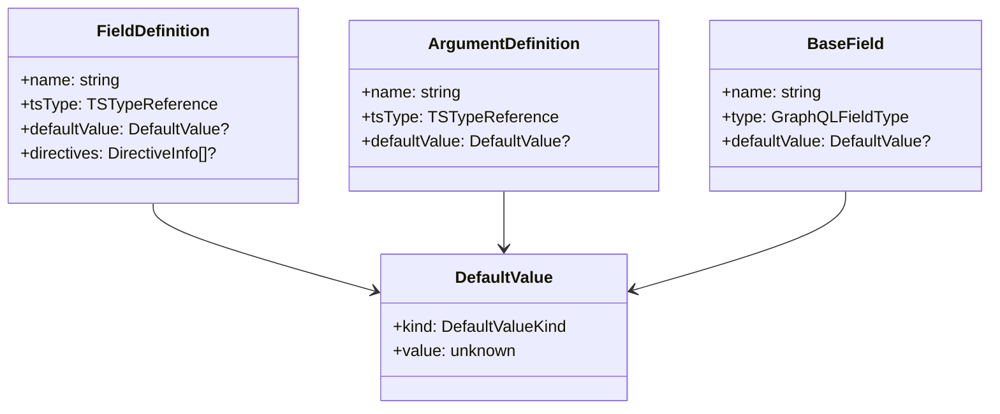

# Technical Design Document

## Overview

**Purpose**: この機能は gqlkit において GraphQL の input field および argument に対するデフォルト値を TypeScript 型定義から指定可能にする機能を提供する。

**Users**: gqlkit ユーザーは Input Object のフィールドや Query/Mutation の引数に対してデフォルト値を宣言的に設定し、生成される GraphQL スキーマに反映させることができる。

**Impact**: 既存の `GqlFieldDef` の Meta オプションに `defaultValue` プロパティを追加し、directive と同様のパターンで処理することで、後方互換性を維持しながら機能を拡張する。

### Goals

- `GqlFieldDef<T, { defaultValue: V }>` 形式でデフォルト値を宣言的に指定可能にする
- Input Object フィールドおよび resolver 引数に対してデフォルト値を出力する
- TypeScript リテラル型から静的にデフォルト値を抽出する
- 既存の directive 機能との併用をサポートする

### Non-Goals

- 実行時に評価される式からのデフォルト値抽出
- Output Object フィールドへのデフォルト値適用（GraphQL 仕様外）
- デフォルト値のバリデーション（型チェック以外）
- カスタムスカラー型のデフォルト値変換ロジック

## Architecture

### Existing Architecture Analysis

gqlkit は以下のパイプラインアーキテクチャを採用している：

1. **Type Extractor** (`type-extractor/`): TypeScript 型定義をスキャンし内部型表現を構築
2. **Resolver Extractor** (`resolver-extractor/`): resolver 定義から引数情報を抽出
3. **Schema Generator** (`schema-generator/`): 統合結果から GraphQL AST を生成
4. **Gen Orchestrator** (`gen-orchestrator/`): パイプライン全体を調整

現在、`GqlFieldDef<T, Meta>` は `Meta.directives` を通じてフィールドレベルのディレクティブをサポートしている。`directive-detector.ts` の `DirectiveArgumentValue` は既にリテラル値（string, number, boolean, enum, list, object）の抽出ロジックを持っている。

### Architecture Pattern & Boundary Map



**Architecture Integration**:

- **Selected pattern**: 既存の directive 処理パターンを拡張
- **Domain boundaries**: Runtime は型定義のみ、CLI がすべての静的解析を担当
- **Existing patterns preserved**: Meta オプション、メタデータプロパティ埋め込み、リテラル値解析
- **New components rationale**: `default-value-detector.ts` を新規追加して責務を分離
- **Steering compliance**: Convention-driven、Fail-fast、No decorators の原則を維持

### Technology Stack

| Layer | Choice / Version | Role in Feature | Notes |
|-------|------------------|-----------------|-------|
| Runtime | @gqlkit-ts/runtime | `GqlFieldDef` Meta 型拡張 | defaultValue オプション追加 |
| CLI | TypeScript Compiler API | 静的型解析 | リテラル型からの値抽出 |
| Schema Output | graphql-js 16.x | AST 生成 | ConstValueNode への変換 |

## System Flows

### Default Value Extraction Flow



## Requirements Traceability

| Requirement | Summary | Components | Interfaces | Flows |
|-------------|---------|------------|------------|-------|
| 1.1 | GqlFieldDef Meta から defaultValue 抽出 | DefaultValueDetector | detectDefaultValueMetadata | Default Value Extraction |
| 1.2 | runtime に defaultValue プロパティ追加 | GqlFieldDef | GqlFieldMetaShape | - |
| 1.3 | defaultValue 省略時はなしとして扱う | DefaultValueDetector | detectDefaultValueMetadata | Default Value Extraction |
| 1.4 | directives と defaultValue の同時指定 | GqlFieldDef | GqlFieldMetaShape | - |
| 2.1-2.8 | Input Object フィールドへの出力 | AST Builder | buildInputFieldDefinitionNode | - |
| 3.1-3.3 | Resolver 引数への出力 | AST Builder | buildInputValueDefinitionNode | - |
| 4.1-4.4 | 静的解析によるリテラル値抽出 | DefaultValueDetector | resolveDefaultValue | Default Value Extraction |
| 5.1-5.3 | 既存機能との互換性 | Runtime, Integrator | - | - |

## Components and Interfaces

| Component | Domain/Layer | Intent | Req Coverage | Key Dependencies (P0/P1) | Contracts |
|-----------|--------------|--------|--------------|--------------------------|-----------|
| GqlFieldMetaShape | Runtime | defaultValue オプションを Meta に追加 | 1.2, 1.4, 5.1-5.3 | - | State |
| DefaultValueDetector | CLI/Shared | TypeScript 型から defaultValue を検出・抽出 | 1.1, 1.3, 4.1-4.4 | directive-detector (P0) | Service |
| TypeExtractor (拡張) | CLI/TypeExtractor | フィールド抽出時に defaultValue を検出 | 1.1, 4.1-4.4 | DefaultValueDetector (P0) | Service |
| ResolverExtractor (拡張) | CLI/ResolverExtractor | 引数抽出時に defaultValue を検出 | 3.1-3.3 | DefaultValueDetector (P0) | Service |
| ASTBuilder (拡張) | CLI/SchemaGenerator | InputValueDefinition に defaultValue 出力 | 2.1-2.8, 3.1-3.3 | - | Service |

### Runtime Layer

#### GqlFieldMetaShape (Extension)

| Field | Detail |
|-------|--------|
| Intent | GqlFieldDef の Meta オプションに defaultValue プロパティを追加 |
| Requirements | 1.2, 1.4, 5.1-5.3 |

**Responsibilities & Constraints**

- `directives` と `defaultValue` の両方をオプショナルに指定可能にする
- 既存の `directives` のみを指定するコードとの後方互換性を維持
- TypeScript の型推論で defaultValue の型をリテラル型として保持

**Contracts**: State [x]

##### State Management

```typescript
export interface GqlFieldMetaShape<
  Meta extends {
    directives?: ReadonlyArray<Directive<string, Record<string, unknown>, DirectiveLocation | DirectiveLocation[]>>;
    defaultValue?: unknown;
  },
> {
  readonly directives?: Meta["directives"];
  readonly defaultValue?: Meta["defaultValue"];
}

export type GqlFieldDef<
  T,
  Meta extends {
    directives?: ReadonlyArray<Directive<string, Record<string, unknown>, DirectiveLocation | DirectiveLocation[]>>;
    defaultValue?: unknown;
  } = object,
> = T & {
  readonly " $gqlkitFieldMeta"?: GqlFieldMetaShape<Meta>;
  readonly " $gqlkitOriginalType"?: T;
};
```

**Implementation Notes**

- Integration: 既存の GqlFieldDef 定義を拡張し、directives をオプショナルに変更
- Validation: TypeScript コンパイラがリテラル型の妥当性を検証
- Risks: 既存コードで `directives` が必須だった場合の後方互換性（現在はオプショナル化で対応可能）

### CLI/Shared Layer

#### DefaultValueDetector

| Field | Detail |
|-------|--------|
| Intent | TypeScript 型から defaultValue メタデータを検出・抽出 |
| Requirements | 1.1, 1.3, 4.1-4.4 |

**Responsibilities & Constraints**

- `$gqlkitFieldMeta` から `defaultValue` プロパティを検出
- TypeScript リテラル型を GraphQL 値表現に変換
- 実行時評価が必要な式は検出不可として報告

**Dependencies**

- Inbound: TypeExtractor, ResolverExtractor — defaultValue 抽出依頼 (P0)
- Internal: directive-detector.ts — resolveArgumentValue 関数を再利用 (P0)

**Contracts**: Service [x]

##### Service Interface

```typescript
export type DefaultValueKind =
  | "string"
  | "number"
  | "boolean"
  | "null"
  | "enum"
  | "list"
  | "object";

export interface DefaultValue {
  readonly kind: DefaultValueKind;
  readonly value: unknown;
}

export interface DefaultValueDetectionResult {
  readonly defaultValue: DefaultValue | null;
  readonly errors: ReadonlyArray<DefaultValueDetectionError>;
}

export interface DefaultValueDetectionError {
  readonly code: "UNRESOLVABLE_DEFAULT_VALUE";
  readonly message: string;
}

export function detectDefaultValueMetadata(
  type: ts.Type,
  checker: ts.TypeChecker,
): DefaultValueDetectionResult;
```

- Preconditions: type は GqlFieldDef でラップされた型
- Postconditions: リテラル型の場合は DefaultValue を返却、非リテラル型の場合はエラー
- Invariants: null は有効なデフォルト値として扱う

**Implementation Notes**

- Integration: directive-detector.ts の resolveArgumentValue を内部で活用
- Validation: TypeScript リテラル型フラグで値の種類を判定
- Risks: 複雑なオブジェクトリテラルのネストレベル制限なし

### CLI/TypeExtractor Layer

#### TypeExtractor (Extension)

| Field | Detail |
|-------|--------|
| Intent | フィールド抽出時に defaultValue を検出して FieldDefinition に含める |
| Requirements | 1.1, 4.1-4.4 |

**Responsibilities & Constraints**

- `extractFieldsFromType` で defaultValue を検出
- 検出結果を FieldDefinition に追加
- エラーを diagnostics に追加

**Dependencies**

- Outbound: DefaultValueDetector — defaultValue 検出 (P0)

**Contracts**: Service [x]

##### Service Interface (Extension)

```typescript
// types/typescript.ts への追加
export interface FieldDefinition {
  readonly name: string;
  readonly tsType: TSTypeReference;
  readonly optional: boolean;
  readonly description: string | null;
  readonly deprecated: DeprecationInfo | null;
  readonly directives: ReadonlyArray<DirectiveInfo> | null;
  readonly defaultValue: DefaultValue | null;  // 追加
}
```

### CLI/ResolverExtractor Layer

#### ResolverExtractor (Extension)

| Field | Detail |
|-------|--------|
| Intent | resolver 引数の抽出時に defaultValue を検出 |
| Requirements | 3.1-3.3 |

**Responsibilities & Constraints**

- `extractArgsFromType` で defaultValue を検出
- ArgumentDefinition に defaultValue を追加

**Dependencies**

- Outbound: DefaultValueDetector — defaultValue 検出 (P0)

**Contracts**: Service [x]

##### Service Interface (Extension)

```typescript
// define-api-extractor.ts への追加
export interface ArgumentDefinition {
  readonly name: string;
  readonly tsType: TSTypeReference;
  readonly optional: boolean;
  readonly description: string | null;
  readonly deprecated: DeprecationInfo | null;
  readonly defaultValue: DefaultValue | null;  // 追加
}
```

### CLI/SchemaGenerator Layer

#### ASTBuilder (Extension)

| Field | Detail |
|-------|--------|
| Intent | InputValueDefinitionNode に defaultValue を出力 |
| Requirements | 2.1-2.8, 3.1-3.3 |

**Responsibilities & Constraints**

- DefaultValue を ConstValueNode に変換
- buildInputValueDefinitionNode, buildInputFieldDefinitionNode で出力

**Contracts**: Service [x]

##### Service Interface (Extension)

```typescript
// ast-builder.ts への追加
function buildDefaultValueNode(
  defaultValue: DefaultValue,
): ConstValueNode;

// GraphQLInputValue 拡張
export interface GraphQLInputValue {
  readonly name: string;
  readonly type: GraphQLFieldType;
  readonly description: string | null;
  readonly deprecated: DeprecationInfo | null;
  readonly defaultValue: DefaultValue | null;  // 追加
}

// BaseField 拡張
export interface BaseField {
  readonly name: string;
  readonly type: GraphQLFieldType;
  readonly description: string | null;
  readonly deprecated: DeprecationInfo | null;
  readonly directives: ReadonlyArray<DirectiveInfo> | null;
  readonly defaultValue: DefaultValue | null;  // 追加
}
```

**Implementation Notes**

- Integration: buildDirectiveArgumentValue と同様のパターンで ConstValueNode を生成
- Validation: GraphQL スキーマとしての妥当性は graphql-js が担保
- Risks: Enum 値の参照解決は既存パターン踏襲

## Data Models

### Domain Model



### Logical Data Model

**DefaultValue 構造**:

| kind | value の型 | GraphQL 出力 |
|------|-----------|-------------|
| string | string | StringValue |
| number | number | IntValue / FloatValue |
| boolean | boolean | BooleanValue |
| null | null | NullValue |
| enum | string | EnumValue |
| list | DefaultValue[] | ListValue |
| object | { name: string, value: DefaultValue }[] | ObjectValue |

## Error Handling

### Error Strategy

Fail-fast 原則に従い、静的解析時点で検出可能なエラーは早期に報告する。

### Error Categories and Responses

**User Errors (Diagnostic)**:

- `UNRESOLVABLE_DEFAULT_VALUE`: デフォルト値が実行時式 → エラー報告、処理中断
- `INVALID_DEFAULT_VALUE_TYPE`: 型不一致 → エラー報告（将来拡張）

**Error Detection Points**:

| 検出箇所 | エラー種別 | 対応 |
|---------|----------|------|
| DefaultValueDetector | 非リテラル型 | UNRESOLVABLE_DEFAULT_VALUE |
| TypeExtractor | 抽出エラー | diagnostics に追加 |
| ResolverExtractor | 抽出エラー | diagnostics に追加 |

## Testing Strategy

### Golden File Tests

gqlkit のテスト方針に従い、golden file テストで検証する。

**New Test Cases** (`packages/cli/src/gen-orchestrator/testdata/`):

1. `default-value-basic/`: 基本的なデフォルト値（string, number, boolean, null）
2. `default-value-complex/`: 配列・オブジェクト・Enum のデフォルト値
3. `default-value-input-object/`: Input Object フィールドのデフォルト値
4. `default-value-resolver-args/`: Query/Mutation 引数のデフォルト値
5. `default-value-with-directives/`: directive との併用
6. `default-value-errors/`: エラーケース（非リテラル型など）

### Unit Tests

- `DefaultValueDetector`: リテラル型解析のエッジケース
- `buildDefaultValueNode`: ConstValueNode 生成の正確性
