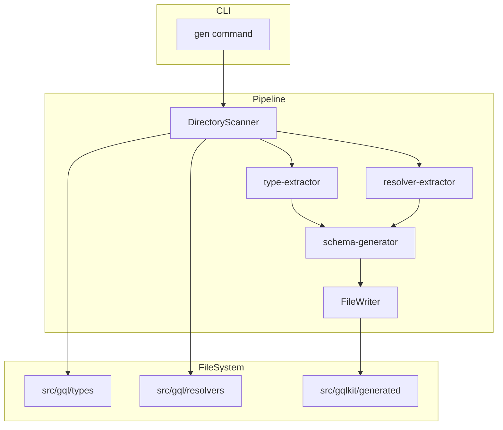
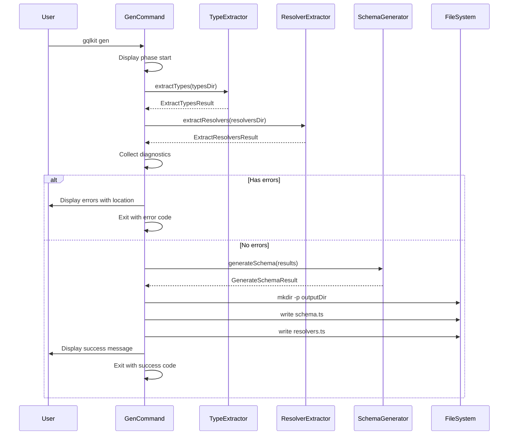

# Design Document

## Overview

**Purpose**: この機能は、gqlkit gen コマンドを通じて TypeScript ソースコードから GraphQL スキーマと解決マップを自動生成する統合パイプラインを提供する。

**Users**: GraphQL サーバーを構築する TypeScript 開発者が、規約ベースのスキーマ生成ワークフローで使用する。

**Impact**: 現在のプレースホルダー実装を、type-extractor、resolver-extractor、schema-generator を統合した完全な生成パイプラインに置き換える。

### Goals

- 既存の3つのモジュール（type-extractor、resolver-extractor、schema-generator）を gen コマンドに統合する
- 規約に基づいたディレクトリ（`src/gql/types/`、`src/gql/resolvers/`）を自動スキャンする
- 生成されたコードを `src/gqlkit/generated/` に書き出す
- 明確なエラーメッセージと進捗表示を提供する

### Non-Goals

- 新しい抽出ロジックや生成ロジックの実装（既存モジュールを使用）
- 設定ファイルによるディレクトリパスのカスタマイズ
- ウォッチモードやインクリメンタルビルド
- HTTP サーバー統合

## Architecture

### Existing Architecture Analysis

現在のアーキテクチャは以下の3つの独立したモジュールで構成されている：

1. **type-extractor**: `src/gql/types/` から TypeScript 型を抽出し GraphQL 型情報に変換
2. **resolver-extractor**: `src/gql/resolvers/` からリゾルバペアを抽出しフィールド定義に変換
3. **schema-generator**: 抽出結果を統合し、schema.ts と resolvers.ts のコードを生成

これらのモジュールは既に適切なインターフェースを持ち、テスト済みである。gen コマンドはこれらを順序立てて呼び出すオーケストレーターとして機能する。

### Architecture Pattern & Boundary Map



**Architecture Integration**:
- Selected pattern: パイプライン/オーケストレーションパターン - 各フェーズが順次実行され、結果が次のフェーズに渡される
- Domain boundaries: CLI（コマンド実行）、抽出（解析）、生成（コード出力）、ファイルI/O
- Existing patterns preserved: 既存モジュールのインターフェースをそのまま使用
- New components rationale: GenCommandOrchestrator のみ追加（既存モジュールの接続と進捗/エラー表示）
- Steering compliance: 設定不要の規約ベースアプローチを維持

### Technology Stack

| Layer | Choice / Version | Role in Feature | Notes |
|-------|------------------|-----------------|-------|
| CLI | gunshi ^0.27.5 | コマンド定義と引数解析 | 既存パターンを踏襲 |
| Runtime | Node.js (ES2022+) | 非同期処理とファイルI/O | ESM モジュール |
| File I/O | node:fs/promises | ディレクトリ作成とファイル書き込み | 標準ライブラリ |

## System Flows

### Code Generation Flow



## Requirements Traceability

| Requirement | Summary | Components | Interfaces | Flows |
|-------------|---------|------------|------------|-------|
| 1.1, 1.2, 1.3, 1.4 | ディレクトリスキャン | GenCommandOrchestrator | DirectoryScannerInterface | Code Generation Flow |
| 2.1, 2.2, 2.3 | 型抽出の統合 | GenCommandOrchestrator | TypeExtractorInterface | Code Generation Flow |
| 3.1, 3.2, 3.3 | リゾルバ抽出の統合 | GenCommandOrchestrator | ResolverExtractorInterface | Code Generation Flow |
| 4.1, 4.2, 4.3 | スキーマ生成の統合 | GenCommandOrchestrator | SchemaGeneratorInterface | Code Generation Flow |
| 5.1, 5.2, 5.3, 5.4, 5.5 | ファイル出力 | FileWriter | FileWriterInterface | Code Generation Flow |
| 6.1, 6.2, 6.3, 6.4, 6.5 | エラーハンドリング | DiagnosticReporter | DiagnosticReporterInterface | Code Generation Flow |
| 7.1, 7.2 | 進捗表示 | ProgressReporter | ProgressReporterInterface | Code Generation Flow |

## Components and Interfaces

| Component | Domain/Layer | Intent | Req Coverage | Key Dependencies (P0/P1) | Contracts |
|-----------|--------------|--------|--------------|--------------------------|-----------|
| GenCommandOrchestrator | CLI | 生成パイプラインのオーケストレーション | 1, 2, 3, 4 | type-extractor (P0), resolver-extractor (P0), schema-generator (P0) | Service |
| FileWriter | Infrastructure | ファイル出力処理 | 5 | node:fs/promises (P0) | Service |
| DiagnosticReporter | Presentation | 診断メッセージのフォーマットと出力 | 6 | - | Service |
| ProgressReporter | Presentation | 進捗状況の表示 | 7 | - | Service |

### CLI Layer

#### GenCommandOrchestrator

| Field | Detail |
|-------|--------|
| Intent | 既存モジュールを統合し、生成パイプラインを実行する |
| Requirements | 1.1, 1.2, 1.3, 1.4, 2.1, 2.2, 2.3, 3.1, 3.2, 3.3, 4.1, 4.2, 4.3 |

**Responsibilities & Constraints**
- 規約ディレクトリのパス解決（`src/gql/types/`、`src/gql/resolvers/`）
- type-extractor と resolver-extractor の呼び出しと結果収集
- 診断メッセージの集約とエラー判定
- schema-generator の呼び出しと結果取得
- 終了コードの決定（エラーあり: 1、成功: 0）

**Dependencies**
- Outbound: type-extractor — 型抽出実行 (P0)
- Outbound: resolver-extractor — リゾルバ抽出実行 (P0)
- Outbound: schema-generator — スキーマ生成実行 (P0)
- Outbound: FileWriter — ファイル出力 (P0)
- Outbound: DiagnosticReporter — エラー表示 (P1)
- Outbound: ProgressReporter — 進捗表示 (P1)

**Contracts**: Service [x]

##### Service Interface

```typescript
interface GenerationConfig {
  readonly cwd: string;
  readonly typesDir: string;      // default: "src/gql/types"
  readonly resolversDir: string;  // default: "src/gql/resolvers"
  readonly outputDir: string;     // default: "src/gqlkit/generated"
}

interface GenerationResult {
  readonly success: boolean;
  readonly filesWritten: ReadonlyArray<string>;
  readonly diagnostics: ReadonlyArray<Diagnostic>;
}

interface GenCommandOrchestratorService {
  execute(config: GenerationConfig): Promise<GenerationResult>;
}
```

- Preconditions: cwd は有効なディレクトリパス
- Postconditions: success が true の場合、filesWritten に書き出されたファイルパスが含まれる
- Invariants: 既存ファイルは上書きされる

**Implementation Notes**
- Integration: gunshi の define() を使用してコマンドを定義し、run 関数内でオーケストレーションを実行
- Validation: ディレクトリ存在チェックは type-extractor/resolver-extractor に委譲（既に DIRECTORY_NOT_FOUND エラーを返す）
- Risks: 大量ファイル時のメモリ使用量（現時点では許容範囲と想定）

### Infrastructure Layer

#### FileWriter

| Field | Detail |
|-------|--------|
| Intent | 生成されたコードをファイルシステムに書き出す |
| Requirements | 5.1, 5.2, 5.3, 5.4, 5.5 |

**Responsibilities & Constraints**
- 出力ディレクトリの作成（存在しない場合）
- schema.ts と resolvers.ts の書き込み
- 既存ファイルの上書き

**Dependencies**
- External: node:fs/promises — ファイルI/O (P0)
- External: node:path — パス操作 (P0)

**Contracts**: Service [x]

##### Service Interface

```typescript
interface WriteFileOptions {
  readonly outputDir: string;
  readonly files: ReadonlyArray<{
    readonly filename: string;
    readonly content: string;
  }>;
}

interface WriteResult {
  readonly success: boolean;
  readonly writtenPaths: ReadonlyArray<string>;
  readonly error?: Error;
}

interface FileWriterService {
  writeFiles(options: WriteFileOptions): Promise<WriteResult>;
}
```

- Preconditions: files 配列が空でない
- Postconditions: success が true の場合、全ファイルが書き込まれている
- Invariants: 部分的な書き込み失敗時は全体を失敗として報告

**Implementation Notes**
- Integration: `fs.mkdir` で `recursive: true` を使用してディレクトリを作成
- Validation: ファイル名のサニタイズは不要（固定ファイル名のため）
- Risks: ディスク容量不足やパーミッションエラー時の適切なエラーメッセージ

### Presentation Layer

#### DiagnosticReporter

| Field | Detail |
|-------|--------|
| Intent | 診断メッセージをフォーマットしてコンソールに出力する |
| Requirements | 6.1, 6.3 |

**Responsibilities & Constraints**
- エラーと警告の分類表示
- ファイル名、行番号、列番号を含む位置情報のフォーマット
- 診断コードに基づく分かりやすいメッセージ

**Dependencies**
- None

**Contracts**: Service [x]

##### Service Interface

```typescript
interface DiagnosticReporterService {
  reportDiagnostics(diagnostics: ReadonlyArray<Diagnostic>): void;
  reportError(message: string): void;
  reportSuccess(message: string): void;
}
```

- Preconditions: なし
- Postconditions: 診断メッセージが標準出力/エラー出力に書き込まれる
- Invariants: エラーは stderr、その他は stdout に出力

**Implementation Notes**
- フォーマット例: `error[DIRECTORY_NOT_FOUND]: src/gql/types/ が見つかりません`
- 位置情報付き: `src/gql/types/user.ts:10:5 - error[UNSUPPORTED_SYNTAX]: ...`

#### ProgressReporter

| Field | Detail |
|-------|--------|
| Intent | 処理の進捗状況を表示する |
| Requirements | 7.1, 7.2 |

**Responsibilities & Constraints**
- 各フェーズ開始時のメッセージ表示
- ファイル出力完了時のパス表示

**Dependencies**
- None

**Contracts**: Service [x]

##### Service Interface

```typescript
interface ProgressReporterService {
  startPhase(phaseName: string): void;
  fileWritten(filePath: string): void;
  complete(): void;
}
```

**Implementation Notes**
- フェーズ名例: "Extracting types...", "Extracting resolvers...", "Generating schema..."
- 出力例: `  wrote src/gqlkit/generated/schema.ts`

## Data Models

### Domain Model

本機能で新規のドメインモデルは導入しない。既存モジュールの型定義を使用する：

- `ExtractTypesResult`: 型抽出結果（types, diagnostics）
- `ExtractResolversResult`: リゾルバ抽出結果（queryFields, mutationFields, typeExtensions, diagnostics）
- `GenerateSchemaResult`: スキーマ生成結果（typeDefsCode, resolversCode, diagnostics, hasErrors）
- `Diagnostic`: 診断メッセージ（code, message, severity, location?）

### Data Contracts & Integration

**Output Files**:
- `src/gqlkit/generated/schema.ts`: GraphQL スキーマ AST（DocumentNode）のエクスポート
- `src/gqlkit/generated/resolvers.ts`: リゾルバマップのエクスポート

```typescript
// schema.ts の出力形式
import type { DocumentNode } from "graphql";
export const typeDefs: DocumentNode = { ... } as DocumentNode;

// resolvers.ts の出力形式
import { queryResolver } from "../../gql/resolvers/query.js";
export const resolvers = {
  Query: {
    users: queryResolver.users,
  },
} as const;
```

## Error Handling

### Error Strategy

エラーは Diagnostic 型で統一的に扱う。既存モジュールが返す診断メッセージをそのまま活用し、gen コマンドレベルで集約・表示する。

### Error Categories and Responses

**User Errors (ディレクトリ・ファイル関連)**:
- `DIRECTORY_NOT_FOUND`: 指定ディレクトリが存在しない → 明確なパスと修正方法を表示
- `PARSE_ERROR`: TypeScript パースエラー → ファイル位置と構文エラー詳細を表示

**Business Logic Errors (規約違反)**:
- `NAMING_CONVENTION_MISMATCH`: 命名規約に違反 → 期待される命名パターンを表示
- `MISSING_RESOLVER_TYPE`: リゾルバ型が見つからない → 必要な型定義を提示
- `INVALID_RESOLVER_SIGNATURE`: リゾルバ署名が不正 → 正しい署名例を表示

**System Errors (I/O関連)**:
- ファイル書き込み失敗 → パーミッションやディスク容量を確認するよう案内

### Exit Codes

| Exit Code | Condition |
|-----------|-----------|
| 0 | 正常完了（警告があっても成功） |
| 1 | エラーが1件以上存在 |

## Testing Strategy

### Unit Tests

- `GenCommandOrchestrator`: モックを使用したオーケストレーションロジックのテスト
- `FileWriter`: 仮想ファイルシステムまたは一時ディレクトリでの書き込みテスト
- `DiagnosticReporter`: 診断メッセージのフォーマット検証
- `ProgressReporter`: 出力メッセージのフォーマット検証

### Integration Tests

- 完全なパイプライン実行: types と resolvers を含むテストプロジェクトで gen コマンドを実行
- エラーケース: ディレクトリ不在、型エラー、リゾルバ不整合時の動作検証
- 出力ファイル検証: 生成された schema.ts と resolvers.ts の内容検証

### E2E Tests

- CLI 実行テスト: 実際の gqlkit gen コマンド実行と終了コード検証
- 生成コードのコンパイル検証: 生成された TypeScript ファイルが正常にコンパイルできることを確認
