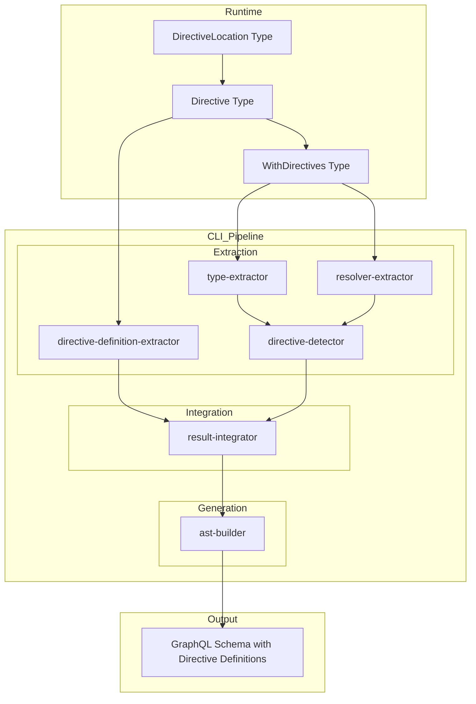
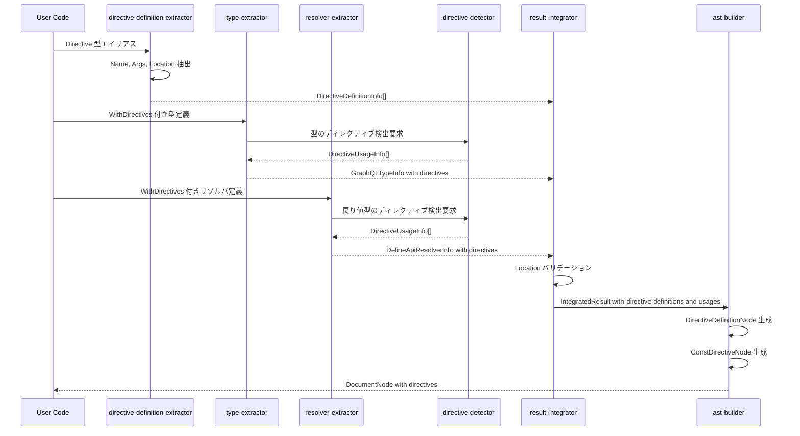
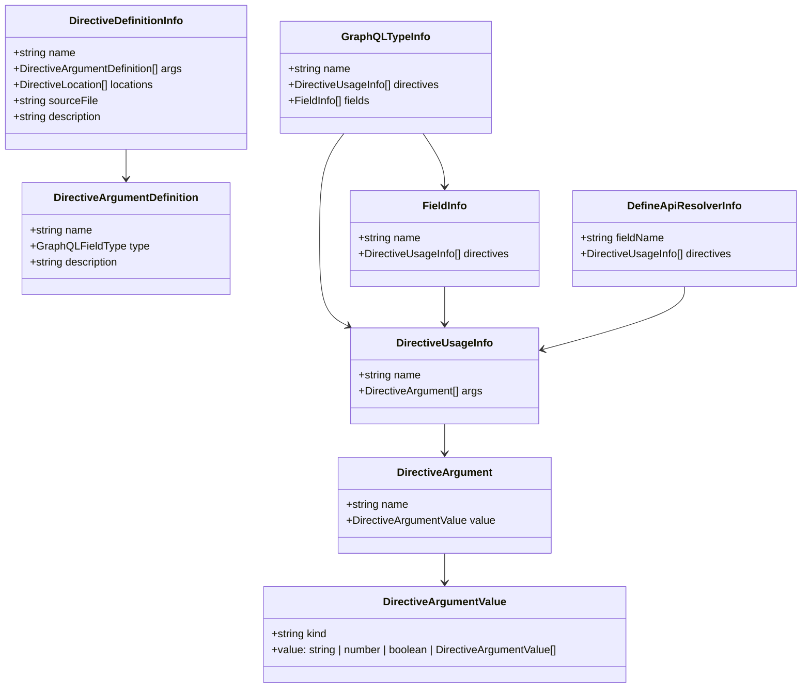

# Design Document

## Overview

**Purpose**: この機能は、gqlkit ユーザーが TypeScript の型定義およびリゾルバ定義に GraphQL ディレクティブ情報を付与し、生成される GraphQL スキーマにディレクティブ定義とディレクティブ使用を反映できるようにする。

**Users**: gqlkit を使用する GraphQL サーバー開発者が、認可 (`@auth`)、キャッシュ (`@cache`)、カスタムビジネスロジックなどのディレクティブを型安全に定義し、スキーマ生成時にディレクティブ定義 (`directive @auth(...) on FIELD_DEFINITION`) および使用 (`@auth(...)`) を自動的に出力させるために利用する。

**Impact**: 既存の型抽出・リゾルバ抽出・スキーマ生成パイプラインを拡張し、ディレクティブ定義の抽出・生成、ディレクティブ使用メタデータの抽出、およびLocation バリデーションを追加する。

### Goals

- TypeScript 型システムを活用したディレクティブの型安全な定義（名前・引数・適用可能場所）
- 型レベル・フィールドレベル両方でのディレクティブ使用の付与
- ディレクティブ定義のスキーマ出力（`directive @name(...) on LOCATION`）
- ディレクティブ使用のスキーマ出力（型・フィールドへの `@directive(...)` 付与）
- ディレクティブ使用場所の静的バリデーション

### Non-Goals

- ディレクティブの実行時ロジック実装（認可チェックなど）
- 引数のディレクティブ付与 (ARGUMENT_DEFINITION への適用)
- 列挙値のディレクティブ付与 (@deprecated 以外)
- Repeatable ディレクティブのサポート
- 以下の Location へのディレクティブ付与（現行 gqlkit の型抽出対象外）:
  - SCHEMA（スキーマ定義）
  - SCALAR（スカラー型定義への付与、定義自体は可能）
  - INTERFACE（インターフェース定義）
  - UNION（ユニオン型定義）
  - ENUM（列挙型定義）
  - ENUM_VALUE（列挙値定義、@deprecated 以外）

## Architecture

### Existing Architecture Analysis

現在の gqlkit パイプラインは以下の構造を持つ:

1. **type-extractor**: TypeScript 型定義をスキャンし、`GraphQLTypeInfo` を生成
2. **resolver-extractor**: リゾルバ定義をスキャンし、`DefineApiResolverInfo` を生成
3. **result-integrator**: 両者を統合し、`IntegratedResult` を生成
4. **ast-builder**: 統合結果から GraphQL `DocumentNode` を構築

メタデータ埋め込みパターンとして `$gqlkitScalar` が既に確立されており、同様のパターンでディレクティブメタデータを埋め込む。

**既存ディレクティブ実装（部分的）**:
- `Directive<Name, Args>` (2パラメータ) - 実装済み
- `WithDirectives<T, Ds>` - 実装済み
- 型・フィールドへのディレクティブ使用抽出 - 実装済み
- ディレクティブ AST 出力 (`ConstDirectiveNode`) - 実装済み

**拡張が必要な機能**:
- `Directive<Name, Args, Location>` (3パラメータ) への拡張
- `DirectiveLocation` 型の追加
- ディレクティブ型定義の抽出（型エイリアスから）
- ディレクティブ定義のスキーマ生成 (`DirectiveDefinitionNode`)
- Location バリデーション

### Architecture Pattern & Boundary Map



**Architecture Integration**:
- Selected pattern: 既存のメタデータ埋め込みパターン (`$gqlkitScalar` 方式) を踏襲
- Domain boundaries: Runtime (型定義) / CLI Pipeline (抽出・生成) の分離を維持
- Existing patterns preserved: DefineScalar のメタデータプロパティパターン、extractors の構造
- New components: directive-definition-extractor モジュール、Location バリデーション
- Steering compliance: No decorators、Pure static analysis、Deterministic output

### Technology Stack

| Layer | Choice / Version | Role in Feature | Notes |
|-------|------------------|-----------------|-------|
| Runtime | TypeScript 5.9+ | ユーティリティ型定義（Directive, DirectiveLocation, WithDirectives） | @gqlkit-ts/runtime |
| CLI | TypeScript Compiler API | ディレクティブメタデータ・定義抽出 | 既存パターン踏襲 |
| Output | graphql-js | ConstDirectiveNode, DirectiveDefinitionNode 生成 | Kind.DIRECTIVE, Kind.DIRECTIVE_DEFINITION |

## System Flows

### Directive Definition and Usage Extraction Flow



## Requirements Traceability

| Requirement | Summary | Components | Interfaces | Flows |
|-------------|---------|------------|------------|-------|
| 1.1, 1.2, 1.3, 1.4, 1.5 | Directive 型定義 (3パラメータ) | DirectiveType, DirectiveLocationType | Directive<Name, Args, Location>, DirectiveLocation | - |
| 2.1, 2.2, 2.3, 2.4 | WithDirectives 型定義 | WithDirectivesType | WithDirectives<T, Ds> | - |
| 3.1, 3.2, 3.3, 3.4 | リゾルバへのディレクティブ付与 | WithDirectivesType, ResolverExtractor | QueryResolver, WithDirectives | Extraction Flow |
| 4.1, 4.2, 4.3, 4.4, 4.5 | ディレクティブ型定義の抽出 | DirectiveDefinitionExtractor | DirectiveDefinitionInfo | Extraction Flow |
| 5.1, 5.2, 5.3, 5.4, 5.5 | 型からのディレクティブ使用抽出 | DirectiveDetector, TypeExtractor | DirectiveUsageInfo, detectDirectiveMetadata | Extraction Flow |
| 6.1, 6.2, 6.3, 6.4 | リゾルバからのディレクティブ使用抽出 | DirectiveDetector, ResolverExtractor | DirectiveUsageInfo | Extraction Flow |
| 7.1, 7.2, 7.3, 7.4, 7.5 | ディレクティブ定義のスキーマ生成 | AstBuilderExt | DirectiveDefinitionNode | Generation |
| 8.1, 8.2, 8.3, 8.4, 8.5 | ディレクティブ使用のスキーマ出力 | AstBuilderExt | ConstDirectiveNode | Generation |
| 9.1, 9.2, 9.3, 9.4, 9.5 | ディレクティブバリデーション | ResultIntegrator | Diagnostic | Validation |

## Components and Interfaces

| Component | Domain/Layer | Intent | Req Coverage | Key Dependencies | Contracts |
|-----------|--------------|--------|--------------|-----------------|-----------|
| DirectiveLocationType | Runtime | ディレクティブ適用可能場所の型定義 | 1.4, 1.5 | - | Type Definition |
| DirectiveType | Runtime | ディレクティブの名前・引数・場所を型安全に表現 | 1.1, 1.2, 1.3 | DirectiveLocationType (P0) | Type Definition |
| WithDirectivesType | Runtime | 型へのディレクティブ使用付与 | 2.1-2.4, 3.1-3.4 | DirectiveType (P0) | Type Definition |
| DirectiveDefinitionExtractor | CLI/shared | ディレクティブ型定義からの情報抽出 | 4.1-4.5 | TypeScript API (P0) | Service |
| DirectiveDetector | CLI/shared | ディレクティブ使用メタデータ抽出 | 5.1-5.5, 6.1-6.4 | TypeScript API (P0) | Service |
| TypeExtractorExt | CLI/type-extractor | 型定義からのディレクティブ抽出統合 | 5.1-5.5 | DirectiveDetector (P0), DirectiveDefinitionExtractor (P0) | Service |
| ResolverExtractorExt | CLI/resolver-extractor | リゾルバからのディレクティブ抽出統合 | 6.1-6.4 | DirectiveDetector (P0) | Service |
| ResultIntegratorExt | CLI/schema-generator | Location バリデーション | 9.3 | DirectiveDefinitionExtractor (P0) | Service |
| AstBuilderExt | CLI/schema-generator | ディレクティブ定義・使用 AST 出力 | 7.1-7.5, 8.1-8.5 | graphql-js (P0) | Service |

### Runtime Layer

#### DirectiveLocationType

| Field | Detail |
|-------|--------|
| Intent | GraphQL ディレクティブの適用可能場所を表す文字列リテラル型を定義する |
| Requirements | 1.4, 1.5 |

**Responsibilities & Constraints**
- GraphQL 仕様に準拠した Type System Directive Location を網羅
- 文字列リテラル型の和集合として定義
- 実行時にはオーバーヘッドなし (型レベルのみ)

**Contracts**: Type Definition

```typescript
export type DirectiveLocation =
  | "SCHEMA"
  | "SCALAR"
  | "OBJECT"
  | "FIELD_DEFINITION"
  | "ARGUMENT_DEFINITION"
  | "INTERFACE"
  | "UNION"
  | "ENUM"
  | "ENUM_VALUE"
  | "INPUT_OBJECT"
  | "INPUT_FIELD_DEFINITION";
```

**Implementation Notes**
- Executable directive locations (QUERY, MUTATION, FIELD など) は本スコープ外
- Type system directive locations のみをサポート

#### DirectiveType

| Field | Detail |
|-------|--------|
| Intent | GraphQL ディレクティブの名前・引数・適用可能場所を型安全に表現する |
| Requirements | 1.1, 1.2, 1.3, 1.4, 1.5 |

**Responsibilities & Constraints**
- ディレクティブ名を文字列リテラル型で表現
- 引数を `Record<string, unknown>` を継承する型で表現
- 適用可能場所を `DirectiveLocation` または `DirectiveLocation[]` で表現
- 実行時にはオーバーヘッドなし (型レベルのみ)

**Contracts**: Type Definition

```typescript
export type Directive<
  Name extends string,
  Args extends Record<string, unknown> = Record<string, never>,
  Location extends DirectiveLocation | DirectiveLocation[] = DirectiveLocation,
> = {
  readonly " $directiveName": Name;
  readonly " $directiveArgs": Args;
  readonly " $directiveLocation": Location;
};
```

**Implementation Notes**
- Phantom type pattern により型情報のみを保持
- 既存の2パラメータ版 `Directive<Name, Args>` からの後方互換性を維持（Location にデフォルト値）
- ジェネリック型パラメータを持つディレクティブ型エイリアス（例: `AuthDirective<R extends string[]>`）をサポート

#### WithDirectivesType

| Field | Detail |
|-------|--------|
| Intent | 任意の型にディレクティブ使用メタデータを付与する |
| Requirements | 2.1, 2.2, 2.3, 2.4, 3.1, 3.2, 3.3, 3.4 |

**Responsibilities & Constraints**
- 元の型 `T` の型情報を保持しつつディレクティブメタデータを追加
- 複数のディレクティブを配列として受け付け
- 型レベルでの交差型として実装

**Contracts**: Type Definition

```typescript
export type WithDirectives<
  T,
  Ds extends ReadonlyArray<Directive<string, Record<string, unknown>, DirectiveLocation | DirectiveLocation[]>>,
> = T & {
  readonly " $gqlkitDirectives"?: Ds;
};
```

**Implementation Notes**
- `$gqlkitScalar` と同様のスペースプレフィックスによる衝突回避
- Optional property (`?`) により実行時の値不要
- 既存実装から変更なし（Directive 型の制約が緩和されるのみ）

### CLI/shared Layer

#### DirectiveDefinitionExtractor

| Field | Detail |
|-------|--------|
| Intent | Directive 型を使用した型エイリアスからディレクティブ定義情報を抽出する |
| Requirements | 4.1, 4.2, 4.3, 4.4, 4.5 |

**Responsibilities & Constraints**
- エクスポートされた型エイリアスから `Directive<Name, Args, Location>` の使用を検出
- ディレクティブ名（Name）、引数型（Args）、適用場所（Location）を抽出
- ジェネリック型パラメータを持つディレクティブの引数構造を解析

**Dependencies**
- Inbound: TypeExtractor - ディレクティブ定義抽出要求 (P0)
- External: TypeScript Compiler API - 型解析 (P0)

**Contracts**: Service

##### Service Interface

```typescript
interface DirectiveDefinitionInfo {
  readonly name: string;
  readonly args: ReadonlyArray<DirectiveArgumentDefinition>;
  readonly locations: ReadonlyArray<DirectiveLocation>;
  readonly sourceFile: string;
  readonly description: string | null;
}

interface DirectiveArgumentDefinition {
  readonly name: string;
  readonly type: GraphQLFieldType;
  readonly description: string | null;
}

interface DirectiveDefinitionExtractionResult {
  readonly definitions: ReadonlyArray<DirectiveDefinitionInfo>;
  readonly errors: ReadonlyArray<DirectiveDefinitionError>;
}

function extractDirectiveDefinitions(
  program: ts.Program,
  sourceFiles: ts.SourceFile[],
): DirectiveDefinitionExtractionResult;
```

- Preconditions: program は有効な TypeScript プログラム、sourceFiles は対象ソースファイル
- Postconditions: Directive を使用していない型エイリアスは無視される
- Invariants: 同名のディレクティブ定義が複数ある場合はエラーを報告

**Implementation Notes**
- 型エイリアス宣言をスキャンし、`Directive<...>` を参照しているものを検出
- ジェネリック型の場合、引数の構造は型パラメータの制約から推論
- 例: `AuthDirective<R extends string[]> = Directive<"auth", { roles: R }, "FIELD_DEFINITION">` から `roles: [String!]!` を推論

**ジェネリック型 Args 抽出のエッジケース対応**

| ケース | TypeScript 型 | 推論される GraphQL 型 | 備考 |
|--------|---------------|----------------------|------|
| 単純リスト | `R extends string[]` | `[String!]!` | 要素は non-null、リストも non-null |
| nullable 要素 | `R extends (string \| null)[]` | `[String]!` | 要素は nullable |
| nullable リスト | `R extends string[] \| null` | `[String!]` | リストは nullable |
| ネストした配列 | `R extends string[][]` | `[[String!]!]!` | 再帰的に処理 |
| カスタム型参照 | `R extends Role[]` | `[Role!]!` | 型名を解決して使用 |
| オブジェクト型 | `R extends { id: string }` | `RInput!` | 入力型として生成 |
| 解決不能な型 | `R extends T` (unbounded) | エラー | `UNRESOLVABLE_ARG_TYPE` を報告 |

- nullable の判定は TypeScript の型フラグ（`undefined` 含有、`null` 含有）から決定
- カスタム型参照は gqlkit が認識する型（enum、input type）のみ許可
- 解決不能な型（unbounded ジェネリック、複合型など）はエラーとして報告

#### DirectiveDetector (既存拡張)

| Field | Detail |
|-------|--------|
| Intent | TypeScript 型からディレクティブ使用メタデータを抽出する |
| Requirements | 5.1, 5.2, 5.3, 5.4, 5.5, 6.1, 6.2, 6.3, 6.4 |

**Responsibilities & Constraints**
- `$gqlkitDirectives` プロパティの検出
- ディレクティブ名と引数の型情報解析
- 引数値のリテラル型からの解決
- バリデーションエラーの診断生成

**Dependencies**
- Inbound: TypeExtractor, ResolverExtractor - メタデータ検出要求 (P0)
- External: TypeScript Compiler API - 型解析 (P0)

**Contracts**: Service

##### Service Interface

```typescript
interface DirectiveUsageInfo {
  readonly name: string;
  readonly args: ReadonlyArray<DirectiveArgument>;
}

interface DirectiveArgument {
  readonly name: string;
  readonly value: DirectiveArgumentValue;
}

type DirectiveArgumentValue =
  | { readonly kind: "string"; readonly value: string }
  | { readonly kind: "number"; readonly value: number }
  | { readonly kind: "boolean"; readonly value: boolean }
  | { readonly kind: "enum"; readonly value: string }
  | { readonly kind: "list"; readonly values: ReadonlyArray<DirectiveArgumentValue> }
  | { readonly kind: "object"; readonly fields: ReadonlyArray<DirectiveArgument> };

interface DirectiveDetectionResult {
  readonly directives: ReadonlyArray<DirectiveUsageInfo>;
  readonly errors: ReadonlyArray<DirectiveDetectionError>;
}

interface DirectiveDetectionError {
  readonly code: DirectiveDetectionErrorCode;
  readonly message: string;
}

type DirectiveDetectionErrorCode =
  | "EMPTY_DIRECTIVE_NAME"
  | "UNRESOLVABLE_ARGUMENT";

function detectDirectiveMetadata(
  type: ts.Type,
  checker: ts.TypeChecker,
): DirectiveDetectionResult;
```

- Preconditions: type は有効な TypeScript 型、checker は同一プログラムの TypeChecker
- Postconditions: WithDirectives が適用されていない場合は空配列を返す
- Invariants: ディレクティブの順序は型定義での記述順を保持

**Implementation Notes**
- 既存の `metadata-detector.ts` の `getActualMetadataType` パターンを再利用
- 引数値の解決は TypeScript の型情報から直接取得 (リテラル型)
- 配列リテラル型の各要素を再帰的に解析
- **既存実装から変更なし**: DirectiveInfo の構造は既存のまま維持

### CLI/type-extractor Layer

#### TypeExtractorExt (type-extractor 拡張)

| Field | Detail |
|-------|--------|
| Intent | 型定義からディレクティブを抽出し、ディレクティブ定義も収集する |
| Requirements | 4.1, 4.2, 4.3, 4.4, 4.5, 5.1, 5.2, 5.3, 5.4, 5.5 |

**Responsibilities & Constraints**
- 型レベルディレクティブ使用 (`WithDirectives` でラップされた型)
- フィールドレベルディレクティブ使用 (`WithDirectives` でラップされたフィールド型)
- ディレクティブ型定義 (`Directive` を使用した型エイリアス) の収集
- 既存の型抽出フローへの統合

**Dependencies**
- Inbound: extractTypesFromProgram - 型抽出処理 (P0)
- Outbound: DirectiveDetector - ディレクティブ使用検出 (P0)
- Outbound: DirectiveDefinitionExtractor - ディレクティブ定義抽出 (P0)

**Contracts**: Service (既存インターフェース拡張)

##### Data Model Extension

```typescript
// types/graphql.ts (既存)
interface FieldInfo {
  readonly name: string;
  readonly type: GraphQLFieldType;
  readonly description: string | null;
  readonly deprecated: DeprecationInfo | null;
  readonly directives: ReadonlyArray<DirectiveUsageInfo> | null;
}

interface GraphQLTypeInfo {
  readonly name: string;
  readonly kind: GraphQLTypeKind;
  readonly fields: ReadonlyArray<FieldInfo> | null;
  readonly unionMembers: ReadonlyArray<string> | null;
  readonly enumValues: ReadonlyArray<EnumValueInfo> | null;
  readonly sourceFile: string;
  readonly description: string | null;
  readonly deprecated: DeprecationInfo | null;
  readonly directives: ReadonlyArray<DirectiveUsageInfo> | null;
}

// 新規追加: 抽出結果にディレクティブ定義を含める
interface TypeExtractionResult {
  readonly types: ReadonlyArray<GraphQLTypeInfo>;
  readonly directiveDefinitions: ReadonlyArray<DirectiveDefinitionInfo>;
  readonly diagnostics: ReadonlyArray<Diagnostic>;
}
```

**Implementation Notes**
- `extractFieldsFromType` でフィールドごとにディレクティブ使用を検出（既存）
- 型自体のディレクティブ使用は型定義時に検出（既存）
- **新規**: 型エイリアス宣言から `Directive<...>` を使用しているものを DirectiveDefinitionExtractor で抽出

### CLI/resolver-extractor Layer

#### ResolverExtractorExt (resolver-extractor 拡張)

| Field | Detail |
|-------|--------|
| Intent | リゾルバ定義からディレクティブ使用を抽出し DefineApiResolverInfo に追加 |
| Requirements | 6.1, 6.2, 6.3, 6.4 |

**Responsibilities & Constraints**
- 戻り値型に `WithDirectives` が適用されている場合のディレクティブ使用抽出
- Query/Mutation/Field 全てのリゾルバタイプをサポート
- 既存のリゾルバ抽出フローへの統合

**Dependencies**
- Inbound: extractDefineApiResolvers - リゾルバ抽出処理 (P0)
- Outbound: DirectiveDetector - ディレクティブ使用検出 (P0)

**Contracts**: Service (既存インターフェース、変更なし)

##### Data Model (既存)

```typescript
interface DefineApiResolverInfo {
  readonly fieldName: string;
  readonly resolverType: DefineApiResolverType;
  readonly parentTypeName: string | null;
  readonly argsType: TSTypeReference | null;
  readonly args: ReadonlyArray<ArgumentDefinition> | null;
  readonly returnType: TSTypeReference;
  readonly sourceFile: string;
  readonly exportedInputTypes: ReadonlyArray<ExportedInputType>;
  readonly description: string | null;
  readonly deprecated: DeprecationInfo | null;
  readonly directives: ReadonlyArray<DirectiveUsageInfo> | null;
}
```

**Implementation Notes**
- **既存実装から変更なし**: 3番目の型パラメータ（TDirectiveResult）からディレクティブ使用を抽出する機能は実装済み

### CLI/schema-generator Layer

#### ResultIntegratorExt (result-integrator 拡張)

| Field | Detail |
|-------|--------|
| Intent | ディレクティブ定義を統合し、Location バリデーションを実行 |
| Requirements | 9.3, 9.4 |

**Responsibilities & Constraints**
- ディレクティブ定義情報を IntegratedResult に統合
- ディレクティブ使用場所と定義された Location の整合性を検証
- 未定義ディレクティブの使用に対する警告を生成

**Dependencies**
- Inbound: integrate - 統合処理 (P0)
- External: DirectiveDefinitionInfo - ディレクティブ定義情報 (P0)

**Contracts**: Service (既存インターフェース拡張)

##### Data Model Extension

```typescript
interface IntegratedResult {
  readonly baseTypes: ReadonlyArray<BaseType>;
  readonly inputTypes: ReadonlyArray<InputType>;
  readonly typeExtensions: ReadonlyArray<TypeExtension>;
  readonly customScalars: ReadonlyArray<CustomScalarInfo> | null;
  readonly customScalarNames: ReadonlySet<string> | null;
  readonly directiveDefinitions: ReadonlyArray<DirectiveDefinitionInfo>; // 新規追加
}
```

##### Location Validation Logic

```typescript
type UsageLocation =
  | "OBJECT"           // オブジェクト型定義に付与
  | "FIELD_DEFINITION" // フィールド定義に付与
  | "INPUT_OBJECT"     // 入力オブジェクト型定義に付与
  | "INPUT_FIELD_DEFINITION"; // 入力フィールド定義に付与

function validateDirectiveLocation(
  usageLocation: UsageLocation,
  directiveDefinition: DirectiveDefinitionInfo,
): Diagnostic | null;
```

**Implementation Notes**
- 型定義に付与されたディレクティブ → `OBJECT` または `INPUT_OBJECT` での使用
- フィールドに付与されたディレクティブ → `FIELD_DEFINITION` または `INPUT_FIELD_DEFINITION` での使用
- 使用場所が定義された Location に含まれない場合、`INVALID_DIRECTIVE_LOCATION` エラーを生成
- ディレクティブ定義の Location が未サポート（SCHEMA, SCALAR, INTERFACE, UNION, ENUM）の場合、`UNSUPPORTED_DIRECTIVE_LOCATION` エラーを生成
- ディレクティブ定義が見つからない場合は `UNDEFINED_DIRECTIVE` 警告（外部定義の可能性があるため）

#### AstBuilderExt (ast-builder 拡張)

| Field | Detail |
|-------|--------|
| Intent | ディレクティブ定義と使用を GraphQL AST として出力 |
| Requirements | 7.1, 7.2, 7.3, 7.4, 7.5, 8.1, 8.2, 8.3, 8.4, 8.5 |

**Responsibilities & Constraints**
- DirectiveDefinitionInfo から DirectiveDefinitionNode への変換
- DirectiveUsageInfo から ConstDirectiveNode への変換（既存）
- 型定義・フィールド定義両方でのディレクティブ出力

**Dependencies**
- Inbound: buildDocumentNode - AST 構築処理 (P0)
- External: graphql-js - AST ノード型 (P0)

**Contracts**: Service (既存関数拡張)

##### Service Interface

```typescript
// 新規追加
function buildDirectiveDefinitionNode(
  definition: DirectiveDefinitionInfo,
): DirectiveDefinitionNode;

// 既存（変更なし）
function buildDirectiveNodes(
  directives: ReadonlyArray<DirectiveUsageInfo> | null,
): ReadonlyArray<ConstDirectiveNode>;

function buildDirectiveArgumentValue(
  value: DirectiveArgumentValue,
): ConstValueNode;
```

##### DirectiveDefinitionNode Structure (graphql-js)

```typescript
interface DirectiveDefinitionNode {
  readonly kind: Kind.DIRECTIVE_DEFINITION;
  readonly loc?: Location | undefined;
  readonly description?: StringValueNode | undefined;
  readonly name: NameNode;
  readonly arguments?: ReadonlyArray<InputValueDefinitionNode> | undefined;
  readonly repeatable: boolean;
  readonly locations: ReadonlyArray<NameNode>;
}
```

**Implementation Notes**
- 既存の `buildDirectiveArgumentValue` を再利用（ConstValueNode 変換）
- ディレクティブ引数の型を InputValueDefinitionNode として出力
- locations は NameNode の配列として出力（例: `["FIELD_DEFINITION", "OBJECT"]`）
- repeatable は常に `false`（本スコープでは非対応）
- ディレクティブ定義はスキーマ内の型定義より前に配置

## Data Models

### Domain Model



### Logical Data Model

**DirectiveDefinitionInfo**: ディレクティブ定義の情報。名前、引数定義、適用可能場所を含む。

**DirectiveArgumentDefinition**: ディレクティブ引数の定義。名前、GraphQL 型、説明を含む。

**DirectiveUsageInfo**: ディレクティブ使用の情報。名前と具体的な引数値を含む。

**DirectiveArgument**: ディレクティブ引数の名前と値のペア。

**DirectiveArgumentValue**: 引数値の多態型。GraphQL の ConstValue に対応:
- string: 文字列リテラル
- number: 整数または浮動小数点数
- boolean: true/false
- enum: 列挙値 (クォートなし文字列)
- list: 配列
- object: 入力オブジェクト

## Error Handling

### Error Strategy

ディレクティブ関連のエラーは Diagnostic として報告し、既存のエラーハンドリングパターンに統合する。

### Error Categories and Responses

**User Errors (バリデーションエラー)**:
- `EMPTY_DIRECTIVE_NAME`: ディレクティブ名が空文字列の場合
- `UNRESOLVABLE_ARGUMENT`: 引数値が型情報から解決できない場合
- `UNRESOLVABLE_ARG_TYPE`: ディレクティブ定義の引数型が解決できない場合（unbounded ジェネリック等）
- `INVALID_DIRECTIVE_LOCATION`: ディレクティブが定義された Location と異なる場所で使用されている場合
- `UNSUPPORTED_DIRECTIVE_LOCATION`: ディレクティブが未サポートの Location（SCHEMA, SCALAR, INTERFACE, UNION, ENUM）で使用されている場合

**Warning**:
- `UNDEFINED_DIRECTIVE`: 使用されているディレクティブに対応する定義が見つからない場合（外部定義の可能性があるため警告）

**Error Response Format**:

```typescript
interface Diagnostic {
  readonly code: string;
  readonly message: string;
  readonly severity: "error" | "warning";
  readonly location: {
    readonly file: string;
    readonly line: number;
    readonly column: number;
  } | null;
}
```

### Monitoring

既存の gen-orchestrator の診断レポート機能を使用。ディレクティブ関連エラーは既存のエラーコード体系に統合。

## Testing Strategy

### Unit Tests (golden file tests)

- `testdata/directive-basic/`: 基本的なディレクティブ付与 (型レベル、フィールドレベル)
- `testdata/directive-args/`: 各種引数型 (string, number, boolean, enum, list, object)
- `testdata/directive-multiple/`: 複数ディレクティブの付与と順序保持
- `testdata/directive-resolver/`: Query/Mutation/Field リゾルバへのディレクティブ付与
- `testdata/directive-definition/`: ディレクティブ定義のスキーマ生成
- `testdata/directive-definition-generic/`: ジェネリック型 Args のエッジケース (nullable, nested, custom type)
- `testdata/directive-location-validation/`: Location バリデーションエラー
- `testdata/directive-unsupported-location/`: 未サポート Location エラー

### Integration Tests

- 型抽出からスキーマ生成までの E2E フロー
- ディレクティブ定義 (`directive @name(...) on LOCATION`) が正しく出力されることの検証
- ディレクティブ使用が正しく GraphQL SDL に出力されることの検証

### Validation Tests

- 空のディレクティブ名エラー
- 解決不能な引数値エラー
- 解決不能な引数型エラー（unbounded ジェネリック）
- Location 不一致エラー（定義と使用場所の不整合）
- 未サポート Location エラー（SCHEMA, SCALAR, INTERFACE, UNION, ENUM への使用）
- 未定義ディレクティブ警告
- 診断メッセージの位置情報正確性

## Supporting References

### Directive Argument Value Mapping

| TypeScript Type | DirectiveArgumentValue kind | GraphQL ConstValue |
|-----------------|---------------------------|-------------------|
| string literal | "string" | StringValue |
| number literal | "number" | IntValue / FloatValue |
| boolean literal | "boolean" | BooleanValue |
| string enum member | "enum" | EnumValue |
| tuple/array literal | "list" | ListValue |
| object literal | "object" | ObjectValue |

### DirectiveLocation Mapping (Type System)

| DirectiveLocation | Usage Context |
|-------------------|---------------|
| SCHEMA | スキーマ定義 |
| SCALAR | スカラー型定義 |
| OBJECT | オブジェクト型定義 |
| FIELD_DEFINITION | フィールド定義 |
| ARGUMENT_DEFINITION | 引数定義 |
| INTERFACE | インターフェース定義 |
| UNION | ユニオン型定義 |
| ENUM | 列挙型定義 |
| ENUM_VALUE | 列挙値定義 |
| INPUT_OBJECT | 入力オブジェクト型定義 |
| INPUT_FIELD_DEFINITION | 入力フィールド定義 |

### GraphQL-js References

- [DirectiveDefinitionNode in graphql-js](https://github.com/graphql/graphql-js/blob/main/src/language/ast.ts)
- [DirectiveLocation in graphql-js](https://github.com/graphql/graphql-js/blob/main/src/language/directiveLocation.ts)
- [Using Directives in GraphQL.js](https://www.graphql-js.org/docs/using-directives/)
