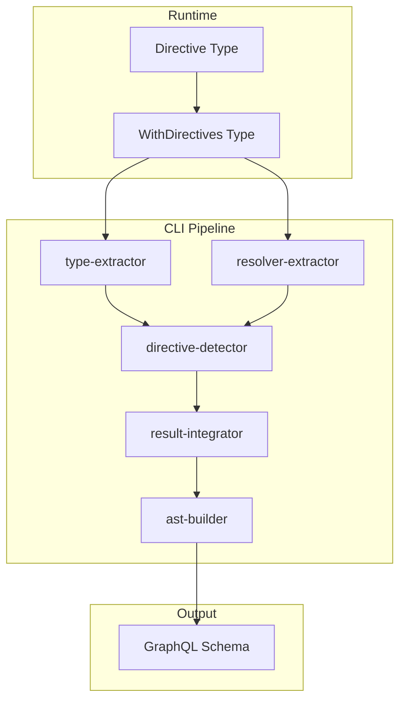
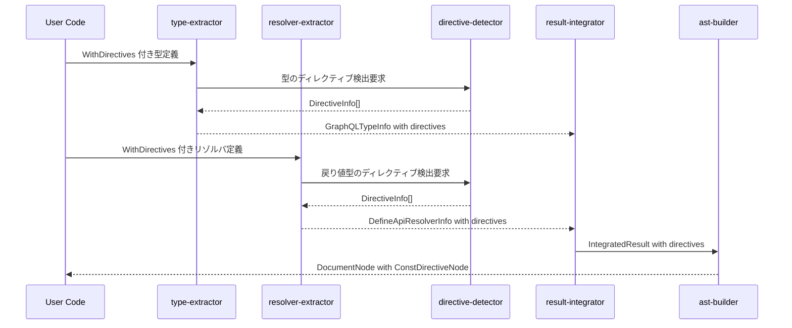
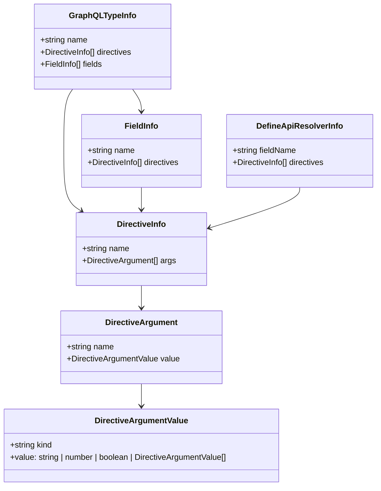

# Design Document

## Overview

**Purpose**: この機能は、gqlkit ユーザーが TypeScript の型定義およびリゾルバ定義に GraphQL ディレクティブ情報を付与し、生成される GraphQL スキーマにディレクティブを反映できるようにする。

**Users**: gqlkit を使用する GraphQL サーバー開発者が、認可 (`@auth`)、キャッシュ (`@cache`)、カスタムビジネスロジックなどのディレクティブを型安全に定義し、スキーマ生成時に自動的に出力させるために利用する。

**Impact**: 既存の型抽出・リゾルバ抽出・スキーマ生成パイプラインを拡張し、ディレクティブメタデータの抽出と GraphQL AST への出力を追加する。

### Goals

- TypeScript 型システムを活用したディレクティブの型安全な定義
- 型レベル・フィールドレベル両方でのディレクティブ付与
- 既存の `DefineScalar` パターンに倣ったメタデータ埋め込み方式
- 既存パイプライン構造を維持した拡張

### Non-Goals

- ディレクティブ定義 (directive definition) のスキーマ出力（SDL での `directive @auth(...) on FIELD_DEFINITION` 宣言）
- ディレクティブの実行時ロジック実装
- 引数のディレクティブ付与 (Input value directive)
- 列挙値のディレクティブ付与 (Enum value directive、@deprecated 以外)

## Architecture

### Existing Architecture Analysis

現在の gqlkit パイプラインは以下の構造を持つ:

1. **type-extractor**: TypeScript 型定義をスキャンし、`GraphQLTypeInfo` を生成
2. **resolver-extractor**: リゾルバ定義をスキャンし、`DefineApiResolverInfo` を生成
3. **result-integrator**: 両者を統合し、`IntegratedResult` を生成
4. **ast-builder**: 統合結果から GraphQL `DocumentNode` を構築

メタデータ埋め込みパターンとして `$gqlkitScalar` が既に確立されており、同様のパターンでディレクティブメタデータを埋め込む。

### Architecture Pattern & Boundary Map



**Architecture Integration**:
- Selected pattern: 既存のメタデータ埋め込みパターン (`$gqlkitScalar` 方式) を踏襲
- Domain boundaries: Runtime (型定義) / CLI Pipeline (抽出・生成) の分離を維持
- Existing patterns preserved: DefineScalar のメタデータプロパティパターン、extractors の構造
- New components: directive-detector モジュール (shared 配下)
- Steering compliance: No decorators、Pure static analysis、Deterministic output

### Technology Stack

| Layer | Choice / Version | Role in Feature | Notes |
|-------|------------------|-----------------|-------|
| Runtime | TypeScript 5.9+ | ユーティリティ型定義 | @gqlkit-ts/runtime |
| CLI | TypeScript Compiler API | ディレクティブメタデータ抽出 | 既存パターン踏襲 |
| Output | graphql-js | ConstDirectiveNode 生成 | Kind.DIRECTIVE |

## System Flows

### Directive Extraction Flow



## Requirements Traceability

| Requirement | Summary | Components | Interfaces | Flows |
|-------------|---------|------------|------------|-------|
| 1.1, 1.2, 1.3 | Directive 型定義 | DirectiveType | Directive<Name, Args> | - |
| 2.1, 2.2, 2.3, 2.4 | WithDirectives 型定義 | WithDirectivesType | WithDirectives<T, Ds> | - |
| 3.1, 3.2, 3.3, 3.4 | リゾルバへのディレクティブ付与 | WithDirectivesType, ResolverExtractor | QueryResolver, WithDirectives | Extraction Flow |
| 4.1, 4.2, 4.3, 4.4, 4.5 | 型からのディレクティブ抽出 | DirectiveDetector, TypeExtractor | DirectiveInfo, detectDirectiveMetadata | Extraction Flow |
| 5.1, 5.2, 5.3, 5.4 | リゾルバからのディレクティブ抽出 | DirectiveDetector, ResolverExtractor | DirectiveInfo | Extraction Flow |
| 6.1, 6.2, 6.3, 6.4, 6.5 | スキーマへのディレクティブ出力 | AstBuilder | ConstDirectiveNode | Extraction Flow |
| 7.1, 7.2, 7.3 | ディレクティブバリデーション | DirectiveDetector | Diagnostic | Extraction Flow |

## Components and Interfaces

| Component | Domain/Layer | Intent | Req Coverage | Key Dependencies | Contracts |
|-----------|--------------|--------|--------------|-----------------|-----------|
| DirectiveType | Runtime | ディレクティブ名と引数の型定義 | 1.1-1.3 | - | Type Definition |
| WithDirectivesType | Runtime | 型へのディレクティブ付与 | 2.1-2.4, 3.1-3.4 | Directive | Type Definition |
| DirectiveDetector | CLI/shared | ディレクティブメタデータ抽出 | 4.1-4.5, 5.1-5.4, 7.1-7.3 | TypeScript API (P0) | Service |
| TypeExtractorExt | CLI/type-extractor | 型定義からのディレクティブ抽出統合 | 4.1-4.5 | DirectiveDetector (P0) | Service |
| ResolverExtractorExt | CLI/resolver-extractor | リゾルバからのディレクティブ抽出統合 | 5.1-5.4 | DirectiveDetector (P0) | Service |
| AstBuilderExt | CLI/schema-generator | ディレクティブ AST 出力 | 6.1-6.5 | graphql-js (P0) | Service |

### Runtime Layer

#### DirectiveType

| Field | Detail |
|-------|--------|
| Intent | GraphQL ディレクティブの名前と引数を型安全に表現する |
| Requirements | 1.1, 1.2, 1.3 |

**Responsibilities & Constraints**
- ディレクティブ名を文字列リテラル型で表現
- 引数を `Record<string, unknown>` を継承する型で表現
- 実行時にはオーバーヘッドなし (型レベルのみ)

**Contracts**: Type Definition

```typescript
export type Directive<
  Name extends string,
  Args extends Record<string, unknown> = Record<string, never>,
> = {
  readonly " $directiveName": Name;
  readonly " $directiveArgs": Args;
};
```

**Implementation Notes**
- Phantom type pattern により型情報のみを保持
- 空のオブジェクト `{}` にメタデータプロパティを追加する形式

#### WithDirectivesType

| Field | Detail |
|-------|--------|
| Intent | 任意の型にディレクティブメタデータを付与する |
| Requirements | 2.1, 2.2, 2.3, 2.4, 3.1, 3.2, 3.3, 3.4 |

**Responsibilities & Constraints**
- 元の型 `T` の型情報を保持しつつディレクティブメタデータを追加
- 複数のディレクティブを配列として受け付け
- 型レベルでの交差型として実装

**Contracts**: Type Definition

```typescript
export type WithDirectives<
  T,
  Ds extends ReadonlyArray<Directive<string, Record<string, unknown>>>,
> = T & {
  readonly " $gqlkitDirectives"?: Ds;
};
```

**Implementation Notes**
- `$gqlkitScalar` と同様のスペースプレフィックスによる衝突回避
- Optional property (`?`) により実行時の値不要

### CLI/shared Layer

#### DirectiveDetector

| Field | Detail |
|-------|--------|
| Intent | TypeScript 型からディレクティブメタデータを抽出する |
| Requirements | 4.1, 4.2, 4.3, 4.4, 4.5, 5.1, 5.2, 5.3, 5.4, 7.1, 7.2, 7.3 |

**Responsibilities & Constraints**
- `$gqlkitDirectives` プロパティの検出
- ディレクティブ名と引数の型情報解析
- 引数値のリテラル型からの解決
- バリデーションエラーの診断生成

**Dependencies**
- Inbound: TypeExtractor, ResolverExtractor - メタデータ検出要求 (P0)
- External: TypeScript Compiler API - 型解析 (P0)

**Contracts**: Service

##### Service Interface

```typescript
interface DirectiveInfo {
  readonly name: string;
  readonly args: ReadonlyArray<DirectiveArgument>;
}

interface DirectiveArgument {
  readonly name: string;
  readonly value: DirectiveArgumentValue;
}

type DirectiveArgumentValue =
  | { readonly kind: "string"; readonly value: string }
  | { readonly kind: "number"; readonly value: number }
  | { readonly kind: "boolean"; readonly value: boolean }
  | { readonly kind: "enum"; readonly value: string }
  | { readonly kind: "list"; readonly values: ReadonlyArray<DirectiveArgumentValue> }
  | { readonly kind: "object"; readonly fields: ReadonlyArray<DirectiveArgument> };

interface DirectiveDetectionResult {
  readonly directives: ReadonlyArray<DirectiveInfo>;
  readonly errors: ReadonlyArray<DirectiveDetectionError>;
}

interface DirectiveDetectionError {
  readonly code: "EMPTY_DIRECTIVE_NAME" | "UNRESOLVABLE_ARGUMENT";
  readonly message: string;
}

function detectDirectiveMetadata(
  type: ts.Type,
  checker: ts.TypeChecker,
): DirectiveDetectionResult;
```

- Preconditions: type は有効な TypeScript 型、checker は同一プログラムの TypeChecker
- Postconditions: WithDirectives が適用されていない場合は空配列を返す
- Invariants: ディレクティブの順序は型定義での記述順を保持

**Implementation Notes**
- `metadata-detector.ts` の `getActualMetadataType` パターンを再利用
- 引数値の解決は TypeScript の型情報から直接取得 (リテラル型)
- 配列リテラル型の各要素を再帰的に解析

### CLI/type-extractor Layer

#### TypeExtractorExt (type-extractor 拡張)

| Field | Detail |
|-------|--------|
| Intent | 型定義からディレクティブを抽出し GraphQLTypeInfo に追加 |
| Requirements | 4.1, 4.2, 4.3, 4.4, 4.5 |

**Responsibilities & Constraints**
- 型レベルディレクティブ (`WithDirectives` でラップされた型)
- フィールドレベルディレクティブ (`WithDirectives` でラップされたフィールド型)
- 既存の型抽出フローへの統合

**Dependencies**
- Inbound: extractTypesFromProgram - 型抽出処理 (P0)
- Outbound: DirectiveDetector - ディレクティブ検出 (P0)

**Contracts**: Service (既存インターフェース拡張)

##### Data Model Extension

```typescript
// types/graphql.ts への追加
interface FieldInfo {
  readonly name: string;
  readonly type: GraphQLFieldType;
  readonly description: string | null;
  readonly deprecated: DeprecationInfo | null;
  readonly directives: ReadonlyArray<DirectiveInfo> | null; // 追加
}

interface GraphQLTypeInfo {
  readonly name: string;
  readonly kind: GraphQLTypeKind;
  readonly fields: ReadonlyArray<FieldInfo> | null;
  readonly unionMembers: ReadonlyArray<string> | null;
  readonly enumValues: ReadonlyArray<EnumValueInfo> | null;
  readonly sourceFile: string;
  readonly description: string | null;
  readonly deprecated: DeprecationInfo | null;
  readonly directives: ReadonlyArray<DirectiveInfo> | null; // 追加
}
```

**Implementation Notes**
- `extractFieldsFromType` でフィールドごとにディレクティブを検出
- 型自体のディレクティブは型定義時に検出
- null 許容により既存コードへの影響を最小化

### CLI/resolver-extractor Layer

#### ResolverExtractorExt (resolver-extractor 拡張)

| Field | Detail |
|-------|--------|
| Intent | リゾルバ定義からディレクティブを抽出し DefineApiResolverInfo に追加 |
| Requirements | 5.1, 5.2, 5.3, 5.4 |

**Responsibilities & Constraints**
- 戻り値型に `WithDirectives` が適用されている場合のディレクティブ抽出
- Query/Mutation/Field 全てのリゾルバタイプをサポート
- 既存のリゾルバ抽出フローへの統合

**Dependencies**
- Inbound: extractDefineApiResolvers - リゾルバ抽出処理 (P0)
- Outbound: DirectiveDetector - ディレクティブ検出 (P0)

**Contracts**: Service (既存インターフェース拡張)

##### Data Model Extension

```typescript
// resolver-extractor/extractor/define-api-extractor.ts への追加
interface DefineApiResolverInfo {
  readonly fieldName: string;
  readonly resolverType: DefineApiResolverType;
  readonly parentTypeName: string | null;
  readonly argsType: TSTypeReference | null;
  readonly args: ReadonlyArray<ArgumentDefinition> | null;
  readonly returnType: TSTypeReference;
  readonly sourceFile: string;
  readonly exportedInputTypes: ReadonlyArray<ExportedInputType>;
  readonly description: string | null;
  readonly deprecated: DeprecationInfo | null;
  readonly directives: ReadonlyArray<DirectiveInfo> | null; // 追加
}
```

**Resolver API Signature (B案採用)**

```typescript
// 3番目の型パラメータとしてディレクティブ付き型を指定
export const me = defineQuery<
  NoArgs,
  User,
  WithDirectives<User, [AuthDirective<["USER"]>]>  // ディレクティブ情報
>((_root, _args, ctx) => {
  return { id: "123" as IDString };
});

// 型シグネチャ
export type QueryResolver<
  TArgs,
  TResult,
  TDirectiveResult extends WithDirectives<TResult, Directive<string, Record<string, unknown>>[]> = TResult,
> = ...
```

**Implementation Notes**
- `extractTypeArgumentsFromCall` で3番目の型引数からディレクティブを検出
- 3番目の型パラメータが指定されている場合のみディレクティブ情報を抽出
- WithDirectives でラップされた型から内部型とディレクティブを分離

### CLI/schema-generator Layer

#### AstBuilderExt (ast-builder 拡張)

| Field | Detail |
|-------|--------|
| Intent | ディレクティブ情報から ConstDirectiveNode を生成 |
| Requirements | 6.1, 6.2, 6.3, 6.4, 6.5 |

**Responsibilities & Constraints**
- DirectiveInfo から ConstDirectiveNode への変換
- 引数値の GraphQL 値ノードへの変換
- 型定義・フィールド定義両方でのディレクティブ出力

**Dependencies**
- Inbound: buildDocumentNode - AST 構築処理 (P0)
- External: graphql-js - AST ノード型 (P0)

**Contracts**: Service (既存関数拡張)

##### Service Interface

```typescript
function buildDirectiveNodes(
  directives: ReadonlyArray<DirectiveInfo> | null,
): ReadonlyArray<ConstDirectiveNode>;

function buildDirectiveArgumentValue(
  value: DirectiveArgumentValue,
): ConstValueNode;
```

**Implementation Notes**
- 既存の `buildDeprecatedDirective` パターンを一般化
- 引数値は ConstValueNode (StringValueNode, IntValueNode, ListValueNode など) に変換
- ディレクティブは定義順を保持して出力

## Data Models

### Domain Model



### Logical Data Model

**DirectiveInfo**: ディレクティブの名前と引数のリストを表現。名前は GraphQL のディレクティブ名 (@なしの文字列)。

**DirectiveArgument**: ディレクティブ引数の名前と値のペア。

**DirectiveArgumentValue**: 引数値の多態型。GraphQL の ConstValue に対応:
- string: 文字列リテラル
- number: 整数または浮動小数点数
- boolean: true/false
- enum: 列挙値 (クォートなし文字列)
- list: 配列
- object: 入力オブジェクト

## Error Handling

### Error Strategy

ディレクティブ関連のエラーは Diagnostic として報告し、既存のエラーハンドリングパターンに統合する。

### Error Categories and Responses

**User Errors (バリデーションエラー)**:
- `EMPTY_DIRECTIVE_NAME`: ディレクティブ名が空文字列の場合
- `UNRESOLVABLE_ARGUMENT`: 引数値が型情報から解決できない場合

**Error Response Format**:

```typescript
interface Diagnostic {
  readonly code: string;
  readonly message: string;
  readonly severity: "error" | "warning";
  readonly location: {
    readonly file: string;
    readonly line: number;
    readonly column: number;
  } | null;
}
```

### Monitoring

既存の gen-orchestrator の診断レポート機能を使用。ディレクティブ関連エラーは既存のエラーコード体系に統合。

## Testing Strategy

### Unit Tests (golden file tests)

- `testdata/directive-basic/`: 基本的なディレクティブ付与 (型レベル、フィールドレベル)
- `testdata/directive-args/`: 各種引数型 (string, number, boolean, enum, list, object)
- `testdata/directive-multiple/`: 複数ディレクティブの付与と順序保持
- `testdata/directive-resolver/`: Query/Mutation/Field リゾルバへのディレクティブ付与

### Integration Tests

- 型抽出からスキーマ生成までの E2E フロー
- ディレクティブ情報が正しく GraphQL SDL に出力されることの検証

### Validation Tests

- 空のディレクティブ名エラー
- 解決不能な引数値エラー
- 診断メッセージの位置情報正確性

## Supporting References

### Directive Argument Value Mapping

| TypeScript Type | DirectiveArgumentValue kind | GraphQL ConstValue |
|-----------------|---------------------------|-------------------|
| string literal | "string" | StringValue |
| number literal | "number" | IntValue / FloatValue |
| boolean literal | "boolean" | BooleanValue |
| string enum member | "enum" | EnumValue |
| tuple/array literal | "list" | ListValue |
| object literal | "object" | ObjectValue |
