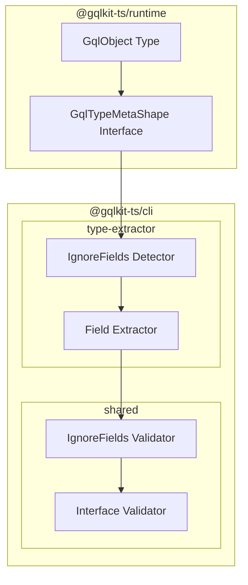
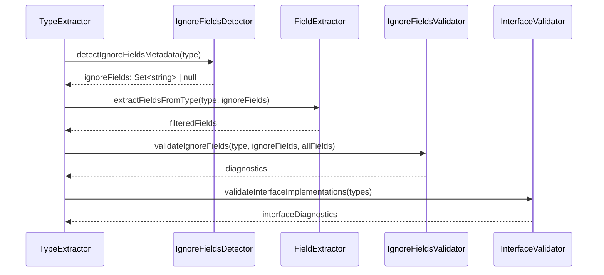

# Technical Design Document: ignore-fields

## Overview

**Purpose**: 本機能は `GqlObject` の第2型引数に `ignoreFields` オプションを追加し、TypeScript 型には存在するが GraphQL スキーマからは除外するフィールドを宣言する機能を提供する。

**Users**: gqlkit ユーザーは、内部ロジックで使用するフィールド（DB の内部 ID、キャッシュキー、計算用の中間値など）を GraphQL API から隠蔽しつつ、TypeScript の型安全性を維持できる。

**Impact**: 既存の `GqlTypeMetaShape` インターフェースと `GqlObject` 型定義を拡張し、CLI の型抽出パイプラインにフィールドフィルタリングロジックを追加する。

### Goals

- `GqlObject<T, { ignoreFields: "field1" | "field2" }>` 形式で除外フィールドを宣言可能にする
- Object Type と Input Object Type の両方で ignoreFields をサポートする
- 既存メタデータ（`directives`, `implements`）との併用を可能にする
- 不正な指定に対して明確なエラーメッセージを提供する
- Interface 実装時の整合性検証を行う

### Non-Goals

- フィールドレベルの `GqlField` での ignoreFields サポート（型レベルのみ）
- 動的なフィールド除外（コンパイル時に確定）
- Union Type での ignoreFields サポート（Union にはフィールドがないため）

## Architecture

### Existing Architecture Analysis

**現在の `GqlObject` 構造**:
```typescript
export type GqlObject<
  T,
  Meta extends {
    directives?: ReadonlyArray<GqlDirective<...>>;
    implements?: ReadonlyArray<GqlInterfaceMarker>;
  } = { directives: [] },
> = T & {
  readonly " $gqlkitTypeMeta"?: GqlTypeMetaShape<Meta>;
  readonly " $gqlkitOriginalType"?: T;
};
```

**型抽出パイプライン**:
1. `type-extractor` が TypeScript ソースをスキャン
2. `extractFieldsFromType` が型のプロパティを抽出
3. ` $` プレフィックスで始まるメタデータプロパティはスキップ
4. `interface-detector` が `implements` メタデータを抽出
5. `interface-validator` が Interface 実装の整合性を検証

**拡張ポイント**:
- `GqlTypeMetaShape` に `ignoreFields` プロパティを追加
- `extractFieldsFromType` でフィールドフィルタリングを実行
- 新規バリデータで ignoreFields の妥当性を検証

### Architecture Pattern & Boundary Map



**Architecture Integration**:
- Selected pattern: 既存のメタデータ抽出パターンを踏襲（intersection type + metadata property）
- Domain boundaries: Runtime は型定義のみ、CLI は抽出・検証ロジック
- Existing patterns preserved: `$gqlkitTypeMeta` によるメタデータ埋め込み、TypeScript Compiler API による型解析
- New components rationale: ignoreFields 専用の detector と validator を追加し、関心の分離を維持
- Steering compliance: 静的解析のみ、デコレータ不使用、graphql-tools 互換出力

### Technology Stack

| Layer | Choice / Version | Role in Feature | Notes |
|-------|------------------|-----------------|-------|
| Runtime | TypeScript 5.9+ | 型定義 | `GqlTypeMetaShape` 拡張 |
| CLI | TypeScript Compiler API | 型解析 | 既存パターン継続 |

## System Flows

### ignoreFields 抽出・検証フロー



**Key Decisions**:
- ignoreFields 検出は extractFieldsFromType の前に実行し、フィルタリング条件を準備
- バリデーションは抽出完了後に実行し、全フィールド情報を参照可能にする
- Interface バリデーションは既存ロジックを活用（フィルタ後のフィールドを検証）

## Requirements Traceability

| Requirement | Summary | Components | Interfaces | Flows |
|-------------|---------|------------|------------|-------|
| 1.1 | ignoreFields プロパティ提供 | GqlTypeMetaShape | GqlObject | - |
| 1.2 | ignoreFields 指定フィールドの除外 | IgnoreFieldsDetector, FieldExtractor | ExtractFieldsParams | 抽出・検証フロー |
| 1.3 | ignoreFields 未指定時の全フィールド含有 | FieldExtractor | ExtractFieldsParams | - |
| 2.1 | Object Type での ignoreFields | FieldExtractor | ExtractFieldsParams | 抽出・検証フロー |
| 2.2 | 除外フィールドのリゾルバ非生成 | FieldExtractor | - | - |
| 2.3 | 非除外フィールドの保持 | FieldExtractor | - | - |
| 3.1 | Input Object Type での ignoreFields | FieldExtractor | ExtractFieldsParams | 抽出・検証フロー |
| 3.2 | Input フィールドの属性保持 | FieldExtractor | - | - |
| 4.1 | ignoreFields + implements 併用 | GqlTypeMetaShape, FieldExtractor | - | - |
| 4.2 | ignoreFields + directives 併用 | GqlTypeMetaShape, FieldExtractor | - | - |
| 4.3 | 全メタデータオプション併用 | GqlTypeMetaShape | GqlObject | - |
| 5.1 | 存在しないフィールド名エラー | IgnoreFieldsValidator | ValidateIgnoreFieldsResult | 抽出・検証フロー |
| 5.2 | 全フィールド除外エラー | IgnoreFieldsValidator | ValidateIgnoreFieldsResult | 抽出・検証フロー |
| 5.3 | 抽出フェーズでのバリデーション | IgnoreFieldsValidator | - | 抽出・検証フロー |
| 6.1 | Interface 必須フィールド除外エラー | InterfaceValidator | InterfaceValidationResult | 抽出・検証フロー |
| 6.2 | Interface フィールド残存検証 | InterfaceValidator | InterfaceValidationResult | 抽出・検証フロー |

## Components and Interfaces

| Component | Domain/Layer | Intent | Req Coverage | Key Dependencies (P0/P1) | Contracts |
|-----------|--------------|--------|--------------|--------------------------|-----------|
| GqlTypeMetaShape | Runtime | ignoreFields メタデータ型定義 | 1.1, 4.1, 4.2, 4.3 | None | Service |
| IgnoreFieldsDetector | CLI/shared | ignoreFields メタデータ抽出 | 1.2 | TypeChecker (P0) | Service |
| FieldExtractor (既存拡張) | CLI/type-extractor | フィールド抽出とフィルタリング | 1.2, 1.3, 2.1-2.3, 3.1-3.2 | IgnoreFieldsDetector (P0) | Service |
| IgnoreFieldsValidator | CLI/shared | ignoreFields バリデーション | 5.1-5.3 | None | Service |
| InterfaceValidator (既存拡張) | CLI/shared | Interface 整合性検証 | 6.1, 6.2 | None | Service |

### Runtime

#### GqlTypeMetaShape

| Field | Detail |
|-------|--------|
| Intent | ignoreFields を含むメタデータ型定義を提供 |
| Requirements | 1.1, 4.1, 4.2, 4.3 |

**Responsibilities & Constraints**
- `ignoreFields` プロパティを `GqlTypeMetaShape` に追加
- 既存の `directives` と `implements` との併用をサポート
- 型制約として `keyof T` のサブセットを受け入れる

**Dependencies**
- None

**Contracts**: Service [x]

##### Service Interface

```typescript
export interface GqlTypeMetaShape<
  Meta extends {
    directives?: ReadonlyArray<GqlDirective<string, Record<string, unknown>, DirectiveLocation | DirectiveLocation[]>>;
    implements?: ReadonlyArray<GqlInterfaceMarker>;
    ignoreFields?: string;
  },
> {
  readonly directives?: Meta["directives"];
  readonly implements?: Meta["implements"];
  readonly ignoreFields?: Meta["ignoreFields"];
}

export type GqlObject<
  T,
  Meta extends {
    directives?: ReadonlyArray<GqlDirective<string, Record<string, unknown>, DirectiveLocation | DirectiveLocation[]>>;
    implements?: ReadonlyArray<GqlInterfaceMarker>;
    ignoreFields?: keyof T & string;
  } = { directives: [] },
> = T & {
  readonly " $gqlkitTypeMeta"?: GqlTypeMetaShape<Meta>;
  readonly " $gqlkitOriginalType"?: T;
};
```

- Preconditions: `Meta.ignoreFields` は `T` のキーのサブセットである
- Postconditions: メタデータが型に埋め込まれる
- Invariants: 既存メタデータプロパティとの互換性維持

**Implementation Notes**
- Integration: 既存の `GqlTypeMetaShape` を拡張、後方互換性を維持
- Validation: TypeScript 型システムによる静的検証（存在しないフィールド名は型エラー）
- Risks: なし（純粋な型定義の拡張）

### CLI/shared

#### IgnoreFieldsDetector

| Field | Detail |
|-------|--------|
| Intent | TypeScript 型から ignoreFields メタデータを抽出 |
| Requirements | 1.2 |

**Responsibilities & Constraints**
- `$gqlkitTypeMeta` から `ignoreFields` プロパティを検出
- String literal union を解析して除外フィールド名セットを構築
- 検出失敗時は null を返却

**Dependencies**
- Inbound: TypeExtractor -- ignoreFields 検出依頼 (P0)
- External: TypeScript Compiler API -- 型解析 (P0)

**Contracts**: Service [x]

##### Service Interface

```typescript
interface DetectIgnoreFieldsParams {
  readonly type: ts.Type;
  readonly checker: ts.TypeChecker;
}

interface DetectIgnoreFieldsResult {
  readonly ignoreFields: ReadonlySet<string> | null;
}

function detectIgnoreFieldsMetadata(
  params: DetectIgnoreFieldsParams
): DetectIgnoreFieldsResult;
```

- Preconditions: type は有効な TypeScript Type オブジェクト
- Postconditions: ignoreFields が設定されていれば Set を、なければ null を返却
- Invariants: 結果は型情報のみに依存（副作用なし）

**Implementation Notes**
- Integration: `interface-detector.ts` と同様のパターンで `$gqlkitTypeMeta` からメタデータを抽出
- Validation: 抽出ロジック自体はバリデーションを行わない（IgnoreFieldsValidator に委譲）
- Risks: TypeScript の型解析における union 型の展開方法に依存

#### IgnoreFieldsValidator

| Field | Detail |
|-------|--------|
| Intent | ignoreFields 指定の妥当性を検証 |
| Requirements | 5.1, 5.2, 5.3 |

**Responsibilities & Constraints**
- 指定されたフィールド名が型に存在するか検証
- 全フィールド除外の検出と報告
- アクショナブルなエラーメッセージの生成

**Dependencies**
- Inbound: TypeExtractor -- バリデーション依頼 (P0)

**Contracts**: Service [x]

##### Service Interface

```typescript
interface ValidateIgnoreFieldsParams {
  readonly typeName: string;
  readonly ignoreFields: ReadonlySet<string>;
  readonly allFieldNames: ReadonlySet<string>;
  readonly sourceLocation: SourceLocation;
}

interface ValidateIgnoreFieldsResult {
  readonly isValid: boolean;
  readonly diagnostics: ReadonlyArray<Diagnostic>;
}

function validateIgnoreFields(
  params: ValidateIgnoreFieldsParams
): ValidateIgnoreFieldsResult;
```

- Preconditions: allFieldNames はフィルタリング前の全フィールド名
- Postconditions: 検証結果と diagnostics を返却
- Invariants: エラーメッセージには利用可能なフィールド名を含める

**Implementation Notes**
- Integration: 既存の Diagnostic 形式を使用し、エラーコードは新規定義（`IGNORE_FIELD_NOT_FOUND`, `IGNORE_ALL_FIELDS`）
- Validation: 5.1 存在しないフィールド名、5.2 全フィールド除外
- Risks: なし

### CLI/type-extractor

#### FieldExtractor (既存拡張)

| Field | Detail |
|-------|--------|
| Intent | 型からフィールドを抽出し、ignoreFields でフィルタリング |
| Requirements | 1.2, 1.3, 2.1-2.3, 3.1-3.2 |

**Responsibilities & Constraints**
- 既存の `extractFieldsFromType` 関数を拡張
- ignoreFields が指定されている場合、該当フィールドを除外
- 非除外フィールドの型・説明・デフォルト値を保持

**Dependencies**
- Inbound: TypeExtractor -- フィールド抽出依頼 (P0)
- Outbound: IgnoreFieldsDetector -- ignoreFields 取得 (P0)
- External: TypeScript Compiler API -- プロパティ抽出 (P0)

**Contracts**: Service [x]

##### Service Interface

```typescript
interface ExtractFieldsParams {
  readonly type: ts.Type;
  readonly checker: ts.TypeChecker;
  readonly globalTypeMappings: ReadonlyArray<GlobalTypeMapping>;
  readonly knownTypeNames: ReadonlySet<string>;
  readonly knownTypeSymbols: ReadonlyMap<string, ts.Symbol>;
  readonly underlyingSymbolToTypeName: ReadonlyMap<ts.Symbol, string>;
  readonly sourceFiles: ReadonlySet<string>;
  readonly scalarMappingTable: ScalarBaseTypeMappingTable | null;
  readonly scalarMappingContext: ScalarMappingContext;
  // 新規追加
  readonly ignoreFields: ReadonlySet<string> | null;
}

interface FieldExtractionResult {
  readonly fields: FieldDefinition[];
  readonly diagnostics: Diagnostic[];
}

function extractFieldsFromType(
  params: ExtractFieldsParams
): FieldExtractionResult;
```

- Preconditions: ignoreFields が null の場合は全フィールドを抽出
- Postconditions: ignoreFields に含まれるフィールドは除外
- Invariants: ` $` プレフィックスのメタデータプロパティは常にスキップ

**Implementation Notes**
- Integration: 既存の `extractFieldsFromType` にパラメータ追加、フィルタリングロジック挿入
- Validation: フィールドループ内で ignoreFields.has(propName) をチェック
- Risks: 既存テストへの影響（パラメータ追加による破壊的変更）

### CLI/shared (既存拡張)

#### InterfaceValidator (既存拡張)

| Field | Detail |
|-------|--------|
| Intent | Interface 実装時の ignoreFields による整合性違反を検出 |
| Requirements | 6.1, 6.2 |

**Responsibilities & Constraints**
- Interface のフィールドが ignoreFields で除外されている場合にエラー報告
- 既存の `validateInterfaceImplementations` を活用

**Dependencies**
- Inbound: ResultIntegrator -- Interface バリデーション依頼 (P0)

**Contracts**: Service [x]

##### Service Interface

既存の `validateInterfaceImplementations` は変更不要。ignoreFields によるフィルタリング後のフィールドリストが渡されるため、自動的に「Interface フィールドが存在しない」エラーが検出される。

```typescript
// 既存インターフェース（変更なし）
function validateInterfaceImplementations(
  types: ReadonlyArray<GraphQLTypeInfo>
): InterfaceValidationResult;
```

- Preconditions: types には ignoreFields フィルタリング後のフィールドが含まれる
- Postconditions: Interface フィールドが欠落している場合は `INTERFACE_MISSING_FIELD` エラー
- Invariants: エラーメッセージ形式は既存と同一

**Implementation Notes**
- Integration: 追加実装不要、既存ロジックが適用される
- Validation: 6.1, 6.2 は既存の `INTERFACE_MISSING_FIELD` エラーでカバー
- Risks: なし

## Data Models

### Domain Model

**ignoreFields メタデータ**:
- `ignoreFields` は string literal union として表現
- TypeScript 型システムで `keyof T & string` に制約
- Runtime では型情報のみ（実行時の値は存在しない）

### Logical Data Model

**ExtractedTypeInfo への影響**:
- `fields` は ignoreFields フィルタリング後のフィールドのみ含む
- `metadata` に ignoreFields 情報は含めない（CLI 内部でのみ使用）

## Error Handling

### Error Categories and Responses

**User Errors (Diagnostic)**:

| Error Code | Condition | Message Template |
|------------|-----------|------------------|
| `IGNORE_FIELD_NOT_FOUND` | ignoreFields に存在しないフィールド名 | `Type '{typeName}': ignoreFields contains unknown field '{fieldName}'. Available fields: {availableFields}` |
| `IGNORE_ALL_FIELDS` | ignoreFields で全フィールド除外 | `Type '{typeName}': ignoreFields excludes all fields. At least one field must remain.` |
| `INTERFACE_MISSING_FIELD` | Interface フィールドが ignoreFields で除外 | (既存) `Type '{typeName}' implements interface '{interfaceName}' but is missing field '{fieldName}'` |

### Monitoring

既存の Diagnostic レポーティング機構を使用。新規エラーコードは severity: "error" で報告。

## Testing Strategy

### Golden File Tests

本機能は golden file テストで検証する。以下のテストケースを `packages/cli/src/gen-orchestrator/testdata/` に追加:

| Test Case | Description | Requirement Coverage |
|-----------|-------------|---------------------|
| `ignore-fields-basic` | 基本的な ignoreFields 動作 | 1.1-1.3, 2.1-2.3 |
| `ignore-fields-input` | Input Object Type での ignoreFields | 3.1, 3.2 |
| `ignore-fields-with-implements` | Interface 実装との併用 | 4.1, 6.1, 6.2 |
| `ignore-fields-with-directives` | Directives との併用 | 4.2, 4.3 |
| `ignore-fields-error-unknown-field` | 存在しないフィールド名エラー | 5.1, 5.3 |
| `ignore-fields-error-all-fields` | 全フィールド除外エラー | 5.2, 5.3 |
| `ignore-fields-error-interface-field` | Interface フィールド除外エラー | 6.1, 6.2 |

### Unit Tests (Minimal)

- `detectIgnoreFieldsMetadata`: メタデータ抽出ロジックの境界ケース
- `validateIgnoreFields`: バリデーションロジックの境界ケース
