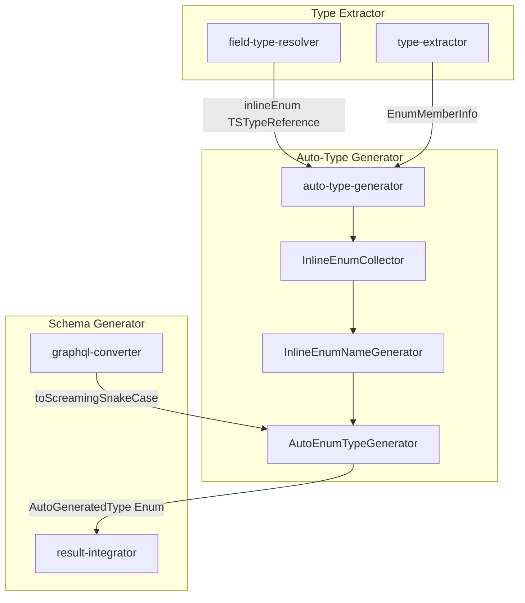
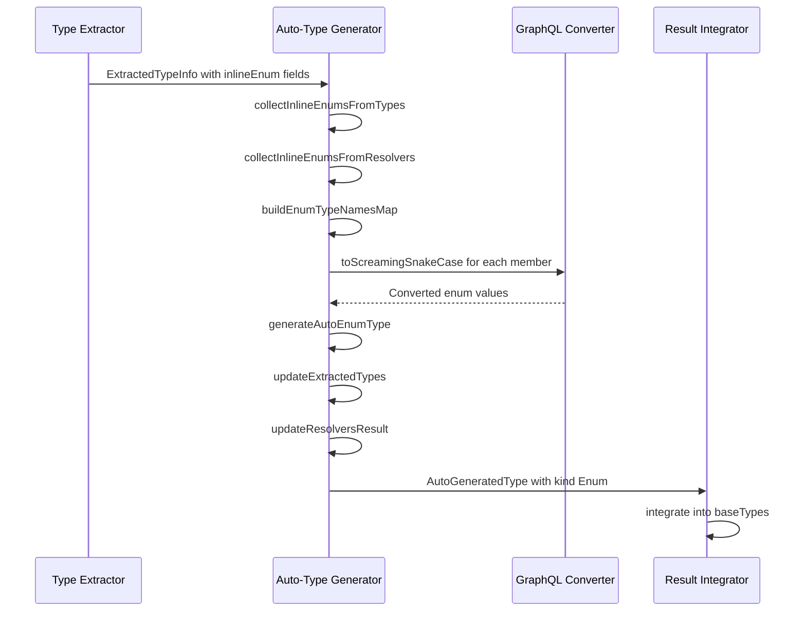
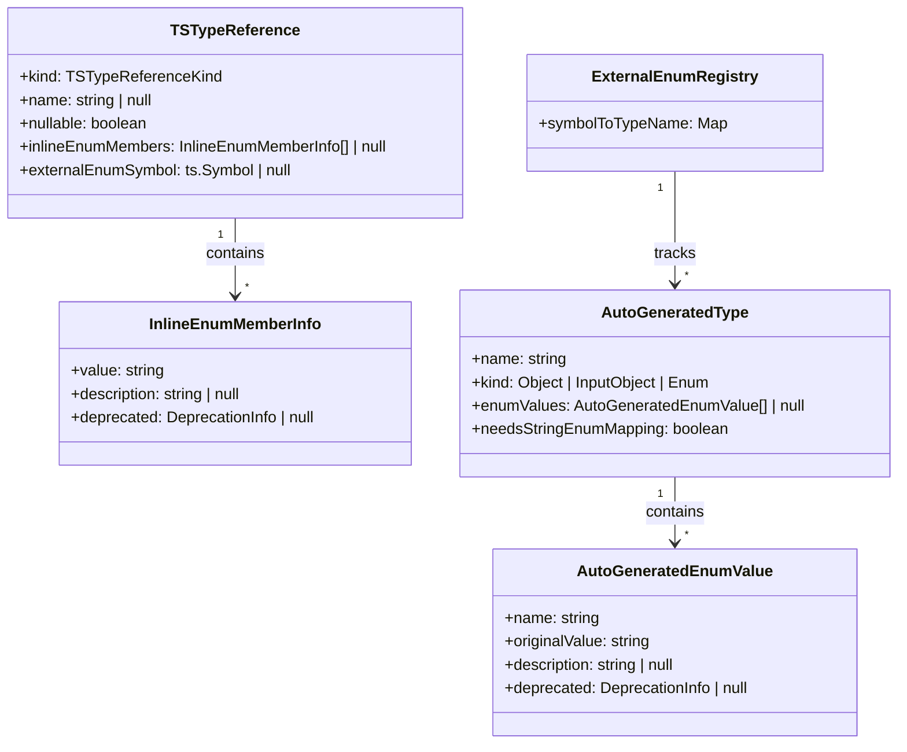

# Design Document: inline-enum

## Overview

**Purpose**: フィールドや引数の型定義にインラインで記述された string literal union および TypeScript enum を自動的に GraphQL enum 型として生成する機能を提供する。

**Users**: gqlkit ユーザーは、明示的な型定義なしに enum 型を利用でき、既存の TypeScript enum をスキーマにエクスポートせずに再利用できる。

**Impact**: 既存の auto-type-generator パイプラインを拡張し、inline object 型と同様のパターンで inline enum 型を処理する。

### Goals

- フィールド/引数にインラインで記述された string literal union を自動で GraphQL enum 型に変換
- スキーマ外の TypeScript enum を参照した場合も自動で GraphQL enum 型を生成
- 既存の auto-type-generator の命名規則に従った予測可能な enum 型名の生成
- TSDoc コメントの GraphQL スキーマへの反映

### Non-Goals

- スキーマディレクトリ内でエクスポートされた enum の動作変更（従来通り knownTypeNames として扱う）
- 数値 enum のインライン参照サポート（スキーマ外参照は string enum のみ）
- 複雑なジェネリクス型内の enum 抽出

## Architecture

### Existing Architecture Analysis

現在の auto-type-generator は以下の流れで inline object 型を処理している:

1. **収集フェーズ**: `collectInlineObjectsFromType()` / `collectInlineObjectsFromResolvers()` で inline object を検出
2. **命名フェーズ**: `buildGeneratedTypeNamesMap()` で context に基づく型名を生成
3. **生成フェーズ**: `generateAutoType()` で `AutoGeneratedType` を生成
4. **更新フェーズ**: `updateExtractedTypes()` / `updateResolversResult()` で参照を置換

この既存パターンを拡張し、inline enum についても同様の処理を行う。

### Architecture Pattern & Boundary Map



**Architecture Integration**:
- 選択パターン: 既存 auto-type-generator パイプラインの拡張
- ドメイン境界: Type Extractor が enum 情報を抽出、Auto-Type Generator が自動型を生成
- 既存パターン維持: inline object と同じ収集-命名-生成-更新フロー
- 新規コンポーネント: inline enum 収集・生成ロジックを auto-type-generator 内に追加
- Steering 準拠: 2-phase type extraction パターンを維持し、knownTypeNames による判定を尊重

### Technology Stack

| Layer | Choice / Version | Role in Feature | Notes |
|-------|------------------|-----------------|-------|
| Backend / Services | TypeScript Compiler API | inline enum 検出とメンバー抽出 | 既存の field-type-resolver を拡張 |

## System Flows

### Inline Enum Detection and Generation Flow



**Key Decisions**:
- inline enum の検出は field-type-resolver 内で `TSTypeReference` に `inlineEnumMembers` を付加することで行う
- SCREAMING_SNAKE_CASE 変換は既存の `toScreamingSnakeCase()` を共有利用
- 同一 TypeScript enum の複数参照は単一の GraphQL enum 型にマージ

## Requirements Traceability

| Requirement | Summary | Components | Interfaces | Flows |
|-------------|---------|------------|------------|-------|
| 1.1 | フィールド型の string literal union 検出 | field-type-resolver | resolveFieldType | Detection Flow |
| 1.2 | 引数型の string literal union 検出 | define-api-extractor | - | Detection Flow |
| 1.3 | nullable string literal union 処理 | field-type-resolver | TSTypeReference | Detection Flow |
| 1.4 | SCREAMING_SNAKE_CASE 変換 | graphql-converter, auto-type-generator | toScreamingSnakeCase | Generation Flow |
| 2.1 | フィールド型のスキーマ外 enum 検出 | field-type-resolver | resolveFieldType | Detection Flow |
| 2.2 | 引数型のスキーマ外 enum 検出 | define-api-extractor | - | Detection Flow |
| 2.3 | knownTypeNames によるスキップ判定 | field-type-resolver | isKnownSchemaType | Detection Flow |
| 2.4 | TypeScript enum の SCREAMING_SNAKE_CASE 変換 | graphql-converter, auto-type-generator | toScreamingSnakeCase | Generation Flow |
| 3.1 | Object フィールドの命名規則 | naming-convention | generateAutoTypeName | Generation Flow |
| 3.2 | Input フィールドの命名規則 | naming-convention | generateAutoTypeName | Generation Flow |
| 3.3 | Query/Mutation 引数の命名規則 | naming-convention | generateAutoTypeName | Generation Flow |
| 3.4 | Field resolver 引数の命名規則 | naming-convention | generateAutoTypeName | Generation Flow |
| 4.1 | 配列内 string literal union 処理 | field-type-resolver | resolveFieldType | Detection Flow |
| 4.2 | nullable 配列要素処理 | field-type-resolver | TSTypeReference | Detection Flow |
| 5.1 | 同一 union の独立生成 | auto-type-generator | - | Generation Flow |
| 5.2 | 同一 TypeScript enum のマージ | auto-type-generator | ExternalEnumRegistry | Generation Flow |
| 5.3 | 型名競合エラー | name-collision-validator | validateNameCollisions | Validation |
| 6.1 | TSDoc コメント反映 | type-extractor | extractTsDocFromSymbol | Detection Flow |
| 6.2 | enum 値の TSDoc 反映 | type-extractor | extractEnumMembers | Detection Flow |
| 6.3 | @deprecated ディレクティブ | type-extractor, graphql-converter | DeprecationInfo | Generation Flow |

## Components and Interfaces

| Component | Domain/Layer | Intent | Req Coverage | Key Dependencies | Contracts |
|-----------|--------------|--------|--------------|------------------|-----------|
| field-type-resolver | Type Extractor | inline enum 検出と TSTypeReference 生成 | 1.1, 1.3, 2.1, 2.3, 4.1, 4.2 | TypeScript API (P0) | Service |
| auto-type-generator | Auto-Type Generator | inline enum の収集・命名・生成 | 1.4, 2.4, 3.1-3.4, 5.1, 5.2 | field-type-resolver (P0), naming-convention (P0), graphql-converter (P1) | Service |
| naming-convention | Auto-Type Generator | enum 型名生成 | 3.1-3.4 | - | Service |
| graphql-converter | Type Extractor | SCREAMING_SNAKE_CASE 変換と重複検出 | 1.4, 2.4 | - | Service |
| name-collision-validator | Auto-Type Generator | 型名競合検証 | 5.3 | - | Service |

### Type Extractor Layer

#### field-type-resolver (Extension)

| Field | Detail |
|-------|--------|
| Intent | inline enum (string literal union, スキーマ外 TypeScript enum) を検出し TSTypeReference に情報を付加 |
| Requirements | 1.1, 1.3, 2.1, 2.3, 4.1, 4.2 |

**Responsibilities & Constraints**
- string literal union を `inlineEnum` として検出し、メンバー情報を `TSTypeReference` に付加
- スキーマ外の TypeScript enum 参照を検出し、enum メンバー情報を抽出
- `knownTypeNames` に含まれる enum は通常の参照として扱う（自動生成しない）
- 配列型の要素が inline enum の場合も正しく検出

**Dependencies**
- Inbound: type-extractor - field type resolution (P0)
- External: TypeScript Compiler API - type analysis (P0)

**Contracts**: Service [x]

##### Service Interface

```typescript
interface InlineEnumMemberInfo {
  /** Original value from TypeScript (e.g., "pendingReview") */
  readonly value: string;
  /** Description from TSDoc (if available) */
  readonly description: string | null;
  /** Deprecation info from @deprecated tag */
  readonly deprecated: DeprecationInfo | null;
}

/**
 * Extended TSTypeReference for inline enum support.
 * When kind is "inlineEnum", inlineEnumMembers contains the enum values.
 */
interface TSTypeReference {
  readonly kind: TSTypeReferenceKind; // Add "inlineEnum" to existing union
  readonly name: string | null;
  readonly elementType: TSTypeReference | null;
  readonly members: ReadonlyArray<TSTypeReference> | null;
  readonly nullable: boolean;
  readonly scalarInfo: ScalarTypeInfo | null;
  readonly inlineObjectProperties: ReadonlyArray<InlineObjectPropertyDef> | null;
  /** Inline enum members when kind is "inlineEnum" */
  readonly inlineEnumMembers: ReadonlyArray<InlineEnumMemberInfo> | null;
  /** External TypeScript enum symbol for deduplication (Requirement 5.2) */
  readonly externalEnumSymbol: ts.Symbol | null;
}
```

- Preconditions: type および typeNode が有効な TypeScript 型であること
- Postconditions: inline enum の場合、`inlineEnumMembers` に enum 値情報が設定される
- Invariants: `knownTypeNames` に含まれる型は `kind: "reference"` として返される

**Implementation Notes**
- Integration: 既存の `resolveFieldTypeInternal()` に string literal union 判定を追加
- Validation: string literal 以外のメンバー (number literal, object) を含む union は inline enum として扱わない
- Risks: TypeScript enum の symbol 取得が失敗する場合、inline object にフォールバック

### Auto-Type Generator Layer

#### auto-type-generator (Extension)

| Field | Detail |
|-------|--------|
| Intent | inline enum を収集し、GraphQL enum 型として自動生成 |
| Requirements | 1.4, 2.4, 3.1-3.4, 5.1, 5.2 |

**Responsibilities & Constraints**
- inline enum を types および resolvers から収集
- 命名規則に基づく enum 型名を生成
- SCREAMING_SNAKE_CASE 変換と重複検出
- 同一 TypeScript enum の複数参照を単一型にマージ
- 生成した enum 型名で元の参照を更新

**Dependencies**
- Inbound: orchestrator - auto type generation phase (P0)
- Outbound: naming-convention - type name generation (P0)
- Outbound: graphql-converter - toScreamingSnakeCase (P1)

**Contracts**: Service [x]

##### Service Interface

```typescript
interface InlineEnumWithContext {
  readonly members: ReadonlyArray<InlineEnumMemberInfo>;
  readonly context: AutoTypeNameContext;
  readonly sourceLocation: SourceLocation;
  readonly nullable: boolean;
  /** External enum symbol for deduplication (null for string literal unions) */
  readonly externalEnumSymbol: ts.Symbol | null;
}

interface AutoGeneratedEnumValue {
  /** GraphQL enum value name (SCREAMING_SNAKE_CASE) */
  readonly name: string;
  /** Original TypeScript value */
  readonly originalValue: string;
  readonly description: string | null;
  readonly deprecated: DeprecationInfo | null;
}

/**
 * Extended AutoGeneratedType to support Enum kind.
 */
interface AutoGeneratedType {
  readonly name: string;
  readonly kind: "Object" | "InputObject" | "Enum";
  /** Fields for Object/InputObject kinds */
  readonly fields: ReadonlyArray<AutoGeneratedField> | null;
  /** Enum values for Enum kind */
  readonly enumValues: ReadonlyArray<AutoGeneratedEnumValue> | null;
  /** True if enum needs value mapping (at least one value converted) */
  readonly needsStringEnumMapping: boolean;
  readonly sourceLocation: SourceLocation;
  readonly generatedFrom: GeneratedFromInfo;
  readonly description: string | null;
}

interface ExternalEnumRegistry {
  /** Maps external enum symbol to generated type name */
  readonly symbolToTypeName: Map<ts.Symbol, string>;
}

function generateAutoTypes(input: AutoTypeGeneratorInput): AutoTypeGeneratorResult;
```

- Preconditions: extractedTypes と resolversResult が有効であること
- Postconditions: inline enum が `AutoGeneratedType` (kind: "Enum") として生成される
- Invariants: 同一 `externalEnumSymbol` を持つ inline enum は単一の型にマージされる

**Implementation Notes**
- Integration: 既存の `generateAutoTypes()` に inline enum 処理を追加
- Validation: SCREAMING_SNAKE_CASE 変換後の重複は診断エラーとして報告
- Risks: 非常に長い enum 値が変換後に GraphQL 識別子として無効になる可能性

#### naming-convention (Extension)

| Field | Detail |
|-------|--------|
| Intent | inline enum 用の型名生成ルールを提供 |
| Requirements | 3.1-3.4 |

**Responsibilities & Constraints**
- inline object と同じ命名規則を enum にも適用
- Object フィールド: `{ParentTypeName}{PascalCaseFieldName}`
- Input フィールド: `{ParentTypeNameWithoutInputSuffix}{PascalCaseFieldName}Input`
- Query/Mutation 引数: `{PascalCaseFieldName}{PascalCaseArgName}Input`
- Field resolver 引数: `{ParentTypeName}{PascalCaseFieldName}{PascalCaseArgName}Input`

**Contracts**: Service [x]

既存の `generateAutoTypeName()` をそのまま使用。enum 固有の命名規則変更なし。

#### name-collision-validator (Extension)

| Field | Detail |
|-------|--------|
| Intent | 生成された enum 型名と既存型名の競合を検証 |
| Requirements | 5.3 |

**Responsibilities & Constraints**
- 自動生成 enum 型名が既存の型名と競合する場合エラーを報告
- 複数の inline enum から同じ型名が生成される場合のエラー報告

**Contracts**: Service [x]

既存の `validateNameCollisions()` を拡張し、enum 型も対象に含める。

### Schema Generator Layer

#### graphql-converter (Shared Utility)

| Field | Detail |
|-------|--------|
| Intent | SCREAMING_SNAKE_CASE 変換と重複検出 |
| Requirements | 1.4, 2.4 |

**Responsibilities & Constraints**
- 既存の `toScreamingSnakeCase()` を auto-type-generator から利用可能にエクスポート
- 変換後の重複検出ロジック (`convertEnumMembers`) の一部を共有可能に

**Contracts**: Service [x]

```typescript
/** Export existing function for use by auto-type-generator */
export function toScreamingSnakeCase(value: string): string;
```

**Implementation Notes**
- Integration: 関数を shared ディレクトリに移動し、両コンポーネントから参照
- Validation: 既存のテストケースを維持

## Data Models

### Domain Model



**Entities**:
- `TSTypeReference`: フィールド型情報。`inlineEnumMembers` で inline enum メンバーを保持
- `InlineEnumMemberInfo`: enum 値の情報（元値、説明、非推奨情報）
- `AutoGeneratedType`: 自動生成された型。kind "Enum" で enum 型を表現
- `AutoGeneratedEnumValue`: 生成された enum 値（GraphQL 名と元値のマッピング）
- `ExternalEnumRegistry`: 外部 TypeScript enum symbol から生成型名へのマッピング

**Invariants**:
- `kind === "inlineEnum"` の場合、`inlineEnumMembers` は非 null
- `kind === "Enum"` の `AutoGeneratedType` は `enumValues` が非 null、`fields` が null
- 同一 `externalEnumSymbol` は単一の型名にマップされる

## Error Handling

### Error Strategy

既存の Diagnostic システムを利用し、fail-fast でアクション可能なエラーメッセージを提供。

### Error Categories and Responses

**User Errors (Validation)**:
- `DUPLICATE_ENUM_VALUE_AFTER_CONVERSION`: 変換後の enum 値重複 → 元値と変換後値を含むエラー
- `INVALID_ENUM_MEMBER_NAME`: GraphQL 識別子として無効な enum 値 → 問題の値を特定

**Business Logic Errors**:
- `TYPE_NAME_COLLISION`: 生成型名が既存型名と競合 → 競合する型名と場所を報告

### Monitoring

既存の診断レポートシステムで警告・エラーを報告。

## Testing Strategy

### Unit Tests

- `toScreamingSnakeCase()` 変換: 各種ケース（camelCase, snake_case, kebab-case, 既に SCREAMING_SNAKE）
- `generateAutoTypeName()` for enum contexts: 各命名規則パターン

### Integration Tests (Golden File Tests)

1. **inline-string-literal-union**: フィールド型の string literal union が enum に変換される
2. **inline-string-literal-union-nullable**: nullable string literal union の処理
3. **inline-string-literal-union-array**: 配列内 string literal union の処理
4. **inline-external-enum**: スキーマ外 TypeScript enum の参照
5. **inline-external-enum-multiple-refs**: 同一 enum の複数参照がマージされる
6. **inline-enum-with-tsdoc**: TSDoc コメントが description に反映
7. **inline-enum-name-collision-error**: 型名競合時のエラー出力
8. **inline-enum-resolver-arg**: Query/Mutation/Field resolver 引数での inline enum
9. **inline-enum-screaming-snake-conversion**: SCREAMING_SNAKE_CASE 変換と重複エラー

### E2E Tests

- 既存の golden file テストフレームワークを使用
- `pnpm test -- -u` でスナップショット更新
