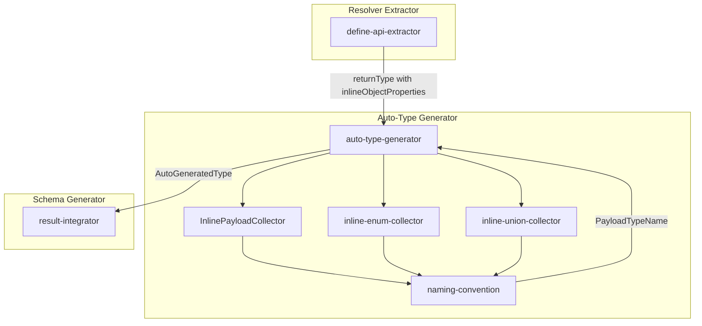
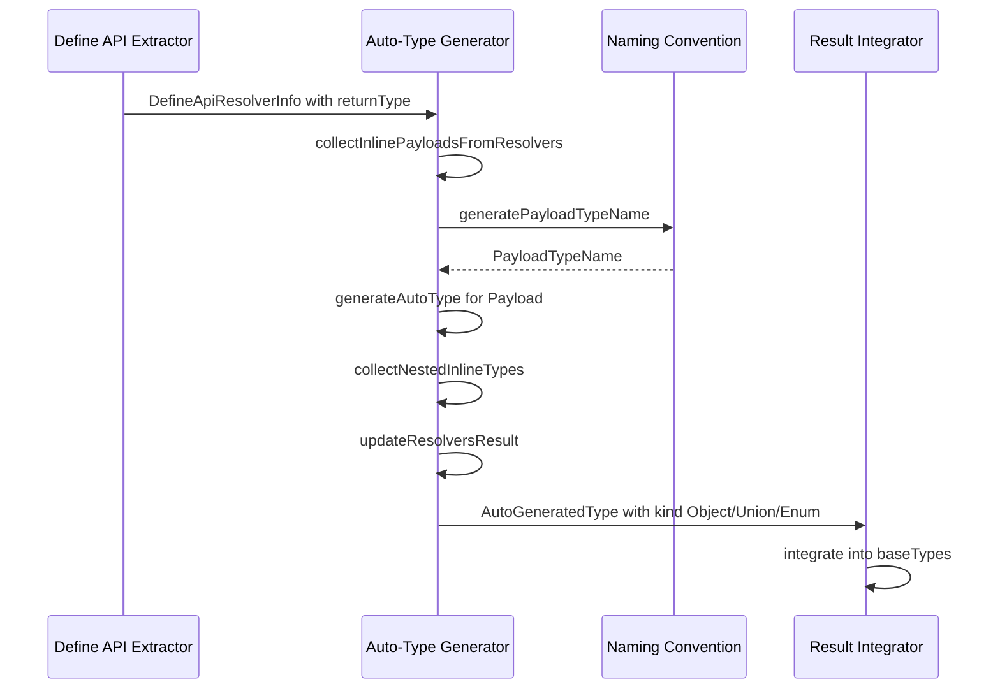
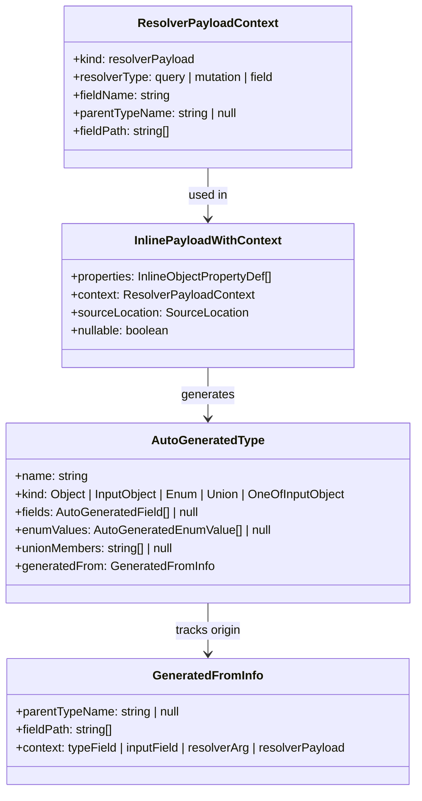

# Design Document: inline-payload

## Overview

**Purpose**: `defineQuery`, `defineMutation`, `defineField` の返り値型に指定されたインライン型（Object、Enum、Union）を自動検出し、一貫した命名規則に基づいて GraphQL 型を生成する機能を提供する。

**Users**: gqlkit ユーザーは、Query/Mutation/Field resolver の返り値に対して明示的な型定義を省略でき、インラインオブジェクトやユニオン型を直接記述することで GraphQL スキーマを簡潔に定義できる。

**Impact**: 既存の auto-type-generator パイプラインを拡張し、引数の inline 型と同様のパターンで返り値の inline 型を処理する。

### Goals

- 返り値型のインラインオブジェクトを自動で GraphQL Object 型（Payload）に変換
- 返り値型の名前付き型ユニオンを自動で GraphQL Union 型に変換
- 返り値型の string literal union を自動で GraphQL Enum 型に変換
- ネストしたインライン型の再帰的処理
- TSDoc コメントの GraphQL description への反映
- 既存の `knownTypeNames` に含まれる型は自動生成をスキップ

### Non-Goals

- 返り値型の `@oneOf` Input Object 生成（返り値は出力コンテキストのため）
- 返り値型からの引数型の自動生成（引数は入力コンテキスト）
- Promise や Async Generator のアンラップ（既存機能で対応済み）

## Architecture

### Existing Architecture Analysis

現在の auto-type-generator は以下の流れでインライン型を処理している:

1. **収集フェーズ**: `collectInlineObjectsFromTypes()` / `collectInlineObjectsFromResolvers()` でフィールドや引数から inline object を検出
2. **命名フェーズ**: `buildGeneratedTypeNamesMap()` で context に基づく型名を生成
3. **生成フェーズ**: `generateAutoType()` で `AutoGeneratedType` を生成
4. **更新フェーズ**: `updateExtractedTypes()` / `updateResolversResult()` で参照を置換

現在、resolver からの収集は**引数のみ**を対象としており、返り値（`GraphQLFieldDefinition.type`）は処理対象外。本機能では返り値からも同様のパターンで inline 型を収集・生成する。

### Architecture Pattern & Boundary Map



**Architecture Integration**:
- 選択パターン: 既存 auto-type-generator パイプラインの拡張
- ドメイン境界: Resolver Extractor が返り値情報を抽出、Auto-Type Generator が Payload 型を生成
- 既存パターン維持: inline object/enum/union と同じ収集-命名-生成-更新フロー
- 新規コンポーネント: `resolverPayload` コンテキストを naming-convention に追加、返り値からの収集ロジックを auto-type-generator に追加
- Steering 準拠: 2-phase type extraction パターンを維持し、`knownTypeNames` による判定を尊重

### Technology Stack

| Layer | Choice / Version | Role in Feature | Notes |
|-------|------------------|-----------------|-------|
| Backend / Services | TypeScript Compiler API | inline 型検出と返り値型解析 | 既存の field-type-resolver を活用 |

## System Flows

### Inline Payload Detection and Generation Flow



**Key Decisions**:
- Payload 型の検出は `DefineApiResolverInfo.returnType` の `inlineObjectProperties`, `inlineEnumMembers`, `members` (union) フィールドを利用
- 命名規則: Query/Mutation は `${PascalCase<fieldName>}Payload`、Field resolver は `${ParentTypeName}${PascalCase<fieldName>}Payload`
- ネスト型は `${PayloadTypeName}${PascalCase<fieldName>}` で生成（Input サフィックスなし、出力コンテキストのため）
- `knownTypeNames` に含まれる型は自動生成をスキップし、既存型への参照を維持

## Requirements Traceability

| Requirement | Summary | Components | Interfaces | Flows |
|-------------|---------|------------|------------|-------|
| 1.1 | Query/Mutation インラインオブジェクト → Payload 型生成 | auto-type-generator, naming-convention | generatePayloadTypeName, generateAutoType | Detection Flow |
| 1.2 | Non-Null フィールド処理 | auto-type-generator | AutoGeneratedField | Generation Flow |
| 1.3 | List 型フィールド処理 | auto-type-generator | AutoGeneratedField | Generation Flow |
| 1.4 | 既存型変換ルール適用 | auto-type-generator | resolveFieldType | Generation Flow |
| 2.1 | Object Field インラインオブジェクト → Payload 型生成 | auto-type-generator, naming-convention | generatePayloadTypeName | Detection Flow |
| 2.2 | 親型名の PascalCase 維持 | naming-convention | generatePayloadTypeName | Generation Flow |
| 2.3 | フィールド返り値型への反映 | auto-type-generator | updateResolversResult | Update Flow |
| 3.1 | 名前付き型ユニオン → Union 型生成 | inline-union-collector, auto-type-generator | InlineUnionWithContext | Detection Flow |
| 3.2 | Query/Mutation Union Payload 命名 | naming-convention | generatePayloadTypeName | Generation Flow |
| 3.3 | Object Field Union Payload 命名 | naming-convention | generatePayloadTypeName | Generation Flow |
| 3.4 | Union メンバーの GraphQL Union メンバー化 | auto-type-generator | processInlineUnions | Generation Flow |
| 4.1 | 文字列リテラルユニオン → Enum 型生成 | inline-enum-collector, auto-type-generator | InlineEnumWithContext | Detection Flow |
| 4.2 | Query/Mutation Enum Payload 命名 | naming-convention | generatePayloadTypeName | Generation Flow |
| 4.3 | Object Field Enum Payload 命名 | naming-convention | generatePayloadTypeName | Generation Flow |
| 4.4 | SCREAMING_SNAKE_CASE 変換 | auto-type-generator | toScreamingSnakeCase | Generation Flow |
| 4.5 | Enum 値マッピング生成 | auto-type-generator | AutoGeneratedType.needsStringEnumMapping | Generation Flow |
| 5.1 | ネスト Object 型生成 | auto-type-generator | extractNestedInlineObjects | Detection Flow |
| 5.2 | ネスト Enum 型生成 | inline-enum-collector | collectInlineEnumsFromPayload | Detection Flow |
| 5.3 | ネスト Union 型生成 | inline-union-collector | collectInlineUnionsFromPayload | Detection Flow |
| 5.4 | 再帰的処理 | auto-type-generator | recursive collection | Detection Flow |
| 5.5 | 親子参照の整合性 | auto-type-generator | resolveFieldType | Generation Flow |
| 6.1 | knownTypeNames による自動生成スキップ | auto-type-generator | - | Detection Flow |
| 6.2 | ユーティリティ型の展開 | field-type-resolver | resolveFieldType | Detection Flow |
| 6.3 | 2-phase 型抽出 | field-type-resolver | FieldTypeResolverContext | Detection Flow |
| 7.1 | フィールド TSDoc → description | auto-type-generator | AutoGeneratedField.description | Generation Flow |
| 7.2 | 型 TSDoc → type description | auto-type-generator | AutoGeneratedType.description | Generation Flow |
| 7.3 | @deprecated → directive | auto-type-generator | DeprecationInfo | Generation Flow |

## Components and Interfaces

| Component | Domain/Layer | Intent | Req Coverage | Key Dependencies | Contracts |
|-----------|--------------|--------|--------------|------------------|-----------|
| naming-convention | Auto-Type Generator | Payload 型名生成ルールの拡張 | 1.1, 2.1, 2.2, 3.2, 3.3, 4.2, 4.3, 5.1-5.3 | - | Service |
| auto-type-generator | Auto-Type Generator | 返り値からのインライン型収集と Payload 型生成 | 1.1-1.4, 2.1, 2.3, 3.1, 3.4, 4.1, 4.4, 4.5, 5.4, 5.5, 6.1 | naming-convention (P0), field-type-resolver (P0) | Service |
| inline-enum-collector | Auto-Type Generator | 返り値からの inline enum 収集 | 4.1, 5.2 | naming-convention (P0) | Service |
| inline-union-collector | Auto-Type Generator | 返り値からの inline union 収集 | 3.1, 5.3 | naming-convention (P0) | Service |
| field-type-resolver | Type Extractor | 返り値型の inline 型プロパティ抽出 | 6.2, 6.3, 7.1-7.3 | TypeScript API (P0) | Service |

### Auto-Type Generator Layer

#### naming-convention (Extension)

| Field | Detail |
|-------|--------|
| Intent | Payload 型命名規則の追加 |
| Requirements | 1.1, 2.1, 2.2, 3.2, 3.3, 4.2, 4.3, 5.1-5.3 |

**Responsibilities & Constraints**
- 新規コンテキスト `resolverPayload` を追加
- Query/Mutation: `${PascalCase<fieldName>}Payload`
- Field resolver: `${ParentTypeName}${PascalCase<fieldName>}Payload`
- ネスト型: `${PayloadTypeName}${PascalCase<fieldName>}`（Input サフィックスなし）

**Dependencies**
- Inbound: auto-type-generator - type name generation (P0)

**Contracts**: Service [x]

##### Service Interface

```typescript
/**
 * Context for resolver payload inline types.
 * Generated name:
 * - Query/Mutation: {PascalCaseFieldName}Payload
 * - Field resolver: {ParentTypeName}{PascalCaseFieldName}Payload
 */
interface ResolverPayloadContext {
  readonly kind: "resolverPayload";
  readonly resolverType: "query" | "mutation" | "field";
  readonly fieldName: string;
  readonly parentTypeName: string | null;
  readonly fieldPath: ReadonlyArray<string>;
}

/**
 * Extended AutoTypeNameContext to include resolverPayload.
 */
type AutoTypeNameContext =
  | ObjectFieldContext
  | InputFieldContext
  | ResolverArgContext
  | ResolverPayloadContext;

/**
 * Generate type name for resolver payload context.
 */
function generatePayloadTypeName(context: ResolverPayloadContext): string;
```

- Preconditions: context が有効であること
- Postconditions: 命名規則に従った型名が返される
- Invariants: Query/Mutation は `Payload` サフィックス、Field resolver は `${ParentTypeName}${FieldName}Payload`

**Implementation Notes**
- Integration: 既存の `generateAutoTypeName()` に `resolverPayload` ケースを追加
- Validation: `fieldPath` が空の場合は直接 Payload 型、非空の場合はネスト型として命名
- Risks: 既存の `objectField` 命名と衝突する可能性（ただし Payload サフィックスで回避）

#### auto-type-generator (Extension)

| Field | Detail |
|-------|--------|
| Intent | 返り値からのインライン型収集と Payload 型生成 |
| Requirements | 1.1-1.4, 2.1, 2.3, 3.1, 3.4, 4.1, 4.4, 4.5, 5.4, 5.5, 6.1 |

**Responsibilities & Constraints**
- `GraphQLFieldDefinition` の返り値型からインライン型を収集
- 収集した型に `resolverPayload` コンテキストを付与
- 既存の inline object/enum/union 生成ロジックを再利用
- `updateResolversResult()` で返り値型の参照を更新

**Dependencies**
- Inbound: schema-generator - auto type generation phase (P0)
- Outbound: naming-convention - type name generation (P0)
- Outbound: inline-enum-collector, inline-union-collector - nested type collection (P1)

**Contracts**: Service [x]

##### Service Interface

```typescript
interface InlinePayloadWithContext {
  readonly properties: ReadonlyArray<InlineObjectPropertyDef>;
  readonly context: ResolverPayloadContext;
  readonly sourceLocation: SourceLocation;
  readonly nullable: boolean;
}

/**
 * Collect inline payloads from resolver return types.
 */
function collectInlinePayloadsFromResolvers(
  resolversResult: ExtractResolversResult,
): InlinePayloadWithContext[];

/**
 * Extended generateAutoTypes to include payload processing.
 */
function generateAutoTypes(input: AutoTypeGeneratorInput): AutoTypeGeneratorResult;
```

- Preconditions: `resolversResult` が有効であること
- Postconditions: 返り値のインライン型が `AutoGeneratedType` として生成される
- Invariants: `knownTypeNames` に含まれる型は自動生成されない

**Implementation Notes**
- Integration: 既存の `collectInlineObjectsFromResolvers()` パターンを拡張し、返り値からも収集
- Validation: 返り値が `knownTypeNames` に含まれる参照型の場合はスキップ
- Risks: 循環参照の可能性（ただし inline 型は定義上循環しない）

#### inline-enum-collector (Extension)

| Field | Detail |
|-------|--------|
| Intent | 返り値からの inline enum 収集 |
| Requirements | 4.1, 5.2 |

**Responsibilities & Constraints**
- `GraphQLFieldDefinition.type` から inline enum (string literal union) を検出
- ネストした Payload 型内の inline enum も収集
- `resolverPayload` コンテキストを付与

**Dependencies**
- Inbound: auto-type-generator - enum collection (P0)

**Contracts**: Service [x]

##### Service Interface

```typescript
/**
 * Collect inline enums from resolver return types.
 */
function collectInlineEnumsFromPayloads(
  resolversResult: ExtractResolversResult,
): InlineEnumWithContext[];
```

**Implementation Notes**
- Integration: 既存の `collectInlineEnumsFromResolvers()` の引数処理パターンを返り値に適用
- Validation: 既存の enum メンバー検証を再利用

#### inline-union-collector (Extension)

| Field | Detail |
|-------|--------|
| Intent | 返り値からの inline union 収集 |
| Requirements | 3.1, 5.3 |

**Responsibilities & Constraints**
- `GraphQLFieldDefinition.type` から名前付き型ユニオンを検出
- ネストした Payload 型内の inline union も収集
- 出力コンテキストのため `isInputContext: false` を設定

**Dependencies**
- Inbound: auto-type-generator - union collection (P0)

**Contracts**: Service [x]

##### Service Interface

```typescript
/**
 * Collect inline unions from resolver return types.
 */
function collectInlineUnionsFromPayloads(
  params: CollectInlineUnionsFromPayloadsParams,
): InlineUnionWithContext[];

interface CollectInlineUnionsFromPayloadsParams {
  readonly resolversResult: ExtractResolversResult;
  readonly knownTypeNames: ReadonlySet<string>;
}
```

**Implementation Notes**
- Integration: 既存の `collectInlineUnionsFromResolvers()` の引数処理パターンを返り値に適用
- Validation: `isInputContext: false` により Union 型（OneOf ではなく）として生成

### Resolver Extractor Layer

#### define-api-extractor (Extension)

| Field | Detail |
|-------|--------|
| Intent | 返り値型のインライン型プロパティ抽出 |
| Requirements | 6.2, 6.3, 7.1-7.3 |

**Responsibilities & Constraints**
- 返り値型がインラインオブジェクトの場合、`inlineObjectProperties` を抽出
- 返り値型が string literal union の場合、`inlineEnumMembers` を抽出
- 返り値型が名前付き型ユニオンの場合、`members` を抽出
- TSDoc コメントを抽出

**Dependencies**
- Inbound: orchestrator - resolver extraction phase (P0)
- Outbound: field-type-resolver - type resolution (P0)

**Contracts**: Service [x]

##### Service Interface

```typescript
/**
 * Extended TSTypeReference with inline type properties for return types.
 * Already supported via existing resolveFieldType.
 */
interface TSTypeReference {
  readonly kind: TSTypeReferenceKind;
  readonly name: string | null;
  readonly nullable: boolean;
  readonly inlineObjectProperties: ReadonlyArray<InlineObjectPropertyDef> | null;
  readonly inlineEnumMembers: ReadonlyArray<InlineEnumMemberInfo> | null;
  readonly members: ReadonlyArray<TSTypeReference> | null;
  // ...existing fields
}
```

**Implementation Notes**
- Integration: 既存の `resolveFieldType()` が返り値型にも使用されており、インライン型プロパティは既に抽出されている
- Validation: 返り値型の検証は既存の型検証を再利用

### Extract Resolvers Layer

#### GraphQLFieldDefinition (Extension)

| Field | Detail |
|-------|--------|
| Intent | 返り値のインライン型情報を保持 |
| Requirements | 1.1-1.4, 3.1, 4.1, 5.1-5.5 |

**Responsibilities & Constraints**
- 返り値型のインライン情報を auto-type-generator に渡す

**Dependencies**
- Inbound: define-api-extractor (P0)
- Outbound: auto-type-generator (P0)

**Contracts**: Service [x]

##### Service Interface

```typescript
/**
 * Extended GraphQLFieldDefinition with inline return type properties.
 */
interface GraphQLFieldDefinition {
  readonly name: string;
  readonly type: GraphQLFieldType;
  readonly args: ReadonlyArray<GraphQLInputValue> | null;
  readonly sourceLocation: SourceLocation;
  readonly resolverExportName: string | null;
  readonly description: string | null;
  readonly deprecated: DeprecationInfo | null;
  readonly directives: ReadonlyArray<DirectiveInfo> | null;
  // New fields for inline return types
  readonly returnTypeInlineObjectProperties: ReadonlyArray<InlineObjectPropertyDef> | null;
  readonly returnTypeInlineEnumMembers: ReadonlyArray<InlineEnumMemberInfo> | null;
  readonly returnTypeInlineUnionMembers: ReadonlyArray<TSTypeReference> | null;
  readonly returnTypeExternalEnumSymbol: ts.Symbol | null;
  readonly returnTypeExternalEnumDescription: string | null;
}
```

**Implementation Notes**
- Integration: `convertDefineApiToFields()` で `returnType` からインライン型プロパティを抽出して設定
- Validation: 引数と同様のパターンでインライン型情報を保持

## Data Models

### Domain Model



**Entities**:
- `ResolverPayloadContext`: Payload 型生成のためのコンテキスト情報
- `InlinePayloadWithContext`: 返り値から収集されたインライン型とそのコンテキスト
- `AutoGeneratedType`: 自動生成された型（既存、`generatedFrom.context` に `resolverPayload` を追加）
- `GeneratedFromInfo`: 型の生成元情報（`context` に `resolverPayload` を追加）

**Invariants**:
- `resolverPayload` コンテキストの型は常に出力コンテキスト（Object, Union, Enum）として生成される
- `fieldPath` が空の場合は直接 Payload 型、非空の場合はネスト型
- Query/Mutation の Payload 型は `parentTypeName: null`
- Field resolver の Payload 型は `parentTypeName` が設定される

## Error Handling

### Error Strategy

既存の Diagnostic システムを利用し、fail-fast でアクション可能なエラーメッセージを提供。

### Error Categories and Responses

**User Errors (Validation)**:
- `DUPLICATE_ENUM_VALUE_AFTER_CONVERSION`: Payload 内 Enum 値の変換後重複 → 元値と変換後値を含むエラー
- `INVALID_UNION_MEMBER`: Union メンバーが無効な型 → メンバー型を特定

**Business Logic Errors**:
- `TYPE_NAME_COLLISION`: 生成 Payload 型名が既存型名と競合 → 競合する型名と場所を報告

### Monitoring

既存の診断レポートシステムで警告・エラーを報告。

## Testing Strategy

### Unit Tests

- `generatePayloadTypeName()`: 各命名規則パターン（Query, Mutation, Field, ネスト）
- `collectInlinePayloadsFromResolvers()`: 各 resolver タイプからの収集

### Integration Tests (Golden File Tests)

1. **inline-payload-object**: Query/Mutation 返り値のインラインオブジェクトが Payload 型に変換される
2. **inline-payload-field**: Field resolver 返り値のインラインオブジェクトが Payload 型に変換される
3. **inline-payload-union**: 返り値の名前付き型ユニオンが Union 型に変換される
4. **inline-payload-enum**: 返り値の string literal union が Enum 型に変換される
5. **inline-payload-nested**: ネストしたインライン型の再帰的処理
6. **inline-payload-known-type**: knownTypeNames の型は自動生成されない
7. **inline-payload-utility-type**: Omit/Pick 等でラップされた型が展開される
8. **inline-payload-tsdoc**: TSDoc コメントが description に反映
9. **inline-payload-deprecated**: @deprecated タグが directive に反映
10. **inline-payload-name-collision-error**: 型名競合時のエラー出力

### E2E Tests

- 既存の golden file テストフレームワークを使用
- `UPDATE_GOLDEN=true pnpm test` でスナップショット更新
