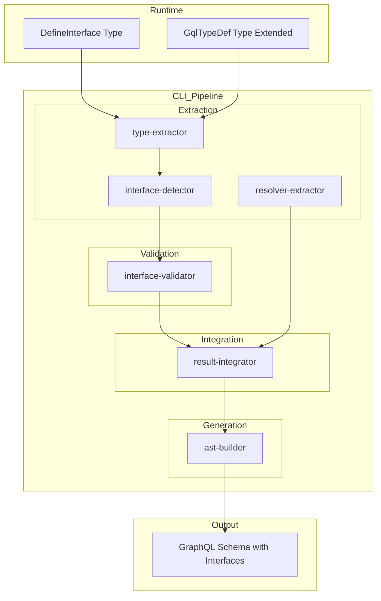
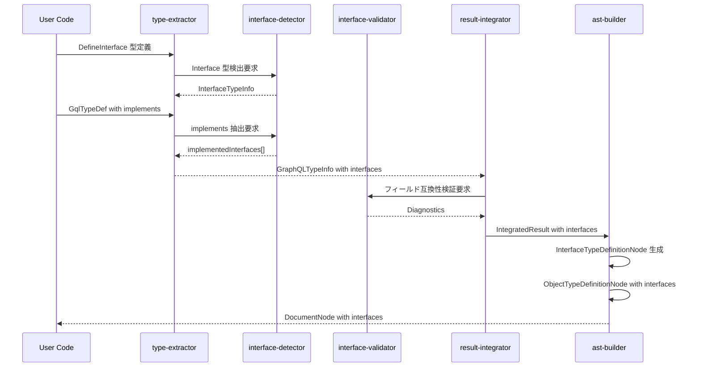
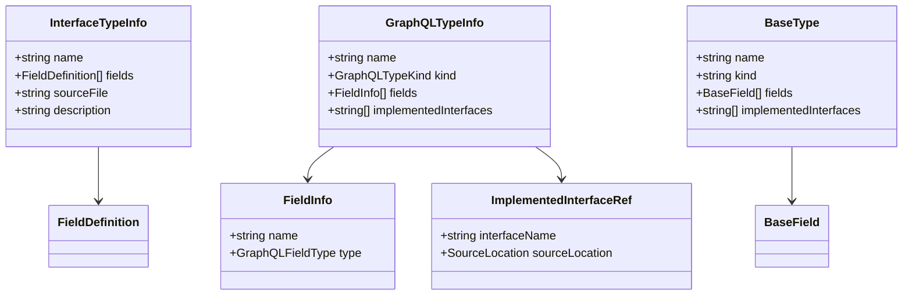

# Design Document

## Overview

**Purpose**: この機能は、gqlkit ユーザーが TypeScript の型定義から GraphQL interface 型を生成し、型が interface を実装することを宣言できるようにする。これにより、共通フィールドを持つ型群を抽象化し、ポリモーフィックなクエリを実現できる。

**Users**: gqlkit を使用する GraphQL サーバー開発者が、`Node` interface のような共通インターフェースを定義し、複数の型で実装することで、型安全かつ規約駆動のスキーマ設計を行う。

**Impact**: 既存の type-extractor、schema-generator パイプラインを拡張し、interface 型の抽出・生成、implements 宣言の検証、および `__resolveType` リゾルバーサポートを追加する。

### Goals

- TypeScript 型システムを活用した interface 型の型安全な定義（`DefineInterface<Fields, Meta>`）
- interface の多重継承（interface が他の interface を継承すること）のサポート
- 既存の `GqlTypeDef` パターンを拡張した `implements` オプションのサポート
- interface を実装する型のフィールド互換性バリデーション
- GraphQL スキーマへの interface 定義と implements 句の出力
- interface 型に対するフィールドリゾルバーのサポート

### Non-Goals

- interface 型へのディレクティブ付与（現行 gqlkit の規約に沿わないため）
- abstract resolver の自動生成（`__resolveType` の実装はユーザー責任）
- Input Object 型への interface 適用（GraphQL 仕様で未サポート）

## Architecture

### Existing Architecture Analysis

現在の gqlkit パイプラインは以下の構造を持つ:

1. **type-extractor**: TypeScript 型定義をスキャンし、`GraphQLTypeInfo` を生成
2. **resolver-extractor**: リゾルバ定義をスキャンし、`DefineApiResolverInfo` を生成
3. **result-integrator**: 両者を統合し、`IntegratedResult` を生成
4. **ast-builder**: 統合結果から GraphQL `DocumentNode` を構築

メタデータ埋め込みパターンとして `$gqlkitTypeMeta` が既に確立されており、`directives` プロパティを持つ構造が存在する。同様のパターンで `implements` 情報を埋め込む。

**既存の GqlTypeDef 実装**:

```typescript
export type GqlTypeDef<
  T,
  Meta extends {
    directives: ReadonlyArray<Directive<...>>;
  },
> = T & {
  readonly " $gqlkitTypeMeta"?: GqlTypeMetaShape<Meta>;
  readonly " $gqlkitOriginalType"?: T;
};
```

**拡張が必要な機能**:
- `DefineInterface<Fields>` ユーティリティ型の追加
- `GqlTypeDef` の Meta に `implements` オプションを追加
- type-extractor での interface 定義と implements 宣言の抽出
- schema-generator での `InterfaceTypeDefinitionNode` 生成
- フィールド互換性バリデーション

### Architecture Pattern & Boundary Map



**Architecture Integration**:
- Selected pattern: 既存の `$gqlkitTypeMeta` メタデータ埋め込みパターンを拡張
- Domain boundaries: Runtime (型定義) / CLI Pipeline (抽出・生成) の分離を維持
- Existing patterns preserved: GqlTypeDef のメタデータプロパティパターン、extractors の構造
- New components: interface-detector モジュール、interface-validator モジュール
- Steering compliance: No decorators、Pure static analysis、Deterministic output

### Technology Stack

| Layer | Choice / Version | Role in Feature | Notes |
|-------|------------------|-----------------|-------|
| Runtime | TypeScript 5.9+ | DefineInterface 型定義、GqlTypeDef 拡張 | @gqlkit-ts/runtime |
| CLI | TypeScript Compiler API | interface メタデータ抽出、implements 検証 | 既存パターン踏襲 |
| Output | graphql-js | InterfaceTypeDefinitionNode 生成 | Kind.INTERFACE_TYPE_DEFINITION |

## System Flows

### Interface Definition and Implementation Extraction Flow



## Requirements Traceability

| Requirement | Summary | Components | Interfaces | Flows |
|-------------|---------|------------|------------|-------|
| 1.1, 1.2, 1.3, 1.4 | Interface 型の定義 | DefineInterfaceType | DefineInterface<Fields> | Extraction Flow |
| 2.1, 2.2, 2.3, 2.4, 2.5 | Interface の実装宣言と検証 | GqlTypeDefExt, InterfaceValidator | GqlTypeDef with implements | Validation Flow |
| 3.1, 3.2, 3.3, 3.4 | Interface 型の抽出 | InterfaceDetector, TypeExtractorExt | InterfaceTypeInfo | Extraction Flow |
| 4.1, 4.2, 4.3, 4.4 | GraphQL スキーマ生成 | AstBuilderExt, ResultIntegratorExt | InterfaceTypeDefinitionNode | Generation Flow |
| 5.1, 5.2, 5.3 | Interface リゾルバーサポート | ResolverExtractorExt | FieldResolver for Interface | Extraction Flow |
| 6.1, 6.2, 6.3, 6.4 | エラーハンドリング | InterfaceValidator | Diagnostic | Validation Flow |
| 7.1, 7.2, 7.3 | Runtime パッケージ拡張 | DefineInterfaceType, GqlTypeDefExt | DefineInterface, GqlTypeDef | - |

## Components and Interfaces

| Component | Domain/Layer | Intent | Req Coverage | Key Dependencies | Contracts |
|-----------|--------------|--------|--------------|-----------------|-----------|
| DefineInterfaceType | Runtime | Interface 型を TypeScript で定義するためのユーティリティ型 | 1.1-1.4, 7.1 | - | Type Definition |
| GqlTypeDefExt | Runtime | implements オプションを持つ型メタデータの定義 | 2.1, 2.2, 7.2, 7.3 | DefineInterfaceType (P0) | Type Definition |
| InterfaceDetector | CLI/shared | DefineInterface と implements の検出 | 3.1-3.4 | TypeScript API (P0) | Service |
| InterfaceValidator | CLI/shared | フィールド互換性と循環参照の検証 | 2.3-2.5, 6.1-6.4 | InterfaceDetector (P0) | Service |
| TypeExtractorExt | CLI/type-extractor | Interface 情報の抽出と統合 | 3.1-3.4 | InterfaceDetector (P0) | Service |
| ResultIntegratorExt | CLI/schema-generator | Interface 型情報の統合 | 4.1-4.4 | InterfaceValidator (P0) | Service |
| AstBuilderExt | CLI/schema-generator | Interface 定義と implements 句の AST 出力 | 4.1-4.4 | graphql-js (P0) | Service |

### Runtime Layer

#### DefineInterfaceType

| Field | Detail |
|-------|--------|
| Intent | GraphQL interface 型を TypeScript で定義するためのユーティリティ型を提供する |
| Requirements | 1.1, 1.2, 1.3, 1.4, 7.1 |

**Responsibilities & Constraints**
- interface のフィールド定義を TypeScript 型として表現
- フィールドの型、nullability、リスト型を Object 型と同じルールで推論
- 実行時にはオーバーヘッドなし (型レベルのみ)

**Contracts**: Type Definition

```typescript
/**
 * Interface 型定義用メタデータ構造
 *
 * @typeParam Meta - implements を含むメタデータ
 */
export interface GqlInterfaceMetaShape<
  Meta extends {
    implements?: ReadonlyArray<DefineInterface<Record<string, unknown>>>;
  } = {},
> {
  readonly " $gqlkitInterface": true;
  readonly implements?: Meta["implements"];
}

/**
 * GraphQL interface 型を定義するためのユーティリティ型
 *
 * @typeParam T - Interface のフィールド定義を含むオブジェクト型
 * @typeParam Meta - implements を含むメタデータ（デフォルト: {}）
 *
 * @example
 * ```typescript
 * // 基本的な interface 定義
 * export type Node = DefineInterface<{
 *   id: IDString;
 * }>;
 *
 * export type Timestamped = DefineInterface<{
 *   createdAt: DateTime;
 *   updatedAt: DateTime;
 * }>;
 *
 * // interface が他の interface を継承
 * export type Entity = DefineInterface<
 *   {
 *     id: IDString;
 *     createdAt: DateTime;
 *     updatedAt: DateTime;
 *   },
 *   { implements: [Node, Timestamped] }
 * >;
 * ```
 */
export type DefineInterface<
  T extends Record<string, unknown>,
  Meta extends {
    implements?: ReadonlyArray<DefineInterface<Record<string, unknown>>>;
  } = {},
> = T & {
  readonly " $gqlkitInterfaceMeta"?: GqlInterfaceMetaShape<Meta>;
};
```

**Implementation Notes**
- `$gqlkitInterfaceMeta` プロパティにより CLI が interface 型を識別
- `$gqlkitInterfaceMeta.implements` から継承する interface の参照を抽出
- フィールド定義は通常の Object 型と同じ構造（型推論ルールを共有）
- TSDoc コメントは interface の description として抽出される

#### GqlTypeDefExt (GqlTypeDef 拡張)

| Field | Detail |
|-------|--------|
| Intent | 型が interface を実装することを宣言するための `implements` オプションを追加する |
| Requirements | 2.1, 2.2, 7.2, 7.3 |

**Responsibilities & Constraints**
- 既存の `directives` オプションと並行して `implements` オプションをサポート
- 複数の interface を配列として指定可能
- 型レベルでの交差型として実装

**Contracts**: Type Definition

```typescript
/**
 * 型メタデータ構造（拡張版）
 *
 * directives と implements の両方をサポート
 */
export interface GqlTypeMetaShape<
  Meta extends {
    directives?: ReadonlyArray<Directive<...>>;
    implements?: ReadonlyArray<DefineInterface<Record<string, unknown>>>;
  },
> {
  readonly directives?: Meta["directives"];
  readonly implements?: Meta["implements"];
}

/**
 * 型定義にメタデータを付与する（拡張版）
 *
 * @typeParam T - ベースとなる型
 * @typeParam Meta - directives と implements を含むメタデータ
 *
 * @example
 * ```typescript
 * // Interface を実装する型
 * export type User = GqlTypeDef<
 *   {
 *     id: IDString;
 *     name: string;
 *     email: string;
 *   },
 *   { implements: [Node] }
 * >;
 *
 * // directives と implements の両方を使用
 * export type Post = GqlTypeDef<
 *   {
 *     id: IDString;
 *     title: string;
 *     createdAt: DateTime;
 *     updatedAt: DateTime;
 *   },
 *   {
 *     implements: [Node, Timestamped],
 *     directives: [CacheDirective<{ maxAge: 60 }>]
 *   }
 * >;
 * ```
 */
export type GqlTypeDef<
  T,
  Meta extends {
    directives?: ReadonlyArray<Directive<...>>;
    implements?: ReadonlyArray<DefineInterface<Record<string, unknown>>>;
  } = { directives: [] },
> = T & {
  readonly " $gqlkitTypeMeta"?: GqlTypeMetaShape<Meta>;
  readonly " $gqlkitOriginalType"?: T;
};
```

**Implementation Notes**
- Meta 型パラメータを拡張し、`implements` を optional property として追加
- 既存コードとの後方互換性を維持（`directives` のみの使用が引き続き可能）
- `implements` 配列の各要素は `DefineInterface<...>` で定義された型への参照

### CLI/shared Layer

#### InterfaceDetector

| Field | Detail |
|-------|--------|
| Intent | TypeScript 型から interface 定義と implements 宣言を検出する |
| Requirements | 3.1, 3.2, 3.3, 3.4 |

**Responsibilities & Constraints**
- `$gqlkitInterfaceMeta` プロパティの検出による interface 型の識別
- `$gqlkitTypeMeta.implements` からの実装 interface 参照の抽出
- interface 型名の解決と参照の検証

**Dependencies**
- Inbound: TypeExtractor - interface 検出要求 (P0)
- External: TypeScript Compiler API - 型解析 (P0)

**Contracts**: Service

##### Service Interface

```typescript
/**
 * 検出された Interface 型の情報
 */
export interface InterfaceTypeInfo {
  readonly name: string;
  readonly fields: ReadonlyArray<FieldDefinition>;
  readonly implementedInterfaces: ReadonlyArray<string>;  // 継承する interface
  readonly sourceFile: string;
  readonly description: string | null;
  readonly deprecated: DeprecationInfo | null;
}

/**
 * 型が実装する Interface の参照情報
 */
export interface ImplementedInterfaceRef {
  readonly interfaceName: string;
  readonly sourceLocation: SourceLocation;
}

/**
 * Interface 検出結果
 */
export interface InterfaceDetectionResult {
  readonly isInterface: boolean;
  readonly interfaceInfo: InterfaceTypeInfo | null;
  readonly implementedInterfaces: ReadonlyArray<ImplementedInterfaceRef>;
  readonly errors: ReadonlyArray<InterfaceDetectionError>;
}

/**
 * Interface 検出エラー
 */
export interface InterfaceDetectionError {
  readonly code: InterfaceDetectionErrorCode;
  readonly message: string;
}

export type InterfaceDetectionErrorCode =
  | "UNKNOWN_INTERFACE_REFERENCE"
  | "INVALID_INTERFACE_TYPE";

/**
 * 型から Interface 情報を検出する
 */
export function detectInterfaceMetadata(
  type: ts.Type,
  checker: ts.TypeChecker,
): InterfaceDetectionResult;

/**
 * 型が DefineInterface を使用しているかどうかを判定する
 */
export function isInterfaceType(
  type: ts.Type,
): boolean;
```

- Preconditions: type は有効な TypeScript 型、checker は同一プログラムの TypeChecker
- Postconditions: DefineInterface が適用されていない場合は isInterface = false を返す
- Invariants: implements 配列の順序は型定義での記述順を保持

**Implementation Notes**
- `metadata-detector.ts` の `getActualMetadataType` パターンを再利用
- interface 型の参照解決は TypeScript の symbol から型名を取得
- 存在しない interface への参照は `UNKNOWN_INTERFACE_REFERENCE` エラーを生成

#### InterfaceValidator

| Field | Detail |
|-------|--------|
| Intent | Interface 実装のフィールド互換性を検証する |
| Requirements | 2.3, 2.4, 2.5, 6.1, 6.2, 6.3, 6.4 |

**Responsibilities & Constraints**
- 実装型が interface で定義されたすべてのフィールドを持つことを検証
- フィールドの型互換性（共変性）を検証
- 循環参照の検出

**Dependencies**
- Inbound: ResultIntegrator - 検証要求 (P0)
- External: InterfaceDetector - interface 情報取得 (P0)

**Contracts**: Service

##### Service Interface

```typescript
/**
 * フィールド互換性検証結果
 */
export interface FieldCompatibilityResult {
  readonly compatible: boolean;
  readonly missingFields: ReadonlyArray<string>;
  readonly incompatibleFields: ReadonlyArray<IncompatibleFieldInfo>;
}

/**
 * 型の不一致情報
 */
export interface IncompatibleFieldInfo {
  readonly fieldName: string;
  readonly expectedType: string;
  readonly actualType: string;
}

/**
 * Interface 実装の検証結果
 */
export interface InterfaceValidationResult {
  readonly valid: boolean;
  readonly diagnostics: ReadonlyArray<Diagnostic>;
}

/**
 * 型が Interface を正しく実装しているかを検証する
 */
export function validateInterfaceImplementation(
  implementingType: GraphQLTypeInfo,
  interfaceType: InterfaceTypeInfo,
  sourceLocation: SourceLocation,
): InterfaceValidationResult;

/**
 * 循環的な Interface 参照を検出する
 *
 * interface が他の interface を継承する際に循環参照が発生しないことを検証する。
 * 例: A implements B, B implements C, C implements A のような循環を検出
 */
export function detectCircularInterfaceReferences(
  interfaces: ReadonlyArray<InterfaceTypeInfo>,
): ReadonlyArray<Diagnostic>;
```

- Preconditions: implementingType と interfaceType は有効な型情報
- Postconditions: すべてのフィールドが検証され、結果が返される
- Invariants: 検証は決定的で、同じ入力に対して常に同じ結果を返す

**Implementation Notes**
- フィールドの存在チェック: interface のすべてのフィールドが実装型に存在
- 型互換性チェック: 実装型のフィールド型は interface のフィールド型と共変（より具体的な型は許可）
- nullability チェック: 実装型のフィールドは interface のフィールドと同等以上の non-null 性を持つ

### CLI/type-extractor Layer

#### TypeExtractorExt (type-extractor 拡張)

| Field | Detail |
|-------|--------|
| Intent | Interface 型定義と implements 宣言を抽出する |
| Requirements | 3.1, 3.2, 3.3, 3.4, 3.5 |

**Responsibilities & Constraints**
- `DefineInterface` を使用した型定義の検出
- `GqlTypeDef` の `implements` オプションからの interface 参照抽出
- 既存の型抽出フローへの統合
- 既存の Union 型検出との互換性維持

**Dependencies**
- Inbound: extractTypesFromProgram - 型抽出処理 (P0)
- Outbound: InterfaceDetector - interface 検出 (P0)

**Contracts**: Service (既存インターフェース拡張)

##### Data Model Extension

```typescript
// types/graphql.ts (拡張)

/**
 * GraphQL 型の種類（拡張）
 */
export type GraphQLTypeKind =
  | "Object"
  | "Union"
  | "Enum"
  | "InputObject"
  | "OneOfInputObject"
  | "Interface";  // 新規追加

/**
 * GraphQL 型情報（拡張）
 */
export interface GraphQLTypeInfo {
  readonly name: string;
  readonly kind: GraphQLTypeKind;
  readonly fields: ReadonlyArray<FieldInfo> | null;
  readonly unionMembers: ReadonlyArray<string> | null;
  readonly enumValues: ReadonlyArray<EnumValueInfo> | null;
  readonly implementedInterfaces: ReadonlyArray<string> | null;  // 新規追加
  readonly sourceFile: string;
  readonly description: string | null;
  readonly deprecated: DeprecationInfo | null;
  readonly directives: ReadonlyArray<DirectiveInfo> | null;
}
```

**Implementation Notes**
- `determineTypeKind` 関数を拡張して `$gqlkitInterfaceMeta` を検出
- `extractFieldsFromType` は interface 型にも適用（Object 型と同じロジック）
- `implements` の抽出は `$gqlkitTypeMeta.implements` プロパティから型参照を解決
- **Union 型との互換性**: `GqlTypeDef<T, Meta>` は交差型（`T & { $gqlkitTypeMeta?: ... }`）を生成するため、`determineTypeKind` での Union 判定時に `ts.TypeFlags.Intersection` フラグを持つ型も Object 型として扱う必要がある

### CLI/schema-generator Layer

#### ResultIntegratorExt (result-integrator 拡張)

| Field | Detail |
|-------|--------|
| Intent | Interface 型情報を統合し、フィールド互換性を検証する |
| Requirements | 4.1, 4.2, 4.3, 4.4 |

**Responsibilities & Constraints**
- Interface 型を baseTypes に追加
- implements 宣言の検証を InterfaceValidator に委譲
- 診断情報の集約

**Dependencies**
- Inbound: integrate - 統合処理 (P0)
- Outbound: InterfaceValidator - 検証処理 (P0)

**Contracts**: Service (既存インターフェース拡張)

##### Data Model Extension

```typescript
// integrator/result-integrator.ts (拡張)

/**
 * ベース型（拡張）
 */
export interface BaseType {
  readonly name: string;
  readonly kind: "Object" | "Union" | "Enum" | "Interface";  // Interface 追加
  readonly fields: ReadonlyArray<BaseField> | null;
  readonly unionMembers: ReadonlyArray<string> | null;
  readonly enumValues: ReadonlyArray<EnumValueInfo> | null;
  readonly implementedInterfaces: ReadonlyArray<string> | null;  // 新規追加
  readonly description: string | null;
  readonly deprecated: DeprecationInfo | null;
  readonly sourceFile: string | null;
  readonly directives: ReadonlyArray<DirectiveInfo> | null;
}
```

**Implementation Notes**
- Interface 型は BaseType として扱い、`kind: "Interface"` で区別
- `integrate` 関数内で implements 参照の存在チェックと互換性検証を実行
- 未定義の interface を参照している場合は `UNKNOWN_INTERFACE` エラーを生成

#### AstBuilderExt (ast-builder 拡張)

| Field | Detail |
|-------|--------|
| Intent | Interface 定義と implements 句を GraphQL AST として出力 |
| Requirements | 4.1, 4.2, 4.3, 4.4 |

**Responsibilities & Constraints**
- InterfaceTypeDefinitionNode の生成
- ObjectTypeDefinitionNode への interfaces プロパティの追加
- フィールド定義の出力（Object 型と同じロジック）

**Dependencies**
- Inbound: buildDocumentNode - AST 構築処理 (P0)
- External: graphql-js - AST ノード型 (P0)

**Contracts**: Service (既存関数拡張)

##### Service Interface

```typescript
/**
 * Interface 型定義ノードを構築する
 */
function buildInterfaceTypeDefinitionNode(
  baseType: BaseType,
  sourceRoot?: string,
): InterfaceTypeDefinitionNode;

/**
 * Object 型定義ノードを構築する（拡張）
 * implements が指定されている場合は interfaces プロパティを追加
 */
function buildObjectTypeDefinitionNode(
  baseType: BaseType,
  sourceRoot?: string,
): ObjectTypeDefinitionNode;
```

##### InterfaceTypeDefinitionNode Structure (graphql-js)

```typescript
interface InterfaceTypeDefinitionNode {
  readonly kind: Kind.INTERFACE_TYPE_DEFINITION;
  readonly loc?: Location | undefined;
  readonly description?: StringValueNode | undefined;
  readonly name: NameNode;
  readonly interfaces?: ReadonlyArray<NamedTypeNode> | undefined;  // 継承時に使用
  readonly directives?: ReadonlyArray<ConstDirectiveNode> | undefined;
  readonly fields?: ReadonlyArray<FieldDefinitionNode> | undefined;
}
```

**Implementation Notes**
- Interface 型は baseTypes の中で `kind === "Interface"` で識別
- フィールド定義の出力ロジックは `buildBaseFieldDefinitionNode` を再利用
- ObjectTypeDefinitionNode の `interfaces` プロパティは NamedTypeNode の配列として出力

### CLI/resolver-extractor Layer

#### ResolverExtractorExt (resolver-extractor 拡張)

| Field | Detail |
|-------|--------|
| Intent | Interface 型に対するフィールドリゾルバーを抽出する |
| Requirements | 5.1, 5.2, 5.3 |

**Responsibilities & Constraints**
- `defineField<InterfaceType, ...>` で定義された Interface フィールドリゾルバーの検出
- TypeExtension として Interface 型へのフィールド追加を記録
- Interface を返すフィールドの戻り型推論

**Dependencies**
- Inbound: extractDefineApiResolvers - リゾルバ抽出処理 (P0)
- External: TypeScript Compiler API - 型解析 (P0)

**Contracts**: Service (既存インターフェース、変更なし)

**Implementation Notes**
- Interface 型に対する defineField の親型チェックを追加
- Interface を返すフィールドの場合、戻り型は interface を実装するすべての型の union として推論
- `__resolveType` はユーザーが実装する必要があり、gqlkit は生成しない

## Data Models

### Domain Model



### Logical Data Model

**InterfaceTypeInfo**: Interface 型の定義情報。名前、フィールド定義、ソースファイル位置を含む。

**ImplementedInterfaceRef**: 型が実装する Interface への参照。Interface 名とソース位置を含む。

**GraphQLTypeInfo (拡張)**: GraphQL 型情報。`kind: "Interface"` の場合は Interface 型として扱われ、`implementedInterfaces` プロパティを持つ場合は implements 宣言を表す。

**BaseType (拡張)**: 統合後のベース型情報。Interface 型も含み、`implementedInterfaces` プロパティで実装関係を表現。

## Error Handling

### Error Strategy

Interface 関連のエラーは Diagnostic として報告し、既存のエラーハンドリングパターンに統合する。

### Error Categories and Responses

**User Errors (バリデーションエラー)**:
- `UNKNOWN_INTERFACE_REFERENCE`: 存在しない Interface 型を `implements` で参照した場合
- `MISSING_INTERFACE_FIELD`: Interface で定義されたフィールドが実装型に不足している場合
- `INCOMPATIBLE_FIELD_TYPE`: 実装型のフィールド型が Interface のフィールド型と互換性がない場合
- `INVALID_INTERFACE_TYPE`: `DefineInterface` の型引数が不正な形式である場合

**Warning**:
- `CIRCULAR_INTERFACE_REFERENCE`: 循環的な Interface 参照が検出された場合（将来の拡張に備えて）

**Error Response Format**:

```typescript
interface Diagnostic {
  readonly code: string;
  readonly message: string;
  readonly severity: "error" | "warning";
  readonly location: {
    readonly file: string;
    readonly line: number;
    readonly column: number;
  } | null;
}
```

### Error Message Examples

```
UNKNOWN_INTERFACE_REFERENCE:
Type 'User' implements unknown interface 'UnknownInterface'.
Ensure the interface is defined using DefineInterface<...>.
Location: src/gqlkit/schema/user.ts:15:1

MISSING_INTERFACE_FIELD:
Type 'User' is missing required field 'id' from interface 'Node'.
Interface 'Node' requires field 'id: ID!'.
Location: src/gqlkit/schema/user.ts:15:1

INCOMPATIBLE_FIELD_TYPE:
Type 'User' field 'id' has incompatible type.
Expected: ID! (from interface 'Node')
Actual: String!
Location: src/gqlkit/schema/user.ts:17:3
```

### Monitoring

既存の gen-orchestrator の診断レポート機能を使用。Interface 関連エラーは既存のエラーコード体系に統合。

## Testing Strategy

### Unit Tests (golden file tests)

- `testdata/interface-basic/`: 基本的な Interface 定義と実装
- `testdata/interface-multiple-implements/`: 複数 Interface の実装
- `testdata/interface-inheritance/`: Interface が他の Interface を継承
- `testdata/interface-field-types/`: 様々なフィールド型（nullable、リスト、参照型）
- `testdata/interface-with-directives/`: Interface 実装型へのディレクティブ付与
- `testdata/interface-resolver/`: Interface 型に対するフィールドリゾルバー
- `testdata/interface-errors/`: エラーケース（不足フィールド、型不一致、未定義参照、循環継承）

### Integration Tests

- 型抽出からスキーマ生成までの E2E フロー
- Interface 定義 (`interface Node { id: ID! }`) が正しく出力されることの検証
- Interface 継承 (`interface Entity implements Node & Timestamped`) が正しく出力されることの検証
- implements 句 (`type User implements Node`) が正しく出力されることの検証
- 複数 Interface 実装 (`type Post implements Node & Timestamped`) の出力検証
- Interface を継承した Interface を実装する型の出力検証

### Validation Tests

- 存在しない Interface 参照エラー
- 不足フィールドエラー
- 型互換性エラー（non-null 不一致、型名不一致）
- 循環的な Interface 継承エラー
- 診断メッセージの位置情報正確性

## Supporting References

### GraphQL Interface Specification

GraphQL Interface 型は September 2025 仕様に準拠:
- [GraphQL September 2025 Specification](https://spec.graphql.org/September2025/)
- [Unions and Interfaces - Apollo GraphQL Docs](https://www.apollographql.com/docs/apollo-server/schema/unions-interfaces)

### Interface SDL Examples

```graphql
# 基本的な Interface 定義
interface Node {
  id: ID!
}

interface Timestamped {
  createdAt: DateTime!
  updatedAt: DateTime!
}

# Interface が他の Interface を継承
interface Entity implements Node & Timestamped {
  id: ID!
  createdAt: DateTime!
  updatedAt: DateTime!
}

# Interface を実装する型
type User implements Node {
  id: ID!
  name: String!
  email: String!
}

# 複数 Interface の実装
type Post implements Node & Timestamped {
  id: ID!
  title: String!
  content: String!
  createdAt: DateTime!
  updatedAt: DateTime!
}

# Entity を実装する型（Node, Timestamped も暗黙的に実装）
type Comment implements Entity & Node & Timestamped {
  id: ID!
  content: String!
  createdAt: DateTime!
  updatedAt: DateTime!
}
```

### TypeScript Usage Examples

```typescript
// packages/runtime/src/index.ts からインポート
import {
  DefineInterface,
  GqlTypeDef,
  IDString
} from "@gqlkit-ts/runtime";

// 基本的な Interface 定義
export type Node = DefineInterface<{
  id: IDString;
}>;

export type Timestamped = DefineInterface<{
  createdAt: DateTime;
  updatedAt: DateTime;
}>;

// Interface が他の Interface を継承
export type Entity = DefineInterface<
  {
    id: IDString;
    createdAt: DateTime;
    updatedAt: DateTime;
  },
  { implements: [Node, Timestamped] }
>;

// Interface を実装する型
export type User = GqlTypeDef<
  {
    id: IDString;
    name: string;
    email: string;
  },
  { implements: [Node] }
>;

// 複数 Interface の実装（directives と併用）
export type Post = GqlTypeDef<
  {
    id: IDString;
    title: string;
    createdAt: DateTime;
    updatedAt: DateTime;
  },
  {
    implements: [Entity],  // Entity を実装すれば Node, Timestamped も暗黙的に実装
    directives: [CacheDirective<{ maxAge: 60 }>]
  }
>;
```

### graphql-js References

- [InterfaceTypeDefinitionNode in graphql-js](https://github.com/graphql/graphql-js/blob/main/src/language/ast.ts)
- [Kind.INTERFACE_TYPE_DEFINITION](https://github.com/graphql/graphql-js/blob/main/src/language/kinds.ts)
