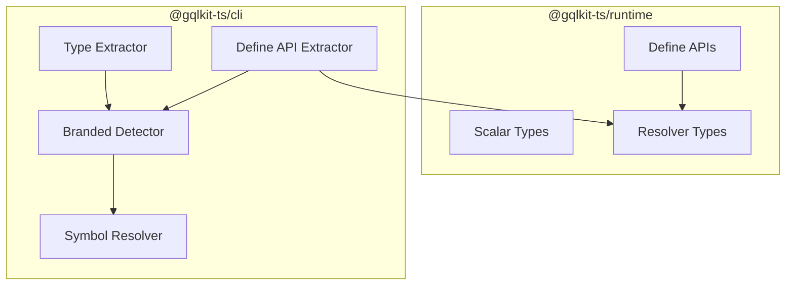
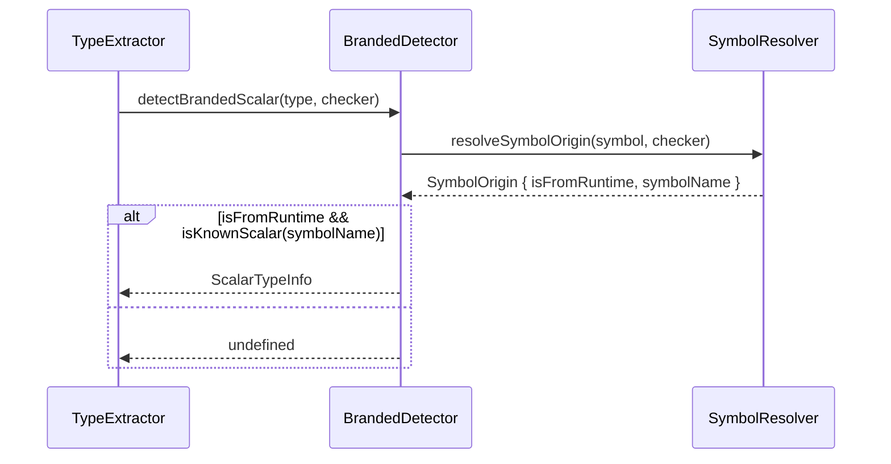
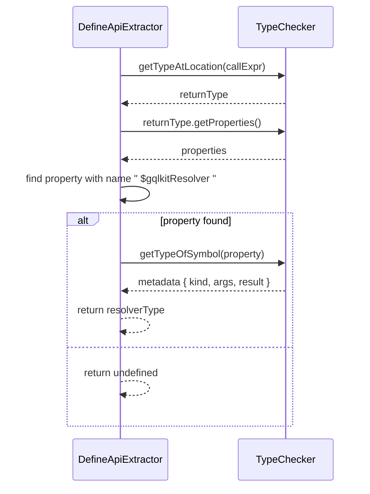

# Technical Design: no-branded-types

## Overview

**Purpose**: 本機能は branded type を廃止し、より簡素で扱いやすい型システムに置き換えることで、gqlkit 開発者と利用者に対してエラーメッセージの可読性向上とデバッグの容易化を提供する。

**Users**: gqlkit 利用者は scalar 型を通常の type alias として使用でき、gqlkit 開発者は resolver 型のメタデータをオブジェクトプロパティベースで保持できるようになる。

**Impact**: `@gqlkit-ts/runtime` の型定義と `@gqlkit-ts/cli` の型抽出ロジックを変更し、symbol ベースの branded type から import パス + 名前ベースの識別方式に移行する。

### Goals

- Resolver 型メタデータの保持方法を symbol から文字列リテラルプロパティに変更
- Preset scalar (`IDString`, `IDNumber`, `Int`, `Float`) を通常の type alias に変更
- 型抽出ロジックを import パス + 型名ベースの識別に変更

### Non-Goals

- カスタム scalar の設定方式変更 (既存の `gqlkit.config.ts` 方式を維持)
- 新規 scalar 型の追加
- resolver 以外の新規 API 追加

## Architecture

### Existing Architecture Analysis

現在のアーキテクチャでは以下のパターンを使用している:

1. **Branded Scalar Types**: `ScalarBrand<K>` と `unique symbol` を使用して scalar 型を識別
2. **Resolver Brand**: `ResolverBrandSymbol` を使用して resolver のメタデータを型レベルで保持
3. **Symbol Origin Resolution**: TypeScript コンパイラ API を使用して import 元を追跡

これらのパターンは動作するが、TypeScript のエラーメッセージに symbol が表示されるため可読性が低い。

### Architecture Pattern & Boundary Map



**Architecture Integration**:

- **Selected pattern**: 既存のパイプラインアーキテクチャを維持しつつ、識別方式のみ変更
- **Domain/feature boundaries**: Runtime は型定義の提供、CLI は型解析と検出を担当
- **Existing patterns preserved**: Symbol origin resolution による import 元追跡は維持
- **New components rationale**: 新規コンポーネントは不要、既存コンポーネントの内部実装を変更
- **Steering compliance**: Convention-driven design、static analysis only の原則を維持

### Technology Stack

| Layer | Choice / Version | Role in Feature | Notes |
|-------|------------------|-----------------|-------|
| Runtime | TypeScript 5.9+ | 型定義提供 | branded type から type alias へ変更 |
| CLI | TypeScript Compiler API | 型解析・検出 | symbol 検出から property 検出へ変更 |

## System Flows

### Scalar Type Detection Flow



### Resolver Type Detection Flow



## Requirements Traceability

| Requirement | Summary | Components | Interfaces | Flows |
|-------------|---------|------------|------------|-------|
| 1.1-1.4 | Resolver メタデータを object property で保持 | ResolverTypes, DefineApiExtractor | ResolverMetadata | Resolver Detection |
| 2.1-2.4 | Scalar を import パス + 名前で識別 | BrandedDetector, SymbolResolver | ScalarTypeInfo | Scalar Detection |
| 3.1-3.5 | Scalar 型を type alias に変更 | ScalarTypes | N/A | N/A |
| 4.1-4.6 | 型抽出ロジックの更新 | BrandedDetector, TypeExtractor | ScalarTypeInfo | Scalar Detection |

## Components and Interfaces

| Component | Domain/Layer | Intent | Req Coverage | Key Dependencies (P0/P1) | Contracts |
|-----------|--------------|--------|--------------|--------------------------|-----------|
| ScalarTypes | Runtime | Scalar 型定義 | 3.1-3.5 | None | State |
| ResolverTypes | Runtime | Resolver 型定義 | 1.1, 1.3 | ScalarTypes (P1) | State |
| DefineApis | Runtime | Define 関数群 | 1.3 | ResolverTypes (P0) | Service |
| SymbolResolver | CLI/Shared | Symbol 起源解決 | 2.1 | TypeScript (P0) | Service |
| BrandedDetector | CLI/Shared | Scalar 型検出 | 2.1-2.4, 4.1-4.6 | SymbolResolver (P0) | Service |
| DefineApiExtractor | CLI/Resolver | Resolver 抽出 | 1.2, 1.4 | BrandedDetector (P1) | Service |

### Runtime Layer

#### ScalarTypes

| Field | Detail |
|-------|--------|
| Intent | GraphQL scalar 型に対応する TypeScript type alias を提供 |
| Requirements | 3.1, 3.2, 3.3, 3.4, 3.5 |

**Responsibilities & Constraints**

- 4つの preset scalar 型 (`IDString`, `IDNumber`, `Int`, `Float`) を提供
- 各型は対応する primitive 型の単純な type alias として定義
- `ScalarBrandSymbol` と `ScalarBrand<K>` 型を削除

**Dependencies**

- Inbound: TypeExtractor, ResolverExtractor - scalar 型として使用 (P1)
- External: None

**Contracts**: State [x]

##### State Management

```typescript
// Before: Branded type with symbol
declare const ScalarBrandSymbol: unique symbol;
type ScalarBrand<K extends string> = { readonly [ScalarBrandSymbol]: K };
type IDString = string & ScalarBrand<"IDString">;

// After: Simple type alias
type IDString = string;
type IDNumber = number;
type Int = number;
type Float = number;
```

- **State model**: 型レベルのみ、ランタイム値なし
- **Persistence & consistency**: TypeScript コンパイル時に消去

**Implementation Notes**

- Integration: 既存コードは型レベルで互換性あり
- Validation: 型チェックはユーザー側で行う (gqlkit は関与しない)
- Risks: branded type に依存した厳密な型チェックは不可になる

---

#### ResolverTypes

| Field | Detail |
|-------|--------|
| Intent | Resolver 関数の型とメタデータを定義 |
| Requirements | 1.1, 1.3 |

**Responsibilities & Constraints**

- `QueryResolver`, `MutationResolver`, `FieldResolver` 型を提供
- メタデータを文字列リテラルプロパティ `' $gqlkitResolver '` で保持
- `ResolverBrandSymbol` を削除し、文字列キーに置き換え
- 関数シグネチャは既存のまま維持

**Dependencies**

- Outbound: GraphQL types (GraphQLResolveInfo) - 関数パラメータ (P0)
- Inbound: DefineApis - 型として使用 (P0)

**Contracts**: State [x]

##### State Management

```typescript
// Before: Symbol-branded resolver type
declare const ResolverBrandSymbol: unique symbol;
type QueryResolver<TArgs, TResult, TContext = unknown> =
  QueryResolverFn<TArgs, TResult, TContext> & {
    [ResolverBrandSymbol]: { kind: "query"; args: TArgs; result: TResult };
  };

// After: String literal property
type QueryResolver<TArgs, TResult, TContext = unknown> =
  QueryResolverFn<TArgs, TResult, TContext> & {
    [" $gqlkitResolver "]?: { kind: "query"; args: TArgs; result: TResult };
  };
```

- **State model**: 型レベルメタデータ (optional property)
- **Persistence & consistency**: コンパイル時に消去、CLI による型解析時に参照

**Implementation Notes**

- Integration: プロパティ名にスペースを含めることで accidental collision を防止
- Validation: CLI がプロパティの存在と kind 値を検証
- Risks: None - optional property のため既存互換性維持

---

#### DefineApis

| Field | Detail |
|-------|--------|
| Intent | 型付き define 関数群を提供 |
| Requirements | 1.3 |

**Responsibilities & Constraints**

- `createGqlkitApis<TContext>()` ファクトリ関数を提供
- `defineQuery`, `defineMutation`, `defineField` を返却
- 関数シグネチャは変更なし、戻り値の型のみ変更

**Dependencies**

- Outbound: ResolverTypes - 戻り値型 (P0)

**Contracts**: Service [x]

##### Service Interface

```typescript
interface GqlkitApis<TContext> {
  defineQuery: <TArgs, TResult>(
    resolver: QueryResolverFn<TArgs, TResult, TContext>,
  ) => QueryResolver<TArgs, TResult, TContext>;

  defineMutation: <TArgs, TResult>(
    resolver: MutationResolverFn<TArgs, TResult, TContext>,
  ) => MutationResolver<TArgs, TResult, TContext>;

  defineField: <TParent, TArgs, TResult>(
    resolver: FieldResolverFn<TParent, TArgs, TResult, TContext>,
  ) => FieldResolver<TParent, TArgs, TResult, TContext>;
}

function createGqlkitApis<TContext = unknown>(): GqlkitApis<TContext>;
```

- **Preconditions**: None
- **Postconditions**: 戻り値は新形式のメタデータ付き resolver 型
- **Invariants**: 関数自体は identity function として動作

---

### CLI/Shared Layer

#### SymbolResolver

| Field | Detail |
|-------|--------|
| Intent | TypeScript symbol の起源を解決 |
| Requirements | 2.1 |

**Responsibilities & Constraints**

- Symbol が `@gqlkit-ts/runtime` 由来かを判定
- Import 経路を追跡して元の module を特定
- **変更なし**: 既存ロジックをそのまま維持

**Dependencies**

- External: TypeScript Compiler API - symbol 解析 (P0)

**Contracts**: Service [x]

##### Service Interface

```typescript
interface SymbolOrigin {
  readonly moduleName: string;
  readonly symbolName: string;
  readonly isFromRuntime: boolean;
  readonly sourceFilePath: string | undefined;
}

function resolveSymbolOrigin(
  symbol: ts.Symbol,
  checker: ts.TypeChecker,
): SymbolOrigin | undefined;
```

- **Preconditions**: 有効な TypeScript Symbol と TypeChecker
- **Postconditions**: Symbol 起源情報を返却 (解決不可の場合は undefined)
- **Invariants**: Re-export は追跡しない (直接 import のみ)

**Implementation Notes**

- Integration: 既存実装を維持、変更不要
- Risks: None

---

#### BrandedDetector

| Field | Detail |
|-------|--------|
| Intent | Scalar 型を検出し GraphQL 型にマッピング |
| Requirements | 2.1, 2.2, 2.3, 2.4, 4.1, 4.2, 4.3, 4.4, 4.5, 4.6 |

**Responsibilities & Constraints**

- TypeScript 型が `@gqlkit-ts/runtime` の scalar 型かを判定
- Import 元パスと型名を基に scalar を特定
- Re-export された型は追跡せず、直接 import のみ認識
- **変更なし**: 既存ロジックをそのまま維持 (symbol origin resolution で動作)

**Dependencies**

- Outbound: SymbolResolver - symbol 起源解決 (P0)
- Outbound: ScalarRegistry - マッピング情報取得 (P0)
- External: TypeScript Compiler API - 型解析 (P0)

**Contracts**: Service [x]

##### Service Interface

```typescript
interface ScalarTypeInfo {
  readonly scalarName: string;      // GraphQL scalar name (ID, Int, Float)
  readonly brandName: string;       // TypeScript type name (IDString, Int, etc.)
  readonly baseType: "string" | "number" | undefined;
  readonly isCustom: boolean;
}

interface DetectionResult {
  readonly scalarInfo: ScalarTypeInfo | undefined;
  readonly unknownBrand: UnknownBrandInfo | undefined;
  readonly diagnostics: ReadonlyArray<Diagnostic>;
}

function detectBrandedScalar(
  type: ts.Type,
  checker: ts.TypeChecker,
  options: DetectBrandedScalarOptions | null,
): DetectionResult;
```

- **Preconditions**: 有効な TypeScript Type と TypeChecker
- **Postconditions**: Scalar 情報または undefined を返却
- **Invariants**: `@gqlkit-ts/runtime` 直接 import のみ検出

**Implementation Notes**

- Integration: 既存の `resolveSymbolOrigin` 呼び出しは維持
- Validation: `isKnownBrandedScalar` で型名を検証
- Risks: 関数名 `detectBrandedScalar` は歴史的理由で維持 (内部実装は branded type ではなくなる)

---

### CLI/Resolver Layer

#### DefineApiExtractor

| Field | Detail |
|-------|--------|
| Intent | Resolver 定義を抽出 |
| Requirements | 1.2, 1.4 |

**Responsibilities & Constraints**

- `define*` 関数呼び出しから resolver 情報を抽出
- 戻り値の型からメタデータプロパティ `' $gqlkitResolver '` を検出
- `kind` プロパティから resolver 種別 (query/mutation/field) を判定

**Dependencies**

- Outbound: BrandedDetector - scalar 型検出 (P1)
- External: TypeScript Compiler API - AST/型解析 (P0)

**Contracts**: Service [x]

##### Service Interface

```typescript
// detectResolverFromBrandedType 関数の変更
function detectResolverFromBrandedType(
  callExpr: ts.CallExpression,
  checker: ts.TypeChecker,
): DefineApiResolverType | undefined;
```

**内部実装の変更点**:

```typescript
// Before: Symbol 名で検索
const brandProp = properties.find((p) => {
  const name = p.getName();
  return name.includes("ResolverBrandSymbol");
});

// After: 文字列プロパティ名で検索
const brandProp = properties.find((p) => {
  const name = p.getName();
  return name === " $gqlkitResolver ";
});
```

- **Preconditions**: 有効な CallExpression (define* 呼び出し)
- **Postconditions**: Resolver 種別または undefined
- **Invariants**: `kind` 値は "query" | "mutation" | "field" のいずれか

**Implementation Notes**

- Integration: プロパティ検索ロジックのみ変更
- Validation: `kind` 値の literal type チェックは維持
- Risks: None

## Data Models

### Domain Model

本機能はデータ永続化を伴わない。全ての型情報は TypeScript コンパイル時に存在し、ランタイムでは消去される。

**主要な型エンティティ**:

- **ScalarTypeInfo**: Scalar 型の GraphQL マッピング情報
- **ResolverMetadata**: Resolver のメタデータ (kind, args, result)
- **SymbolOrigin**: TypeScript symbol の起源情報

**Business Rules & Invariants**:

- Preset scalar は `@gqlkit-ts/runtime` から直接 import された場合のみ認識
- Re-export 経由の使用は通常の型として扱う
- Resolver メタデータの `kind` は列挙値 (query/mutation/field) に限定

## Error Handling

### Error Strategy

既存のエラーハンドリングパターンを維持する。

### Error Categories and Responses

**User Errors**:

- Re-export 経由の scalar 使用時: 通常の型として扱い、警告は出力しない
- 未知の型 (`@gqlkit-ts/runtime` から import されたが認識不可): `UnknownBrandInfo` として報告

**System Errors**: N/A (静的解析のみ)

### Monitoring

既存の diagnostic システムを使用。変更なし。

## Testing Strategy

### Unit Tests

- `@gqlkit-ts/runtime` の型定義が正しく export されることを確認
- `BrandedDetector` が type alias 形式の scalar を検出することを確認
- `DefineApiExtractor` が新形式のメタデータプロパティを検出することを確認

### Integration Tests

- Golden file tests で生成される GraphQL スキーマが変わらないことを確認
- 既存の `branded-scalar` テストケースが引き続きパスすることを確認

### E2E/UI Tests

N/A (CLI ツールのため)

## Security Considerations

N/A - 型システムの内部変更のみ、セキュリティ影響なし

## Migration Strategy

### Phase 1: Runtime 型定義の更新

1. `ScalarBrand<K>` と `ScalarBrandSymbol` を削除
2. Scalar 型を単純な type alias に変更
3. `ResolverBrandSymbol` を `" $gqlkitResolver "` に変更
4. `ResolverBrand` 型を削除

### Phase 2: CLI 検出ロジックの更新

1. `DefineApiExtractor` のプロパティ検出ロジックを変更
2. `BrandedDetector` の内部実装は変更不要 (symbol origin resolution は維持)

### Phase 3: テスト・検証

1. 全 golden file tests がパスすることを確認
2. 既存 examples が正常動作することを確認

### Rollback Triggers

- Golden file tests の失敗
- 既存プロジェクトでのコンパイルエラー

### Validation Checkpoints

- 全テストがパス
- 生成される GraphQL スキーマに差分なし
- エラーメッセージの可読性向上を目視確認
