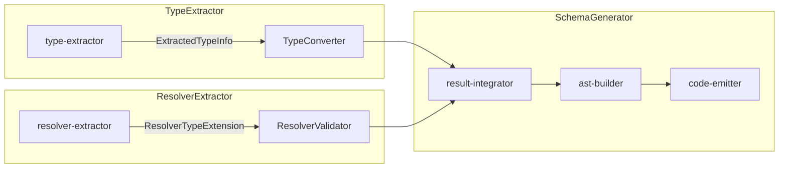
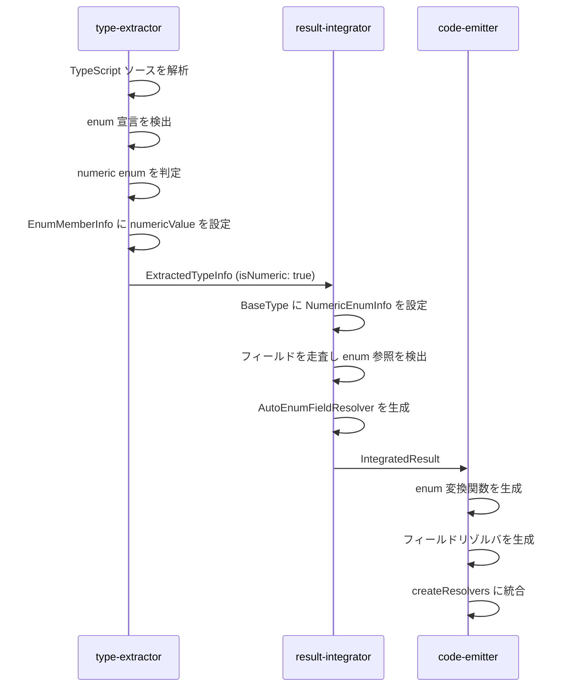
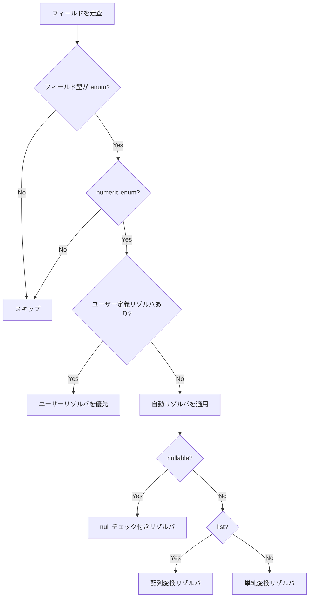
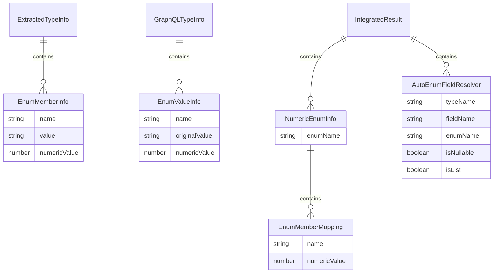

# Design Document

## Overview

**Purpose**: 本機能は TypeScript の numeric enum を GraphQL enum として適切にサポートし、ランタイムでの数値から文字列への変換を自動化する。

**Users**: TypeScript で numeric enum を使用している開発者が、既存のコードを変更することなく GraphQL API で enum を使用できるようになる。

**Impact**: type-extractor、schema-generator、code-emitter の各パイプラインステージを拡張し、numeric enum の検出から変換リゾルバの自動生成までを一貫してサポートする。

### Goals
- TypeScript numeric enum を GraphQL enum として認識・出力
- graphql-tools 互換の enum resolver を自動生成（Output と Input 両方向の変換をサポート）
- 既存のコード生成パイプラインとの統合

### Non-Goals
- const enum のサポート（TypeScript の制約により不可）
- 混合 enum（string と numeric の混在）のサポート
- enum 値のカスタムマッピング

## Architecture

### Existing Architecture Analysis

現在のパイプラインアーキテクチャ:



現在の enum 処理:
- `type-extractor`: string enum のみサポート、numeric enum はエラーで拒否
- `EnumMemberInfo`: `value` フィールドは string 型のみ
- 変換リゾルバの自動生成機能は存在しない

### Architecture Pattern & Boundary Map

**Architecture Integration**:
- Selected pattern: Pipeline Extension - 既存の各パイプラインステージを拡張
- Domain/feature boundaries: type-extractor が enum 種別を判定、schema-generator が変換ロジックを生成
- Existing patterns preserved: ExtractedTypeInfo、IntegratedResult の構造を維持
- New components rationale: NumericEnumInfo を追加して変換情報を保持
- Steering compliance: 静的解析のみ、デコレータ不使用の原則を維持

### Technology Stack

| Layer | Choice / Version | Role in Feature | Notes |
|-------|------------------|-----------------|-------|
| CLI | TypeScript 5.9+ | 静的解析・コード生成 | 既存スタック |
| AST | graphql-js | GraphQL スキーマ AST 生成 | 既存スタック |
| Runtime | None | 生成されたリゾルバは純粋な関数 | ランタイム依存なし |

## System Flows

### Numeric Enum Detection and Conversion Flow



### Field Resolver Application Decision Flow



## Requirements Traceability

| Requirement | Summary | Components | Interfaces | Flows |
|-------------|---------|------------|------------|-------|
| 1.1 | numeric enum 検出 | TypeExtractor | isNumericEnum, extractNumericEnumMembers | Detection Flow |
| 1.2 | メンバー名と数値の保持 | EnumMemberInfo | numericValue field | Detection Flow |
| 1.3 | 混合 enum のエラー報告 | TypeExtractor | isHeterogeneousEnum | Detection Flow |
| 1.4 | numeric/string enum の区別 | GraphQLTypeInfo, BaseType | isNumeric field | Detection Flow |
| 2.1 | GraphQL enum 値出力 | AstBuilder | buildEnumTypeDefinitionNode | - |
| 2.2 | TSDoc から description | AstBuilder | extractTsDocInfo | - |
| 2.3 | @deprecated ディレクティブ | AstBuilder | buildDeprecatedDirective | - |
| 2.4 | 同一スキーマ形式 | AstBuilder | buildEnumTypeDefinitionNode | - |
| 3.1 | 変換関数の生成 | CodeEmitter | buildEnumConverterFunction | Conversion Flow |
| 3.2 | 数値から文字列への変換 | CodeEmitter | enumConverterTemplate | Conversion Flow |
| 3.3 | 未知の数値でエラー | CodeEmitter | enumConverterTemplate | Conversion Flow |
| 3.4 | 各 enum に一つの関数 | CodeEmitter | buildEnumConverterFunctions | Conversion Flow |
| 4.1 | Object フィールドへの自動適用 | ResultIntegrator | collectAutoEnumResolvers | Application Flow |
| 4.2 | nullable 対応 | CodeEmitter | buildNullableEnumResolver | Application Flow |
| 4.3 | 配列対応 | CodeEmitter | buildListEnumResolver | Application Flow |
| 4.4 | ユーザー定義リゾルバ優先 | ResultIntegrator | hasUserDefinedResolver | Application Flow |
| 4.5 | Interface 型対応 | ResultIntegrator | collectAutoEnumResolvers | Application Flow |
| 5.1 | パイプライン統合 | GenOrchestrator | generateSchema | - |
| 5.2 | 型安全性の維持 | CodeEmitter | TypeScript 型付き出力 | - |
| 5.3 | graphql-tools 互換 | CodeEmitter | Resolver map 形式 | - |
| 5.4 | 必要な変換関数を含める | CodeEmitter | buildEnumConverterFunctions | - |
| 6.1 | 重複値エラー | TypeExtractor | validateEnumValues | - |
| 6.2 | 無効な名前エラー | TypeExtractor | validateEnumMemberName | - |
| 6.3 | ファイル名と行番号 | Diagnostic | SourceLocation | - |
| 6.4 | verbose モード出力 | GenOrchestrator | Reporter | - |

## Components and Interfaces

| Component | Domain/Layer | Intent | Req Coverage | Key Dependencies | Contracts |
|-----------|--------------|--------|--------------|------------------|-----------|
| TypeExtractor | Extraction | numeric enum の検出と抽出 | 1.1-1.4, 6.1-6.3 | ts.TypeChecker (P0) | Service |
| GraphQLConverter | Extraction | GraphQL 型への変換 | 1.4, 2.1 | TypeExtractor (P0) | Service |
| ResultIntegrator | Integration | 型とリゾルバの統合 | 4.1, 4.4, 4.5 | TypeExtractor (P0), ResolverExtractor (P0) | Service |
| AstBuilder | Generation | GraphQL AST 構築 | 2.1-2.4 | IntegratedResult (P0) | Service |
| CodeEmitter | Generation | TypeScript コード生成 | 3.1-3.4, 4.2-4.3, 5.1-5.4 | IntegratedResult (P0) | Service |

### Extraction Layer

#### TypeExtractor (Extended)

| Field | Detail |
|-------|--------|
| Intent | TypeScript ソースから numeric enum を検出・抽出する |
| Requirements | 1.1, 1.2, 1.3, 1.4, 6.1, 6.2, 6.3 |

**Responsibilities & Constraints**
- enum 宣言の検出と numeric/string/heterogeneous の判定
- enum メンバーの名前と値（文字列または数値）の抽出
- 重複値や無効な名前の検証
- 既存の string enum 処理との互換性維持

**Dependencies**
- Inbound: GenOrchestrator - 型抽出の呼び出し (P0)
- External: ts.TypeChecker - TypeScript 型情報の取得 (P0)

**Contracts**: Service [x]

##### Service Interface

```typescript
interface EnumMemberInfo {
  readonly name: string;
  readonly value: string;
  /** Numeric value for numeric enums, null for string enums */
  readonly numericValue: number | null;
  readonly description: string | null;
  readonly deprecated: DeprecationInfo | null;
  readonly sourceLocation: SourceLocation | null;
}

interface GraphQLTypeInfo {
  // ... existing fields ...
  readonly enumValues: ReadonlyArray<EnumValueInfo> | null;
  /** True if this enum uses numeric values */
  readonly isNumericEnum: boolean;
}

function extractNumericEnumMembers(
  node: ts.EnumDeclaration,
  checker: ts.TypeChecker,
): ReadonlyArray<EnumMemberInfo>;

function isNumericEnum(node: ts.Node): boolean;

function validateEnumValues(
  members: ReadonlyArray<EnumMemberInfo>,
  enumName: string,
  sourceLocation: SourceLocation,
): ReadonlyArray<Diagnostic>;
```

- Preconditions: node は有効な EnumDeclaration
- Postconditions: すべてのメンバーに numericValue が設定される
- Invariants: 混合 enum は常にエラーとして報告

**Implementation Notes**
- Integration: 既存の `extractEnumMembers` を拡張し、numeric enum も処理
- Validation: GraphQL 識別子として有効でない名前を検出してエラー報告
- Risks: TypeScript の enum 初期化子の複雑なケース（計算値など）

### Integration Layer

#### ResultIntegrator (Extended)

| Field | Detail |
|-------|--------|
| Intent | 型情報とリゾルバ情報を統合し、自動 enum リゾルバを生成する |
| Requirements | 4.1, 4.4, 4.5 |

**Responsibilities & Constraints**
- BaseType に numeric enum 情報を保持
- Object/Interface 型のフィールドを走査して numeric enum 参照を検出
- ユーザー定義リゾルバの有無を確認
- 自動適用すべきフィールドリゾルバのリストを生成

**Dependencies**
- Inbound: GenOrchestrator - 統合処理の呼び出し (P0)
- Inbound: TypeExtractor - ExtractTypesResult (P0)
- Inbound: ResolverExtractor - ExtractResolversResult (P0)

**Contracts**: Service [x]

##### Service Interface

```typescript
interface NumericEnumInfo {
  readonly enumName: string;
  readonly members: ReadonlyArray<{
    readonly name: string;
    readonly numericValue: number;
  }>;
}

interface AutoEnumFieldResolver {
  readonly typeName: string;
  readonly fieldName: string;
  readonly enumName: string;
  readonly isNullable: boolean;
  readonly isList: boolean;
  readonly listItemNullable: boolean | null;
}

interface IntegratedResult {
  // ... existing fields ...
  /** Numeric enum definitions for converter generation */
  readonly numericEnums: ReadonlyArray<NumericEnumInfo>;
  /** Auto-generated field resolvers for numeric enum conversion */
  readonly autoEnumResolvers: ReadonlyArray<AutoEnumFieldResolver>;
}

function collectAutoEnumResolvers(
  baseTypes: ReadonlyArray<BaseType>,
  numericEnumNames: ReadonlySet<string>,
  userDefinedResolvers: ReadonlySet<string>,
): ReadonlyArray<AutoEnumFieldResolver>;
```

- Preconditions: baseTypes に有効な型情報が含まれる
- Postconditions: ユーザー定義リゾルバがないフィールドのみに自動リゾルバを適用
- Invariants: 同一フィールドに重複したリゾルバは生成しない

**Implementation Notes**
- Integration: ユーザー定義リゾルバの検出は `typeExtensions` を参照
- Validation: Interface 型のフィールドも走査対象に含める

### Generation Layer

#### CodeEmitter (Extended)

| Field | Detail |
|-------|--------|
| Intent | numeric enum 変換関数とフィールドリゾルバを含むコードを生成 |
| Requirements | 3.1, 3.2, 3.3, 3.4, 4.2, 4.3, 5.1, 5.2, 5.3, 5.4 |

**Responsibilities & Constraints**
- 各 numeric enum に対して変換関数を生成
- フィールドリゾルバを生成（nullable、list 対応）
- createResolvers 関数に統合
- 型安全な TypeScript コードを出力

**Dependencies**
- Inbound: GenOrchestrator - コード生成の呼び出し (P0)
- Inbound: IntegratedResult - 統合済み情報 (P0)

**Contracts**: Service [x]

##### Service Interface

```typescript
interface EnumConverterTemplate {
  readonly enumName: string;
  readonly functionName: string;
  readonly memberMappings: ReadonlyArray<{
    readonly numericValue: number;
    readonly stringValue: string;
  }>;
}

function buildEnumConverterFunction(
  enumInfo: NumericEnumInfo,
): string;

function buildEnumFieldResolver(
  resolver: AutoEnumFieldResolver,
  converterFunctionName: string,
): string;

function emitResolversCode(
  resolverInfo: ResolverInfo,
  outputDir: string,
  customScalars?: ReadonlyArray<CollectedScalarType>,
  numericEnums?: ReadonlyArray<NumericEnumInfo>,
  autoEnumResolvers?: ReadonlyArray<AutoEnumFieldResolver>,
): string;
```

- Preconditions: NumericEnumInfo に有効な変換情報が含まれる
- Postconditions: 生成されたコードは TypeScript として有効
- Invariants: 未知の数値に対してランタイムエラーを発生させる

**Implementation Notes**
- Integration: 既存の `emitResolversCode` を拡張
- Validation: 生成コードは graphql-tools 互換形式

## Data Models

### Domain Model



**Aggregates and Transactional Boundaries**:
- `ExtractedTypeInfo` は型抽出の単位
- `IntegratedResult` は統合処理の単位

**Business Rules & Invariants**:
- numeric enum のメンバー値は一意でなければならない
- 混合 enum（numeric と string の混在）は許可しない

### Logical Data Model

**EnumMemberInfo (Extended)**:
```typescript
interface EnumMemberInfo {
  readonly name: string;
  /** String representation of the value */
  readonly value: string;
  /** Numeric value for numeric enums, null for string enums */
  readonly numericValue: number | null;
  readonly description: string | null;
  readonly deprecated: DeprecationInfo | null;
  readonly sourceLocation: SourceLocation | null;
}
```

**NumericEnumInfo (New)**:
```typescript
interface NumericEnumInfo {
  readonly enumName: string;
  readonly members: ReadonlyArray<{
    readonly name: string;
    readonly numericValue: number;
  }>;
}
```

**AutoEnumFieldResolver (New)**:
```typescript
interface AutoEnumFieldResolver {
  readonly typeName: string;
  readonly fieldName: string;
  readonly enumName: string;
  readonly isNullable: boolean;
  readonly isList: boolean;
  readonly listItemNullable: boolean | null;
}
```

## Error Handling

### Error Strategy
パイプライン全体を通じて Fail-Fast 戦略を採用。エラーは早期に検出し、具体的な位置情報とともに報告する。

### Error Categories and Responses

**User Errors (Diagnostic severity: error)**:
- 混合 enum の検出 → `UNSUPPORTED_ENUM_TYPE: Heterogeneous enum '{name}' is not supported`
- 重複する numeric 値 → `DUPLICATE_ENUM_VALUE: Enum '{name}' has duplicate value {value}`
- 無効な識別子名 → `INVALID_ENUM_MEMBER_NAME: Enum member '{name}' is not a valid GraphQL identifier`

**System Errors (Runtime)**:
- 未知の数値を変換しようとした場合 → `Error: Unknown value {value} for enum {enumName}`

### Monitoring
- 診断メッセージにソースファイルと行番号を含める
- verbose モードで検出された numeric enum の一覧を出力

## Testing Strategy

### Unit Tests
- `isNumericEnum` 関数: 純粋な numeric enum、string enum、混合 enum の判定
- `extractNumericEnumMembers`: メンバー名と数値の正しい抽出
- `validateEnumValues`: 重複値検出、無効名検出
- `buildEnumConverterFunction`: 変換関数コードの正確な生成

### Integration Tests
- 型抽出からスキーマ生成までの完全なフロー
- ユーザー定義リゾルバとの共存
- nullable および list フィールドの処理

### Golden File Tests
以下のテストケースを `testdata/` に追加:
- `numeric-enum-basic`: 基本的な numeric enum の変換
- `numeric-enum-nullable`: nullable フィールドの処理
- `numeric-enum-list`: 配列フィールドの処理
- `numeric-enum-user-resolver`: ユーザー定義リゾルバとの共存
- `numeric-enum-interface`: Interface 型フィールドへの適用
- `numeric-enum-input`: Input 型での numeric enum 使用
- `numeric-enum-error-heterogeneous`: 混合 enum のエラー
- `numeric-enum-error-duplicate`: 重複値のエラー

## Supporting References

### Generated Code Examples

**Enum Resolver (graphql-tools pattern)**:

graphql-tools の enum resolver パターンを使用することで、Output（数値→文字列）と Input（文字列→数値）の両方向の変換が自動的に処理される。

```typescript
{
  UserStatus: {
    ACTIVE: 0,
    INACTIVE: 1,
    PENDING: 2,
  }
}
```

これにより:
- **Output 方向**: リゾルバが返す数値 `0` は GraphQL 応答で文字列 `"ACTIVE"` に変換される
- **Input 方向**: GraphQL 引数の文字列 `"ACTIVE"` はリゾルバ内で数値 `0` として受け取れる

**Complete Resolver Output Example**:
```typescript
// This file is auto-generated by gqlkit. DO NOT EDIT.

import { createUser } from "../schema/types.js";

export function createResolvers() {
  return {
    UserStatus: {
      ACTIVE: 0,
      INACTIVE: 1,
      PENDING: 2,
    },
    Mutation: {
      createUser: createUser,
    },
  };
}
```

**Note**: 従来のコンバータ関数方式は廃止され、enum resolver パターンに統一された。これにより:
- コード生成がシンプルになった
- nullable や配列の特別処理が不要になった
- Input 型での numeric enum 使用が可能になった
