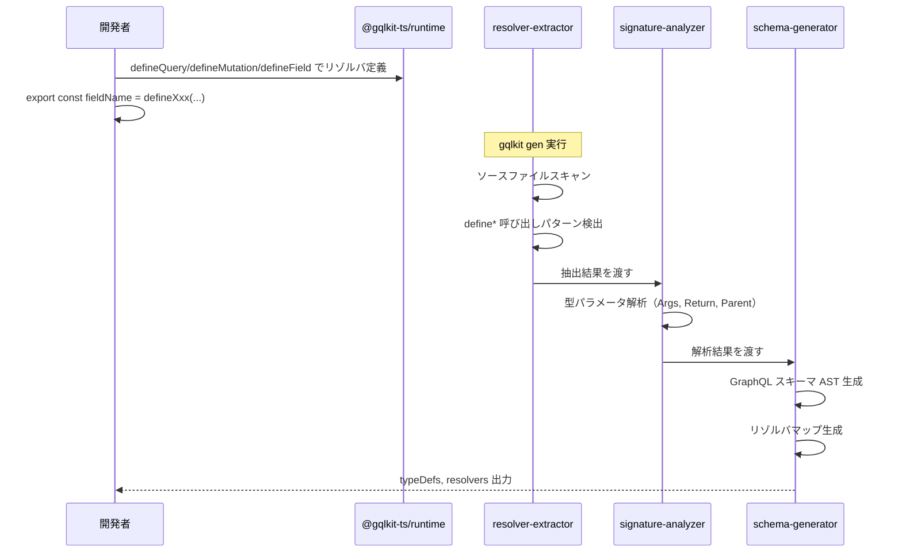
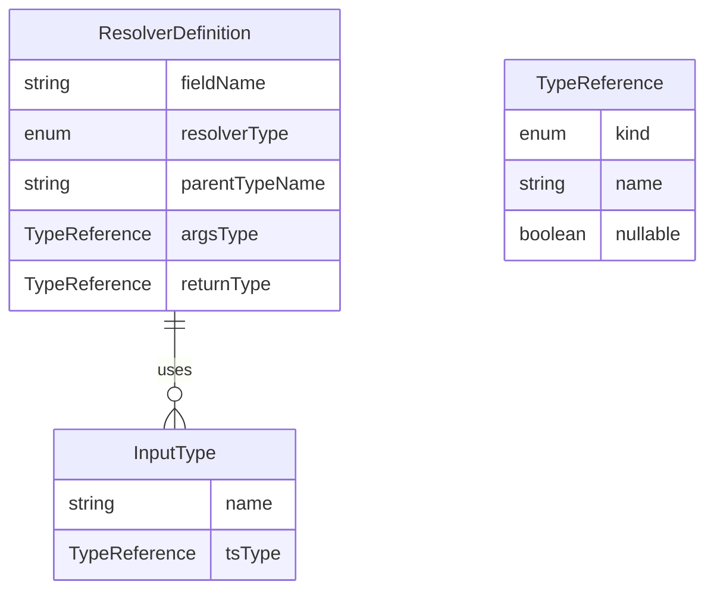

# Design Document

## Overview

**Purpose**: 本機能は、gqlkit のリゾルバ定義 API を刷新し、開発者が Query/Mutation/フィールドリゾルバを明示的かつ型安全に定義できるユーティリティ関数群を提供する。

**Users**: GraphQL サーバを TypeScript で実装する開発者が、`defineQuery`、`defineMutation`、`defineField` 関数を使用してリゾルバを個別に定義・エクスポートする。

**Impact**: 現在のオブジェクトスタイル（`QueryResolver` 型 + `queryResolver` 値のペア）を廃止し、関数スタイル（個別の `export const fieldName = defineQuery(...)` 形式）に完全移行する。旧 API と新 API の混在は許可しない。

### Current API vs New API

現在のオブジェクトスタイル API:
```typescript
// 現在: オブジェクトスタイル（1-2 パラメータ）
export type QueryResolver = {
  users: () => User[];
};
export const queryResolver: QueryResolver = {
  users: () => [...],
};

export type UserResolver = {
  fullName: (parent: User) => string;
};
export const userResolver: UserResolver = {
  fullName: (parent) => `${parent.firstName} ${parent.lastName}`,
};
```

新しい関数スタイル API:
```typescript
// 新規: 関数スタイル（4 パラメータ）
import { defineQuery, defineField, NoArgs } from "@gqlkit-ts/runtime";

export const users = defineQuery<NoArgs, User[]>(
  (root, args, ctx, info) => [...]
);

export const fullName = defineField<User, NoArgs, string>(
  (parent, args, ctx, info) => `${parent.firstName} ${parent.lastName}`
);
```

**主な変更点**:
- リゾルバごとに個別の export（オブジェクトプロパティではなく）
- GraphQL 標準の 4 パラメータシグネチャ（`root/parent, args, context, info`）
- 関数名から Query/Mutation/Field の種別が明確
- 型パラメータで明示的に型を指定

### Goals

- `defineQuery`、`defineMutation`、`defineField` ユーティリティ関数を `@gqlkit-ts/runtime` パッケージから提供する
- ジェネリクス型パラメータによる完全な型安全性を実現する
- GraphQL 標準の4パラメータ `(parent/root, args, context, info)` シグネチャをサポートする
- ユーザー定義の Context 型をリゾルバ全体に適用する仕組みを提供する
- gqlkit gen コマンドが新 API を認識し、スキーマ生成に統合する
- 既存の `resolver-extractor` パイプラインと統合し、`AnalyzedResolver` / `AnalyzedField` 形式で出力する

### Non-Goals

- 旧オブジェクトスタイル API との後方互換性（新 API に完全移行）
- Subscription リゾルバのサポート（将来の拡張として検討）
- デコレータベースの API（gqlkit の設計原則に反する）
- 実行時のリゾルバ検証（静的解析のみ）
- context / info パラメータの使用状況に基づく最適化（将来検討）

## Architecture

### Existing Architecture Analysis

現在の resolver-extractor パイプライン:
```
scanResolverDirectory → extractResolversFromProgram → analyzeSignatures → convertToFields
                               ↓
                        ResolverPair (type + value ペア検出)
                               ↓
                        AnalyzedResolver (フィールドシグネチャ解析)
                               ↓
                        QueryFieldDefinitions / TypeExtension
```

現在のパイプラインは `XxxResolver` 型 + `xxxResolver` 値のペアパターンを検出する。新 API では `export const fieldName = defineXxx(...)` パターンを検出する必要があるが、最終的な出力形式 `AnalyzedResolver` / `AnalyzedField` は再利用可能。

### Architecture Pattern & Boundary Map

```mermaid
graph TB
    subgraph UserCode[ユーザーコード]
        Resolvers[リゾルバファイル]
        Types[型定義ファイル]
    end

    subgraph RuntimePkg[@gqlkit-ts/runtime]
        DefineQuery[defineQuery]
        DefineMutation[defineMutation]
        DefineField[defineField]
        NoArgsType[NoArgs]
        ContextTypes[Gqlkit.Context]
    end

    subgraph CLIPkg[@gqlkit-ts/cli]
        subgraph ResolverExtractor[resolver-extractor]
            LegacyExtractor[旧API検出]
            DefineApiExtractor[新API検出]
            MixedApiValidator[混在チェック]
        end
        SignatureAnalyzer[signature-analyzer]
        FieldConverter[field-converter]
        SchemaGenerator[schema-generator]
    end

    subgraph Generated[生成物]
        TypeDefs[typeDefs]
        ResolverMap[resolvers]
    end

    Resolvers --> DefineQuery
    Resolvers --> DefineMutation
    Resolvers --> DefineField
    Resolvers --> LegacyExtractor
    DefineQuery --> DefineApiExtractor
    DefineMutation --> DefineApiExtractor
    DefineField --> DefineApiExtractor
    LegacyExtractor --> MixedApiValidator
    DefineApiExtractor --> MixedApiValidator
    MixedApiValidator --> SignatureAnalyzer
    SignatureAnalyzer --> FieldConverter
    FieldConverter --> SchemaGenerator
    SchemaGenerator --> TypeDefs
    SchemaGenerator --> ResolverMap
```

**Architecture Integration**:
- **Selected pattern**: 関数ラッパーパターン（Vue の `defineComponent`、Pinia の `defineStore` に類似）
- **Domain/feature boundaries**: `@gqlkit-ts/runtime`（ランタイム API）と `@gqlkit-ts/cli`（静的解析・生成）を明確に分離
- **Existing patterns preserved**: 既存の `AnalyzedResolver` / `AnalyzedField` 型を再利用し、`field-converter` 以降は変更なし
- **Migration strategy**: 旧オブジェクトスタイル API と新関数スタイル API の混在を検出しエラーを報告、完全移行を強制
- **New components rationale**:
  - `@gqlkit-ts/runtime`: 軽量ランタイムとして分離し、ユーザープロジェクトの依存を最小化
  - `DefineApiExtractor`: 新 API パターン検出の専用モジュール
  - `MixedApiValidator`: 旧/新 API 混在検出
- **Steering compliance**: 静的解析のみ、デコレータ不使用、graphql-tools 互換の原則を維持

### Technology Stack

| Layer | Choice / Version | Role in Feature | Notes |
|-------|------------------|-----------------|-------|
| Runtime | `@gqlkit-ts/runtime` (new) | ユーザープロジェクトにインポートされるユーティリティ関数群 | 依存なし（peer: graphql） |
| Backend / CLI | `@gqlkit-ts/cli` (existing) | リゾルバ抽出・スキーマ生成 | TypeScript Compiler API 使用 |
| Type System | TypeScript 5.9+ | ジェネリクス型推論、モジュール拡張 | strict mode 必須 |

## System Flows

### リゾルバ定義から生成までのフロー



## Requirements Traceability

| Requirement | Summary | Components | Interfaces | Flows |
|-------------|---------|------------|------------|-------|
| 1.1-1.5 | ランタイムパッケージの提供 | @gqlkit-ts/runtime | defineQuery, defineMutation, defineField, NoArgs | - |
| 2.1-2.5 | Query resolver 定義 | DefineQueryFunction | `defineQuery<Args, Return>` | リゾルバ定義フロー |
| 3.1-3.5 | Mutation resolver 定義 | DefineMutationFunction | `defineMutation<Args, Return>` | リゾルバ定義フロー |
| 4.1-4.6 | オブジェクト型フィールド resolver 定義 | DefineFieldFunction | `defineField<Parent, Args, Return>` | リゾルバ定義フロー |
| 5.1-5.3 | NoArgs 型エイリアス | NoArgs type | - | - |
| 6.1-6.4 | コード生成との統合（パターン検出） | DefineApiExtractor | extractDefineApiResolvers | 抽出フロー |
| 6.5 | Parent 型から GraphQL 型名解決 | ParentTypeResolver | resolveParentType | 抽出フロー |
| 7.1-7.3 | 旧 API との互換性（混在禁止） | MixedApiValidator | validateApiStyleConsistency | エラーハンドリング |
| 8.1-8.4 | 型推論とエラー検出 | TypeScript | 型チェック | - |

## Components and Interfaces

| Component | Domain/Layer | Intent | Req Coverage | Key Dependencies (P0/P1) | Contracts |
|-----------|--------------|--------|--------------|--------------------------|-----------|
| DefineQueryFunction | @gqlkit-ts/runtime | Query フィールドリゾルバ定義 | 1.1, 2.1-2.5, 8.1-8.4 | graphql (P1) | Service |
| DefineMutationFunction | @gqlkit-ts/runtime | Mutation フィールドリゾルバ定義 | 1.2, 3.1-3.5, 8.1-8.4 | graphql (P1) | Service |
| DefineFieldFunction | @gqlkit-ts/runtime | オブジェクトフィールドリゾルバ定義 | 1.3, 4.1-4.6, 8.1-8.4 | graphql (P1) | Service |
| NoArgsType | @gqlkit-ts/runtime | 引数なし resolver の型エイリアス | 1.4, 5.1-5.3 | - | Type |
| ContextTypeProvider | @gqlkit-ts/runtime | Context 型の宣言的定義 | - | - | State |
| DefineApiExtractor | @gqlkit-ts/cli | 新 API パターンの検出・抽出 | 6.1-6.4 | typescript (P0) | Service |
| ParentTypeResolver | @gqlkit-ts/cli | Parent 型から GraphQL 型名への解決 | 6.5 | type-extractor (P0) | Service |
| MixedApiValidator | @gqlkit-ts/cli | 旧/新 API 混在検出・エラー報告 | 7.1-7.3 | typescript (P0) | Service |

### @gqlkit-ts/runtime

#### DefineQueryFunction

| Field | Detail |
|-------|--------|
| Intent | Query タイプのフィールドリゾルバを型安全に定義するユーティリティ関数 |
| Requirements | 1.1, 2.1-2.5, 8.1-8.4 |

**Responsibilities & Constraints**
- Query フィールドリゾルバの定義をラップし、型情報を保持する
- GraphQL 標準の `(root, args, context, info)` シグネチャを強制する
- **渡された resolver 関数をそのまま返す**（identity 関数として動作）
- 戻り値は GraphQL リゾルバとして直接使用可能

**Dependencies**
- External: `graphql` — GraphQLResolveInfo 型の参照 (P1)

**Contracts**: Service [x]

##### Service Interface

```typescript
import type { GraphQLResolveInfo } from "graphql";

type GqlkitContext = Gqlkit.Context extends Record<string, never>
  ? unknown
  : Gqlkit.Context;

/** 引数なしのリゾルバに使用する型エイリアス */
type NoArgs = Record<string, never>;

type QueryResolverFn<TArgs, TResult> = (
  root: undefined,
  args: TArgs,
  context: GqlkitContext,
  info: GraphQLResolveInfo
) => TResult | Promise<TResult>;

function defineQuery<TArgs, TResult>(
  resolver: QueryResolverFn<TArgs, TResult>
): QueryResolverFn<TArgs, TResult>;
```

- Preconditions: resolver 関数は有効な関数でなければならない
- Postconditions: 渡された resolver 関数がそのまま返される
- Invariants: 入力と出力は同一の関数参照

**Implementation Notes**
- Integration: ユーザーは引数なしの場合 `export const me = defineQuery<NoArgs, User>((root, args, ctx, info) => ...)` のように使用する
- Integration: ユーザーは引数ありの場合 `export const user = defineQuery<UserArgs, User>((root, args, ctx, info) => ...)` のように使用する
- **実装**: `return resolver;` のみ。引数をそのまま返す identity 関数
- Validation: 型レベルでのみ検証、実行時検証は行わない
- Risks: 静的解析で `defineQuery` 呼び出しを検出し、型パラメータから Query フィールドであることを判別する必要がある

#### DefineMutationFunction

| Field | Detail |
|-------|--------|
| Intent | Mutation タイプのフィールドリゾルバを型安全に定義するユーティリティ関数 |
| Requirements | 1.2, 3.1-3.5, 8.1-8.4 |

**Responsibilities & Constraints**
- Mutation フィールドリゾルバの定義をラップし、型情報を保持する
- GraphQL 標準の `(root, args, context, info)` シグネチャを強制する
- **渡された resolver 関数をそのまま返す**（identity 関数として動作）
- 戻り値は GraphQL リゾルバとして直接使用可能

**Dependencies**
- External: `graphql` — GraphQLResolveInfo 型の参照 (P1)

**Contracts**: Service [x]

##### Service Interface

```typescript
type MutationResolverFn<TArgs, TResult> = (
  root: undefined,
  args: TArgs,
  context: GqlkitContext,
  info: GraphQLResolveInfo
) => TResult | Promise<TResult>;

function defineMutation<TArgs, TResult>(
  resolver: MutationResolverFn<TArgs, TResult>
): MutationResolverFn<TArgs, TResult>;
```

- Preconditions: resolver 関数は有効な関数でなければならない
- Postconditions: 渡された resolver 関数がそのまま返される
- Invariants: 入力と出力は同一の関数参照

**Implementation Notes**
- Integration: ユーザーは `export const createUser = defineMutation<CreateUserInput, User>((root, args, ctx, info) => ...)` のように使用する
- **実装**: `return resolver;` のみ。引数をそのまま返す identity 関数
- Validation: 型レベルでのみ検証

#### DefineFieldFunction

| Field | Detail |
|-------|--------|
| Intent | オブジェクトタイプのフィールドリゾルバを型安全に定義するユーティリティ関数 |
| Requirements | 1.3, 4.1-4.6, 8.1-8.4 |

**Responsibilities & Constraints**
- オブジェクトフィールドリゾルバの定義をラップし、親型情報を保持する
- Parent 型パラメータにより、所属先の GraphQL 型を特定可能にする
- GraphQL 標準の `(parent, args, context, info)` シグネチャを強制する
- **渡された resolver 関数をそのまま返す**（identity 関数として動作）

**Dependencies**
- External: `graphql` — GraphQLResolveInfo 型の参照 (P1)

**Contracts**: Service [x]

##### Service Interface

```typescript
type FieldResolverFn<TParent, TArgs, TResult> = (
  parent: TParent,
  args: TArgs,
  context: GqlkitContext,
  info: GraphQLResolveInfo
) => TResult | Promise<TResult>;

function defineField<TParent, TArgs, TResult>(
  resolver: FieldResolverFn<TParent, TArgs, TResult>
): FieldResolverFn<TParent, TArgs, TResult>;
```

- Preconditions: resolver 関数は有効な関数でなければならない、TParent は `src/gql/types` に定義された型でなければならない
- Postconditions: 渡された resolver 関数がそのまま返される
- Invariants: 入力と出力は同一の関数参照

**Implementation Notes**
- Integration: ユーザーは引数なしの場合 `export const fullName = defineField<User, NoArgs, string>((parent, args, ctx, info) => ...)` のように使用する
- Integration: ユーザーは引数ありの場合 `export const posts = defineField<User, PostsArgs, Post[]>((parent, args, ctx, info) => ...)` のように使用する
- **実装**: `return resolver;` のみ。引数をそのまま返す identity 関数
- Validation: Parent 型の存在検証は gqlkit gen 実行時に行う
- Risks: Parent 型の解決が静的解析で困難な場合がある（型エイリアスのチェーンなど）

#### ContextTypeProvider

| Field | Detail |
|-------|--------|
| Intent | ユーザー定義の Context 型をすべてのリゾルバに適用する仕組み |
| Requirements | - |

**Responsibilities & Constraints**
- グローバルな Context 型をモジュール拡張で定義可能にする
- 未定義の場合は `unknown` 型をフォールバックとして使用する

**Dependencies**
- なし

**Contracts**: State [x]

##### State Management

```typescript
declare global {
  namespace Gqlkit {
    interface Context {}
  }
}

type GqlkitContext = Gqlkit.Context extends Record<string, never>
  ? unknown
  : Gqlkit.Context;
```

- State model: グローバル名前空間を使用したモジュール拡張パターン
- Persistence & consistency: 型定義ファイルでユーザーが一度宣言すれば、プロジェクト全体で適用される
- Concurrency strategy: 型システムのみで実行時の状態管理なし

**Implementation Notes**
- Integration: ユーザーは `declare global { namespace Gqlkit { interface Context { userId: string; } } }` で拡張する
- Validation: TypeScript コンパイラが型の整合性を検証
- Risks: グローバル名前空間の汚染。`Gqlkit` 名前空間で適切にスコープ化する

### @gqlkit-ts/cli

#### DefineApiExtractor

| Field | Detail |
|-------|--------|
| Intent | 新しい define* API パターンを検出し、リゾルバ情報を抽出する |
| Requirements | 6.1-6.5, 7.1-7.3 |

**Responsibilities & Constraints**
- `export const fieldName = defineQuery/defineMutation/defineField(...)` パターンを検出する
- エクスポート名を GraphQL フィールド名として使用する
- 同一ファイルからの複数エクスポートをサポートする
- 旧オブジェクトスタイル API との混在を検出し、エラーを報告する

**Dependencies**
- Inbound: resolver-extractor — 統合エントリポイント (P0)
- External: typescript — TypeScript Compiler API (P0)

**Contracts**: Service [x]

##### Service Interface

```typescript
interface DefineApiResolverInfo {
  readonly fieldName: string;
  readonly resolverType: "query" | "mutation" | "field";
  readonly parentTypeName?: string;
  readonly argsType?: TSTypeReference;
  readonly returnType: TSTypeReference;
  readonly sourceFile: string;
  readonly exportedInputTypes: ReadonlyArray<ExportedInputType>;
}

interface ExportedInputType {
  readonly name: string;
  readonly tsType: TSTypeReference;
  readonly sourceFile: string;
}

interface ExtractDefineApiResult {
  readonly resolvers: ReadonlyArray<DefineApiResolverInfo>;
  readonly diagnostics: ReadonlyArray<Diagnostic>;
}

function extractDefineApiResolvers(
  program: ts.Program,
  files: ReadonlyArray<string>
): ExtractDefineApiResult;
```

- Preconditions: TypeScript Program が有効であること
- Postconditions: 検出されたすべての define* 呼び出しが解析される
- Invariants: 既存の resolver-extractor との結果は統合可能

**Implementation Notes**
- Integration: 既存の `extractResolversFromProgram` を置き換え、新 API のみを処理する
- Validation: define* 関数の呼び出しパターンを AST で検証。旧スタイル（`QueryResolver` 型 + `queryResolver` 値）が検出された場合はエラーを報告する
- Risks: 複雑な式での define* 呼び出し（例: `export const x = condition ? defineQuery(...) : defineQuery(...)`）は未サポートとして診断を出力

##### AST Detection Pattern

検出対象の AST 構造:
```
VariableStatement (export)
  └─ VariableDeclarationList
       └─ VariableDeclaration
            ├─ Identifier (fieldName)
            └─ CallExpression
                 ├─ Identifier (defineQuery/defineMutation/defineField)
                 ├─ TypeArguments? [TArgs, TResult] or [TParent, TArgs, TResult]
                 └─ Arguments
                      └─ FunctionExpression | ArrowFunction
```

検出ロジック:
1. `ts.forEachChild` でソースファイルをトラバース
2. `ts.isVariableStatement` かつ `export` 修飾子を持つノードを検出
3. 各 `VariableDeclaration` の初期化子が `CallExpression` かを確認
4. 呼び出し先が `defineQuery` / `defineMutation` / `defineField` かを確認
5. 型引数から `Args`, `Return`, `Parent`（defineField のみ）を抽出
6. 抽出結果を `DefineApiResolverInfo` に変換

呼び出し元の判定方法:
```typescript
// インポートシンボルを追跡して @gqlkit-ts/runtime からのインポートか確認
function isDefineApiCall(node: ts.CallExpression, checker: ts.TypeChecker): boolean {
  const symbol = checker.getSymbolAtLocation(node.expression);
  if (!symbol) return false;

  const declarations = symbol.getDeclarations();
  if (!declarations || declarations.length === 0) return false;

  const sourceFile = declarations[0]!.getSourceFile();
  // @gqlkit-ts/runtime からのインポートかを確認
  return sourceFile.fileName.includes("@gqlkit-ts/runtime");
}
```

#### ParentTypeResolver

| Field | Detail |
|-------|--------|
| Intent | defineField の Parent 型パラメータから GraphQL 型名を解決する |
| Requirements | 6.5 |

**Responsibilities & Constraints**
- 型パラメータから型名を抽出し、`src/gql/types` に定義されているか検証する
- 型エイリアスを解決して元の型名を取得する
- 未定義の型に対してはエラー診断を出力する

**Dependencies**
- Inbound: DefineApiExtractor — 型解決のトリガー (P0)
- Outbound: type-extractor — 型定義の検証 (P0)

**Contracts**: Service [x]

##### Service Interface

```typescript
interface ParentTypeResolution {
  readonly success: boolean;
  readonly graphqlTypeName?: string;
  readonly diagnostic?: Diagnostic;
}

function resolveParentType(
  parentTsType: TSTypeReference,
  typeDefinitions: ReadonlyArray<ExtractedType>,
  sourceFile: string
): ParentTypeResolution;
```

- Preconditions: parentTsType は `kind: "reference"` でなければならない
- Postconditions: 成功時は graphqlTypeName が設定される、失敗時は diagnostic が設定される
- Invariants: 常に success と graphqlTypeName/diagnostic のどちらかが設定される

**Implementation Notes**
- Integration: signature-analyzer の一部として統合可能
- Validation: 型名の存在確認は type-extractor の結果と照合
- Risks: ジェネリック型や条件型が Parent として使用された場合の処理

#### MixedApiValidator

| Field | Detail |
|-------|--------|
| Intent | 旧オブジェクトスタイル API と新関数スタイル API の混在を検出しエラーを報告する |
| Requirements | 7.1, 7.2, 7.3 |

**Responsibilities & Constraints**
- 旧 API（`XxxResolver` 型 + `xxxResolver` 値ペア）の検出
- 新 API（`defineQuery` / `defineMutation` / `defineField`）の検出
- 同一プロジェクト内での混在を検出しエラーを報告
- 処理の続行を中断し、明確なエラーメッセージを提供

**Dependencies**
- Inbound: resolver-extractor — 検証フェーズとして呼び出される (P0)
- External: typescript — TypeScript Compiler API (P0)

**Contracts**: Service [x]

##### Service Interface

```typescript
type ApiStyle = "legacy" | "define-api";

interface ApiStyleDetection {
  readonly style: ApiStyle;
  readonly locations: ReadonlyArray<{
    readonly file: string;
    readonly line: number;
    readonly identifier: string;
  }>;
}

interface MixedApiValidationResult {
  readonly valid: boolean;
  readonly detectedStyles: ReadonlyArray<ApiStyleDetection>;
  readonly diagnostic?: Diagnostic;
}

function validateApiStyleConsistency(
  legacyResolvers: ExtractedResolvers,
  defineApiResolvers: ExtractDefineApiResult
): MixedApiValidationResult;
```

- Preconditions: 両方の抽出結果が完了していること
- Postconditions: 混在検出時はエラー診断が設定される
- Invariants: valid が false の場合は必ず diagnostic が設定される

**Implementation Notes**
- Integration: `extractResolvers` 関数内で両方の抽出後に呼び出す
- Validation: 旧 API と新 API の両方が検出された場合のみエラー
- Error Message Example:
  ```
  error[LEGACY_API_DETECTED]: Cannot mix legacy resolver API with define* API
    --> src/gql/resolvers/user.ts:3:1
    |
  3 | export type QueryResolver = { ... }
    | ^^^^^^^^^^^^^^^^^^^^^^^^^^^^^^^^^^^
    = note: Found legacy API (QueryResolver + queryResolver pattern)
    --> src/gql/resolvers/post.ts:5:1
    |
  5 | export const posts = defineQuery(...);
    | ^^^^^^^^^^^^^^^^^^^^^^^^^^^^^^^^^^^^^
    = note: Found define* API
    = help: Migrate all resolvers to use defineQuery, defineMutation, or defineField
  ```

## Data Models

### Domain Model



**Aggregates and Boundaries**:
- `ResolverDefinition` が集約ルートとして機能
- `InputType` は Args から抽出され、ResolverDefinition に関連付けられる

**Business Rules & Invariants**:
- Query/Mutation リゾルバは `parentTypeName` を持たない
- Field リゾルバは必ず `parentTypeName` を持つ
- `returnType` は常に必須
- 同一ファイル内で同名のフィールドを複数定義した場合はエラー

### Logical Data Model

**Structure Definition**:
- `resolverType`: "query" | "mutation" | "field" の enum 値
- `TypeReference`: 既存の `TSTypeReference` 型を再利用
- `InputType`: リゾルバファイルからエクスポートされた入力用型

**Referential Integrity**:
- `parentTypeName` は `src/gql/types` に定義された型名と一致する必要がある
- `argsType` で使用される型がエクスポートされていれば `InputType` として登録される

## Error Handling

### Error Categories and Responses

**User Errors (診断メッセージ)**:
- `MISSING_PARENT_TYPE`: defineField の Parent 型が src/gql/types に存在しない
  - 対応: 該当する型を src/gql/types に定義するか、既存の型名を使用する
- `INVALID_DEFINE_CALL`: define* 関数の呼び出しパターンが不正
  - 対応: `export const fieldName = defineXxx(...)` 形式に修正する
- `DUPLICATE_FIELD_NAME`: 同一スコープで重複するフィールド名
  - 対応: フィールド名を一意にするか、ファイルを分割する
- `LEGACY_API_DETECTED`: 旧オブジェクトスタイル API（`QueryResolver` 型等）が検出された
  - 対応: 新関数スタイル API（`defineQuery` 等）に移行する。混在は許可されない

**System Errors**:
- TypeScript Compiler API のエラー → 診断メッセージとして出力

### Monitoring

- 診断メッセージは既存の `diagnostic-reporter` を通じて出力
- エラー/警告のカウントは既存の進捗レポートに統合

## Testing Strategy

### Unit Tests
- `defineQuery` 関数の型推論テスト（Args あり/なし、Promise 戻り値）
- `defineMutation` 関数の型推論テスト
- `defineField` 関数の型推論テスト（Parent 型の検証を含む）
- Context 型のモジュール拡張テスト

### Integration Tests
- define* API を使用したリゾルバファイルからの抽出テスト
- オブジェクトスタイル API と関数スタイル API の混在テスト
- 親タイプ解決のエンドツーエンドテスト
- 入力型エクスポートの検出テスト

### E2E Tests
- 新 API を使用した examples プロジェクトの gqlkit gen 実行
- 生成された typeDefs と resolvers の検証
