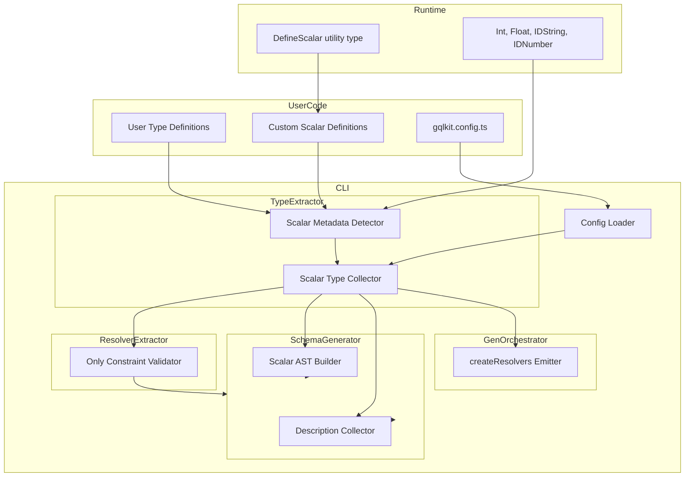
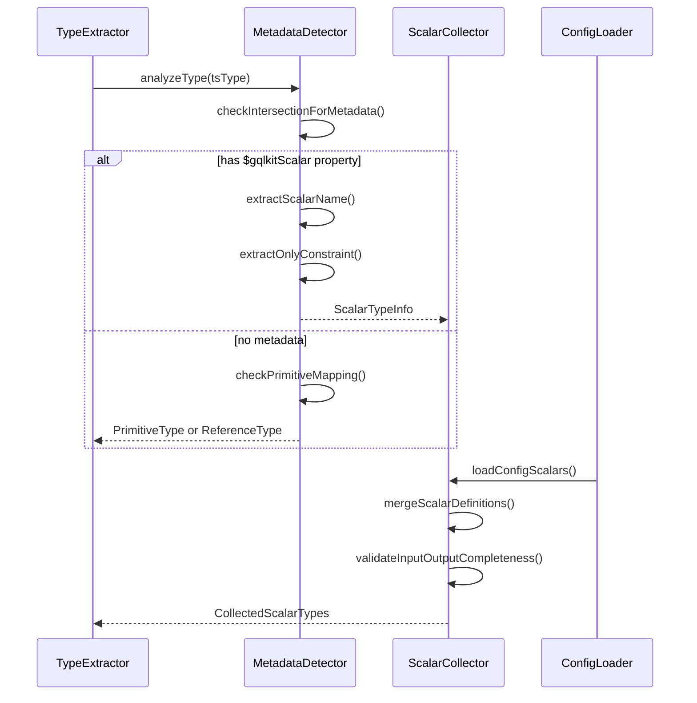
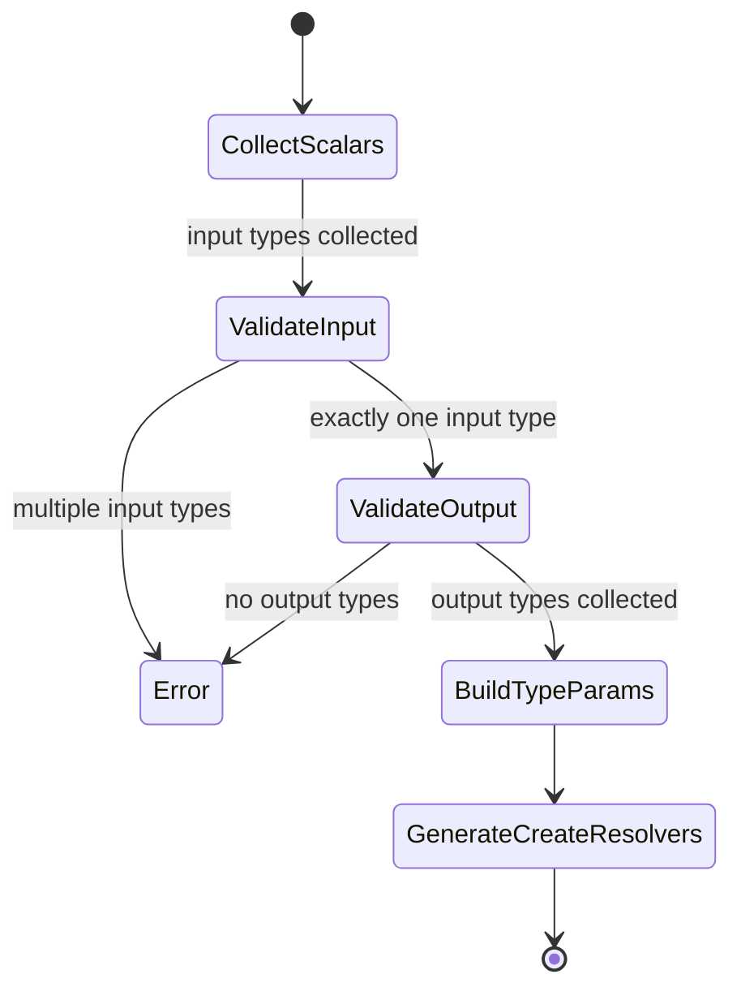
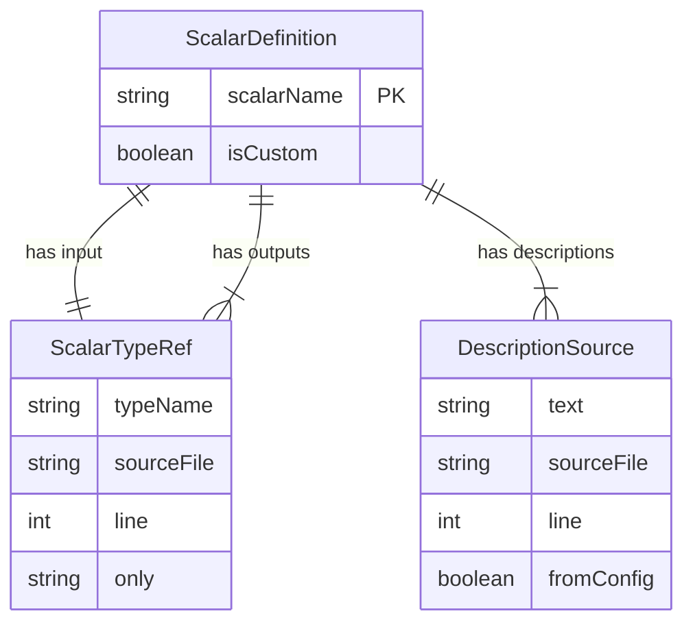

# Scalar Metadata System - Technical Design Document

## Overview

**Purpose**: この機能は gqlkit の scalar 型検出方式を import-path ベースから metadata ベースに移行し、input/output で異なる型を使用できる柔軟な scalar 型システムを提供する。

**Users**: gqlkit ユーザーは、`DefineScalar` utility type を使用して型安全に custom scalar を定義し、TypeScript の型情報から自動的に GraphQL schema を生成できる。

**Impact**: 現在の単純な型エイリアス (`type IDString = string`) による scalar 検出から、intersection type の metadata プロパティ (`" $gqlkitScalar"`) を読み取る方式に変更する。

### Goals

- metadata ベースの scalar 型検出システムの実装
- input/output 用途別の型定義サポート (`only` オプション)
- custom scalar の `createResolvers` 関数による型安全な注入
- TSDoc コメントからの description 自動生成
- 設定ファイルによる外部型の scalar マッピングサポート

### Non-Goals

- GraphQL scalar resolver の実装コード生成（ユーザーが実装を注入）
- 既存の branded type 検出ロジックの完全な削除（互換性のため段階的移行）
- subscriptions のサポート

## Architecture

### Existing Architecture Analysis

現在の scalar 検出システム:

1. **branded-detector.ts**: `@gqlkit-ts/runtime` からの import を検出し、型名 (`IDString`, `Int` 等) から GraphQL scalar にマッピング
2. **scalar-registry.ts**: 標準 scalar (`IDString`, `IDNumber`, `Int`, `Float`) のマッピング情報を管理
3. **symbol-resolver.ts**: シンボルの origin（import 元）を解決
4. **config/types.ts**: `ScalarMappingConfig` で custom scalar 設定を定義

課題:
- 単純な型エイリアスは TypeScript が underlying type に展開するため、型情報から直接検出できない
- input/output で異なる型を使用するユースケースに対応できない
- custom scalar の resolver 注入に型安全性がない

### Architecture Pattern & Boundary Map



**Architecture Integration**:
- **Selected pattern**: Pipeline architecture（既存パターンを維持）
- **Domain boundaries**: type-extractor に scalar metadata 検出を集約、resolver-extractor で only 検証、schema-generator で AST 生成
- **Existing patterns preserved**: branded-detector パターンを拡張、config-loader パターンを維持
- **New components rationale**: `ScalarMetadataDetector` は metadata 解析の責務を分離、`CreateResolversEmitter` は custom scalar 用の新しいコード生成パターン
- **Steering compliance**: fail-fast validation、deterministic output、no runtime mutation 原則を維持

### Technology Stack

| Layer | Choice / Version | Role in Feature | Notes |
|-------|------------------|-----------------|-------|
| Runtime | TypeScript 5.9+ | Intersection type の metadata 検出 | type predicate を活用 |
| CLI | ts.TypeChecker API | metadata プロパティの走査 | getTypeOfPropertyOfType 使用 |
| Code Generation | Template Literals | createResolvers 関数の生成 | 既存の emitter パターン拡張 |

## System Flows

### Scalar Type Detection Flow



**Key Decisions**:
- metadata 検出は intersection type の全メンバーを走査
- `only` が省略された場合は input/output 両方で使用可能
- 設定ファイルと DefineScalar の両方からの定義をマージ

### Custom Scalar Resolution Flow



## Requirements Traceability

| Requirement | Summary | Components | Interfaces | Flows |
|-------------|---------|------------|------------|-------|
| 1.1-1.3 | TypeScript プリミティブ自動マッピング | MetadataDetector | - | Detection Flow |
| 2.1-2.5 | Scalar Metadata 構造検出 | MetadataDetector | ScalarMetadata | Detection Flow |
| 3.1-3.6 | Runtime Built-in Scalar 型 | runtime/index.ts | Int, Float, IDString, IDNumber | - |
| 4.1-4.4 | DefineScalar Utility Type | runtime/index.ts | DefineScalar | - |
| 5.1-5.2 | Custom Scalar 自動検出 | ScalarCollector, SchemaGenerator | - | Detection Flow |
| 6.1-6.6 | 設定ファイル Scalar マッピング | ConfigLoader | ScalarMappingConfig | - |
| 7.1-7.4 | createResolvers 関数生成 | CreateResolversEmitter | createResolvers | Resolution Flow |
| 8.1-8.4 | Scalar 型パラメータ収集 | ScalarCollector | ScalarTypeParams | Resolution Flow |
| 9.1-9.4 | Description 生成 | DescriptionCollector | - | - |
| 10.1-10.4 | only 制約検証 | OnlyValidator | - | Detection Flow |
| 11.1-11.2 | Scalar Union エラー検出 | MetadataDetector | - | Detection Flow |
| 12.1-12.4 | Input 型複数マッピングエラー | ScalarCollector | - | Resolution Flow |
| 13.1-13.3 | Input/Output 型不足エラー | ScalarCollector | - | Resolution Flow |
| 14.1-14.2 | Built-in Scalar 衝突回避 | MetadataDetector | - | - |
| 15.1-15.5 | Nullable/List 組み合わせ | MetadataDetector | - | Detection Flow |
| 16.1-16.3 | 型エイリアス連鎖サポート | MetadataDetector | - | Detection Flow |
| 17.1-17.3 | 既存機能互換性 | All components | - | - |
| 18.1-18.3 | エラーメッセージ品質 | All validators | Diagnostic | - |

## Components and Interfaces

### Component Summary

| Component | Domain/Layer | Intent | Req Coverage | Key Dependencies | Contracts |
|-----------|--------------|--------|--------------|------------------|-----------|
| ScalarMetadata types | runtime | scalar metadata 型定義 | 2, 3, 4 | - | - |
| MetadataDetector | type-extractor | metadata 検出ロジック | 1, 2, 11, 14, 15, 16 | ts.TypeChecker (P0) | Service |
| ScalarCollector | type-extractor | scalar 定義収集・検証 | 5, 8, 12, 13 | MetadataDetector (P0), ConfigLoader (P1) | Service |
| OnlyValidator | resolver-extractor | only 制約検証 | 10 | ScalarCollector (P0) | Service |
| DescriptionCollector | schema-generator | description 結合 | 9 | ScalarCollector (P0) | Service |
| ScalarASTBuilder | schema-generator | scalar AST 生成 | 5 | DescriptionCollector (P1) | Service |
| CreateResolversEmitter | gen-orchestrator | createResolvers 生成 | 7 | ScalarCollector (P0) | Service |
| ConfigLoader (拡張) | config-loader | 新形式 scalar 設定読込 | 6 | - | Service |

### Runtime Layer

#### ScalarMetadata Type Definitions

| Field | Detail |
|-------|--------|
| Intent | TypeScript 型に埋め込む scalar metadata 構造を定義 |
| Requirements | 2.1-2.5, 3.1-3.6, 4.1-4.4 |

**Responsibilities & Constraints**
- scalar metadata の構造を intersection type として定義
- underlying type との互換性を保つため optional プロパティを使用
- DefineScalar utility type でユーザーフレンドリーな API を提供

**Contracts**: Service [x]

##### Service Interface

```typescript
/**
 * Scalar metadata structure embedded in intersection types.
 */
interface ScalarMetadataShape {
  readonly name: string;
  readonly only?: "input" | "output";
}

/**
 * Built-in scalar types with metadata.
 */
type Int = number & { " $gqlkitScalar"?: { name: "Int" } };
type Float = number & { " $gqlkitScalar"?: { name: "Float" } };
type IDString = string & { " $gqlkitScalar"?: { name: "ID" } };
type IDNumber = number & { " $gqlkitScalar"?: { name: "ID" } };

/**
 * Utility type for defining custom scalars.
 * @typeParam Name - GraphQL scalar name
 * @typeParam Base - Underlying TypeScript type
 * @typeParam Only - Usage constraint ("input" | "output" | undefined)
 */
type DefineScalar<
  Name extends string,
  Base,
  Only extends "input" | "output" | undefined = undefined
> = Base & {
  " $gqlkitScalar"?: {
    name: Name;
    only: Only;
  };
};
```

- Preconditions: なし
- Postconditions: 型定義が TypeScript の型システムで正しく推論される
- Invariants: metadata プロパティは optional であり、underlying type と互換

**Implementation Notes**
- Integration: 既存の `@gqlkit-ts/runtime` の export に追加
- Validation: 型レベルの検証のみ（runtime 検証なし）

### Type Extractor Layer

#### MetadataDetector

| Field | Detail |
|-------|--------|
| Intent | TypeScript 型から scalar metadata を検出 |
| Requirements | 1.1-1.3, 2.1-2.5, 11.1-11.2, 14.1-14.2, 15.1-15.5, 16.1-16.3 |

**Responsibilities & Constraints**
- intersection type から `" $gqlkitScalar"` プロパティを検出
- union 型から null を除外して scalar metadata を特定
- 型エイリアスの連鎖を再帰的に辿る
- 異なる scalar の union をエラーとして検出

**Dependencies**
- Inbound: TypeExtractor - 型解析の委譲 (P0)
- Outbound: ScalarCollector - 検出結果の収集 (P0)
- External: ts.TypeChecker - 型情報の取得 (P0)

**Contracts**: Service [x]

##### Service Interface

```typescript
interface ScalarMetadataInfo {
  readonly scalarName: string;
  readonly typeName: string;
  readonly only: "input" | "output" | null;
  readonly sourceFile: string;
  readonly line: number;
  readonly description: string | null;
}

interface DetectionResult {
  readonly scalarInfo: ScalarMetadataInfo | null;
  readonly diagnostics: ReadonlyArray<Diagnostic>;
}

interface MetadataDetectorService {
  /**
   * Detects scalar metadata from a TypeScript type.
   * Handles intersection types, unions with null, and type alias chains.
   */
  detectScalarMetadata(
    type: ts.Type,
    checker: ts.TypeChecker,
  ): DetectionResult;

  /**
   * Checks if a union of different scalars exists (error case).
   */
  validateNoMixedScalarUnion(
    type: ts.Type,
    checker: ts.TypeChecker,
  ): ReadonlyArray<Diagnostic>;
}
```

- Preconditions: TypeChecker が有効な program から取得されている
- Postconditions: scalar metadata が検出された場合、scalarName と only が正しく設定される
- Invariants: null との union は nullable として処理され、scalar 検出には影響しない

**Implementation Notes**
- Integration: 既存の `branded-detector.ts` を拡張または置換
- Validation: 異なる scalar の union は即時エラー
- Risks: 型エイリアスの深い連鎖でのパフォーマンス（実用的な深さでは問題なし）

#### ScalarCollector

| Field | Detail |
|-------|--------|
| Intent | 検出された scalar 定義を収集し、input/output 型パラメータを構築 |
| Requirements | 5.1-5.2, 8.1-8.4, 12.1-12.4, 13.1-13.3 |

**Responsibilities & Constraints**
- sourceDir 内の scalar metadata 付き型を収集
- 設定ファイルからの scalar マッピングとマージ
- input 用型の単一性を検証（複数定義はエラー）
- output 用型の union を構築

**Dependencies**
- Inbound: TypeExtractor - 型抽出完了後の収集 (P0)
- Outbound: SchemaGenerator - scalar 定義の提供 (P0)
- External: ConfigLoader - 設定ファイルからの scalar 設定 (P1)

**Contracts**: Service [x]

##### Service Interface

```typescript
interface CollectedScalarType {
  readonly scalarName: string;
  readonly inputType: ScalarTypeRef;
  readonly outputTypes: ReadonlyArray<ScalarTypeRef>;
  readonly descriptions: ReadonlyArray<DescriptionSource>;
  readonly isCustom: boolean;
}

interface ScalarTypeRef {
  readonly typeName: string;
  readonly sourceFile: string;
  readonly line: number;
  readonly baseType: ts.Type;
}

interface DescriptionSource {
  readonly text: string;
  readonly sourceFile: string;
  readonly line: number;
  readonly fromConfig: boolean;
}

interface ScalarCollectorService {
  /**
   * Collects all scalar definitions from types and config.
   * Returns error if input type constraints are violated.
   */
  collectScalars(
    scalarInfos: ReadonlyArray<ScalarMetadataInfo>,
    configScalars: ReadonlyArray<ConfigScalarMapping>,
  ): Result<ReadonlyArray<CollectedScalarType>, ReadonlyArray<Diagnostic>>;

  /**
   * Gets custom scalar names for schema generation.
   */
  getCustomScalarNames(): ReadonlyArray<string>;
}
```

- Preconditions: scalarInfos は MetadataDetector から取得された有効な情報
- Postconditions: 各 custom scalar に対して inputType と少なくとも1つの outputType が存在
- Invariants: built-in scalar (ID, Int, Float, String, Boolean) は収集対象外

### Resolver Extractor Layer

#### OnlyValidator

| Field | Detail |
|-------|--------|
| Intent | `only` 制約の違反を検出 |
| Requirements | 10.1-10.4 |

**Responsibilities & Constraints**
- input position で `only: "output"` の型が使用されていないことを検証
- output position で `only: "input"` の型が使用されていないことを検証
- resolver の引数型と返り値型を走査

**Dependencies**
- Inbound: ResolverExtractor - resolver 解析後の検証 (P0)
- External: ScalarCollector - scalar 定義の参照 (P0)

**Contracts**: Service [x]

##### Service Interface

```typescript
interface OnlyValidatorService {
  /**
   * Validates that only constraints are not violated.
   * Returns diagnostics for each violation.
   */
  validateOnlyConstraints(
    resolverInfo: DefineApiResolverInfo,
    scalarRegistry: ScalarCollector,
  ): ReadonlyArray<Diagnostic>;
}
```

- Preconditions: resolver の型情報が正しく抽出されている
- Postconditions: 違反がある場合、actionable なエラーメッセージを含む Diagnostic が返される
- Invariants: `only` が省略された型は input/output 両方で使用可能

### Schema Generator Layer

#### DescriptionCollector

| Field | Detail |
|-------|--------|
| Intent | TSDoc コメントと設定ファイルからの description を結合 |
| Requirements | 9.1-9.4 |

**Responsibilities & Constraints**
- TSDoc コメントを抽出
- 複数の description を空行区切りで結合
- ファイルパス alphabetical 順、同一ファイル内では登場順でソート

**Dependencies**
- Inbound: SchemaGenerator - AST 生成時の呼び出し (P0)
- External: ScalarCollector - description ソースの取得 (P0)

**Contracts**: Service [x]

##### Service Interface

```typescript
interface DescriptionCollectorService {
  /**
   * Collects and merges descriptions for a scalar.
   * Returns null if no descriptions are available.
   */
  collectDescription(
    descriptionSources: ReadonlyArray<DescriptionSource>,
  ): string | null;
}
```

- Preconditions: descriptionSources は有効な DescriptionSource の配列
- Postconditions: 複数の description がある場合、空行区切りで結合される
- Invariants: ソート順はファイルパス alphabetical → ファイル内登場順

#### ScalarASTBuilder

| Field | Detail |
|-------|--------|
| Intent | GraphQL scalar 定義の AST を生成 |
| Requirements | 5.1-5.2 |

**Responsibilities & Constraints**
- ScalarTypeDefinition の AST ノードを生成
- description の設定

**Dependencies**
- Inbound: SchemaGenerator - AST 構築時の呼び出し (P0)
- External: DescriptionCollector - description の取得 (P1)

**Contracts**: Service [x]

##### Service Interface

```typescript
interface ScalarASTBuilderService {
  /**
   * Builds ScalarTypeDefinition AST node.
   */
  buildScalarDefinition(
    scalarName: string,
    description: string | null,
  ): ScalarTypeDefinitionNode;
}
```

- Preconditions: scalarName は有効な GraphQL 識別子
- Postconditions: 有効な ScalarTypeDefinitionNode が返される
- Invariants: built-in scalar の定義は生成しない

### Gen Orchestrator Layer

#### CreateResolversEmitter

| Field | Detail |
|-------|--------|
| Intent | custom scalar を含む createResolvers 関数を生成 |
| Requirements | 7.1-7.4 |

**Responsibilities & Constraints**
- custom scalar がある場合は引数付き関数を生成
- custom scalar がない場合は引数なし関数を生成
- GraphQLScalarType の型パラメータを正しく設定

**Dependencies**
- Inbound: GenOrchestrator - コード生成時の呼び出し (P0)
- External: ScalarCollector - custom scalar 情報の取得 (P0)

**Contracts**: Service [x]

##### Service Interface

```typescript
interface CreateResolversEmitterService {
  /**
   * Emits the createResolvers function code.
   * If customScalars is empty, emits a no-argument function.
   */
  emitCreateResolvers(
    resolverInfo: ResolverInfo,
    customScalars: ReadonlyArray<CollectedScalarType>,
    outputDir: string,
  ): string;
}
```

- Preconditions: customScalars の各要素に inputType と outputTypes が正しく設定されている
- Postconditions: 生成されたコードが TypeScript として valid である
- Invariants: resolvers オブジェクトは Query, Mutation, custom scalar resolver を含む

**Implementation Notes**
- Integration: 既存の `code-emitter.ts` の `emitResolversCode` を拡張/置換
- Validation: 型パラメータの import パスを正しく解決
- Risks: 循環 import の可能性（出力ディレクトリと型定義の配置に注意）

### Config Loader Layer

#### ConfigLoader Extension

| Field | Detail |
|-------|--------|
| Intent | 新形式の scalar 設定を読み込む |
| Requirements | 6.1-6.6 |

**Responsibilities & Constraints**
- 新しい `scalars` 設定形式をパース
- `tsType.from` が省略された場合はグローバル型として扱う
- `only` と `description` オプションを処理

**Dependencies**
- Inbound: CLI - 設定ファイル読み込み時 (P0)
- Outbound: ScalarCollector - scalar 設定の提供 (P0)

**Contracts**: Service [x]

##### Service Interface

```typescript
interface NewScalarMappingConfig {
  readonly name: string;
  readonly tsType: {
    readonly name: string;
    readonly from?: string;
  };
  readonly only?: "input" | "output";
  readonly description?: string;
}

interface ConfigLoaderService {
  /**
   * Loads and validates scalar configuration.
   */
  loadScalarConfig(
    config: GqlkitConfig,
  ): Result<ReadonlyArray<ResolvedScalarMapping>, ReadonlyArray<Diagnostic>>;
}
```

- Preconditions: config は有効な GqlkitConfig オブジェクト
- Postconditions: tsType.from が相対パスの場合、絶対パスに解決される
- Invariants: 既存の ScalarMappingConfig 形式との後方互換性は維持しない（breaking change）

## Data Models

### Domain Model

**Aggregates**:
- `ScalarDefinition`: scalar 名、input 型、output 型群、description を集約
- `ScalarRegistry`: 全 scalar 定義を管理

**Entities**:
- `ScalarMetadataInfo`: 検出された個別の scalar 型情報
- `CollectedScalarType`: 収集・検証済みの scalar 定義

**Value Objects**:
- `ScalarTypeRef`: 型への参照（型名、ソースファイル、行番号）
- `DescriptionSource`: description のソース情報

**Business Rules**:
- 各 custom scalar に対して input 型は exactly 1つ
- 各 custom scalar に対して output 型は 1つ以上
- `only: "input"` の型は output position で使用不可
- `only: "output"` の型は input position で使用不可

### Logical Data Model



## Error Handling

### Error Strategy

fail-fast 原則に従い、検出時点でエラーを報告。各エラーには問題箇所、具体的内容、修正ヒントを含める。

### Error Categories and Responses

**User Errors (Validation)**:
- `MIXED_SCALAR_UNION`: 異なる scalar の union → 各 scalar 名を表示し、union の分離を提案
- `MULTIPLE_INPUT_TYPES`: 同一 scalar に複数の input 型 → 競合する型と定義場所を表示
- `MISSING_INPUT_TYPE`: input 型がない → `only: "input"` または `only` なしの型を追加するよう提案
- `MISSING_OUTPUT_TYPE`: output 型がない → `only: "output"` または `only` なしの型を追加するよう提案
- `ONLY_CONSTRAINT_VIOLATION`: only 制約違反 → 正しい用途の型を使用するよう提案

**System Errors**:
- `TYPE_ANALYSIS_FAILURE`: TypeScript 型解析エラー → 詳細なエラーメッセージと行番号

### Monitoring

既存の diagnostic-reporter を使用。severity は error/warning を適切に設定。

## Testing Strategy

### Unit Tests

- **MetadataDetector**:
  - intersection type からの metadata 検出
  - nullable 型からの scalar 抽出
  - 型エイリアス連鎖の追跡
  - 異なる scalar union のエラー検出

- **ScalarCollector**:
  - input/output 型の収集
  - 複数 input 型のエラー検出
  - 型パラメータの union 構築

- **OnlyValidator**:
  - input position での output-only 型使用エラー
  - output position での input-only 型使用エラー

- **DescriptionCollector**:
  - TSDoc からの description 抽出
  - 複数 description の結合
  - ソート順の検証

- **CreateResolversEmitter**:
  - custom scalar ありの関数生成
  - custom scalar なしの関数生成
  - 型パラメータの正確性

### Integration Tests

- **End-to-end scalar detection**:
  - DefineScalar で定義した custom scalar の検出から AST 生成まで
  - 設定ファイルでの scalar マッピングから AST 生成まで
  - input/output 型の分離と createResolvers 生成

### Golden File Tests

- **testdata/scalar-metadata-basic**: 基本的な scalar metadata 検出
- **testdata/scalar-input-output-split**: input/output 分離パターン
- **testdata/scalar-config-mapping**: 設定ファイルでのマッピング
- **testdata/scalar-errors**: 各種エラーケース

## Performance & Scalability

- 型エイリアス連鎖の追跡は再帰的だが、実用的な深さ（10段程度）では問題なし
- TypeScript の型情報キャッシュを活用
- 既存のパフォーマンス特性を維持

## Migration Strategy

### Breaking Changes

1. **Runtime types**: 単純な型エイリアスから metadata 付き intersection type へ
2. **Config format**: `scalars` 設定形式の変更

### Migration Steps

1. `@gqlkit-ts/runtime` の更新（新しい型定義）
2. `gqlkit.config.ts` の更新（新しい scalars 形式）
3. `gqlkit gen` の実行（自動的に新しい createResolvers 関数を生成）
4. custom scalar の resolver 実装を createResolvers に渡すようにコード更新
