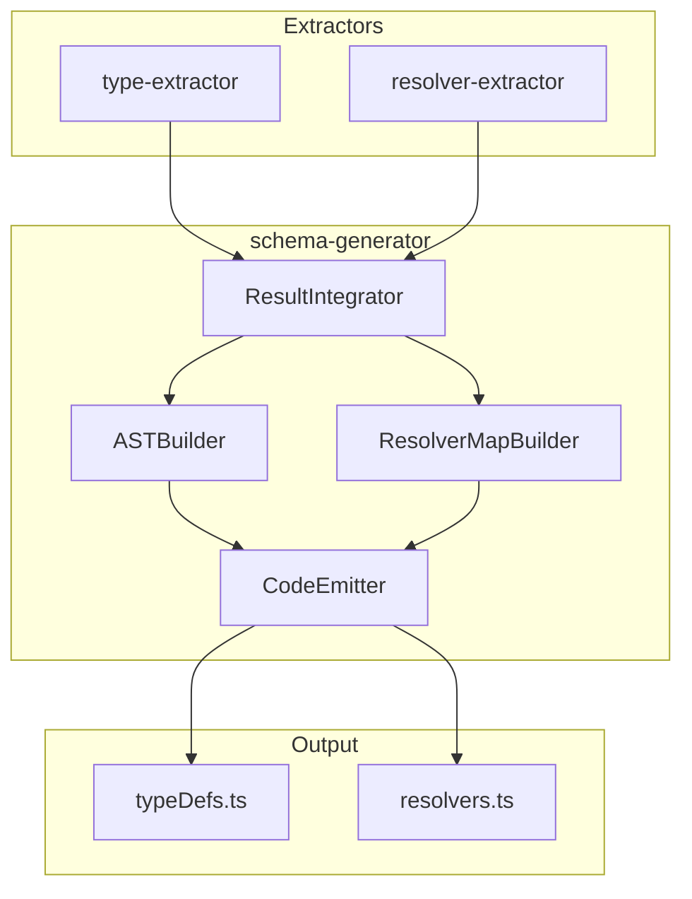
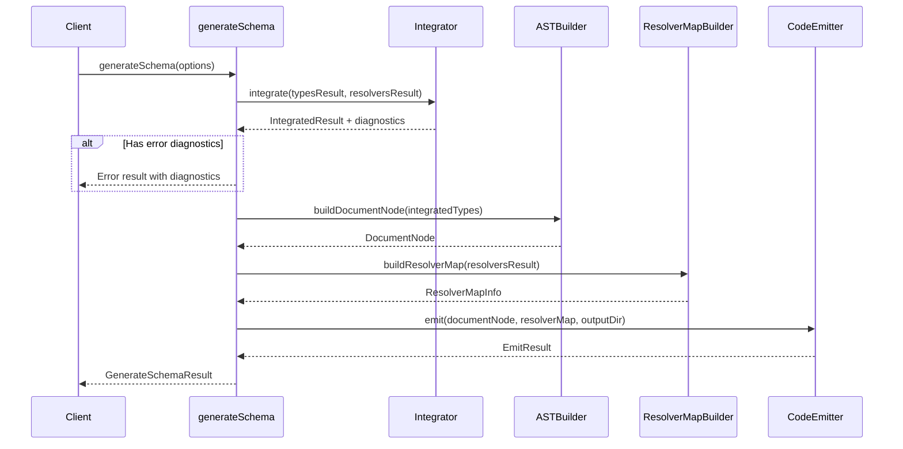
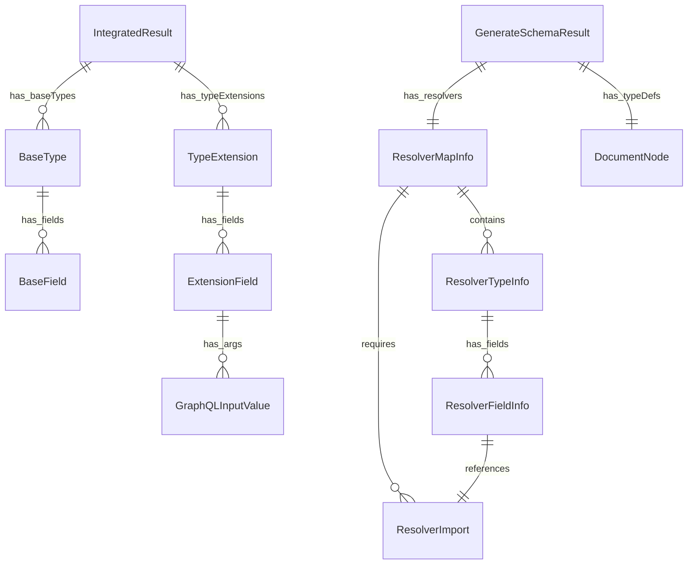

# Design Document

## Overview

**Purpose**: schema-generator は type-extractor と resolver-extractor の出力を統合し、GraphQL スキーマ AST（DocumentNode）と graphql-tools 互換の resolver map を含む TypeScript コードを生成する。

**Users**: gqlkit CLI（`gqlkit gen` コマンド）が schema-generator を呼び出し、生成されたコードを `src/gqlkit/generated/` に出力する。

**Impact**: 既存の type-extractor/resolver-extractor パイプラインの最終段階として機能し、実行可能な GraphQL スキーマ生成を完結させる。

### Goals

- type-extractor の型定義を GraphQL スキーマ AST として出力し、resolver-extractor のフィールドは `extend type` として分離出力する
- graphql-tools の `makeExecutableSchema` と互換性のある resolver map を生成する
- 決定論的な出力（同一入力 → 同一出力）を保証する
- 生成時の問題を明確な診断メッセージで報告する

### Non-Goals

- GraphQL スキーマの実行やクエリ処理（graphql-tools/ランタイムの責務）
- resolver 実装コードの生成（既存の resolver コードへの参照を維持）
- HTTP サーバー統合やミドルウェア設定
- Input 型や Enum 型の自動生成（将来フェーズで対応予定）

## Architecture

### Existing Architecture Analysis

type-extractor および resolver-extractor は以下のパイプライン構造を持つ:

1. **Scanner**: ディレクトリから `.ts` ファイルを収集
2. **Extractor**: ts.Program で型/resolver を抽出
3. **Converter**: TypeScript 表現を GraphQL 表現に変換
4. **Collector**: 結果と診断情報を集約

schema-generator は両 extractor の出力を入力として受け取り、最終的な TypeScript コードを生成する統合レイヤーとして機能する。

### Architecture Pattern & Boundary Map



**Architecture Integration**:
- **Selected pattern**: Pipeline（既存 extractor と一貫）
- **Domain boundaries**: schema-generator は独立モジュールとして `src/schema-generator/` に配置
- **Existing patterns preserved**: Diagnostic 型、パイプライン構造、決定論的出力
- **New components rationale**: AST 構築（ASTBuilder）とコード出力（CodeEmitter）が新規責務
- **Steering compliance**: 静的解析のみ、デコレータ不使用、graphql-tools 互換出力

### Technology Stack

| Layer | Choice / Version | Role in Feature | Notes |
|-------|------------------|-----------------|-------|
| Backend / Services | TypeScript 5.9+ | コード生成、AST 構築 | strict mode |
| Backend / Services | graphql 16.x | AST 型定義（Kind, DocumentNode 等） | peer dependency |
| Infrastructure / Runtime | Node.js (ES2022+) | ファイル出力、ESM | ESM のみ |

## System Flows

### スキーマ生成フロー



**Key Decisions**:
- エラー診断が存在する場合、コード生成をスキップ（fail-fast）
- 統合処理で型とリゾルバのマッチングを検証

## Requirements Traceability

| Requirement | Summary | Components | Interfaces | Flows |
|-------------|---------|------------|------------|-------|
| 1.1-1.6 | スキーマ AST 生成 | ASTBuilder | `buildDocumentNode()` | Step 3 |
| 2.1-2.5 | Query/Mutation 型生成 | Integrator, ASTBuilder | `integrate()`, `buildDocumentNode()` | Step 2-3 |
| 3.1-3.3 | 型拡張の統合 | Integrator | `integrate()` | Step 2 |
| 4.1-4.5 | Resolver Map 生成 | ResolverMapBuilder | `buildResolverMap()` | Step 4 |
| 5.1-5.5 | TypeScript コード生成 | CodeEmitter | `emit()` | Step 5 |
| 6.1-6.4 | 診断とエラーハンドリング | Integrator | `integrate()` | Step 2 |
| 7.1-7.4 | 決定論的出力 | ASTBuilder, CodeEmitter | 全インターフェース | 全フロー |

## Components and Interfaces

| Component | Domain/Layer | Intent | Req Coverage | Key Dependencies | Contracts |
|-----------|--------------|--------|--------------|------------------|-----------|
| ResultIntegrator | Integrator | 型とリゾルバを統合し検証 | 2.1-2.5, 3.1-3.3, 6.1-6.4 | type-extractor (P0), resolver-extractor (P0) | Service |
| ASTBuilder | Builder | GraphQL AST ノードを構築 | 1.1-1.6, 7.1-7.4 | graphql (P0) | Service |
| ResolverMapBuilder | Builder | Resolver map 情報を構築 | 4.1-4.5, 7.3 | resolver-extractor (P0) | Service |
| CodeEmitter | Emitter | TypeScript コードを出力 | 5.1-5.5, 7.4 | Node.js fs (P0) | Service |

### Integrator Layer

#### ResultIntegrator

| Field | Detail |
|-------|--------|
| Intent | type-extractor と resolver-extractor の結果を検証し、base types と type extensions を分離して管理する |
| Requirements | 2.1, 2.2, 2.3, 2.4, 2.5, 3.1, 3.2, 6.1, 6.2, 6.3, 6.4 |

**Responsibilities & Constraints**
- Query/Mutation の空 base type を生成（フィールドは extend type で追加）
- typeExtensions の targetTypeName が存在することを検証
- 存在しない型への typeExtension 参照をエラー報告
- base types と type extensions を分離して出力用に構造化
- 入力の診断エラーを伝播

**Design Decision: `extend type` 分離出力**
- フィールドマージを行わず、resolver で定義されたフィールドは `extend type` として出力
- メリット: 実装簡素化、出自の明確化、フィールド競合解決不要
- Query/Mutation: 空の base type + extend type の両方を出力

**Dependencies**
- Inbound: type-extractor `ExtractTypesResult` (P0)
- Inbound: resolver-extractor `ExtractResolversResult` (P0)

**Contracts**: Service [x]

##### Service Interface

```typescript
// Base type（type-extractor から）
interface BaseType {
  readonly name: string;
  readonly kind: "Object" | "Union";
  readonly fields?: ReadonlyArray<BaseField>;  // Object の場合
  readonly unionMembers?: ReadonlyArray<string>;  // Union の場合
}

interface BaseField {
  readonly name: string;
  readonly type: GraphQLFieldType;
}

// Type extension（resolver-extractor から）
interface TypeExtension {
  readonly targetTypeName: string;  // "Query" | "Mutation" | "User" など
  readonly fields: ReadonlyArray<ExtensionField>;
}

interface ExtensionField {
  readonly name: string;
  readonly type: GraphQLFieldType;
  readonly args?: ReadonlyArray<GraphQLInputValue>;
  readonly resolverSourceFile: string;
}

interface IntegratedResult {
  readonly baseTypes: ReadonlyArray<BaseType>;
  readonly typeExtensions: ReadonlyArray<TypeExtension>;
  readonly hasQuery: boolean;  // Query typeExtension が存在するか
  readonly hasMutation: boolean;  // Mutation typeExtension が存在するか
  readonly diagnostics: ReadonlyArray<Diagnostic>;
}

function integrate(
  typesResult: ExtractTypesResult,
  resolversResult: ExtractResolversResult,
): IntegratedResult;
```

- Preconditions: 両 extractor の結果が提供される
- Postconditions:
  - `baseTypes` は type-extractor の型（Query/Mutation は hasQuery/hasMutation が true の場合のみ追加）
  - `typeExtensions` は resolver-extractor の typeExtensions（Query/Mutation フィールド含む）
  - `hasQuery` は Query typeExtension が存在する場合 true
  - `hasMutation` は Mutation typeExtension が存在する場合 true
  - 未解決の typeExtension は `UNKNOWN_TARGET_TYPE` エラー
  - 入力エラーは伝播
- Invariants: ソート順維持（名前順）

**Implementation Notes**
- Integration: Query/Mutation 空 base type を暗黙生成、resolver フィールドは全て TypeExtension として出力
- Validation: targetTypeName の存在確認のみ（フィールド重複検出は不要）
- Risks: 大量の typeExtensions でのパフォーマンス（Map 使用で O(1) ルックアップ）

### Builder Layer

#### ASTBuilder

| Field | Detail |
|-------|--------|
| Intent | base types と type extensions から graphql-js 互換の DocumentNode を構築する |
| Requirements | 1.1, 1.2, 1.3, 1.4, 1.5, 1.6, 3.1, 7.1, 7.2 |

**Responsibilities & Constraints**
- BaseType から ObjectTypeDefinitionNode/UnionTypeDefinitionNode を生成
- TypeExtension から ObjectTypeExtensionNode を生成
- フィールドの nullable/list 設定を TypeNode に正しく変換
- 引数を InputValueDefinitionNode として生成
- 型定義を名前順でソート（base types → type extensions の順）
- 各型内フィールドを名前順でソート

**出力スキーマ例**:
```graphql
# Base types (type-extractor から)
type Query
type Mutation
type User {
  id: ID!
  name: String!
}

# Type extensions (resolver-extractor から)
extend type Query {
  users: [User!]!
  user(id: ID!): User
}
extend type User {
  posts: [Post!]!
}
```

**Dependencies**
- Inbound: ResultIntegrator からの IntegratedResult (P0)
- External: graphql - Kind 定数、AST 型定義 (P0)

**Contracts**: Service [x]

##### Service Interface

```typescript
import type { DocumentNode } from "graphql";

function buildDocumentNode(
  integratedResult: IntegratedResult,
): DocumentNode;
```

- Preconditions: `integratedResult` は統合済み型情報を含む
- Postconditions:
  - 戻り値は有効な DocumentNode
  - definitions は名前順でソート済み
  - Query 型は hasQuery が true の場合のみ含まれる
  - Mutation 型は hasMutation が true の場合のみ含まれる
- Invariants: 同一入力に対して同一 AST 出力

**Implementation Notes**
- Integration: graphql パッケージの Kind 定数を使用
- Validation: AST 構築前に型の完全性を検証
- Risks: graphql パッケージのバージョン差異（peer dependency として管理）

#### ResolverMapBuilder

| Field | Detail |
|-------|--------|
| Intent | resolver-extractor の結果から resolver map 生成に必要な情報を構築する |
| Requirements | 4.1, 4.2, 4.3, 4.4, 4.5, 7.3 |

**Responsibilities & Constraints**
- Query/Mutation/型別にリゾルバフィールドを分類
- ソースファイルパスと export 名を追跡
- コード生成に必要な import 情報を収集
- キーを一貫した順序で出力

**Dependencies**
- Inbound: resolver-extractor `ExtractResolversResult` (P0)

**Contracts**: Service [x]

##### Service Interface

```typescript
interface ResolverImport {
  readonly modulePath: string;
  readonly importName: string;
}

interface ResolverFieldInfo {
  readonly fieldName: string;
  readonly import: ResolverImport;
}

interface ResolverTypeInfo {
  readonly typeName: string;
  readonly fields: ReadonlyArray<ResolverFieldInfo>;
}

interface ResolverMapInfo {
  readonly types: ReadonlyArray<ResolverTypeInfo>;
  readonly imports: ReadonlyArray<ResolverImport>;
}

function buildResolverMap(
  resolversResult: ExtractResolversResult,
  outputDir: string,
): ResolverMapInfo;
```

- Preconditions: `resolversResult` は抽出済みリゾルバ情報を含む
- Postconditions:
  - `types` は Query/Mutation および型拡張のリゾルバ情報
  - `imports` は必要な import 文の情報
  - 空のフィールドリストを持つ型は含まれない
- Invariants: types/fields は名前順でソート

**Implementation Notes**
- Integration: resolver-extractor の sourceLocation からモジュールパス解決
- Validation: import パスの相対解決が正しいことを確認
- Risks: パス解決のプラットフォーム差異（path.posix 使用で統一）

### Emitter Layer

#### CodeEmitter

| Field | Detail |
|-------|--------|
| Intent | DocumentNode と ResolverMapInfo から TypeScript コードファイルを生成・出力する |
| Requirements | 5.1, 5.2, 5.3, 5.4, 5.5, 7.4 |

**Responsibilities & Constraints**
- `typeDefs.ts`: DocumentNode を export する TypeScript コード生成
- `resolvers.ts`: resolver map を export する TypeScript コード生成
- ESM 互換の import/export 構文を使用
- 相対 import パスを正しく解決
- 出力ディレクトリが存在しない場合は作成

**Dependencies**
- Inbound: ASTBuilder からの DocumentNode (P0)
- Inbound: ResolverMapBuilder からの ResolverMapInfo (P0)
- External: Node.js fs/promises - ファイル出力 (P0)

**Contracts**: Service [x]

##### Service Interface

```typescript
interface EmitOptions {
  readonly outputDir: string;
  readonly documentNode: DocumentNode;
  readonly resolverMap: ResolverMapInfo;
}

interface EmitResult {
  readonly files: ReadonlyArray<string>;
  readonly diagnostics: ReadonlyArray<Diagnostic>;
}

function emit(options: EmitOptions): Promise<EmitResult>;
```

- Preconditions: `outputDir` は有効なパス、`documentNode` と `resolverMap` が提供される
- Postconditions:
  - `typeDefs.ts` と `resolvers.ts` が `outputDir` に出力される
  - ファイル内容は ESM 互換
  - 同一入力に対してバイト単位で同一の出力
- Invariants: 改行コードは LF 統一

**Implementation Notes**
- Integration: AST を JSON シリアライズして typeDefs に埋め込み
- Validation: 出力ファイルの構文検証（TypeScript parse で確認）
- Risks: ファイル書き込み権限エラー（適切なエラーハンドリング）

## Data Models

### Domain Model



**Aggregates**:
- `GenerateSchemaResult`: スキーマ生成結果の集約ルート
- `IntegratedResult`: 型統合結果の集約（baseTypes + typeExtensions）
- `ResolverMapInfo`: リゾルバマップ情報の集約

**Value Objects**:
- `BaseType`, `BaseField`, `TypeExtension`, `ExtensionField`, `GraphQLInputValue`
- `ResolverTypeInfo`, `ResolverFieldInfo`, `ResolverImport`
- `Diagnostic`, `SourceLocation`

**Business Rules & Invariants**:
- Query base type は対応する typeExtension が存在する場合のみ生成
- Mutation base type は対応する typeExtension が存在する場合のみ生成
- typeExtension の targetTypeName は type-extractor の結果に存在する必要がある
- `extend type` 分離出力によりフィールドマージは不要

### Logical Data Model

**Diagnostic Codes（schema-generator 固有）**:

| Code | Severity | Condition |
|------|----------|-----------|
| `UNKNOWN_TARGET_TYPE` | error | typeExtension の targetTypeName が型定義に存在しない |
| `WRITE_ERROR` | error | ファイル出力に失敗 |

既存の Diagnostic コードは type-extractor/resolver-extractor から伝播される。

## Error Handling

### Error Strategy

- **Fail-fast with propagation**: 入力の診断エラーは伝播し、新規エラーと合わせて報告
- **Skip generation on errors**: severity: "error" の診断が存在する場合、コード生成をスキップ
- **Actionable diagnostics**: エラーメッセージに修正方法を示唆

### Error Categories and Responses

**User Errors (Diagnostic)**:
- 型参照エラー → 参照元の場所情報と期待される型名を提示
- 命名規則違反 → 既存 extractor の診断をそのまま伝播

**System Errors (Diagnostic)**:
- ファイル出力エラー → パスと権限情報を含むエラーメッセージ

### Monitoring

- 診断情報の収集と分類（errors/warnings）
- 生成ファイル数とサイズのログ出力（デバッグ用）

## Testing Strategy

### Unit Tests

- **ResultIntegrator**: 型統合、typeExtension マージ、エラー伝播
- **ASTBuilder**: 各 AST ノード生成、nullable/list 変換、ソート順
- **ResolverMapBuilder**: 型分類、import 情報収集、パス解決
- **CodeEmitter**: ファイル内容生成、ESM 構文、相対パス

### Integration Tests

- 完全な type-extractor + resolver-extractor 出力からのスキーマ生成
- 空の Query/Mutation ケースの正しい処理
- typeExtension と既存型のフィールド重複処理
- エラー診断ありの場合のスキップ動作

### E2E Tests

- 実際のファイル構成からの生成フロー
- 生成コードの TypeScript コンパイル確認
- makeExecutableSchema での実行確認

## Performance & Scalability

### Target Metrics

- 100 型 + 100 リゾルバ規模で 500ms 以内の処理完了
- 生成ファイルサイズは入力規模に比例（過度な肥大化なし）

### Optimization

- AST ノード生成のオブジェクトプール（同一 Kind の再利用）
- 診断情報の遅延評価（エラーメッセージは必要時のみ生成）
- ソート処理は一度だけ実行（各ステージで再ソートしない）

## API Research Notes

### graphql-js AST 構築

graphql-js パッケージの Kind 定数と AST ノード構造:

```typescript
import { Kind } from "graphql/language/kinds";
import type {
  DocumentNode,
  ObjectTypeDefinitionNode,
  ObjectTypeExtensionNode,
  UnionTypeDefinitionNode,
  FieldDefinitionNode,
  InputValueDefinitionNode,
  NamedTypeNode,
  ListTypeNode,
  NonNullTypeNode,
  NameNode,
} from "graphql/language/ast";

// DocumentNode: スキーマ全体を表すルートノード
const document: DocumentNode = {
  kind: Kind.DOCUMENT,  // "Document"
  definitions: [...],   // ReadonlyArray<DefinitionNode>
};

// ObjectTypeDefinitionNode: Object 型定義
const objectType: ObjectTypeDefinitionNode = {
  kind: Kind.OBJECT_TYPE_DEFINITION,  // "ObjectTypeDefinition"
  name: { kind: Kind.NAME, value: "User" },
  interfaces: [],       // ReadonlyArray<NamedTypeNode>
  directives: [],       // ReadonlyArray<ConstDirectiveNode>
  fields: [...],        // ReadonlyArray<FieldDefinitionNode>
};

// UnionTypeDefinitionNode: Union 型定義
const unionType: UnionTypeDefinitionNode = {
  kind: Kind.UNION_TYPE_DEFINITION,  // "UnionTypeDefinition"
  name: { kind: Kind.NAME, value: "SearchResult" },
  types: [...],         // ReadonlyArray<NamedTypeNode>
};

// ObjectTypeExtensionNode: 型拡張（extend type）
const typeExtension: ObjectTypeExtensionNode = {
  kind: Kind.OBJECT_TYPE_EXTENSION,  // "ObjectTypeExtension"
  name: { kind: Kind.NAME, value: "User" },
  interfaces: [],       // ReadonlyArray<NamedTypeNode>
  directives: [],       // ReadonlyArray<ConstDirectiveNode>
  fields: [...],        // ReadonlyArray<FieldDefinitionNode>
};

// FieldDefinitionNode: フィールド定義
const field: FieldDefinitionNode = {
  kind: Kind.FIELD_DEFINITION,  // "FieldDefinition"
  name: { kind: Kind.NAME, value: "id" },
  arguments: [],        // ReadonlyArray<InputValueDefinitionNode>
  type: { kind: Kind.NON_NULL_TYPE, type: { kind: Kind.NAMED_TYPE, name: { kind: Kind.NAME, value: "ID" } } },
};

// TypeNode: 型参照（3種類の組み合わせ）
// - NamedTypeNode: 名前付き型 (String, Int, User, etc.)
// - ListTypeNode: リスト型 [Type]
// - NonNullTypeNode: 非null型 Type!
```

**重要な注意点**:
- `loc` プロパティは省略可能（パーサーが生成するもの）
- 空のコレクションは v17 以降 `undefined` となる（空配列ではない）
- AST ノードは readonly なイミュータブルオブジェクトとして構築

### graphql-tools makeExecutableSchema

```typescript
import { makeExecutableSchema } from "@graphql-tools/schema";

// typeDefs: string | DocumentNode | string[] | DocumentNode[]
// resolvers: IResolvers | IResolvers[]

const schema = makeExecutableSchema({
  typeDefs,    // Required: SDL string または DocumentNode
  resolvers,   // Optional: リゾルバマップ
});

// Resolver map 構造
const resolvers = {
  Query: {
    users: (parent, args, context, info) => [...],
    user: (parent, { id }, context, info) => findUser(id),
  },
  Mutation: {
    createUser: (parent, { input }, context, info) => createUser(input),
  },
  User: {
    posts: (user, args, context, info) => findPostsByAuthor(user.id),
  },
};
```

**gqlkit での活用**:
- `typeDefs` は DocumentNode として直接渡せる（SDL 文字列変換不要）
- `resolvers` オブジェクトは import 参照を維持したまま構築
- 生成コードは `makeExecutableSchema({ typeDefs, resolvers })` の形式で利用可能
