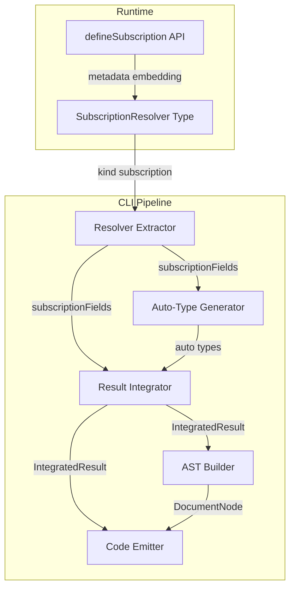
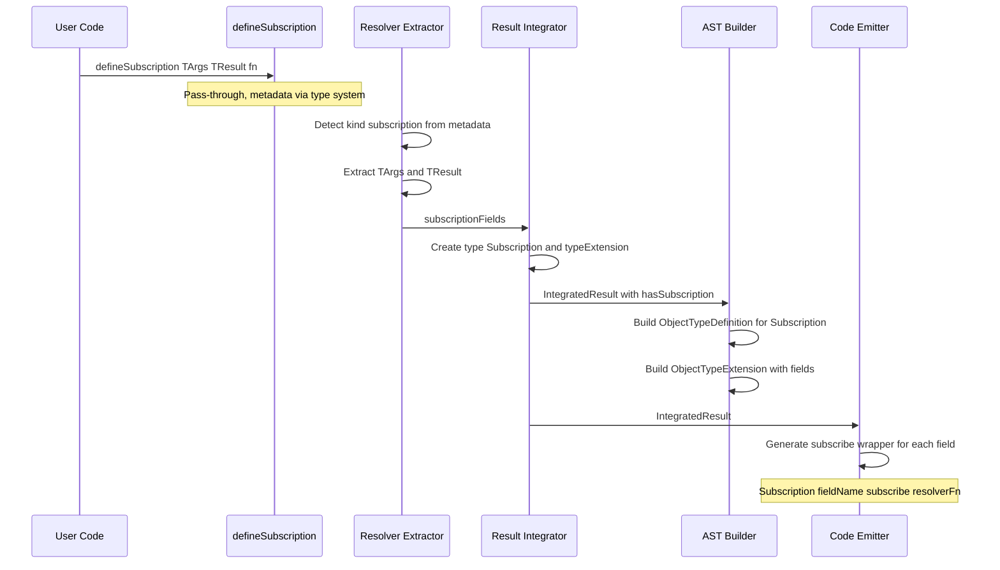

# Technical Design: subscription-support

## Overview

**Purpose**: gqlkit に GraphQL Subscription サポートを追加し、`defineSubscription` API によって Subscription リゾルバを型安全に定義し、`gqlkit gen` で `type Subscription` のスキーマ AST と graphql-tools 互換の `{ subscribe: fn }` 形式リゾルバマップを自動生成する。

**Users**: gqlkit ユーザーは `defineQuery`/`defineMutation` と同じパターンで Subscription リゾルバを定義し、リアルタイムデータ配信機能を実装できる。

**Impact**: `@gqlkit-ts/runtime` に `defineSubscription` と関連型を追加し、`@gqlkit-ts/cli` のリゾルバ抽出・スキーマ生成・コード生成パイプラインを拡張する。

### Goals
- `defineSubscription<TArgs, TResult>` API を `@gqlkit-ts/runtime` に追加する
- `gqlkit gen` が Subscription リゾルバを認識し、`type Subscription` を含む GraphQL スキーマを生成する
- 生成されるリゾルバマップが graphql-tools の `makeExecutableSchema` と互換性のある `{ subscribe: fn }` 形式になる
- 型抽出・自動型生成・エラーハンドリングが Query/Mutation と同等に動作する

### Non-Goals
- WebSocket トランスポート層やサーバー実装の提供
- PubSub メカニズムの提供 (ユーザーが任意の AsyncIterable 実装を使用)
- Subscription の `resolve` フィールド (イベントデータの変換関数) のサポート
- Subscription のフィルタリング API (`withFilter` 等) の統合

## Architecture

### Existing Architecture Analysis

gqlkit は以下のパイプラインアーキテクチャで動作する:

1. **Type Extraction**: TypeScript ソースから型情報を抽出
2. **Resolver Extraction**: `defineQuery`/`defineMutation`/`defineField` の呼び出しを検出しメタデータを抽出
3. **Auto-Type Generation**: インライン型から名前付き GraphQL 型を自動生成
4. **Schema Generation**: 型情報とリゾルバ情報を統合し GraphQL AST を構築
5. **Code Emission**: `typeDefs.ts`, `resolvers.ts`, `schema.graphql` を出力

各ステージは明確な境界を持ち、`ExtractResolversResult` や `IntegratedResult` などのインターフェースを介してデータを受け渡す。Subscription サポートはこのパイプラインの各ステージに対する拡張として実装される。

### Architecture Pattern & Boundary Map



**Architecture Integration**:
- Selected pattern: 既存パイプラインアーキテクチャの拡張
- Domain/feature boundaries: Subscription は Query/Mutation と並列の root operation type として各ステージに横断的に追加
- Existing patterns preserved: Define API パターン、メタデータ埋め込みパターン、パイプラインステージ間のインターフェース
- New components rationale: 新規コンポーネントは不要。既存コンポーネントのインターフェース拡張のみ
- Steering compliance: 静的解析のみ、デコレータ不使用、graphql-tools 互換出力

### Technology Stack

| Layer | Choice / Version | Role in Feature | Notes |
|-------|------------------|-----------------|-------|
| Runtime API | @gqlkit-ts/runtime | defineSubscription, SubscriptionResolver 型 | 既存パッケージへの追加 |
| CLI Pipeline | @gqlkit-ts/cli | リゾルバ抽出・スキーマ生成・コード生成 | 既存パイプラインの拡張 |
| GraphQL | graphql v16.x | DocumentNode 型、AST Kind 定数 | 既存依存 |

## System Flows

### Subscription リゾルバ処理フロー



Subscription フィールドの resolver map 出力形式が Query/Mutation と異なる点が設計上の主要な分岐点である。Query/Mutation は `fieldName: resolverFn` の直接参照だが、Subscription は `fieldName: { subscribe: resolverFn }` のオブジェクト形式が必須。

## Requirements Traceability

| Requirement | Summary | Components | Interfaces | Flows |
|-------------|---------|------------|------------|-------|
| 1.1 | createGqlkitApis に defineSubscription を含める | Runtime: GqlkitApis | defineSubscription method | - |
| 1.2 | defineQuery と同じ型引数パターン | Runtime: defineSubscription | TArgs, TResult, TDirectives | - |
| 1.3 | SubscriptionResolverFn シグネチャ | Runtime: SubscriptionResolverFn | AsyncIterable return type | - |
| 1.4 | メタデータ埋め込み | Runtime: SubscriptionResolver | $gqlkitResolver property | - |
| 1.5 | kind subscription メタデータ | Runtime: SubscriptionResolver | kind literal type | - |
| 1.6 | パススルー動作 | Runtime: createGqlkitApis | defineSubscription impl | - |
| 2.1 | SubscriptionResolverFn 型の export | Runtime | Type export | - |
| 2.2 | SubscriptionResolverFn の型定義 | Runtime | Function type signature | - |
| 2.3 | SubscriptionResolver 型の export | Runtime | Type export | - |
| 2.4 | SubscriptionResolver の intersection 型 | Runtime | Metadata intersection | - |
| 2.5 | ResolverKind に subscription 追加 | Runtime | Union type extension | - |
| 2.6 | ResolverMetadataShape の互換性 | Runtime | Existing shape reuse | - |
| 3.1 | defineSubscription の認識 | CLI: Resolver Extractor | detectResolverFromMetadataType | Subscription Flow |
| 3.2 | DefineApiResolverType の拡張 | CLI: Resolver Extractor | Type union extension | - |
| 3.3 | TArgs/TResult 型情報抽出 | CLI: Resolver Extractor | extractTypeArgumentsFromCall | Subscription Flow |
| 3.4 | フィールド名の $ 区切り解決 | CLI: Resolver Extractor | resolveFieldNameFromExportName | - |
| 3.5 | TSDoc 情報抽出 | CLI: Resolver Extractor | extractTsDocInfo | - |
| 4.1 | type Subscription をスキーマに含める | CLI: Integrator, AST Builder | hasSubscription flag | Subscription Flow |
| 4.2 | TResult を戻り値型として使用 | CLI: Integrator | ExtensionField type mapping | - |
| 4.3 | GraphQL フィールド引数出力 | CLI: AST Builder | buildInputValueDefinitionNode | - |
| 4.4 | Subscription 未定義時にスキーマに含めない | CLI: Integrator | hasSubscription guard | - |
| 4.5 | SDL 出力に type Subscription を含める | CLI: SDL Emitter | emitSdlContent | - |
| 4.6 | ディレクティブのスキーマ AST 出力 | CLI: AST Builder | buildDirectives | - |
| 5.1 | subscribe ラップ形式で出力 | CLI: Code Emitter | buildSubscriptionResolverEntry | Subscription Flow |
| 5.2 | 複数フィールドの subscribe オブジェクト生成 | CLI: Code Emitter | buildTypeResolverEntry extension | - |
| 5.3 | import 文にソースファイルを含める | CLI: Code Emitter | collectResolverImports | - |
| 5.4 | Subscription キー配下に配置 | CLI: Code Emitter | Resolver map structure | - |
| 5.5 | アルファベット順ソート | CLI: Code Emitter | Existing sort logic | - |
| 6.1 | Input 型の検出・抽出 | CLI: Type Extractor | Existing type extraction | - |
| 6.2 | 戻り値オブジェクト型の検出・抽出 | CLI: Type Extractor | Existing type extraction | - |
| 6.3 | インライン型からの名前付き型自動生成 | CLI: Auto-Type Generator | Existing auto-type logic | - |
| 6.4 | 自動生成型の命名規則 | CLI: Auto-Type Generator | Naming convention logic | - |
| 6.5 | カスタムスカラー型の検出 | CLI: Type Extractor | Existing scalar detection | - |
| 7.1 | 型引数不足時のエラー | CLI: Resolver Extractor | INVALID_DEFINE_CALL diagnostic | - |
| 7.2 | 空フィールド名エラー | CLI: Resolver Extractor | resolveFieldNameFromExportName | - |
| 7.3 | INDEX_SIGNATURE_ONLY エラー | CLI: Resolver Extractor | validateArgsType | - |
| 7.4 | 複雑な式でのエラー | CLI: Resolver Extractor | Complex expression detection | - |

## Components and Interfaces

| Component | Domain/Layer | Intent | Req Coverage | Key Dependencies (P0/P1) | Contracts |
|-----------|--------------|--------|--------------|--------------------------|-----------|
| Runtime Types | @gqlkit-ts/runtime | Subscription 型定義と defineSubscription API | 1.1-1.6, 2.1-2.6 | graphql (P0) | Service |
| Resolver Extractor | @gqlkit-ts/cli | defineSubscription のメタデータ検出・型抽出 | 3.1-3.5, 7.1-7.4 | TypeScript Compiler API (P0) | Service |
| Orchestrator | @gqlkit-ts/cli | subscriptionFields のデータフロー仲介 | 3.1-3.5 | Resolver Extractor (P0), Integrator (P0) | Service |
| Auto-Type Generator | @gqlkit-ts/cli | Subscription の引数・戻り値のインライン型処理 | 6.1-6.5 | Resolver Extractor (P0) | Service |
| Result Integrator | @gqlkit-ts/cli | Subscription を統合結果に含める | 4.1, 4.4 | Resolver Extractor (P0) | Service |
| AST Builder | @gqlkit-ts/cli | type Subscription の DocumentNode 生成 | 4.1-4.3, 4.5-4.6 | Integrator (P0) | Service |
| Code Emitter | @gqlkit-ts/cli | subscribe ラップ形式のリゾルバマップ生成 | 5.1-5.5 | Resolver Collector (P0) | Service |

### Runtime Layer

#### Runtime Types (defineSubscription API)

| Field | Detail |
|-------|--------|
| Intent | Subscription リゾルバの型定義と defineSubscription ファクトリ関数の提供 |
| Requirements | 1.1, 1.2, 1.3, 1.4, 1.5, 1.6, 2.1, 2.2, 2.3, 2.4, 2.5, 2.6 |

**Responsibilities & Constraints**
- `SubscriptionResolverFn<TArgs, TResult, TContext>` 型の定義と export
- `SubscriptionResolver<TArgs, TResult, TContext, TDirectives>` 型の定義と export
- `ResolverKind` union 型に `"subscription"` を追加
- `GqlkitApis<TContext>` に `defineSubscription` メソッドを追加
- `createGqlkitApis()` 実装にパススルー関数を追加
- `defineQuery`/`defineMutation` と完全に一貫したパターンを維持する

**Dependencies**
- External: graphql (`GraphQLResolveInfo` 型) -- P0

**Contracts**: Service [x]

##### Service Interface

```typescript
/**
 * Subscription resolver function type.
 * Returns AsyncIterable for the subscription event stream.
 */
type SubscriptionResolverFn<TArgs, TResult, TContext = unknown> = (
  root: undefined,
  args: TArgs,
  context: TContext,
  info: GraphQLResolveInfo,
) => AsyncIterable<TResult> | Promise<AsyncIterable<TResult>>;

/**
 * Subscription resolver type with embedded metadata.
 */
type SubscriptionResolver<
  TArgs,
  TResult,
  TContext = unknown,
  TDirectives extends ReadonlyArray<GqlDirective<string, Record<string, unknown>, DirectiveLocation | DirectiveLocation[]>> = [],
> = SubscriptionResolverFn<TArgs, TResult, TContext> & {
  " $gqlkitResolver"?: {
    kind: "subscription";
    args: TArgs;
    result: TResult;
    directives: TDirectives;
  };
};

/**
 * Extended ResolverKind union type.
 */
type ResolverKind = "query" | "mutation" | "field" | "subscription";

/**
 * Extended GqlkitApis interface (defineSubscription method only shown).
 */
interface GqlkitApis<TContext> {
  // ... existing methods ...

  defineSubscription: <
    TArgs,
    TResult,
    TDirectives extends ReadonlyArray<GqlDirective<string, Record<string, unknown>, DirectiveLocation | DirectiveLocation[]>> = [],
  >(
    resolver: SubscriptionResolverFn<TArgs, TResult, TContext>,
  ) => SubscriptionResolver<TArgs, TResult, TContext, TDirectives>;
}
```

- Preconditions: TArgs, TResult の型引数が指定されていること
- Postconditions: 返り値は入力関数そのもの (パススルー)。型レベルでのみメタデータが付与される
- Invariants: `ResolverMetadataShape` の既存プロパティ (`kind`, `args`, `result`) で subscription メタデータを完全に表現できる

**Implementation Notes**
- Integration: `createGqlkitApis` の実装で `defineSubscription` を `(resolver) => resolver` として追加。既存の defineQuery/defineMutation と同じパススルーパターン
- Validation: TypeScript コンパイラが型引数の不足やシグネチャ不一致を検出する
- Risks: なし。既存パターンの踏襲

### CLI Pipeline Layer

#### Resolver Extractor

| Field | Detail |
|-------|--------|
| Intent | defineSubscription 呼び出しの検出とメタデータ・型情報の抽出 |
| Requirements | 3.1, 3.2, 3.3, 3.4, 3.5, 7.1, 7.2, 7.3, 7.4 |

**Responsibilities & Constraints**
- `DefineApiResolverType` に `"subscription"` を追加
- `detectResolverFromMetadataType` の kind チェック条件に `"subscription"` を追加
- 複雑な式の検出正規表現に `Subscription` を追加
- TArgs/TResult の型引数抽出は既存ロジックを再利用 (subscription は Query/Mutation と同じ型引数パターン)

**Dependencies**
- External: TypeScript Compiler API (`ts.TypeChecker`, `ts.Type`) -- P0

**Contracts**: Service [x]

##### Service Interface

```typescript
/**
 * Extended DefineApiResolverType.
 */
type DefineApiResolverType = "query" | "mutation" | "field" | "subscription";
```

変更は型定義の union 拡張と `detectResolverFromMetadataType` 内の条件分岐追加のみ。`extractTypeArgumentsFromCall` は subscription を Query/Mutation と同じパス (非 field パス) で処理するため変更不要。

- Preconditions: ソースファイルに `defineSubscription` の呼び出しが export された変数宣言として存在すること
- Postconditions: `DefineApiResolverInfo` に `resolverType: "subscription"` が設定されたリゾルバ情報が返される
- Invariants: フィールド名解決、TSDoc 抽出、エラー検出は既存ロジックがそのまま適用される

**Implementation Notes**
- Integration: `detectResolverFromMetadataType` の kind 判定条件に `kind === "subscription"` を追加。`INVALID_DEFINE_CALL` 検出の正規表現を `/define(Query|Mutation|Field|Subscription)/` に変更
- Validation: 型引数不足、空フィールド名、INDEX_SIGNATURE_ONLY、複雑式検出は既存のバリデーションロジックがそのまま適用される
- Risks: なし

#### Orchestrator

| Field | Detail |
|-------|--------|
| Intent | subscriptionFields のデータフロー仲介と ExtractResolversResult への統合 |
| Requirements | 3.1, 3.2, 3.3, 3.4, 3.5 |

**Responsibilities & Constraints**
- `ResolversResult` に `subscriptionFields` プロパティを追加
- `convertDefineApiToFields` で `resolverType === "subscription"` の分岐を追加し、`subscriptionFields` に振り分ける
- `ExtractResolversResult` に `subscriptionFields` を追加

**Dependencies**
- Inbound: Resolver Extractor -- DefineApiResolverInfo の提供 (P0)
- Outbound: Result Integrator -- subscriptionFields の受け渡し (P0)

**Contracts**: Service [x]

##### Service Interface

```typescript
/**
 * Extended ExtractResolversResult.
 */
interface ExtractResolversResult {
  readonly queryFields: QueryFieldDefinitions;
  readonly mutationFields: MutationFieldDefinitions;
  readonly subscriptionFields: SubscriptionFieldDefinitions;
  readonly typeExtensions: ReadonlyArray<TypeExtension>;
  readonly abstractTypeResolvers: ReadonlyArray<AbstractResolverInfo>;
  readonly diagnostics: Diagnostics;
}

/**
 * New type for subscription field definitions.
 */
interface SubscriptionFieldDefinitions {
  readonly fields: ReadonlyArray<GraphQLFieldDefinition>;
}
```

- Preconditions: Resolver Extractor が subscription リゾルバを正しく検出していること
- Postconditions: subscriptionFields に全ての subscription フィールド定義が含まれる
- Invariants: 既存の queryFields/mutationFields/typeExtensions の処理に影響しない

**Implementation Notes**
- Integration: `convertDefineApiToFields` の for ループ内に `resolver.resolverType === "subscription"` の条件分岐を追加
- Risks: なし

#### Auto-Type Generator

| Field | Detail |
|-------|--------|
| Intent | Subscription の引数・戻り値で使用されるインライン型の自動生成 |
| Requirements | 6.1, 6.2, 6.3, 6.4, 6.5 |

**Responsibilities & Constraints**
- `ResolverType` union に `"subscription"` を追加
- `forEachResolverField` で `subscriptionFields` のイテレーションを追加
- 命名規則は Query/Mutation と同じ: `{PascalCaseFieldName}{PascalCaseArgName}Input`

**Dependencies**
- Inbound: Orchestrator -- ExtractResolversResult (P0)

**Contracts**: Service [x]

##### Service Interface

```typescript
/**
 * Extended ResolverType.
 */
type ResolverType = "query" | "mutation" | "field" | "subscription";
```

`forEachResolverField` に以下のイテレーションを追加:

```typescript
for (const field of resolversResult.subscriptionFields.fields) {
  visitor({ field, resolverType: "subscription", parentTypeName: null });
}
```

- Preconditions: ExtractResolversResult に subscriptionFields が含まれること
- Postconditions: Subscription の引数・戻り値のインライン型が他の resolver type と同じ規則で自動生成される
- Invariants: 既存の auto-type-generator ロジックは変更なし

**Implementation Notes**
- Integration: `forEachResolverField` と `ResolverType` の変更のみ。auto-type-generator の各 collector はこの関数経由で全リゾルバフィールドを処理するため、自動的に subscription も対象になる
- Risks: なし

#### Result Integrator

| Field | Detail |
|-------|--------|
| Intent | Subscription の baseType と typeExtension を IntegratedResult に含める |
| Requirements | 4.1, 4.4 |

**Responsibilities & Constraints**
- `IntegratedResult` に `hasSubscription: boolean` フラグを追加
- subscriptionFields が存在する場合に `type Subscription` の baseType を追加
- subscriptionFields を typeExtension として追加
- Query/Mutation と同じパターンで処理

**Dependencies**
- Inbound: Orchestrator -- ExtractResolversResult (P0)

**Contracts**: Service [x]

##### Service Interface

```typescript
/**
 * Extended IntegratedResult.
 */
interface IntegratedResult {
  // ... existing properties ...
  readonly hasSubscription: boolean;
}
```

`integrate` 関数に以下のロジックを追加:

```typescript
const hasSubscription = resolversResult.subscriptionFields.fields.length > 0;

if (hasSubscription) {
  baseTypes.push({
    name: "Subscription",
    kind: "Object",
    fields: [],
    // ... other null/default fields
  });
}

if (hasSubscription) {
  typeExtensions.push({
    targetTypeName: "Subscription",
    fields: resolversResult.subscriptionFields.fields.map(convertToExtensionField),
  });
}
```

- Preconditions: resolversResult に subscriptionFields が含まれること
- Postconditions: hasSubscription が true の場合、baseTypes に "Subscription" が含まれ、typeExtensions にフィールドが含まれる
- Invariants: hasSubscription が false の場合、Subscription 関連の baseType/typeExtension は生成されない (4.4)

**Implementation Notes**
- Integration: 既存の hasQuery/hasMutation パターンと完全に一致
- Risks: なし

#### AST Builder

| Field | Detail |
|-------|--------|
| Intent | type Subscription の ObjectTypeDefinition と Extension の DocumentNode 生成 |
| Requirements | 4.1, 4.2, 4.3, 4.5, 4.6 |

**Responsibilities & Constraints**
- 変更不要。既存の `buildDocumentNode` が baseTypes と typeExtensions を処理するため、Integrator が正しいデータを渡せば自動的に `type Subscription` が生成される
- フィールド引数 (4.3) とディレクティブ (4.6) は既存の `buildFieldDefinitionNode` と `buildDirectives` が処理

**Dependencies**
- Inbound: Integrator -- IntegratedResult (P0)

**Implementation Notes**
- Integration: AST Builder 自体には変更不要。Integrator が Subscription の baseType と typeExtension を正しく生成すれば、既存のロジックが `type Subscription` と `extend type Subscription` を含む DocumentNode を構築する
- Risks: なし

#### Code Emitter

| Field | Detail |
|-------|--------|
| Intent | Subscription リゾルバを `{ subscribe: fn }` 形式で resolver map に出力 |
| Requirements | 5.1, 5.2, 5.3, 5.4, 5.5 |

**Responsibilities & Constraints**
- Subscription フィールドのリゾルバ出力を `{ subscribe: resolverFn }` オブジェクト形式にラップする
- 既存の import 収集・ソートロジックはそのまま利用
- Subscription 型名を判定し、フィールドエントリの出力形式を分岐する

**Dependencies**
- Inbound: Resolver Collector -- ResolverInfo (P0)

**Contracts**: Service [x]

##### Service Interface

Code Emitter の `buildTypeResolverEntry` を拡張し、Subscription 型のフィールドでは `{ subscribe: fn }` ラップを適用する。

生成されるコードのイメージ:

```typescript
// Query/Mutation (既存の直接参照形式)
Query: {
  users: Query$users,
},
Mutation: {
  createUser: Mutation$createUser,
},
// Subscription (subscribe ラップ形式)
Subscription: {
  messageAdded: { subscribe: Subscription$messageAdded },
  userStatusChanged: { subscribe: Subscription$userStatusChanged },
},
```

`buildTypeResolverEntry` の拡張方針:
- `typeName === "Subscription"` の場合、各フィールドエントリを `fieldName: { subscribe: localName }` 形式で出力
- 非 Subscription 型の場合は既存ロジックを維持

- Preconditions: ResolverInfo に Subscription 型のリゾルバが含まれていること
- Postconditions: 生成されるリゾルバマップで Subscription フィールドが `{ subscribe: fn }` 形式になっていること
- Invariants: Query/Mutation/Field リゾルバの出力形式に影響しない

**Implementation Notes**
- Integration: `buildTypeResolverEntry` 内で `typeName === "Subscription"` チェックを追加し、`{ subscribe: ... }` ラップを出力する分岐を追加。directExport と非 directExport の両パターンに対応が必要
- Validation: golden file テストで出力形式を検証
- Risks: directExport パターン (`export const onMessage = defineSubscription(...)`) と non-directExport パターンの両方で正しいラップが必要

## Data Models

### Domain Model

本機能で導入される主要なデータ構造の変更:

**SubscriptionFieldDefinitions** (新規):
- `fields: ReadonlyArray<GraphQLFieldDefinition>` -- subscription フィールド定義の配列
- `QueryFieldDefinitions`/`MutationFieldDefinitions` と同一構造

**ExtractResolversResult** (拡張):
- `subscriptionFields: SubscriptionFieldDefinitions` -- 新規プロパティ

**IntegratedResult** (拡張):
- `hasSubscription: boolean` -- 新規プロパティ

**DefineApiResolverType** (拡張):
- `"subscription"` を union メンバーに追加

**ResolverKind** (拡張):
- `"subscription"` を union メンバーに追加

既存の `GraphQLFieldDefinition`, `DefineApiResolverInfo`, `BaseType`, `TypeExtension`, `ResolverInfo` などの型は変更不要。Subscription リゾルバ情報はこれらの既存型で完全に表現可能。

## Error Handling

### Error Strategy

Subscription 固有のエラーパターンは存在しない。既存の Query/Mutation 向けバリデーションロジックが subscription にも適用される:

| Error Code | Trigger | Severity | Existing Logic |
|-----------|---------|----------|----------------|
| `INVALID_DEFINE_CALL` | 型引数不足 | error | extractTypeArgumentsFromCall の null チェック |
| `INVALID_DEFINE_CALL` | 空フィールド名 (`$` で終わるエクスポート名) | error | resolveFieldNameFromExportName |
| `INDEX_SIGNATURE_ONLY` | インデックスシグネチャのみの引数型 | error | validateArgsType |
| `INVALID_DEFINE_CALL` | 条件式・二項式内での使用 | error | isCallExpression チェック後の複雑式検出 |

正規表現パターンの更新:
- 変更前: `/define(Query|Mutation|Field)/`
- 変更後: `/define(Query|Mutation|Field|Subscription)/`

## Testing Strategy

### Golden File Tests
gqlkit のテスト方針に従い、golden file テストを主軸とする:

1. **基本的な subscription**: `defineSubscription<Args, Result>` の基本パターン -- スキーマに `type Subscription` が含まれ、resolver map に `{ subscribe: fn }` 形式が出力されることを検証
2. **引数なし subscription**: `defineSubscription<NoArgs, Result>` -- 引数なしの subscription フィールドが正しく生成されることを検証
3. **複数 subscription フィールド**: 複数の subscription が定義された場合のソート順序と resolver map 構造を検証
4. **ディレクティブ付き subscription**: `TDirectives` 型引数によるディレクティブ付与を検証
5. **TSDoc コメント付き subscription**: description と `@deprecated` の抽出を検証
6. **インライン引数型**: 引数にインラインオブジェクト型を使用した場合の auto-type 生成と命名規則を検証
7. **Query/Mutation/Subscription 混在**: 3 種の root operation type が共存する場合の統合結果を検証
8. **subscription のみ (Query/Mutation なし)**: subscription だけが定義された場合に `type Subscription` のみが生成されることを検証

### Error Case Tests (golden file)
1. **型引数不足**: `defineSubscription` に型引数が不足した場合のエラー diagnostic
2. **空フィールド名**: `export const subscription$ = defineSubscription(...)` のエラー
3. **複雑式内での使用**: 条件式内で defineSubscription を使用した場合のエラー

### Unit Tests
原則として golden file テストでカバーし、unit テストは最小限に留める (プロジェクトのテスト方針に従う)。
