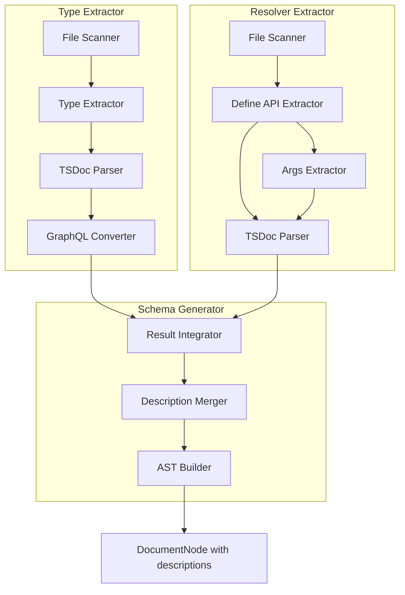
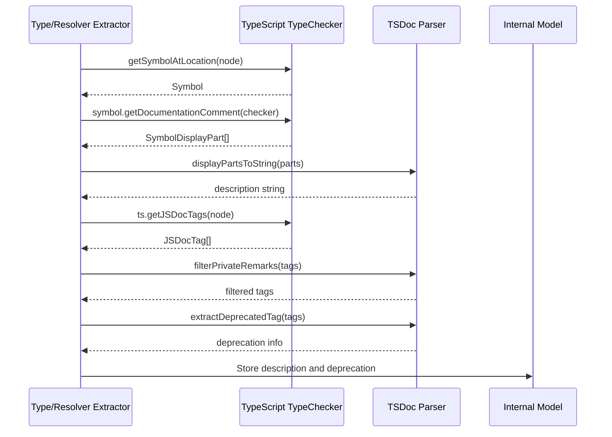
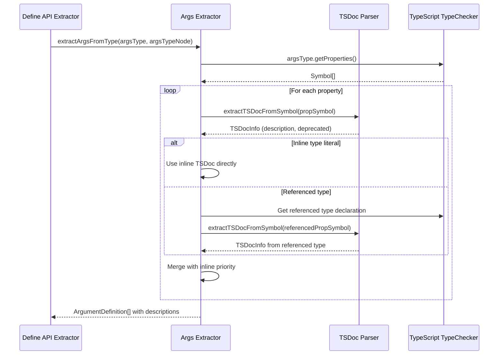
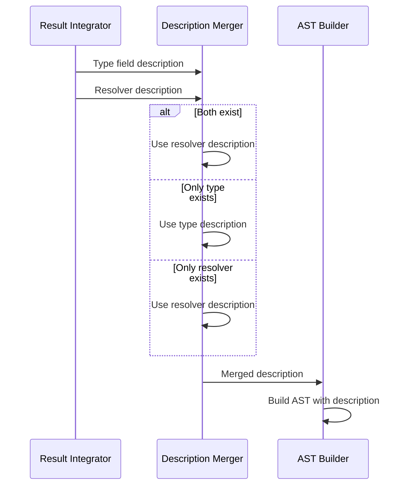
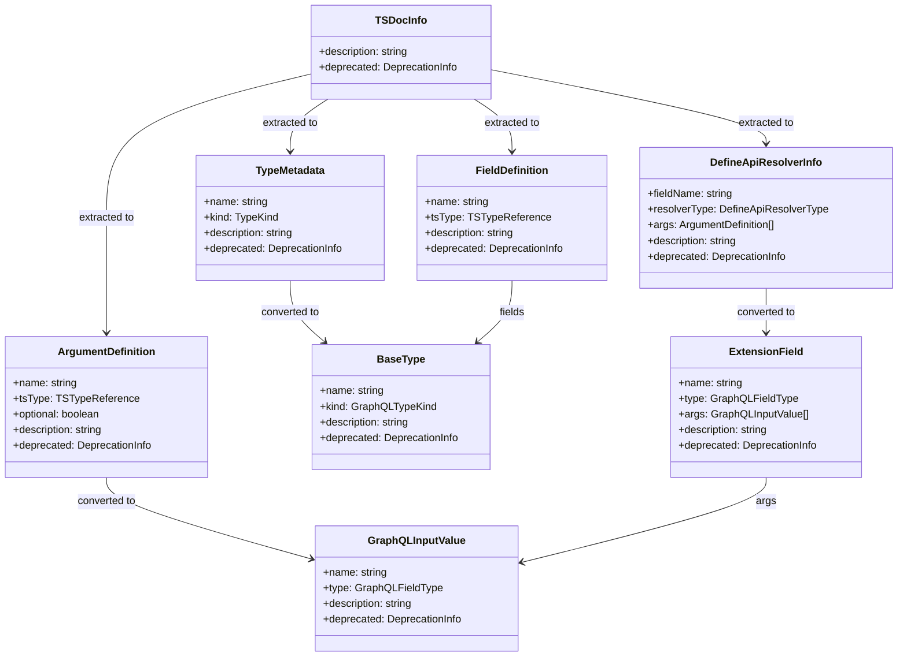

# Technical Design Document

## Overview

**Purpose**: 本機能は、TypeScript ソースコード内の TSDoc コメントを GraphQL スキーマの description フィールドに変換する機能を提供する。gqlkit の規約駆動設計に従い、型定義、フィールド、リゾルバ、リゾルバ引数に付与された TSDoc コメントを抽出し、生成される GraphQL スキーマ AST に description として反映する。

**Users**: gqlkit を使用する開発者が、TypeScript コードに記述した TSDoc コメントを活用して GraphQL スキーマを自己文書化するワークフローで利用する。

**Impact**: 既存の Type Extractor、Resolver Extractor、Schema Generator を拡張し、TSDoc コメントの抽出と GraphQL description への変換を追加する。

### Goals

- TSDoc コメントからの description 自動抽出（型、フィールド、リゾルバ、リゾルバ引数）
- `@deprecated` タグの GraphQL `@deprecated` ディレクティブへの変換
- `@privateRemarks` タグの description からの除外
- 型定義とリゾルバ間の description 優先順位の明確な定義
- インライン型リテラルと参照型定義間の引数 description 優先順位の定義
- 複数行コメントの改行保持

### Non-Goals

- TSDoc の全タグサポート（`@param`, `@returns` 等は description に含めない）
- Markdown 記法の変換や整形
- description に基づくバリデーション生成
- カスタムタグのサポート

## Architecture

### Existing Architecture Analysis

現在の実装は以下のパイプライン構成を持つ：

1. **Type Extractor**: `src/gql/types` から TypeScript 型を抽出し、`GraphQLTypeInfo` へ変換。現在は description 情報を抽出しない。
2. **Resolver Extractor**: `src/gql/resolvers` から Define API リゾルバを抽出し、`DefineApiResolverInfo` を生成。現在は description 情報を抽出しない。`extractArgsFromType` で引数定義を抽出するが、TSDoc は取得しない。
3. **Result Integrator**: 型とリゾルバを統合し、`IntegratedResult` を生成
4. **AST Builder**: `IntegratedResult` から GraphQL DocumentNode を生成。現在は description フィールドを設定しない。

現在の制約：
- TypeScript Symbol から JSDoc/TSDoc コメントを取得する API は利用していない
- GraphQL AST ノード生成時に `description` プロパティを設定していない
- `@deprecated` ディレクティブの生成機能がない
- 引数（`ArgumentDefinition`, `GraphQLInputValue`）に description フィールドがない

### Architecture Pattern & Boundary Map



**Architecture Integration**:
- Selected pattern: パイプライン拡張（既存アーキテクチャに準拠）
- Domain boundaries: Type Extractor と Resolver Extractor に TSDoc 抽出機能を追加、Schema Generator に description マージと AST description 設定を追加
- Existing patterns preserved: 既存の Extractor/Converter/Builder パターンを維持
- New components rationale: TSDoc Parser は TypeScript Compiler API を活用した共通ユーティリティ、Description Merger はリゾルバ優先の統合ロジック
- Steering compliance: Convention-driven design、Static analysis only 原則を維持

### Technology Stack

| Layer | Choice / Version | Role in Feature | Notes |
|-------|------------------|-----------------|-------|
| Backend / Services | TypeScript 5.9+ | TSDoc 抽出・AST 操作 | `ts.Symbol.getDocumentationComment()`, `ts.getJSDocTags()` |
| Data / Storage | N/A | N/A | ファイルシステム読み取りのみ |

## System Flows

### TSDoc Extraction Flow



### Args Description Extraction Flow



### Description Priority Resolution Flow



## Requirements Traceability

| Requirement | Summary | Components | Interfaces | Flows |
|-------------|---------|------------|------------|-------|
| 1.1, 1.2, 1.3, 1.4, 1.5 | 型定義の description 生成 | TSDocParser, TypeExtractor | `extractDescription()` | TSDoc Extraction |
| 2.1, 2.2, 2.3, 2.4 | フィールドの description 生成 | TSDocParser, TypeExtractor | `extractFieldDescription()` | TSDoc Extraction |
| 3.1, 3.2, 3.3, 3.4 | リゾルバの description 生成 | TSDocParser, DefineAPIExtractor | `extractDescription()` | TSDoc Extraction |
| 4.1, 4.2, 4.3 | description の優先順位 | DescriptionMerger | `mergeDescriptions()` | Description Priority Resolution |
| 5.1, 5.2, 5.3, 5.4, 5.5 | TSDoc 形式のサポート | TSDocParser | `parseComment()`, `extractDeprecatedReason()` | TSDoc Extraction |
| 5.6 | @privateRemarks タグの除外 | TSDocParser | `filterPrivateRemarks()` | TSDoc Extraction |
| 6.1, 6.2, 6.3, 6.4 | リゾルバ引数の description 生成 | TSDocParser, DefineAPIExtractor, ASTBuilder | `extractArgsWithDescription()` | Args Description Extraction |

## Components and Interfaces

| Component | Domain/Layer | Intent | Req Coverage | Key Dependencies (P0/P1) | Contracts |
|-----------|--------------|--------|--------------|--------------------------|-----------|
| TSDocParser | Shared Utility | TSDoc コメントの解析と description 抽出 | 1.1-1.5, 2.1-2.4, 5.1-5.6 | TypeScript TypeChecker (P0) | Service |
| TypeExtractor (拡張) | Type Extractor | 型・フィールドの description 抽出 | 1.1-1.5, 2.1-2.4 | TSDocParser (P0) | Service |
| DefineAPIExtractor (拡張) | Resolver Extractor | リゾルバと引数の description 抽出 | 3.1-3.4, 6.1-6.4 | TSDocParser (P0) | Service |
| DescriptionMerger | Schema Generator | 型とリゾルバの description 統合 | 4.1-4.3 | ResultIntegrator (P0) | Service |
| ASTBuilder (拡張) | Schema Generator | GraphQL AST への description 設定 | 1.1-1.5, 2.1-2.4, 3.1-3.4, 5.3-5.4, 6.1-6.3 | graphql-js (P0) | Service |

### Shared Utility Layer

#### TSDocParser

| Field | Detail |
|-------|--------|
| Intent | TypeScript AST ノードから TSDoc コメントを解析し、description と deprecation 情報を抽出する |
| Requirements | 1.1-1.5, 2.1-2.4, 5.1-5.6 |

**Responsibilities & Constraints**
- TypeScript Symbol から documentation comment を取得
- `@description` タグまたは本文から description を抽出
- `@deprecated` タグとその理由を抽出
- `@param`, `@returns` 等のタグを description から除外
- `@privateRemarks` タグの内容を description から除外
- 複数行コメントの改行を保持
- コメント先頭・末尾の空白と `*` プレフィックスを除去

**Dependencies**
- External: TypeScript Compiler API (`ts.Symbol.getDocumentationComment()`, `ts.getJSDocTags()`) (P0)

**Contracts**: Service [x]

##### Service Interface

```typescript
interface TSDocInfo {
  readonly description?: string;
  readonly deprecated?: DeprecationInfo;
}

interface DeprecationInfo {
  readonly isDeprecated: true;
  readonly reason?: string;
}

/**
 * TSDoc コメントから description と deprecation 情報を抽出する。
 * @privateRemarks タグの内容は除外される。
 */
function extractTSDocInfo(
  node: ts.Node,
  checker: ts.TypeChecker
): TSDocInfo;

/**
 * Symbol から TSDoc 情報を抽出する。
 * 引数プロパティなど、ノードではなく Symbol から直接取得する場合に使用。
 */
function extractTSDocFromSymbol(
  symbol: ts.Symbol,
  checker: ts.TypeChecker
): TSDocInfo;

/**
 * JSDocTag 配列から @privateRemarks タグの内容をフィルタリングする。
 * description 文字列から @privateRemarks セクションを除去した結果を返す。
 */
function filterPrivateRemarks(
  description: string,
  tags: ReadonlyArray<ts.JSDocTag>
): string;
```

- Preconditions: node または symbol が有効な TypeScript AST ノード/シンボル
- Postconditions: description が存在する場合は空でない文字列、存在しない場合は undefined
- Invariants: `@param`, `@returns`, `@privateRemarks` 等のタグは description に含まれない

**Implementation Notes**
- Integration: `packages/cli/src/shared/tsdoc-parser.ts` として新規作成
- Validation: 空白のみの description は undefined として扱う
- Risks: TypeScript バージョンによる API 差異の可能性（5.9+ で検証）

### Type Extractor Layer

#### TypeExtractor (拡張)

| Field | Detail |
|-------|--------|
| Intent | 既存の型抽出機能に TSDoc description 抽出を追加 |
| Requirements | 1.1-1.5, 2.1-2.4 |

**Responsibilities & Constraints**
- 型定義ノードから description を抽出
- 各フィールドの property signature から description を抽出
- Enum メンバーから description を抽出
- 抽出した description を `ExtractedTypeInfo` に含める

**Dependencies**
- Inbound: File Scanner - ソースファイル (P0)
- Outbound: GraphQL Converter - description 付き型情報 (P0)
- External: TSDocParser (P0)

**Contracts**: Service [x]

##### Service Interface

拡張されるデータ型：

```typescript
interface TypeMetadata {
  readonly name: string;
  readonly kind: TypeKind;
  readonly sourceFile: string;
  readonly exportKind: "named" | "default";
  readonly description?: string;           // 新規追加
  readonly deprecated?: DeprecationInfo;   // 新規追加
}

interface FieldDefinition {
  readonly name: string;
  readonly tsType: TSTypeReference;
  readonly optional: boolean;
  readonly description?: string;           // 新規追加
  readonly deprecated?: DeprecationInfo;   // 新規追加
}

interface EnumMemberInfo {
  readonly name: string;
  readonly value: string;
  readonly description?: string;           // 新規追加
  readonly deprecated?: DeprecationInfo;   // 新規追加
}
```

- Preconditions: ソースファイルが TypeScript として有効
- Postconditions: TSDoc コメントが存在する場合は description が設定される
- Invariants: description は null ではなく undefined で省略を表現

**Implementation Notes**
- Integration: 既存の `type-extractor.ts` の `extractTypesFromProgram()` を拡張
- Validation: 各ノードで `extractTSDocInfo()` を呼び出し
- Risks: パフォーマンスへの影響（Symbol 取得コスト）

### Resolver Extractor Layer

#### DefineAPIExtractor (拡張)

| Field | Detail |
|-------|--------|
| Intent | 既存のリゾルバ抽出機能に TSDoc description 抽出を追加。引数の description 抽出も担当 |
| Requirements | 3.1-3.4, 6.1-6.4 |

**Responsibilities & Constraints**
- `defineQuery`, `defineMutation`, `defineField` のエクスポート文から description を抽出
- 変数宣言ステートメントに付与された TSDoc コメントを取得
- 引数型のプロパティから description を抽出
- インライン型リテラルと参照型定義の両方をサポート
- インライン型リテラル側の TSDoc を参照型定義より優先

**Dependencies**
- Inbound: File Scanner - ソースファイル (P0)
- Outbound: Result Integrator - description 付きリゾルバ情報 (P0)
- External: TSDocParser (P0)

**Contracts**: Service [x]

##### Service Interface

拡張されるデータ型：

```typescript
interface ArgumentDefinition {
  readonly name: string;
  readonly tsType: TSTypeReference;
  readonly optional: boolean;
  readonly description?: string;           // 新規追加
  readonly deprecated?: DeprecationInfo;   // 新規追加
}

interface DefineApiResolverInfo {
  readonly fieldName: string;
  readonly resolverType: DefineApiResolverType;
  readonly parentTypeName?: string;
  readonly argsType?: TSTypeReference;
  readonly args?: ReadonlyArray<ArgumentDefinition>;
  readonly returnType: TSTypeReference;
  readonly sourceFile: string;
  readonly exportedInputTypes: ReadonlyArray<ExportedInputType>;
  readonly description?: string;           // 新規追加
  readonly deprecated?: DeprecationInfo;   // 新規追加
}
```

引数 description 抽出のロジック：

```typescript
/**
 * 引数型から description 付きの ArgumentDefinition を抽出する。
 *
 * @param argsType - TypeChecker から取得した引数の型
 * @param argsTypeNode - 引数型の TypeNode（インライン型リテラル判定用）
 * @param checker - TypeScript TypeChecker
 * @returns description 付きの ArgumentDefinition 配列
 *
 * 優先順位:
 * 1. インライン型リテラル（{ id: string }）のプロパティ TSDoc
 * 2. 参照型定義（GetUserArgs）のプロパティ TSDoc
 */
function extractArgsWithDescription(
  argsType: ts.Type,
  argsTypeNode: ts.TypeNode,
  checker: ts.TypeChecker
): ArgumentDefinition[];
```

- Preconditions: ソースファイルが有効な Define API パターンを使用
- Postconditions: TSDoc コメントが存在する場合は description が設定される
- Invariants: リゾルバ関数ではなくエクスポート変数宣言の TSDoc を使用。引数はインライン > 参照型の優先順位

**Implementation Notes**
- Integration: 既存の `define-api-extractor.ts` の `extractDefineApiResolvers()` と `extractArgsFromType()` を拡張
- Validation: `ts.isVariableStatement(node)` の親ノードから TSDoc を取得
- Risks: エクスポート変数宣言に対する TSDoc 取得の信頼性。インライン型リテラルの判定精度

### Schema Generator Layer

#### DescriptionMerger

| Field | Detail |
|-------|--------|
| Intent | 型定義とリゾルバの description を優先順位に従って統合 |
| Requirements | 4.1, 4.2, 4.3 |

**Responsibilities & Constraints**
- リゾルバ側の description を優先
- 型定義フィールドの description はリゾルバがない場合に使用
- deprecation 情報も同様の優先順位で統合

**Dependencies**
- Inbound: ResultIntegrator - 型とリゾルバ情報 (P0)
- Outbound: ASTBuilder - 統合された description (P0)

**Contracts**: Service [x]

##### Service Interface

```typescript
interface DescriptionMergeResult {
  readonly description?: string;
  readonly deprecated?: DeprecationInfo;
}

function mergeDescriptions(
  typeDescription?: string,
  typeDeprecated?: DeprecationInfo,
  resolverDescription?: string,
  resolverDeprecated?: DeprecationInfo
): DescriptionMergeResult;
```

- Preconditions: なし（両方 undefined でも可）
- Postconditions: リゾルバ側が存在すればリゾルバ側、なければ型定義側
- Invariants: 優先順位は常にリゾルバ > 型定義

**Implementation Notes**
- Integration: `result-integrator.ts` 内に統合可能
- Validation: シンプルな条件分岐のみ
- Risks: なし

#### ASTBuilder (拡張)

| Field | Detail |
|-------|--------|
| Intent | GraphQL AST ノードに description と deprecated ディレクティブを設定 |
| Requirements | 1.1-1.5, 2.1-2.4, 3.1-3.4, 5.3-5.4, 6.1-6.3 |

**Responsibilities & Constraints**
- 各 Definition/Extension ノードに `description` プロパティを設定
- `@deprecated` がある場合は `directives` に deprecated ディレクティブを追加
- deprecated の reason がある場合は引数として設定
- InputValueDefinitionNode（引数）に description を設定

**Dependencies**
- Inbound: ResultIntegrator - description 付き統合結果 (P0)
- Outbound: DocumentNode - description 付き AST (P0)
- External: graphql-js Kind nodes (P0)

**Contracts**: Service [x]

##### Service Interface

拡張される関数シグネチャ：

```typescript
interface DescribableField {
  readonly name: string;
  readonly type: GraphQLFieldType;
  readonly description?: string;
  readonly deprecated?: DeprecationInfo;
}

interface DescribableInputValue {
  readonly name: string;
  readonly type: GraphQLFieldType;
  readonly description?: string;           // 新規追加
  readonly deprecated?: DeprecationInfo;   // 新規追加
}

function buildStringValueNode(value: string): StringValueNode;

function buildDeprecatedDirective(reason?: string): DirectiveNode;

function buildInputValueDefinitionNode(
  inputValue: DescribableInputValue
): InputValueDefinitionNode;

function buildFieldDefinitionNode(
  field: DescribableField
): FieldDefinitionNode;

function buildObjectTypeDefinitionNode(
  baseType: DescribableBaseType
): ObjectTypeDefinitionNode;

function buildEnumValueDefinitionNode(
  value: DescribableEnumValue
): EnumValueDefinitionNode;
```

- Preconditions: description が存在する場合は空でない文字列
- Postconditions: description があれば GraphQL AST ノードに description プロパティが設定される
- Invariants: description は StringValueNode として構築

**Implementation Notes**
- Integration: 既存の `ast-builder.ts` の各 build 関数を拡張
- Validation: graphql-js の Kind.STRING を使用して StringValueNode を構築
- Risks: なし（GraphQL 仕様に準拠）

## Data Models

### Domain Model

#### Description 情報の流れ



### Logical Data Model

#### DeprecationInfo

```typescript
interface DeprecationInfo {
  readonly isDeprecated: true;
  readonly reason?: string;
}
```

#### 拡張される ArgumentDefinition

```typescript
interface ArgumentDefinition {
  readonly name: string;
  readonly tsType: TSTypeReference;
  readonly optional: boolean;
  readonly description?: string;           // 新規追加
  readonly deprecated?: DeprecationInfo;   // 新規追加
}
```

#### 拡張される GraphQLInputValue

```typescript
interface GraphQLInputValue {
  readonly name: string;
  readonly type: GraphQLFieldType;
  readonly description?: string;           // 新規追加
  readonly deprecated?: DeprecationInfo;   // 新規追加
}
```

#### 拡張される BaseField

```typescript
interface BaseField {
  readonly name: string;
  readonly type: GraphQLFieldType;
  readonly description?: string;           // 新規追加
  readonly deprecated?: DeprecationInfo;   // 新規追加
}
```

#### 拡張される BaseType

```typescript
interface BaseType {
  readonly name: string;
  readonly kind: "Object" | "Union" | "Enum";
  readonly fields?: ReadonlyArray<BaseField>;
  readonly unionMembers?: ReadonlyArray<string>;
  readonly enumValues?: ReadonlyArray<EnumValueInfo>;
  readonly description?: string;           // 新規追加
  readonly deprecated?: DeprecationInfo;   // 新規追加
}
```

#### 拡張される EnumValueInfo

```typescript
interface EnumValueInfo {
  readonly name: string;
  readonly originalValue: string;
  readonly description?: string;           // 新規追加
  readonly deprecated?: DeprecationInfo;   // 新規追加
}
```

#### 拡張される ExtensionField

```typescript
interface ExtensionField {
  readonly name: string;
  readonly type: GraphQLFieldType;
  readonly args?: ReadonlyArray<GraphQLInputValue>;
  readonly resolverSourceFile: string;
  readonly resolverExportName?: string;
  readonly description?: string;           // 新規追加
  readonly deprecated?: DeprecationInfo;   // 新規追加
}
```

### Data Contracts & Integration

#### GraphQL AST Description

GraphQL AST では description は `StringValueNode` として表現される：

```typescript
interface StringValueNode {
  readonly kind: Kind.STRING;
  readonly value: string;
  readonly block?: boolean;  // 複数行の場合 true
}
```

フィールド定義ノードでの使用例：

```typescript
interface FieldDefinitionNode {
  readonly kind: Kind.FIELD_DEFINITION;
  readonly description?: StringValueNode;
  readonly name: NameNode;
  readonly type: TypeNode;
  readonly arguments?: ReadonlyArray<InputValueDefinitionNode>;
  readonly directives?: ReadonlyArray<DirectiveNode>;
  // ...
}
```

引数定義ノードでの使用例：

```typescript
interface InputValueDefinitionNode {
  readonly kind: Kind.INPUT_VALUE_DEFINITION;
  readonly description?: StringValueNode;
  readonly name: NameNode;
  readonly type: TypeNode;
  readonly defaultValue?: ConstValueNode;
  readonly directives?: ReadonlyArray<DirectiveNode>;
}
```

#### Deprecated Directive

GraphQL の `@deprecated` ディレクティブの AST 表現：

```typescript
const deprecatedDirective: DirectiveNode = {
  kind: Kind.DIRECTIVE,
  name: { kind: Kind.NAME, value: "deprecated" },
  arguments: reason ? [
    {
      kind: Kind.ARGUMENT,
      name: { kind: Kind.NAME, value: "reason" },
      value: { kind: Kind.STRING, value: reason },
    }
  ] : [],
};
```

## Error Handling

### Error Strategy

TSDoc 抽出は best-effort で行い、コメントがない場合やパースに失敗した場合はエラーを発生させず、description を省略する。

### Error Categories and Responses

**警告レベル (Diagnostic warning)**:

| 状況 | 対応 |
|------|------|
| TSDoc パースに失敗 | 警告を出力し、description を省略 |
| 空の description | 警告なし、description を省略 |
| @privateRemarks のみのコメント | 警告なし、description を省略 |

**備考**: TSDoc コメントの有無はスキーマ生成の成否に影響しないため、エラーレベルの診断は発生しない。

### Monitoring

- 全ての警告は `Diagnostic` 型で統一（severity: "warning"）
- description 抽出の成功/失敗はログレベルで記録可能

## Testing Strategy

### Unit Tests

1. **TSDocParser**
   - 単一行コメントから description が抽出される
   - 複数行コメントの改行が保持される
   - `@description` タグの内容が抽出される
   - `@description` なしの本文が抽出される
   - `@deprecated` タグと reason が抽出される
   - `@param`, `@returns` 等が除外される
   - `@privateRemarks` タグの内容が除外される
   - 空白と `*` プレフィックスが除去される

2. **TypeExtractor (拡張)**
   - 型定義の TSDoc が description として抽出される
   - フィールドの TSDoc が description として抽出される
   - Enum メンバーの TSDoc が description として抽出される
   - TSDoc がない場合は undefined

3. **DefineAPIExtractor (拡張)**
   - `defineQuery` エクスポートの TSDoc が抽出される
   - `defineMutation` エクスポートの TSDoc が抽出される
   - `defineField` エクスポートの TSDoc が抽出される
   - インライン型リテラルの引数から description が抽出される
   - 参照型定義の引数から description が抽出される
   - インライン型と参照型の両方に TSDoc がある場合インラインが優先される
   - 引数に TSDoc がない場合は undefined

4. **DescriptionMerger**
   - リゾルバのみの description が使用される
   - 型定義のみの description が使用される
   - 両方存在する場合リゾルバが優先される
   - deprecated も同様の優先順位

5. **ASTBuilder (拡張)**
   - description 付き ObjectTypeDefinitionNode が生成される
   - description 付き FieldDefinitionNode が生成される
   - description 付き EnumValueDefinitionNode が生成される
   - description 付き InputValueDefinitionNode が生成される
   - deprecated ディレクティブが生成される
   - deprecated の reason が引数として設定される

### Integration Tests

1. **End-to-end スキーマ生成**
   - TSDoc 付き型からスキーマが正しく生成される
   - TSDoc 付きリゾルバからスキーマが正しく生成される
   - TSDoc 付き引数からスキーマが正しく生成される
   - 型とリゾルバ両方に TSDoc がある場合の優先順位が正しい
   - インライン引数と参照型引数の優先順位が正しい
   - deprecated ディレクティブが正しく出力される
   - @privateRemarks の内容が出力に含まれない

2. **GraphQL スキーマ出力検証**
   - `printSchema()` で description が正しくフォーマットされる
   - 複数行 description がブロック文字列として出力される
   - 引数の description が正しく出力される

### E2E Tests

1. **examples ディレクトリでの検証**
   - 既存の example に TSDoc コメントを追加
   - `gqlkit gen` で description 付きスキーマが生成される
   - GraphQL Playground 等で description が表示される
   - 引数の description が introspection で取得できる
