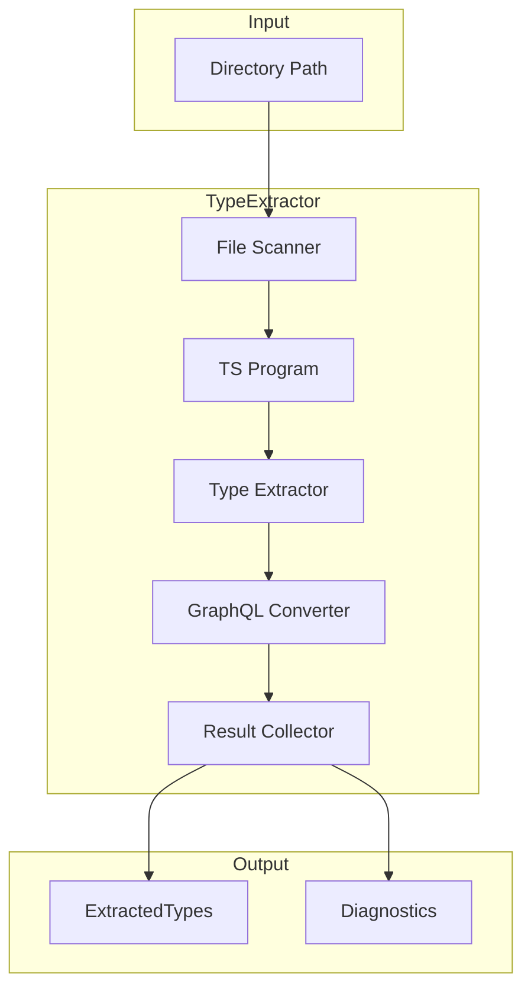
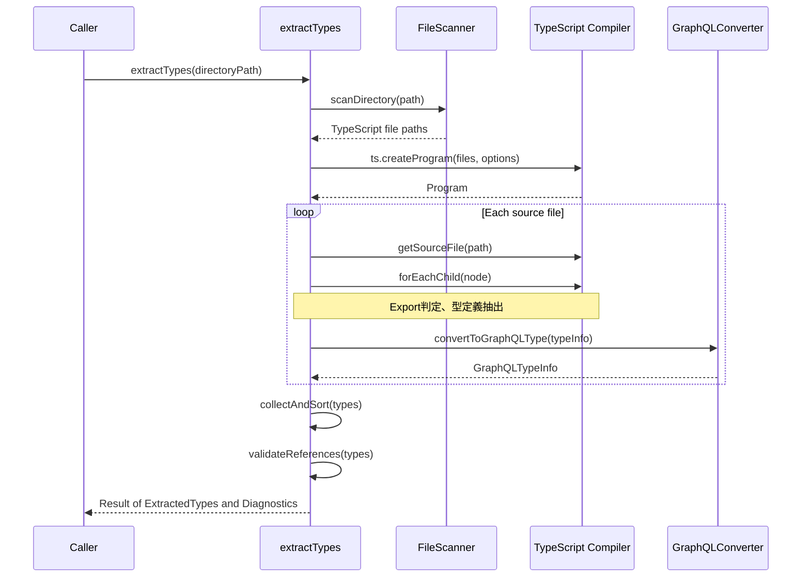
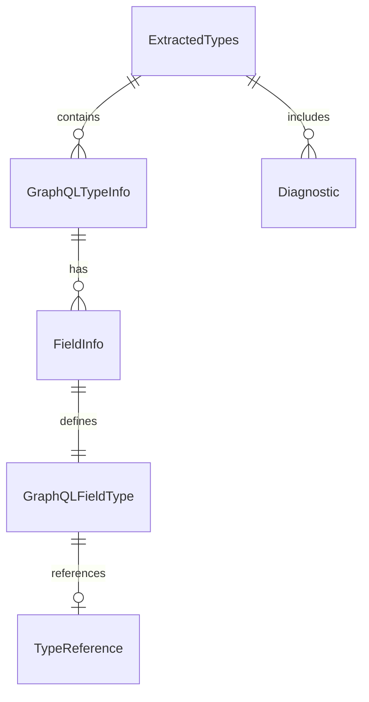

# Design Document: type-extraction

## Overview

**Purpose**: この機能は、指定ディレクトリ配下のTypeScript型定義を解析し、GraphQL型情報として構造化されたオブジェクトを出力する。gqlkitのコード生成パイプラインにおける基盤コンポーネントであり、後続のスキーマAST生成およびリゾルバマップ生成の入力データを提供する。

**Users**: gqlkit利用者およびgqlkit開発者がこの機能を使用する。利用者は型定義を記述するだけでGraphQL型への変換が行われ、開発者はこの機能をパイプラインに組み込んでコード生成を実現する。

**Impact**: 現在のgqlkitには型抽出機能が存在しないため、新規コンポーネントとして追加される。

### Goals

- TypeScript Compiler APIを使用した型定義の静的解析
- 決定論的で再現可能な出力の保証
- 型安全な内部データ構造の提供
- 明確で実用的なエラー診断

### Non-Goals

- GraphQLスキーマAST（DocumentNode）の生成（後続機能）
- リゾルバの解析と抽出（後続機能）
- カスタムスカラー型のサポート（将来拡張）
- ジェネリクス型の完全サポート（将来拡張）
- JSDocアノテーションによるInt/Float指定（将来拡張）

## Architecture

### Architecture Pattern & Boundary Map

**Selected Pattern**: Pipeline Architecture

型抽出機能は、ソースファイルのスキャン → ASTパース → 型情報抽出 → GraphQL型変換 → 結果集約という段階的なパイプラインで構成される。各段階は独立してテスト可能であり、gqlkitの「決定論的出力」原則に適合する。



**Architecture Integration**:
- Selected pattern: Pipeline Architecture（各段階の独立性とテスト容易性を確保）
- Domain/feature boundaries: 型抽出は独立したモジュールとして、後続のスキーマ生成・リゾルバ生成から分離
- Existing patterns preserved: gunshiによるCLI構造、ESM準拠
- New components rationale: TypeScript Compiler APIをラップし、gqlkit固有の型変換ロジックを実装
- Steering compliance: 決定論的出力、デコレータ不使用、純粋な静的解析

### Technology Stack

| Layer | Choice / Version | Role in Feature | Notes |
|-------|------------------|-----------------|-------|
| Backend / Services | TypeScript 5.9+ | 型抽出ロジック実装 | Compiler API使用 |
| Data / Storage | N/A | ファイルシステム読み取りのみ | |
| Infrastructure / Runtime | Node.js (ES2022+) | ファイルスキャン、プログラム実行 | ESM必須 |

TypeScript Compiler APIは`typescript`パッケージに含まれており、追加の依存関係は不要。

## System Flows

### 型抽出フロー



**Key Decisions**:
- 型参照の検証は全型抽出後に実行（循環参照対応）
- 出力は型名のアルファベット順でソート（決定論的出力保証）

## Requirements Traceability

| Requirement | Summary | Components | Interfaces | Flows |
|-------------|---------|------------|------------|-------|
| 1.1 | ディレクトリ再帰スキャン | FileScanner | scanDirectory | 型抽出フロー |
| 1.2 | export型定義の検出 | TypeExtractor | extractTypes | 型抽出フロー |
| 1.3 | 非export型の除外 | TypeExtractor | extractTypes | 型抽出フロー |
| 1.4 | 型メタデータの記録 | TypeExtractor | TypeMetadata | 型抽出フロー |
| 2.1 | Object型変換 | GraphQLConverter | convertObjectType | 型抽出フロー |
| 2.2 | Union型変換 | GraphQLConverter | convertUnionType | 型抽出フロー |
| 2.3 | Nullable型記録 | GraphQLConverter | FieldInfo | 型抽出フロー |
| 2.4 | List型記録 | GraphQLConverter | FieldInfo | 型抽出フロー |
| 2.5 | プリミティブ型変換 | GraphQLConverter | convertPrimitiveType | 型抽出フロー |
| 2.6 | 組み込み型競合検出 | TypeValidator | validateTypeName | 型抽出フロー |
| 3.1 | 構造化出力 | ResultCollector | ExtractedTypes | 型抽出フロー |
| 3.2 | 型メタデータ含有 | ResultCollector | GraphQLTypeInfo | 型抽出フロー |
| 3.3 | フィールド情報含有 | ResultCollector | FieldInfo | 型抽出フロー |
| 3.4 | 型参照記録 | ResultCollector | TypeReference | 型抽出フロー |
| 3.5 | 参照解決エラー | TypeValidator | validateReferences | 型抽出フロー |
| 4.1 | 単一関数エクスポート | extractTypes | extractTypes | 型抽出フロー |
| 4.2 | ディレクトリパス入力 | extractTypes | ExtractTypesOptions | 型抽出フロー |
| 4.3 | 非同期結果返却 | extractTypes | Promise | 型抽出フロー |
| 4.4 | 厳密な型定義 | 全コンポーネント | 全インターフェース | - |
| 5.1 | ディレクトリ不在エラー | FileScanner | Diagnostic | 型抽出フロー |
| 5.2 | パースエラー報告 | TypeExtractor | Diagnostic | 型抽出フロー |
| 5.3 | 未サポート構文警告 | TypeExtractor | Diagnostic | 型抽出フロー |
| 5.4 | エラー一括報告 | ResultCollector | Diagnostics | 型抽出フロー |
| 6.1 | 同一出力保証 | ResultCollector | - | 型抽出フロー |
| 6.2 | スキャン順序非依存 | FileScanner, ResultCollector | - | 型抽出フロー |
| 6.3 | 出力ソート | ResultCollector | - | 型抽出フロー |

## Components and Interfaces

| Component | Domain/Layer | Intent | Req Coverage | Key Dependencies | Contracts |
|-----------|--------------|--------|--------------|------------------|-----------|
| extractTypes | Core/Entry | 型抽出のメインエントリポイント | 4.1, 4.2, 4.3 | FileScanner, TypeExtractor, ResultCollector | Service |
| FileScanner | Core/IO | ディレクトリスキャンとファイル列挙 | 1.1, 5.1, 6.2 | Node.js fs | Service |
| TypeExtractor | Core/Analysis | TypeScript AST解析と型情報抽出 | 1.2, 1.3, 1.4, 5.2, 5.3 | TypeScript Compiler API | Service |
| GraphQLConverter | Core/Transform | TypeScript型からGraphQL型への変換 | 2.1-2.6 | TypeExtractor | Service |
| TypeValidator | Core/Validation | 型参照検証と競合検出 | 2.6, 3.5 | - | Service |
| ResultCollector | Core/Output | 結果集約とソート | 3.1-3.4, 5.4, 6.1, 6.3 | - | Service |

### Core Layer

#### extractTypes (Entry Point)

| Field | Detail |
|-------|--------|
| Intent | 型抽出機能のパブリックAPI、パイプライン全体を調整 |
| Requirements | 4.1, 4.2, 4.3, 4.4 |

**Responsibilities & Constraints**
- 型抽出パイプラインの調整と実行
- 入力バリデーションと結果集約
- エラーと成功結果の統合

**Dependencies**
- Outbound: FileScanner — ファイルスキャン (P0)
- Outbound: TypeExtractor — 型解析 (P0)
- Outbound: GraphQLConverter — 型変換 (P0)
- Outbound: ResultCollector — 結果集約 (P0)

**Contracts**: Service [x]

##### Service Interface

```typescript
interface ExtractTypesOptions {
  readonly directory: string;
}

interface ExtractTypesResult {
  readonly types: ReadonlyArray<GraphQLTypeInfo>;
  readonly diagnostics: Diagnostics;
}

function extractTypes(options: ExtractTypesOptions): Promise<ExtractTypesResult>;
```

- Preconditions: directoryは有効なファイルシステムパス
- Postconditions: 型情報とすべての診断結果を含む結果を返却
- Invariants: 同一入力に対して常に同一出力

**Implementation Notes**
- Integration: genCommandから呼び出される
- Validation: ディレクトリ存在確認はFileScannerに委譲
- Risks: 大規模ディレクトリでのパフォーマンス

---

#### FileScanner

| Field | Detail |
|-------|--------|
| Intent | 指定ディレクトリ配下のTypeScriptファイルを再帰的にスキャン |
| Requirements | 1.1, 5.1, 6.2 |

**Responsibilities & Constraints**
- ディレクトリの再帰的走査
- `.ts`ファイルの列挙（`.d.ts`を除外）
- ファイルパスのソート（決定論的順序）

**Dependencies**
- External: Node.js fs/promises — ファイルシステムアクセス (P0)

**Contracts**: Service [x]

##### Service Interface

```typescript
interface ScanResult {
  readonly files: ReadonlyArray<string>;
  readonly errors: ReadonlyArray<Diagnostic>;
}

function scanDirectory(directory: string): Promise<ScanResult>;
```

- Preconditions: directoryは文字列
- Postconditions: ソート済みのファイルパス配列、またはエラー診断
- Invariants: ファイルパスはアルファベット順でソート

**Implementation Notes**
- Integration: fs.readdir with recursive option (Node.js 20+)
- Validation: ディレクトリ存在確認、アクセス権限確認
- Risks: シンボリックリンクの循環参照

---

#### TypeExtractor

| Field | Detail |
|-------|--------|
| Intent | TypeScript Compiler APIを使用して型定義を抽出 |
| Requirements | 1.2, 1.3, 1.4, 5.2, 5.3 |

**Responsibilities & Constraints**
- TypeScript Programの作成と管理
- AST走査によるexport型定義の検出
- 型メタデータ（名前、種別、ソースパス）の収集
- パースエラーと未サポート構文の診断

**Dependencies**
- External: TypeScript Compiler API — AST解析 (P0)
- Inbound: FileScanner — ファイルパス一覧 (P0)

**Contracts**: Service [x]

##### Service Interface

```typescript
type TypeKind = "object" | "interface" | "union";

interface TypeMetadata {
  readonly name: string;
  readonly kind: TypeKind;
  readonly sourceFile: string;
  readonly exportKind: "named" | "default";
}

interface ExtractedTypeInfo {
  readonly metadata: TypeMetadata;
  readonly fields: ReadonlyArray<FieldDefinition>;
  readonly unionMembers?: ReadonlyArray<string>;
}

interface FieldDefinition {
  readonly name: string;
  readonly tsType: TSTypeReference;
  readonly optional: boolean;
}

interface TSTypeReference {
  readonly kind: "primitive" | "reference" | "array" | "union" | "literal";
  readonly name?: string;
  readonly elementType?: TSTypeReference;
  readonly members?: ReadonlyArray<TSTypeReference>;
  readonly nullable: boolean;
}

interface ExtractionResult {
  readonly types: ReadonlyArray<ExtractedTypeInfo>;
  readonly diagnostics: ReadonlyArray<Diagnostic>;
}

function extractTypesFromProgram(
  program: ts.Program,
  sourceFiles: ReadonlyArray<string>
): ExtractionResult;
```

- Preconditions: 有効なts.Programとソースファイルパス
- Postconditions: 抽出された型情報と診断結果
- Invariants: export修飾子を持つ型のみ抽出

**Implementation Notes**
- Integration: ts.createProgram, ts.forEachChild, program.getTypeChecker()
- Validation: ts.getCombinedModifierFlags()でexportフラグ確認
- Risks: TypeScript内部APIへの依存

---

#### GraphQLConverter

| Field | Detail |
|-------|--------|
| Intent | TypeScript型情報をGraphQL型情報に変換 |
| Requirements | 2.1, 2.2, 2.3, 2.4, 2.5, 2.6 |

**Responsibilities & Constraints**
- プリミティブ型のマッピング（string→String, number→Int, boolean→Boolean）
- Object型とUnion型の変換
- nullable/list修飾子の適用
- 組み込み型名との競合検出

**Dependencies**
- Inbound: TypeExtractor — 抽出された型情報 (P0)

**Contracts**: Service [x]

##### Service Interface

```typescript
type GraphQLTypeKind = "Object" | "Union" | "Scalar";

interface GraphQLTypeInfo {
  readonly name: string;
  readonly kind: GraphQLTypeKind;
  readonly fields?: ReadonlyArray<FieldInfo>;
  readonly unionMembers?: ReadonlyArray<string>;
  readonly sourceFile: string;
}

interface FieldInfo {
  readonly name: string;
  readonly type: GraphQLFieldType;
}

interface GraphQLFieldType {
  readonly typeName: string;
  readonly nullable: boolean;
  readonly list: boolean;
  readonly listItemNullable?: boolean;
}

interface ConversionResult {
  readonly types: ReadonlyArray<GraphQLTypeInfo>;
  readonly diagnostics: ReadonlyArray<Diagnostic>;
}

function convertToGraphQL(
  extractedTypes: ReadonlyArray<ExtractedTypeInfo>
): ConversionResult;
```

- Preconditions: 有効なExtractedTypeInfo配列
- Postconditions: GraphQL型情報と変換時の診断結果
- Invariants: number → Int

**Implementation Notes**
- Integration: TypeExtractorの出力を変換
- Validation: GraphQL予約語（Query, Mutation, Subscription, Int, Float, String, Boolean, ID）との競合チェック
- Risks: 複雑なunion型の変換

---

#### TypeValidator

| Field | Detail |
|-------|--------|
| Intent | 型参照の妥当性と競合を検証 |
| Requirements | 2.6, 3.5 |

**Responsibilities & Constraints**
- 型参照の解決可能性検証
- GraphQL組み込み型との名前競合検出
- 循環参照の検出（警告）

**Dependencies**
- Inbound: GraphQLConverter — 変換後の型情報 (P0)

**Contracts**: Service [x]

##### Service Interface

```typescript
interface ValidationResult {
  readonly valid: boolean;
  readonly diagnostics: ReadonlyArray<Diagnostic>;
}

function validateTypes(
  types: ReadonlyArray<GraphQLTypeInfo>
): ValidationResult;
```

- Preconditions: 変換済みのGraphQL型情報
- Postconditions: 検証結果と診断情報
- Invariants: すべての型参照が解決可能であること

**Implementation Notes**
- Integration: extractTypesの最終段階で呼び出し
- Validation: 型名セットを構築し、各参照をルックアップ
- Risks: 外部型への参照（graphql-jsの型など）

---

#### ResultCollector

| Field | Detail |
|-------|--------|
| Intent | 抽出・変換結果を集約し、決定論的な出力を生成 |
| Requirements | 3.1, 3.2, 3.3, 3.4, 5.4, 6.1, 6.3 |

**Responsibilities & Constraints**
- 型情報のアルファベット順ソート
- フィールド情報のアルファベット順ソート
- 診断情報の集約と重複排除
- 最終出力形式の構築

**Dependencies**
- Inbound: GraphQLConverter — 変換後の型情報 (P0)
- Inbound: TypeValidator — 検証結果 (P0)

**Contracts**: Service [x]

##### Service Interface

```typescript
function collectResults(
  types: ReadonlyArray<GraphQLTypeInfo>,
  diagnostics: ReadonlyArray<Diagnostic>
): ExtractTypesResult;
```

- Preconditions: 型情報と診断情報の配列
- Postconditions: ソート済みの最終結果
- Invariants: 同一入力 → 同一出力

**Implementation Notes**
- Integration: パイプライン最終段階
- Validation: なし（入力は既に検証済み）
- Risks: なし

## Data Models

### Domain Model

型抽出機能は以下のドメイン概念を扱う:

- **ExtractedType**: TypeScriptソースから抽出された型定義
- **GraphQLType**: GraphQL型としての表現
- **Field**: 型のフィールド定義
- **TypeReference**: 他の型への参照
- **Diagnostic**: エラーまたは警告情報



**Business Rules & Invariants**:
- 型名は一意でなければならない
- すべての型参照は解決可能でなければならない
- 出力は常に同じ順序でソートされる

### Logical Data Model

#### Core Types

```typescript
interface ExtractedTypes {
  readonly types: ReadonlyArray<GraphQLTypeInfo>;
  readonly diagnostics: Diagnostics;
}

interface Diagnostics {
  readonly errors: ReadonlyArray<Diagnostic>;
  readonly warnings: ReadonlyArray<Diagnostic>;
}

interface Diagnostic {
  readonly code: DiagnosticCode;
  readonly message: string;
  readonly severity: "error" | "warning";
  readonly location?: SourceLocation;
}

interface SourceLocation {
  readonly file: string;
  readonly line: number;
  readonly column: number;
}

type DiagnosticCode =
  | "DIRECTORY_NOT_FOUND"
  | "PARSE_ERROR"
  | "UNSUPPORTED_SYNTAX"
  | "RESERVED_TYPE_NAME"
  | "UNRESOLVED_REFERENCE";
```

#### GraphQL Type Representation

```typescript
interface GraphQLTypeInfo {
  readonly name: string;
  readonly kind: "Object" | "Union";
  readonly fields?: ReadonlyArray<FieldInfo>;
  readonly unionMembers?: ReadonlyArray<string>;
  readonly sourceFile: string;
}

interface FieldInfo {
  readonly name: string;
  readonly type: GraphQLFieldType;
}

interface GraphQLFieldType {
  readonly typeName: string;
  readonly nullable: boolean;
  readonly list: boolean;
  readonly listItemNullable?: boolean;
}
```

**Type Mappings**:
| TypeScript | GraphQL |
|------------|---------|
| `string` | `String` |
| `number` | `Int` |
| `boolean` | `Boolean` |
| `T[]` / `Array<T>` | `[T!]!` (non-null list of non-null items) |
| `T \| null` | nullable `T` |
| `T \| undefined` | nullable `T` |
| `interface X` | `type X` (Object) |
| `type X = A \| B` | `union X = A \| B` |

## Error Handling

### Error Strategy

型抽出機能はfail-fast原則に従いつつ、可能な限り多くのエラーを収集する。致命的エラー（ディレクトリ不在）は即座に報告し、回復可能なエラー（パース失敗、未サポート構文）は収集して一括報告する。

### Error Categories and Responses

**User Errors (Recoverable)**:
- `PARSE_ERROR`: 構文エラーのあるファイル → 該当ファイルをスキップ、他のファイルは処理続行
- `UNSUPPORTED_SYNTAX`: 未サポートのTypeScript構文 → 警告として報告、処理続行

**System Errors (Fatal)**:
- `DIRECTORY_NOT_FOUND`: 指定ディレクトリが存在しない → 即座にエラー返却

**Validation Errors (Recoverable)**:
- `RESERVED_TYPE_NAME`: GraphQL組み込み型との競合 → エラーとして報告、処理続行
- `UNRESOLVED_REFERENCE`: 解決できない型参照 → エラーとして報告、処理続行

### Monitoring

- 各診断にはユニークなコードを付与（グレップ可能）
- ソース位置情報（ファイル、行、列）を含める
- 重複する診断は排除

## Testing Strategy

### Unit Tests

- TypeExtractor: export/non-export型の識別
- GraphQLConverter: プリミティブ型マッピング（string, number, boolean）
- GraphQLConverter: nullable型の検出（`T | null`, `T | undefined`, optional field）
- GraphQLConverter: 配列型の変換（`T[]`, `Array<T>`）
- ResultCollector: 出力のソート順序

### Integration Tests

- ディレクトリスキャンから型抽出までのパイプライン
- 複数ファイルにまたがる型参照の解決
- エラー収集と一括報告の動作
- 決定論的出力の検証（同一入力 → 同一出力）

### E2E Tests

- gqlkit genコマンドからの型抽出呼び出し
- 実際のプロジェクト構造（src/gql/types/）での動作確認

## Performance & Scalability

**Target Metrics**:
- 100ファイル/1000型定義で1秒以内
- メモリ使用量: 入力ファイルサイズの10倍以内

**Optimization Approaches**:
- TypeScript Programの単一インスタンス化（再パース回避）
- ファイルパスのソートはスキャン時に一度だけ実行
- 型参照の検証はSetを使用してO(1)ルックアップ
