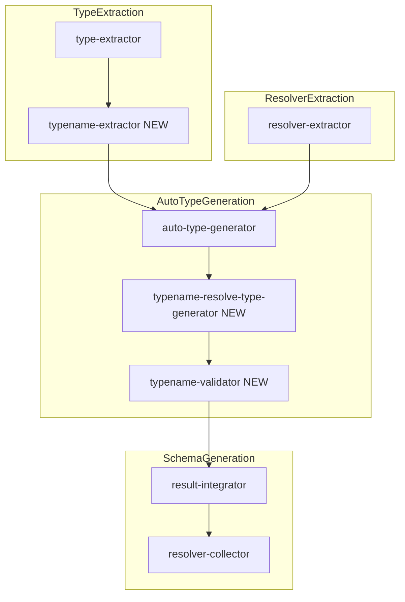
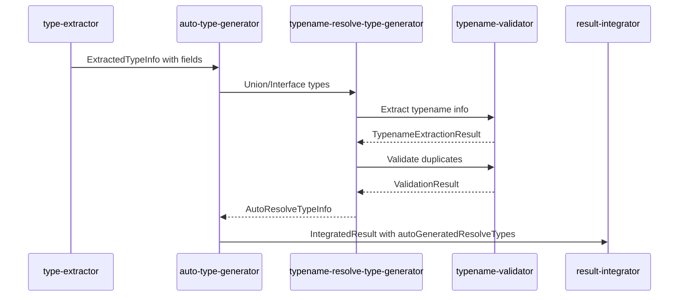

# Technical Design Document

## Overview

**Purpose**: 本機能は、gqlkit の Union 型および Interface 型において `__typename` または `$typeName` フィールドを利用した `resolveType` 関数の自動生成を提供する。現在 inline union payload にのみ適用されている型解決機能を、一般の Union 型および Interface 型にも拡張する。

**Users**: gqlkit ユーザーは、`defineResolveType` を明示的に定義せずに、`__typename` または `$typeName` フィールドのみで抽象型（Union/Interface）の型解決を行える。`$typeName` は protobuf-es 生成コードとの互換性を提供する。

**Impact**: 既存の inline union payload 動作との完全な後方互換性を維持しつつ、一般の Union/Interface 型でも同様の型解決パターンを利用可能にする。

### Goals
- Union 型のすべてのメンバーが `__typename` または `$typeName` を持つ場合、resolveType 関数を自動生成
- Interface 型を実装するすべての型が `__typename` または `$typeName` を持つ場合、resolveType 関数を自動生成
- `$typeName` サポートによる protobuf-es 互換性の提供
- 重複する `__typename`/`$typeName` 値の検出とエラー報告
- 既存の inline union payload 動作との完全な後方互換性

### Non-Goals
- `defineResolveType` を使用した明示的な型解決ロジックの変更
- TypeScript 以外の型システムサポート
- ランタイム時の型解決パフォーマンス最適化（現状の `obj.__typename` / `obj.$typeName` アクセスパターンを維持）

## Architecture

### Existing Architecture Analysis

現在の gqlkit は以下のパイプラインアーキテクチャで動作している：

1. **type-extractor**: TypeScript 型定義をスキャンし、GraphQL 型情報を抽出
2. **resolver-extractor**: defineQuery/defineMutation/defineField/defineResolveType を検出
3. **auto-type-generator**: インライン型から名前付き型を自動生成、inline union payload の `__typename` ベース resolveType を生成
4. **schema-generator**: GraphQL スキーマ AST とリゾルバマップを生成

現在の `__typename` 対応は `auto-type-generator/inline-union-validator.ts` で inline payload union に限定されている。

### Architecture Pattern & Boundary Map



**Architecture Integration**:
- Selected pattern: 既存パイプラインアーキテクチャの拡張
- Domain boundaries: type-extractor で `__typename`/`$typeName` 情報を抽出し、auto-type-generator で検証と resolveType 生成を行う
- Existing patterns preserved: inline payload union の既存処理フローを維持
- New components rationale:
  - typename-extractor: Union/Interface メンバーから型名情報を抽出
  - typename-resolve-type-generator: 一般 Union/Interface の resolveType 生成ロジック
  - typename-validator: 重複検証と inline オブジェクト必須検証

### Technology Stack

| Layer | Choice / Version | Role in Feature | Notes |
|-------|------------------|-----------------|-------|
| Backend / Services | TypeScript 5.9+ | 型解析・コード生成 | TypeScript Compiler API |
| Data / Storage | N/A | N/A | 静的解析のみ |

## System Flows

### resolveType Auto-Generation Flow



**Key Decisions**:
- `__typename` が `$typeName` より優先される（両方存在する場合）
- Union/Interface メンバーに inline オブジェクトが含まれる場合、すべてのメンバーに `__typename`/`$typeName` を要求
- 重複検証は抽象型内とスキーマ全体の両方で実行

## Requirements Traceability

| Requirement | Summary | Components | Interfaces | Flows |
|-------------|---------|------------|------------|-------|
| 1.1, 1.2, 1.3, 1.4 | Union 型 `__typename`/`$typeName` ベース resolveType 生成 | TypenameExtractor, TypenameResolveTypeGenerator | TypenameExtractionResult, AutoResolveTypeInfo | resolveType Auto-Generation Flow |
| 1.5 | 未定義オブジェクト型の自動定義 | TypenameResolveTypeGenerator | AutoGeneratedType | resolveType Auto-Generation Flow |
| 1.6, 1.7 | 検証失敗時の resolveType 非生成 | TypenameValidator | ValidationResult | resolveType Auto-Generation Flow |
| 2.1, 2.2, 2.3, 2.4 | Interface 型 `__typename`/`$typeName` ベース resolveType 生成 | TypenameExtractor, TypenameResolveTypeGenerator | TypenameExtractionResult, AutoResolveTypeInfo | resolveType Auto-Generation Flow |
| 2.5 | 未定義オブジェクト型の自動定義 | TypenameResolveTypeGenerator | AutoGeneratedType | resolveType Auto-Generation Flow |
| 2.6, 2.7 | 検証失敗時の resolveType 非生成 | TypenameValidator | ValidationResult | resolveType Auto-Generation Flow |
| 3.1, 3.2, 3.3, 3.4, 3.5 | Inline オブジェクト必須検証 | TypenameValidator | ValidationResult, Diagnostic | resolveType Auto-Generation Flow |
| 4.1-4.9 | 重複 `__typename`/`$typeName` 検証 | TypenameValidator | ValidationResult, Diagnostic | resolveType Auto-Generation Flow |
| 5.1, 5.2, 5.3, 5.4 | 既存 inline union payload 互換性 | InlineUnionValidator (既存) | ValidateUnionMemberTypenamesResult | resolveType Auto-Generation Flow |

## Components and Interfaces

| Component | Domain/Layer | Intent | Req Coverage | Key Dependencies (P0/P1) | Contracts |
|-----------|--------------|--------|--------------|--------------------------|-----------|
| TypenameExtractor | auto-type-generator | Union/Interface メンバーから `__typename`/`$typeName` 値を抽出 | 1.1-1.4, 2.1-2.4 | ExtractedTypeInfo (P0) | Service |
| TypenameResolveTypeGenerator | auto-type-generator | 一般 Union/Interface の resolveType 生成 | 1.1-1.5, 2.1-2.5 | TypenameExtractor (P0), TypenameValidator (P0) | Service |
| TypenameValidator | auto-type-generator | 重複検証・inline 必須検証・型リテラル検証 | 1.6-1.7, 2.6-2.7, 3.1-3.5, 4.1-4.9 | ExtractedTypeInfo (P0) | Service |

### auto-type-generator

#### TypenameExtractor

| Field | Detail |
|-------|--------|
| Intent | Union/Interface メンバーオブジェクト型から `__typename` または `$typeName` フィールドの string literal 値を抽出する |
| Requirements | 1.1, 1.2, 1.3, 1.4, 2.1, 2.2, 2.3, 2.4 |

**Responsibilities & Constraints**
- Union 型の各メンバー、Interface 型の各実装型から型名フィールドを抽出
- `__typename` を `$typeName` より優先（両方存在する場合）
- string literal type のみを有効値として認識
- optional または nullable な型名フィールドは無効として扱う

**Dependencies**
- Inbound: auto-type-generator — typename 抽出呼び出し (P0)
- External: ExtractedTypeInfo — 型情報 (P0)

**Contracts**: Service [x] / API [ ] / Event [ ] / Batch [ ] / State [ ]

##### Service Interface
```typescript
interface TypenameFieldInfo {
  /** 抽出された型名（`__typename` または `$typeName` の値） */
  readonly typeName: string;
  /** フィールド名（"__typename" または "$typeName"） */
  readonly fieldName: "__typename" | "$typeName";
}

interface MemberTypenameInfo {
  /** Union メンバーまたは Interface 実装型の名前（named type の場合）、または null（inline の場合） */
  readonly memberTypeName: string | null;
  /** メンバーインデックス */
  readonly memberIndex: number;
  /** 抽出された型名情報。抽出できなかった場合は null */
  readonly typenameInfo: TypenameFieldInfo | null;
  /** inline オブジェクトかどうか */
  readonly isInlineObject: boolean;
  /** フィールド構造（inline オブジェクトの場合のみ、重複検証用） */
  readonly fieldStructure: ReadonlyArray<FieldStructureInfo> | null;
}

interface FieldStructureInfo {
  readonly name: string;
  readonly typeName: string;
  readonly nullable: boolean;
  readonly list: boolean;
}

interface TypenameExtractionResult {
  /** 抽象型名（Union または Interface 名） */
  readonly abstractTypeName: string;
  /** 抽象型の種別 */
  readonly abstractTypeKind: "union" | "interface";
  /** 各メンバーの typename 情報 */
  readonly members: ReadonlyArray<MemberTypenameInfo>;
  /** すべてのメンバーが有効な typename を持つか */
  readonly allMembersHaveTypename: boolean;
  /** inline オブジェクトを含むか */
  readonly hasInlineObjects: boolean;
}

interface ExtractTypenamesParams {
  /** 対象の抽象型（Union または Interface） */
  readonly abstractType: ExtractedTypeInfo;
  /** 全型情報マップ（メンバー解決用） */
  readonly typeMap: ReadonlyMap<string, ExtractedTypeInfo>;
}

function extractTypenames(params: ExtractTypenamesParams): TypenameExtractionResult;
```

- Preconditions: `abstractType.metadata.kind` が `"union"` または `"graphqlInterface"` であること
- Postconditions: すべてのメンバーの typename 情報が返される
- Invariants: `__typename` が `$typeName` より常に優先される

**Implementation Notes**
- Integration: `auto-type-generator.ts` の `generateAutoTypes` から呼び出される
- Validation: string literal type チェックは TypeScript Compiler API の `isStringLiteral()` を使用
- Risks: 複雑な型表現（conditional type, mapped type）の解決が不完全な可能性

#### TypenameResolveTypeGenerator

| Field | Detail |
|-------|--------|
| Intent | 一般 Union/Interface 型に対する `__resolveType` 関数の自動生成情報を収集する |
| Requirements | 1.1, 1.2, 1.3, 1.4, 1.5, 2.1, 2.2, 2.3, 2.4, 2.5 |

**Responsibilities & Constraints**
- `TypenameExtractor` の結果に基づき、自動 resolveType 対象を決定
- 手動 `defineResolveType` が定義済みの型はスキップ
- inline オブジェクトを含む場合、対応するオブジェクト型定義を生成
- `__typename` と `$typeName` が混在する場合の resolveType ロジック生成

**Dependencies**
- Inbound: auto-type-generator — resolveType 生成呼び出し (P0)
- Outbound: TypenameExtractor — typename 抽出 (P0)
- Outbound: TypenameValidator — 検証 (P0)

**Contracts**: Service [x] / API [ ] / Event [ ] / Batch [ ] / State [ ]

##### Service Interface
```typescript
interface AutoGeneratedResolveTypeInfo {
  /** 抽象型名 */
  readonly abstractTypeName: string;
  /** 抽象型の種別 */
  readonly abstractTypeKind: "union" | "interface";
  /** resolveType 関数の実装パターン */
  readonly resolveTypePattern: ResolveTypePattern;
}

type ResolveTypePattern =
  | { readonly kind: "typenameOnly" }
  | { readonly kind: "dollarTypenameOnly" }
  | { readonly kind: "mixed"; readonly memberFieldMap: ReadonlyMap<string, "__typename" | "$typeName"> };

interface GenerateResolveTypesParams {
  /** 抽出済み型情報 */
  readonly extractedTypes: ReadonlyArray<ExtractedTypeInfo>;
  /** 手動定義済みの resolveType 型名セット */
  readonly manualResolveTypeNames: ReadonlySet<string>;
  /** 全型情報マップ */
  readonly typeMap: ReadonlyMap<string, ExtractedTypeInfo>;
}

interface GenerateResolveTypesResult {
  /** 自動生成 resolveType 情報 */
  readonly autoResolveTypes: ReadonlyArray<AutoGeneratedResolveTypeInfo>;
  /** 自動生成されたオブジェクト型（inline オブジェクトから生成） */
  readonly generatedObjectTypes: ReadonlyArray<AutoGeneratedType>;
  /** 診断メッセージ */
  readonly diagnostics: ReadonlyArray<Diagnostic>;
}

function generateResolveTypes(params: GenerateResolveTypesParams): GenerateResolveTypesResult;
```

- Preconditions: `extractedTypes` に Union/Interface 型が含まれること
- Postconditions: 有効な型のみ `autoResolveTypes` に含まれる
- Invariants: 手動定義済み型は結果に含まれない

**Implementation Notes**
- Integration: `generateAutoTypes` の後半で呼び出し、`IntegratedResult.autoGeneratedResolveTypes` に追加
- Validation: `TypenameValidator` で検証失敗した型は除外
- Risks: 循環参照を持つ Interface の処理

#### TypenameValidator

| Field | Detail |
|-------|--------|
| Intent | `__typename`/`$typeName` の検証（重複・必須・型リテラル） |
| Requirements | 1.6, 1.7, 2.6, 2.7, 3.1, 3.2, 3.3, 3.4, 3.5, 4.1, 4.2, 4.3, 4.4, 4.5, 4.6, 4.7, 4.8, 4.9 |

**Responsibilities & Constraints**
- 抽象型内での重複 typename 値の検出（4.1-4.6）
- スキーマ全体での重複 typename 値の検出（4.7-4.9）
- inline オブジェクトを含む場合の必須検証（3.1-3.5）
- string literal type 以外の typename フィールドの検出（1.7, 2.7）

**Dependencies**
- Inbound: TypenameResolveTypeGenerator — 検証呼び出し (P0)
- External: TypenameExtractionResult — 検証対象データ (P0)

**Contracts**: Service [x] / API [ ] / Event [ ] / Batch [ ] / State [ ]

##### Service Interface
```typescript
interface ValidateTypenamesParams {
  /** 検証対象の typename 抽出結果 */
  readonly extractionResult: TypenameExtractionResult;
}

interface ValidateTypenamesResult {
  /** 検証成功かどうか */
  readonly valid: boolean;
  /** 診断メッセージ */
  readonly diagnostics: ReadonlyArray<Diagnostic>;
}

interface ValidateSchemaTypenamesParams {
  /** スキーマ内のすべてのオブジェクト型 */
  readonly objectTypes: ReadonlyArray<ExtractedTypeInfo>;
  /** 全型情報マップ */
  readonly typeMap: ReadonlyMap<string, ExtractedTypeInfo>;
}

interface ValidateSchemaTypenamesResult {
  /** 検証成功かどうか */
  readonly valid: boolean;
  /** 診断メッセージ */
  readonly diagnostics: ReadonlyArray<Diagnostic>;
}

function validateTypenames(params: ValidateTypenamesParams): ValidateTypenamesResult;
function validateSchemaTypenames(params: ValidateSchemaTypenamesParams): ValidateSchemaTypenamesResult;
```

- Preconditions: `extractionResult` が有効な `TypenameExtractionResult` であること
- Postconditions: すべての検証ルールが適用される
- Invariants: 検証は冪等

**Implementation Notes**
- Integration: `TypenameResolveTypeGenerator.generateResolveTypes` から呼び出し
- Validation: 診断コードは既存パターンに準拠（`DUPLICATE_TYPENAME_VALUE`, `MISSING_TYPENAME_PROPERTY` 等）
- Risks: 大規模スキーマでの O(n^2) 重複検出のパフォーマンス

## Data Models

### Domain Model

**Aggregates**:
- `TypenameExtractionResult`: 抽象型ごとの typename 抽出結果
- `AutoGeneratedResolveTypeInfo`: 自動生成 resolveType 情報

**Entities**:
- `MemberTypenameInfo`: Union/Interface メンバーごとの typename 情報

**Value Objects**:
- `TypenameFieldInfo`: 型名フィールドの値と種別
- `ResolveTypePattern`: resolveType 生成パターン

**Domain Events**: N/A（静的解析のため）

**Business Rules**:
- `__typename` は `$typeName` より常に優先
- inline オブジェクトを含む抽象型では全メンバーに typename 必須
- 同一抽象型内での typename 値重複は禁止
- スキーマ全体での typename 値重複は禁止

### Logical Data Model

**Entity Relationships**:
```
ExtractedTypeInfo (union/interface)
  └── TypenameExtractionResult (1:1)
        └── MemberTypenameInfo (1:N)
              └── TypenameFieldInfo (1:0..1)
```

## Error Handling

### Error Categories and Responses

**User Errors (Diagnostic - error)**:
- `MISSING_TYPENAME_PROPERTY`: inline オブジェクトメンバーに `__typename`/`$typeName` がない
- `INVALID_TYPENAME_TYPE`: `__typename`/`$typeName` が string literal type ではない
- `OPTIONAL_TYPENAME_PROPERTY`: `__typename`/`$typeName` が optional
- `NULLABLE_TYPENAME_PROPERTY`: `__typename`/`$typeName` が nullable
- `DUPLICATE_TYPENAME_VALUE`: 同一抽象型内または スキーマ全体で typename 値が重複

**User Warnings (Diagnostic - warning)**: N/A

### Error Message Format

```
Union '{unionName}' member at index {index} is missing '__typename' or '$typeName' property.
Interface '{interfaceName}' implementer '{typeName}' has '__typename' that is not a string literal type.
Duplicate typename value '{value}' found in Union '{unionName}': used by members '{member1}' and '{member2}'.
```

## Testing Strategy

### Unit Tests
- `TypenameExtractor`: `__typename`/`$typeName` 抽出ロジック、優先度処理、optional/nullable 検出
- `TypenameValidator`: 重複検出、inline 必須検証、型リテラル検証
- `TypenameResolveTypeGenerator`: resolveType パターン生成、手動定義除外

### Integration Tests (Golden File Tests)
- `union-typename-basic`: すべてのメンバーが `__typename` を持つ Union
- `union-dollar-typename-basic`: すべてのメンバーが `$typeName` を持つ Union
- `union-typename-mixed`: `__typename` と `$typeName` が混在する Union
- `union-typename-priority`: 両方持つメンバーで `__typename` が優先される
- `interface-typename-basic`: すべての実装型が `__typename` を持つ Interface
- `interface-dollar-typename-basic`: すべての実装型が `$typeName` を持つ Interface
- `union-typename-inline-error`: inline メンバーに typename がない場合のエラー
- `union-typename-duplicate-error`: 重複 typename 値のエラー
- `schema-typename-duplicate-error`: スキーマ全体での重複 typename 値のエラー

### Performance Tests
- 大規模スキーマ（100+ 型）での重複検出パフォーマンス
