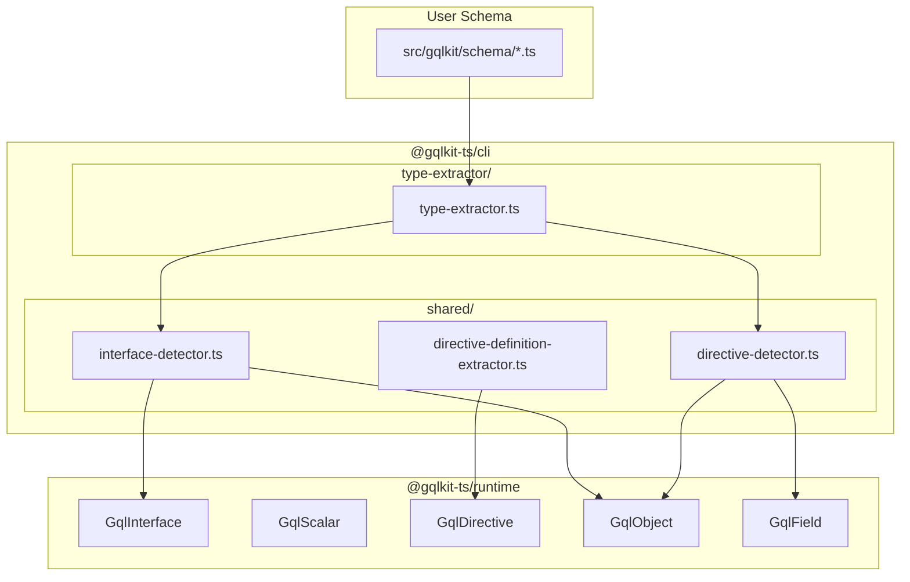

# Design Document

## Overview

**Purpose**: 本機能は `@gqlkit-ts/runtime` パッケージが提供する GraphQL スキーマ定義用ユーティリティタイプの命名規則を統一し、API の一貫性と発見可能性を向上させる。

**Users**: gqlkit ユーザーおよび開発者は、統一された `Gql` プレフィックスパターンにより、IDE の自動補完を活用して必要な型を素早く発見できる。

**Impact**: 既存の5つの公開型と関連する内部型をリネームし、CLI の型認識ロジックを更新する。本プロジェクトは未リリースのため、後方互換性は不要。

### Goals

- すべての GraphQL スキーマ定義用ユーティリティタイプを `Gql` プレフィックスパターンに統一する
- `Def` サフィックスを削除し、命名を簡潔にする
- CLI が新しい型名を認識してスキーマ生成を継続できるようにする
- テストデータ、サンプル、ドキュメントを新しい命名規則に更新する

### Non-Goals

- 後方互換性の維持（未リリースのため不要）
- 型エイリアスや deprecated マーカーの提供
- 新しい機能やビヘイビアの追加

## Architecture

### Existing Architecture Analysis

現在のアーキテクチャにおいて、型認識は以下の2層で行われている:

1. **Runtime Package** (`@gqlkit-ts/runtime`): ユーティリティタイプの定義と export
2. **CLI Shared Utilities** (`packages/cli/src/shared/`): 文字列ベースの型名検出

型認識のフローは以下の通り:
- TypeScript の型エイリアス名を文字列として検出
- 検出した名前に基づいて GraphQL 型の種類を判定
- 判定結果に基づいてスキーマ AST を生成

### Architecture Pattern & Boundary Map



**Architecture Integration**:
- Selected pattern: 単純なリネームリファクタリング
- Domain boundaries: Runtime と CLI のパッケージ境界を維持
- Existing patterns preserved: 文字列ベースの型名検出パターンを維持
- Steering compliance: 静的解析のみ、デコレータ不使用の原則を維持

### Technology Stack

| Layer | Choice / Version | Role in Feature | Notes |
|-------|------------------|-----------------|-------|
| Runtime | TypeScript 5.9+ | 型定義の提供 | 型エイリアスのリネームのみ |
| CLI | TypeScript 5.9+ | 型名検出ロジック | 文字列定数の更新 |

## Requirements Traceability

| Requirement | Summary | Components | Interfaces |
|-------------|---------|------------|------------|
| 1.1-1.7 | ユーティリティタイプの命名統一 | RuntimeTypes | TypeExports |
| 2.1-2.7 | 旧型名の完全削除 | RuntimeTypes | TypeExports |
| 3.1-3.7 | CLI 型認識の対応 | SharedDetectors | TypeNameConstants |
| 4.1-4.4 | テストデータの更新 | TestData | - |
| 5.1-5.5 | ドキュメントとサンプルの更新 | Documentation, Examples | - |

## Components and Interfaces

| Component | Domain/Layer | Intent | Req Coverage | Key Dependencies |
|-----------|--------------|--------|--------------|------------------|
| RuntimeTypes | Runtime | ユーティリティタイプの定義 | 1.1-1.7, 2.1-2.7 | - |
| SharedDetectors | CLI/Shared | 型名検出ロジック | 3.1-3.7 | RuntimeTypes (型名参照) |
| TestData | CLI/Test | ゴールデンファイルテスト | 4.1-4.4 | RuntimeTypes |
| Documentation | Project | ドキュメント更新 | 5.1-5.5 | - |
| Examples | Project | サンプルコード更新 | 5.2 | RuntimeTypes |

### Runtime Layer

#### RuntimeTypes

| Field | Detail |
|-------|--------|
| Intent | GraphQL スキーマ定義用ユーティリティタイプを `Gql` プレフィックスパターンで提供 |
| Requirements | 1.1, 1.2, 1.3, 1.4, 1.5, 1.6, 1.7, 2.1, 2.2, 2.3, 2.4, 2.5, 2.6, 2.7 |

**Responsibilities & Constraints**
- 5つの公開ユーティリティタイプのリネーム
- 1つの内部マーカータイプのリネーム
- 型パラメータとビヘイビアは完全に維持

**Contracts**: Service [ ] / API [ ] / Event [ ] / Batch [ ] / State [ ]

##### Type Definitions (New Names)

```typescript
// packages/runtime/src/index.ts

// Interface type definition utility (was: DefineInterface)
export type GqlInterface<
  T extends Record<string, unknown>,
  Meta extends { implements?: ReadonlyArray<GqlInterfaceMarker> } = object,
> = T & {
  readonly " $gqlkitInterfaceMeta"?: GqlInterfaceMetaShape<Meta>;
};

// Internal marker type (was: DefineInterfaceMarker)
export type GqlInterfaceMarker = Record<string, unknown>;

// Custom scalar type definition (was: DefineScalar)
export type GqlScalar<
  Name extends string,
  Base,
  Only extends "input" | "output" | undefined = undefined,
> = Base & {
  " $gqlkitScalar"?: { name: Name; only: Only };
};

// Custom directive definition (was: Directive)
export type GqlDirective<
  Name extends string,
  Args extends Record<string, unknown> = Record<string, never>,
  Location extends DirectiveLocation | DirectiveLocation[] = DirectiveLocation,
> = {
  readonly " $directiveName": Name;
  readonly " $directiveArgs": Args;
  readonly " $directiveLocation": Location;
};

// Type-level metadata attachment (was: GqlTypeDef)
export type GqlObject<
  T,
  Meta extends {
    directives?: ReadonlyArray<GqlDirective<string, Record<string, unknown>, DirectiveLocation | DirectiveLocation[]>>;
    implements?: ReadonlyArray<GqlInterfaceMarker>;
  } = { directives: [] },
> = T & {
  readonly " $gqlkitTypeMeta"?: GqlTypeMetaShape<Meta>;
  readonly " $gqlkitOriginalType"?: T;
};

// Field-level metadata attachment (was: GqlFieldDef)
export type GqlField<
  T,
  Meta extends {
    directives?: ReadonlyArray<GqlDirective<string, Record<string, unknown>, DirectiveLocation | DirectiveLocation[]>>;
    defaultValue?: unknown;
  } = object,
> = T & {
  readonly " $gqlkitFieldMeta"?: GqlFieldMetaShape<Meta>;
  readonly " $gqlkitOriginalType"?: T;
};
```

**Implementation Notes**
- Integration: 内部メタデータプロパティ名 (`$gqlkitFieldMeta`, `$gqlkitTypeMeta` 等) は変更不要
- Validation: 型パラメータの制約は既存のものを維持
- Risks: ブランドスカラー型 (`Int`, `Float`, `IDString`, `IDNumber`) は `GqlScalar` を使用しているため、内部的に更新が必要

### CLI/Shared Layer

#### SharedDetectors

| Field | Detail |
|-------|--------|
| Intent | TypeScript コードから gqlkit ユーティリティタイプを文字列ベースで検出 |
| Requirements | 3.1, 3.2, 3.3, 3.4, 3.5, 3.6, 3.7 |

**Responsibilities & Constraints**
- 型エイリアス名の文字列比較ロジックを更新
- 新しい型名のみを認識し、旧型名は認識しない

**Dependencies**
- Inbound: type-extractor, resolver-extractor - 型認識のために使用 (P0)

**Contracts**: Service [ ] / API [ ] / Event [ ] / Batch [ ] / State [ ]

##### String Constants Update

```typescript
// packages/cli/src/shared/interface-detector.ts

// Line 22: Update type name check
// Before: typeName === "DefineInterface"
// After:  typeName === "GqlInterface"
export function isDefineInterfaceTypeAlias(
  node: ts.TypeAliasDeclaration,
  sourceFile: ts.SourceFile,
): boolean {
  const typeNode = node.type;
  if (ts.isTypeReferenceNode(typeNode)) {
    const typeName = typeNode.typeName.getText(sourceFile);
    return typeName === "GqlInterface";
  }
  return false;
}

// Line 67: Update type name check
// Before: typeName !== "GqlTypeDef"
// After:  typeName !== "GqlObject"
export function extractImplementsFromGqlTypeDef(
  node: ts.TypeAliasDeclaration,
  sourceFile: ts.SourceFile,
  checker: ts.TypeChecker,
): ReadonlyArray<string> {
  const typeNode = node.type;
  if (!ts.isTypeReferenceNode(typeNode)) {
    return [];
  }
  const typeName = typeNode.typeName.getText(sourceFile);
  if (typeName !== "GqlObject") {
    return [];
  }
  // ...
}
```

```typescript
// packages/cli/src/shared/directive-detector.ts

// Line 452, 479, 494: Update alias name checks
// Before: aliasName === "GqlFieldDef" || aliasName === "GqlTypeDef"
// After:  aliasName === "GqlField" || aliasName === "GqlObject"
export function hasDirectiveMetadata(type: ts.Type): boolean {
  // ...
  if (type.aliasSymbol) {
    const aliasName = type.aliasSymbol.getName();
    if (aliasName === "GqlField" || aliasName === "GqlObject") {
      return true;
    }
  }
  // ...
}

export function unwrapDirectiveType(
  type: ts.Type,
  checker: ts.TypeChecker,
): ts.Type {
  // Line 479
  if (aliasSymbolName === "GqlField" || aliasSymbolName === "GqlObject") {
    return type.aliasTypeArguments[0]!;
  }
  // Line 494
  if (memberAliasSymbolName === "GqlField" || memberAliasSymbolName === "GqlObject") {
    return member.aliasTypeArguments[0]!;
  }
  // ...
}
```

**Implementation Notes**
- Integration: 関数名 (`isDefineInterfaceTypeAlias`, `extractImplementsFromGqlTypeDef`) のリネームは任意（内部 API のため）
- Validation: 型検出ロジックのテストはゴールデンファイルテストでカバー

### Test Layer

#### TestData

| Field | Detail |
|-------|--------|
| Intent | 新しい型名を使用したゴールデンファイルテスト |
| Requirements | 4.1, 4.2, 4.3, 4.4 |

**Responsibilities & Constraints**
- すべてのテストケースで旧型名を新型名に置換
- ゴールデンファイルを再生成

**Files to Update**:

| Directory Pattern | Count | Types Used |
|-------------------|-------|------------|
| `testdata/interface-*/` | 7 | GqlInterface, GqlObject |
| `testdata/directive-*/` | 8 | GqlDirective, GqlField |
| `testdata/default-value-*/` | 4 | GqlField |
| `testdata/scalar-*/` | 3 | GqlScalar |
| `testdata/*/` (others) | 5+ | Mixed |

### Documentation Layer

#### Documentation

| Field | Detail |
|-------|--------|
| Intent | ドキュメントを新しい命名規則に更新 |
| Requirements | 5.1, 5.3, 5.4, 5.5 |

**Files to Update**:
- `.kiro/steering/product.md`: DefineInterface, GqlTypeDef, GqlFieldDef の参照
- `.kiro/steering/structure.md`: DefineScalar, DefineInterface, GqlTypeDef, GqlFieldDef, Directive の参照
- `.kiro/steering/tech.md`: DefineScalar, DefineInterface, GqlTypeDef, GqlFieldDef の参照
- `CLAUDE.md`: Runtime package exports セクション、TypeScript to GraphQL Type Mapping テーブル

#### Examples

| Field | Detail |
|-------|--------|
| Intent | サンプルプロジェクトを新しい型名に更新 |
| Requirements | 5.2 |

**Files to Update**:
- `examples/minimal/src/gqlkit/__generated__/typeDefs.ts`
- `examples/full-featured/src/gqlkit/schema/*.ts` (5 files)
- `examples/full-featured/src/gqlkit/__generated__/*.ts` (2 files)

## Error Handling

### Error Strategy

本機能はリネームのみのため、新しいエラーパターンは発生しない。

**既存のエラーハンドリング**:
- 旧型名使用時: CLI は旧型名を認識しなくなるため、型として無視される（サイレントフェイル）
- これは要件 3.6 の意図通りの動作

## Testing Strategy

### Unit Tests

本機能は新しいユニットテストを追加しない。既存のゴールデンファイルテストでカバー。

### Integration Tests (Golden File Tests)

1. **interface-basic**: `GqlInterface` と `GqlObject` の認識テスト
2. **directive-basic**: `GqlDirective` と `GqlField` の認識テスト
3. **scalar-metadata-basic**: `GqlScalar` の認識テスト
4. **default-value-basic**: `GqlField` のデフォルト値メタデータテスト
5. **すべての既存テスト**: 新しい型名で更新後、パス確認

### Validation Checklist

- [ ] `pnpm test` - すべてのゴールデンファイルテストがパス
- [ ] `pnpm typecheck` - 型エラーなし
- [ ] `pnpm check` - Biome lint/format パス
- [ ] `pnpm knip` - 未使用 export なし
